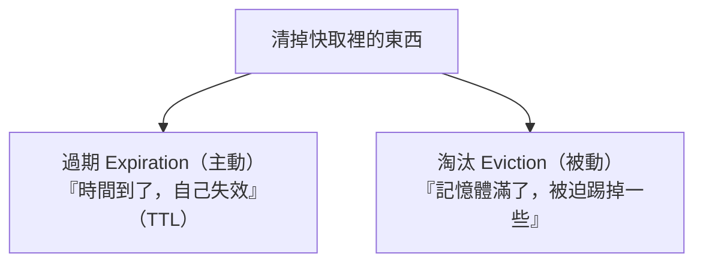
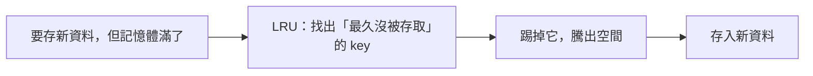

# [cache-5-4] 過期與淘汰：TTL、LRU/LFU、記憶體滿了怎麼辦

> **本章目標**：理解快取「清掉舊東西」的兩種機制——主動過期（TTL）與被動淘汰（eviction），以及記憶體滿了時的淘汰策略 LRU/LFU。

## 你會學到

- 過期（Expiration）vs 淘汰（Eviction）的差別
- TTL 設計的考量
- 記憶體滿了：淘汰策略 LRU、LFU、隨機…
- Redis 的 maxmemory 與淘汰政策

## 概念說明

### 快取不能無限長大

快取存在記憶體（cache-2-2 的「快但小」），空間有限。所以快取必須有機制「**清掉一些東西**」，否則記憶體會被塞爆。清東西分兩種：



- **過期（Expiration）**：你給每個 key 設 TTL（cache-1-2），時間到就自動失效。這是**你主動控制**的。
- **淘汰（Eviction）**：記憶體**滿了**，快取被迫「踢掉一些 key 來騰空間」。這是**被動發生**的，依「淘汰策略」決定踢誰。

兩者都會讓快取裡的東西消失，但原因不同——一個是「時間到」，一個是「沒空間」。

---

### 過期（TTL）的設計

TTL 你已經很熟了（cache-1-2）。這裡補充幾個實務考量：

**① TTL 多長？** 回到「速度 vs 新鮮度」（cache-1-2）：

- 太短 → 一直過期、一直回源、命中率低（cache-1-3）。
- 太長 → 資料容易過時。
- 折衷：依「資料變動頻率 + 過時後果」設（cache-1-2 的表）。

**② TTL 要加「隨機」抖動**：如果大量 key 設「同樣的 TTL」（例如都 60 秒），它們會**同時過期** → 瞬間全部 miss、一起湧向資料庫 → **快取雪崩**（cache-6-2）！解法是給 TTL 加一點隨機（如 60 秒 ± 10 秒隨機），讓過期時間錯開。這是很重要的實務技巧。

**③ 「永不過期」的選擇**：對某些「絕不能讓使用者等回源」的超熱資料，可以「不設 TTL（永不過期）」，改用「背景更新」維持新鮮——避免過期瞬間的擊穿（cache-6-4）。

---

### 淘汰（Eviction）：記憶體滿了踢誰

當記憶體滿了、又要存新東西，快取得「踢掉一些舊的」。踢誰？這由**淘汰策略**決定。最常見的：

| 策略 | 全名 | 踢掉誰 | 直覺 |
|------|------|--------|------|
| **LRU** | Least Recently Used | **最久沒被用**的 | 「最近沒人碰的，大概以後也不太需要」|
| **LFU** | Least Frequently Used | **最少被用**的 | 「用得最少的，大概不重要」|
| **Random** | 隨機 | 隨機踢 | 簡單，但不聰明 |
| **TTL 優先** | | 快過期的先踢 | 反正快過期了 |

**LRU（最近最少使用）是最常用的**——它的假設很合理：「**最近常被用的，未來也可能常被用；最久沒碰的，先踢掉問題不大**」。這呼應 cache-2-2 CPU 快取也用類似邏輯。



**LRU vs LFU**：

- **LRU** 看「**最近**有沒有用」（時間維度）。適合「有時效性熱點」的資料（最近熱的就是熱的）。
- **LFU** 看「**總共**用了幾次」（頻率維度）。適合「長期熱點 vs 偶發」的區分（一個偶爾爆紅但平常沒人用的，LFU 不會留它）。

實務上 LRU 最常見、最通用；LFU 在「長期穩定熱點」場景更好。

---

### Redis 的記憶體管理

Redis 讓你設定「最大記憶體」和「淘汰政策」：

```
maxmemory 2gb                    # 最多用 2GB
maxmemory-policy allkeys-lru     # 滿了用 LRU 淘汰
```

Redis 的淘汰政策有多種組合，常見的：

| 政策 | 行為 |
|------|------|
| `noeviction` | 滿了就「拒絕寫入、報錯」（不踢任何東西）|
| `allkeys-lru` | 對所有 key 用 LRU 淘汰（最常用）|
| `allkeys-lfu` | 對所有 key 用 LFU |
| `volatile-lru` | 只對「有設 TTL」的 key 用 LRU 淘汰 |

⚠️ **`noeviction` 的坑**：如果用了 `noeviction`，記憶體滿時 Redis 會**拒絕新的寫入**——你的應用可能因此報錯。當「純快取」用時，通常該設 `allkeys-lru`（滿了就淘汰舊的，不報錯）。但如果 Redis 同時存「不能丟的資料」（如 session），就要小心淘汰策略別把重要的踢掉。

---

### 過期 + 淘汰一起運作

實際運作中，兩者並存：

```
正常情況：
  - key 到了 TTL → 自動過期消失（主動）
  - 記憶體還夠 → 不觸發淘汰

記憶體滿了：
  - 即使還沒到 TTL，也會依淘汰策略（LRU）踢掉一些 key（被動）
  - 騰出空間給新資料
```

所以一個 key 可能「還沒過期，就因為記憶體滿被 LRU 踢掉了」——這是正常的。你的應用要能接受「快取裡的東西隨時可能不在」（不管是過期還是被淘汰），miss 了就重新載入（Cache-Aside，cache-1-3）。這呼應 cache-2-4「快取是可丟的、重要資料要在 DB」。

## 程式碼範例

設定 TTL（含抖動，避免雪崩）與觀察淘汰：

```
// 設 TTL 時加隨機抖動，避免大量 key 同時過期（cache-6-2 雪崩）
基礎TTL = 300秒
抖動 = 隨機(0, 60)秒
redis.set("product:" + id, 資料, EX = 基礎TTL + 抖動)
// → 各 key 在 300~360 秒間錯開過期，不會同時雪崩
```

```
# Redis 設定（概念）：限制記憶體 + LRU 淘汰
maxmemory 2gb
maxmemory-policy allkeys-lru
# → 滿 2GB 時，自動踢掉「最久沒用」的 key，不報錯
```

## 小練習

### 練習 1：過期 vs 淘汰

用自己的話說明「過期（expiration）」和「淘汰（eviction）」的差別。一個 key 會因為哪兩種原因消失？

---

### 練習 2：LRU vs LFU

回答：

1. LRU 和 LFU 分別根據什麼決定「踢掉誰」？
2. 為什麼 LRU 的假設（最久沒用的先踢）通常合理？

---

### 練習 3：避免雪崩的 TTL

回答：為什麼「大量 key 設同樣的 TTL」很危險？怎麼用「隨機抖動」避免？（提示：cache-6-2）

## 課外讀物

> 大量同時過期造成的「快取雪崩」深入 → 見本書 cache-6-2；LRU 的概念也出現在 CPU/OS 快取 → 見本書 cache-2-2、cache-2-3
