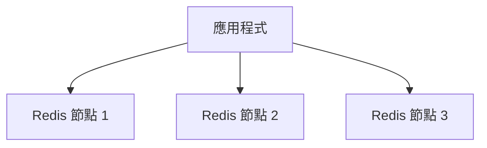
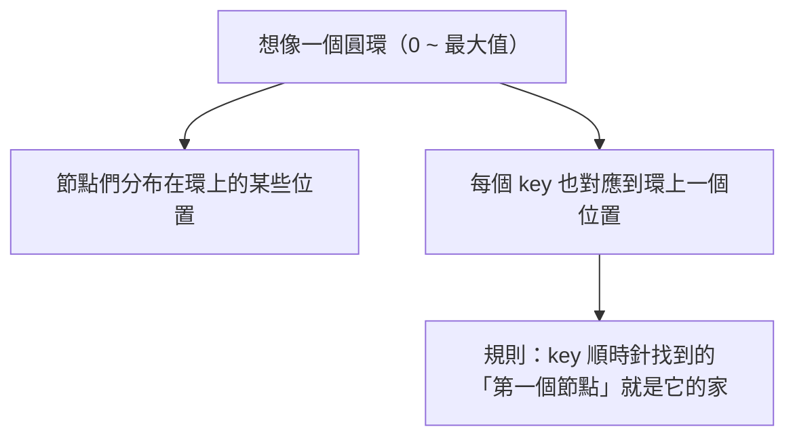

# [cache-5-5] 分散式快取：多節點與一致性雜湊

> **本章目標**：理解當快取資料量大到「一台 Redis 裝不下」時，怎麼分散到多個節點，以及「一致性雜湊」怎麼解決「加減節點時不要全部失效」的問題。

## 你會學到

- 為什麼快取需要「多節點」
- 怎麼決定「一個 key 該存哪個節點」
- 簡單取模（modulo）的問題
- 一致性雜湊（consistent hashing）怎麼解

## 概念說明

### 一台快取不夠用時

cache-2-4 的分散式快取（Redis）讓「多台應用共享一個快取」。但當**快取的資料量大到一台 Redis 裝不下**、或**單台扛不住流量**時，就需要把快取**分散到多個 Redis 節點**（這是 SRE Part 7-3、infra Part 9-1 的水平擴展，用在快取上）。



問題來了：有 3 個節點，一個 key（例如 `product:123`）該存到**哪一個**節點？要有個規則，而且「存的時候」和「取的時候」要算出同一個節點，才找得到。

---

### 簡單做法：取模（modulo）

最直覺的方法——用 key 算一個 hash 數字，再「除以節點數取餘數」決定存哪台：

```
節點編號 = hash(key) % 節點數

例如 3 個節點：
  hash("product:123") % 3 = 1  → 存節點 1
  hash("product:456") % 3 = 2  → 存節點 2
```

存和取都用同樣公式，就能找到同一個節點。簡單有效……**直到你要加減節點**。

---

### 取模的致命問題：加減節點全亂套

假設你從 3 個節點**加到 4 個**（或一台掛了變 2 個）。公式裡的「節點數」變了：

```
原本（3 節點）：hash("product:123") % 3 = 1  → 在節點 1
變成（4 節點）：hash("product:123") % 4 = 3  → 算成節點 3！

→ 但資料還在節點 1，你卻去節點 3 找 → 找不到（miss）！
```

問題在於——**「節點數」一變，幾乎「所有 key」算出來的節點都變了**。結果：

> 加/減一個節點 → **幾乎整個快取瞬間全部 miss** → 海量請求湧向資料庫 → **快取雪崩**（cache-6-2）→ 可能把資料庫打垮。

這太可怕了——只是加台機器擴容，竟然會引發雪崩。需要更好的方法。

---

### 解法：一致性雜湊（Consistent Hashing）

**一致性雜湊**是專門解決這個問題的經典演算法。核心點子：

> **把節點和 key 都對應到一個「環（ring）」上。加減節點時，只有「一小部分」的 key 需要搬家，而不是「全部」。**

用一個圓環來想像：



運作：

1. 把每個**節點**用 hash 放到環上的某個位置。
2. 每個 **key** 也 hash 到環上一個位置。
3. 規則：**從 key 的位置「順時針」走，遇到的第一個節點，就是這個 key 存放的地方。**

關鍵好處——**加/減節點時，只影響「環上相鄰的一小段」**：

```
加一個新節點到環上：
  → 只有「原本屬於它順時針後方那一小段」的 key 需要搬到新節點
  → 其他絕大多數 key 的歸屬「不變」！
  → 只有一小部分 miss，不會全部雪崩
```

對比取模「加節點 = 幾乎全部 key 重新分配」，一致性雜湊「加節點 = 只有約 `1/節點數` 的 key 要搬」——大幅減少了擴縮容時的快取失效。

---

### 虛擬節點：讓分布更均勻

一致性雜湊還有個改良——**虛擬節點（virtual nodes）**。問題是：如果只放「實體節點」在環上，可能分布不均（有的節點負責環上一大段、有的一小段 → 負載不均）。

解法：讓**每個實體節點，在環上對應「很多個虛擬節點」**（分散在環的各處）。這樣負載更平均，加減節點時的影響也更分散。實務的一致性雜湊都會用虛擬節點。

---

### 你不一定要自己實作

好消息——**你通常不用自己寫一致性雜湊**：

- **Redis Cluster**（Redis 的官方叢集方案）內建了資料分片機制（用 hash slot，概念類似）。
- 很多 Redis 客戶端函式庫、代理（如 Twemproxy）幫你處理分片。
- 雲端的託管 Redis（aws ElastiCache）也提供叢集模式。

所以實務上你是「**用**」這些方案，而不是「**從頭實作**」。但你要**理解原理**——尤其「為什麼擴縮容時快取會大量失效（取模的問題）」和「一致性雜湊怎麼緩解」——這樣才知道叢集方案在解什麼、擴容時會發生什麼。

---

### 在全景中的位置

分散式快取（多節點 Redis）是「應用層快取」這層的**規模化版本**：

```
單台 Redis（cache-2-4）── 資料量/流量大到裝不下/扛不住
   ↓ 水平擴展
多節點 Redis 叢集（這章）── 用一致性雜湊分片
```

這呼應了 infra Part 9（從一台到多台）、SRE Part 7-3（水平擴展）的思維——**快取本身也會遇到「一台不夠、要擴展」的問題**，而擴展快取的特殊難點就是「別在擴縮容時引發雪崩」，這正是一致性雜湊存在的理由。

## 程式碼範例

對比兩種分片的「加節點」影響（概念示意）：

```
// 取模分片：加節點 = 災難
原本 3 節點：key 分布 [節點計算用 % 3]
加到 4 節點：[% 4]
→ 約 75% 的 key 歸屬改變 → 75% 瞬間 miss → 雪崩 💥

// 一致性雜湊：加節點 = 溫和
原本 3 節點在環上，加第 4 個節點
→ 只有「新節點順時針前一段」的 key（約 1/4）需要搬
→ 約 75% 的 key 歸屬「不變」 → 只有約 25% miss → 可承受 ✅
```

實務上（用 Redis Cluster）：

```
# 你不用自己算，Redis Cluster 幫你分片
# 加節點時，它會「搬移一部分 hash slot」到新節點
# （概念上類似一致性雜湊，只搬一部分，不是全部重來）
redis-cli --cluster add-node 新節點 既有節點
redis-cli --cluster reshard ...   # 重新分配一部分 slot 給新節點
```

## 小練習

### 練習 1：為什麼取模有問題

回答：用「`hash(key) % 節點數`」分片，當「加一個節點」時會發生什麼？為什麼這很可怕？（提示：雪崩）

---

### 練習 2：一致性雜湊的核心好處

用「圓環 + 順時針找節點」的概念，解釋一致性雜湊為什麼「加減節點時只有一小部分 key 要搬」。

---

### 練習 3：實務認知

回答：

1. 你需要「自己從頭實作」一致性雜湊嗎？實務上通常怎麼做？
2. 為什麼即使用現成方案，還是要「理解原理」？

## 課外讀物

> 擴縮容引發的雪崩 → 見本書 cache-6-2；水平擴展的概念 → 參見 **infra 課程** Part 9-1、**sre 課程** Part 7-3
