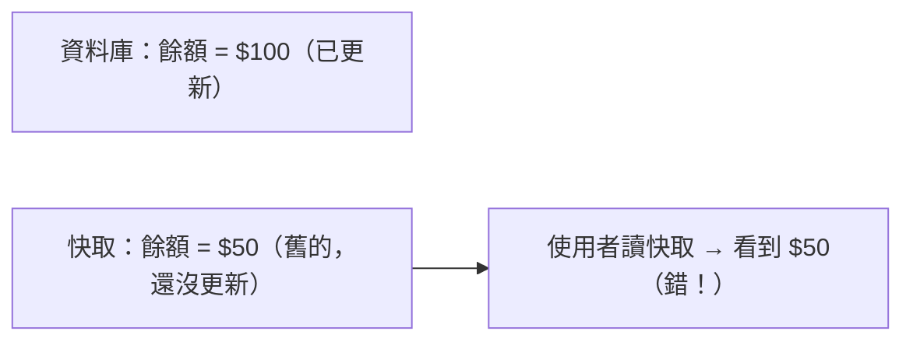
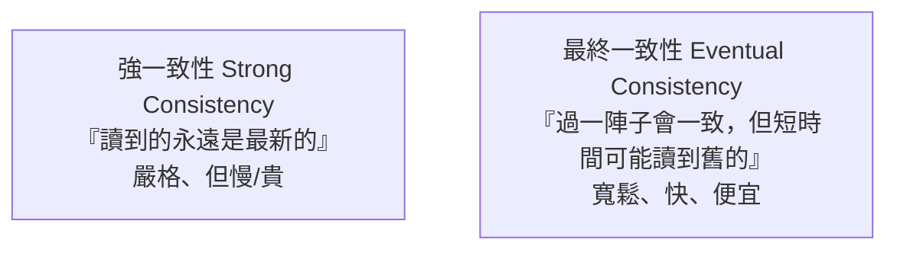

# [cache-6-1] 快取一致性：讀到舊資料的根本問題

> **本章目標**：理解快取最根本的難題——一致性：快取與資料來源不同步，使用者讀到舊資料。知道它為什麼難、有哪些容忍等級。

## 你會學到

- 快取一致性問題到底是什麼
- 為什麼「有快取就一定有不一致的風險」
- 一致性的容忍等級：強一致 vs 最終一致
- 怎麼依場景選擇可接受的一致性

## 概念說明

### 快取的原罪：副本會過時

cache-1-1 說快取是「副本」，cache-1-4 說「失效是最難的問題」。這一章正面處理它——**一致性（consistency）**。

問題很簡單：

> **快取是資料的副本。當「原始資料」變了，但「快取的副本」還沒更新時，使用者讀快取就會讀到「舊資料」——這就是不一致。**



只要你用了快取，就**一定**有「副本可能過時」的風險——這是快取與生俱來的「原罪」。問題不是「能不能完全避免」（不能），而是「**能容忍多少、怎麼控制**」。

---

### 為什麼一致性這麼難

回想 cache-1-4 的「改暱稱」例子——難在快取**散落多層多處**：

- 同一份資料可能快取在：瀏覽器、CDN、多個 Redis 節點、多台應用的行程內快取…
- 資料變了，要讓「**所有這些副本**」都正確更新或失效。
- 漏掉任何一個，那一處就會回舊資料。
- 而且更新它們需要時間，這段時間內就是不一致的。

這就是為什麼「cache invalidation」被列為電腦科學兩大難題之一（cache-1-4）。**完美的一致性（所有副本永遠同步）幾乎不可能、或代價極高**。所以實務上是「選一個能接受的一致性等級」。

---

### 一致性的兩個等級



**強一致性（Strong Consistency）**：

- 保證「**任何時候讀到的都是最新的**」——資料一變，立刻所有地方都是新的。
- 代價：慢、貴。常常意味著「寫的時候要同步更新/失效所有快取」（Write-Through，cache-5-3），或「乾脆不快取關鍵資料」。
- 適合：**絕對不能讀到舊資料**的場景（帳戶餘額、庫存扣減、金流）。

**最終一致性（Eventual Consistency）**：

- 保證「**最終會一致**」，但「短時間內可能讀到舊資料」。
- 代價：可能短暫不一致——但換來快、便宜、高可用。
- 適合：**過時一下子沒差**的場景（文章內容、商品描述、按讚數、貼文列表）——這是**絕大多數**快取的場景。

關鍵認知（呼應 cache-1-2、SRE Part 2）：

> **大多數情況，「最終一致」就夠了**——使用者看到「3 秒前的按讚數」根本沒差。只有少數關鍵資料才需要「強一致」（這些通常乾脆不快取，或用嚴格的同步策略）。

---

### 用 TTL 控制「最多不一致多久」

最常見、最簡單的一致性控制，就是 **TTL**（cache-1-2、cache-5-4）：

> TTL 就是你願意接受的「**最大不一致時間**」。設 TTL = 60 秒，代表「我接受資料最多過時 60 秒，60 秒後一定會重新載入最新的」。

所以 TTL 不只是「快取多久」，它本質是「**一致性的旋鈕**」：

- TTL 短 → 不一致時間短（較一致）、但回源多、命中率低。
- TTL 長 → 不一致時間長（較不一致）、但省回源、命中率高。

你轉這個旋鈕，就是在「一致性」和「效能」之間做 cache-1-2 的取捨。

---

### 主動失效：縮短不一致

光靠 TTL 過期，不一致時間最長可達一個 TTL。如果想「資料一變就盡快一致」，要搭配**主動失效**——資料更新時，**主動刪除/更新快取**（不等 TTL）：

```
更新資料庫(...)
快取.刪除(對應的 key)    // 主動失效 → 下次讀就重新載入最新的
```

這把「最多不一致一個 TTL」縮短成「幾乎立刻一致」（更新後下次讀就是新的）。但這引出一個關鍵問題——**「更新資料庫」和「刪快取」的順序、時機怎麼安排才對？** 做不好反而會造成更詭異的不一致。這就是 cache-6-5 要深入的「快取更新模式」。

---

### 一致性與其他坑的關係

一致性是 Part 6 所有坑的「根」：

```
快取一致性問題（這章，根本問題）
  ├── 怎麼更新才不會不一致 → cache-6-5（更新模式）
  └── 大量失效時的連鎖問題：
       ├── 雪崩 cache-6-2（大量同時過期）
       ├── 穿透 cache-6-3（查不存在的）
       └── 擊穿 cache-6-4（熱點過期瞬間）
```

理解了「快取是副本、副本會過時、要在一致性和效能間取捨」這個根本，後面幾章的具體坑就都是它的不同面向。

## 程式碼範例

用 TTL 與主動失效控制一致性（pseudo code）：

```
// 方法一：純 TTL（最終一致，最多不一致 60 秒）
redis.set("article:10", 文章, EX=60)
// → 文章更新後，最多 60 秒，快取會過期重載

// 方法二：TTL + 主動失效（更新後幾乎立刻一致）
function 更新文章(id, 內容):
    資料庫.更新(id, 內容)
    redis.del("article:" + id)        // 主動刪 → 下次讀重新載入最新
    // → 不一致時間從「最多 60 秒」縮短到「幾乎沒有」

// 關鍵資料（餘額）：強一致 → 乾脆不快取
function 取得餘額(id):
    return 資料庫.查餘額(id)           // 直接查，不快取，保證最新
```

依資料的「一致性要求」選方法——大多數用方法一/二（最終一致夠用），少數關鍵資料用「不快取」（強一致）。

## 小練習

### 練習 1：一致性問題是什麼

用「餘額」的例子，說明快取一致性問題是什麼。為什麼「有快取就一定有不一致風險」？

---

### 練習 2：兩種一致性

回答：

1. 強一致和最終一致的差別？
2. 為什麼說「大多數快取場景，最終一致就夠了」？舉一個「最終一致 OK」和一個「必須強一致」的例子。

---

### 練習 3：TTL 是一致性旋鈕

回答：為什麼說「TTL 本質是『你能接受的最大不一致時間』」？把 TTL 從 60 秒改成 5 秒，一致性和效能各會怎樣變？

## 課外讀物

> 一致性在分散式系統有更深的理論（CAP / 最終一致）→ [課外讀物 E-13-6：CAP 定理] 與 E-13 分散式系統新增章節；快取更新順序 → 見本書 cache-6-5
