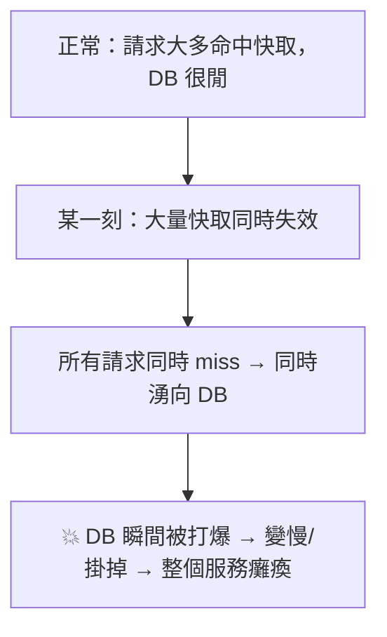

# [cache-6-2] 🕳️ 快取雪崩：大量同時失效打爆資料庫

> **本章目標**：理解「快取雪崩」這個坑——大量快取同時失效，瞬間把資料庫打垮，以及怎麼預防。

## 你會學到

- 快取雪崩（Cache Avalanche）是什麼、怎麼發生
- 兩種引發雪崩的情境
- 預防：TTL 加隨機、多級快取、熔斷
- 雪崩、穿透、擊穿的區別（本章先講雪崩）

## 概念說明

### 雪崩：快取「集體失效」的災難

cache-5-1 說快取的價值是「擋掉大量資料庫查詢」。那如果**快取突然集體失效**呢？

> **快取雪崩（Cache Avalanche）：大量快取在「同一時間」失效，導致原本被快取擋住的請求「同時」湧向資料庫，瞬間把資料庫打垮。**


```mermaid
graph TB
    NORMAL["正常：請求大多命中快取，DB 很閒"]
    NORMAL --> EVENT["某一刻：大量快取同時失效"]
    EVENT --> FLOOD["所有請求同時 miss → 同時湧向 DB"]
    FLOOD --> DOWN["💥 DB 瞬間被打爆 → 變慢/掛掉 → 整個服務癱瘓"]
```

可怕的是它的「連鎖」：DB 被打爆變慢 → 請求堆積 → 更多 timeout 重試 → DB 更慘 → 雪崩式崩潰（呼應 SRE Part 8-1 的連鎖故障）。這就是為什麼叫「雪崩」。

---

### 兩種引發雪崩的情境

**情境一：大量 key「同時過期」**

如果你給大量 key 設了「**相同的 TTL**」（例如系統啟動時一次載入一堆資料、都設 TTL=1 小時），那 1 小時後它們會**同時過期** → 同時 miss → 同時打 DB。

這呼應 cache-5-4 提過的——**TTL 設一樣 = 定時炸彈**。

**情境二：快取服務「整個掛掉」或「重啟」**

如果 Redis 整台掛了、或重啟（快取全空，cache-1-3 的冷啟動極端版），那**所有**請求瞬間全部 miss → 全部打 DB → 雪崩。

---

### 預防雪崩的方法

**① TTL 加隨機抖動（針對情境一，最重要）**

別讓大量 key 同時過期——給 TTL 加一點隨機，讓過期時間**錯開**（cache-5-4 講過）：

```
// ❌ 危險：大量 key 同樣 TTL → 同時過期
redis.set(key, 值, EX=3600)

// ✅ 安全：加隨機抖動 → 過期時間散開
redis.set(key, 值, EX=3600 + 隨機(0, 600))   // 3600~4200 秒間錯開
```

這樣 key 在一段時間內陸續過期，而非「同一秒全爆」，DB 壓力被攤平。簡單但極有效。

**② 多級快取（針對情境二）**

別把所有雞蛋放一個籃子（單一 Redis）。用「多級快取」——例如「行程內快取（cache-2-4）+ Redis」兩層：Redis 掛了，還有行程內快取頂著一部分，不會「全部」瞬間落到 DB。這呼應 cache-2-1 的多層快取精神。

**③ 熱點資料「永不過期」+ 背景更新**

對最關鍵的熱門資料，可以「不設 TTL（不會過期）」，改用背景任務定期更新它——這樣它永遠不會「過期 miss」，根治了這部分的雪崩風險。

**④ 限流與熔斷（最後防線，呼應 SRE Part 8-2）**

萬一真的雪崩了，要有「保命機制」——對資料庫的請求限流（rate limiting），超過就「優雅降級」（回快取舊值、或回「稍後再試」），保住資料庫不被徹底打垮。這是 SRE「為失敗而設計」在快取的應用。

**⑤ 快取重啟時「預熱」（針對情境二）**

Redis 重啟後別讓它「空著上線承受全部流量」——先「預熱」（背景把熱門資料先載入快取）再開放流量，避免冷啟動雪崩。

---

### 雪崩 vs 穿透 vs 擊穿（先區分）

接下來三章是三個容易混的坑，先用一句話區分：

| 坑 | 一句話 | 規模 |
|----|--------|------|
| **雪崩**（本章）| **大量** key **同時**失效 → 大量請求打 DB | 大範圍 |
| **穿透**（cache-6-3）| 查**不存在**的資料 → 永遠 miss → 一直打 DB | 特定（惡意）|
| **擊穿**（cache-6-4）| **單一熱點** key 過期瞬間 → 大量請求打 DB | 單一熱點 |

記憶：**雪崩是「一大片」失效，擊穿是「單一熱點」失效，穿透是「根本不存在」。** 三章看完就能分清。

## 程式碼範例

雪崩的成因與預防對比：

```
// ❌ 會雪崩：系統啟動時一次載入 1000 個商品，全設一樣的 TTL
for product in 所有商品:
    redis.set("product:" + product.id, product, EX=3600)
// → 3600 秒後，1000 個 key 同時過期 → 1000 個請求同時打 DB → 雪崩

// ✅ 防雪崩：TTL 加隨機，錯開過期
for product in 所有商品:
    隨機TTL = 3600 + 隨機(0, 900)        // 3600~4500 秒散開
    redis.set("product:" + product.id, product, EX=隨機TTL)
// → key 在 15 分鐘的區間內陸續過期，DB 壓力被攤平
```

```
// 降級保命（萬一還是雪崩，SRE Part 8-2）
function 取得商品(id):
    快取 = redis.取(key)
    如果 命中: return 快取
    如果 資料庫目前過載:                  // 偵測到 DB 撐不住
        return 回傳舊值或預設值（降級）    // 別再加壓，保住 DB
    商品 = 資料庫.查(id)
    redis.set(key, 商品, EX=隨機TTL)
    return 商品
```

## 小練習

### 練習 1：雪崩是什麼

用自己的話說明快取雪崩。為什麼它會「連鎖」、越來越慘？

<details>
<summary>參考解答</summary>

**快取雪崩是什麼**：正常情況下，大量請求都命中快取，DB 很閒、只承受少數 miss。但如果某一刻「大量快取同時失效」（一堆 key 同時過期，或整台 Redis 掛掉／重啟導致快取全空），原本被快取擋住的請求會在「同一瞬間」全部 miss、全部湧向 DB → DB 瞬間承受平常好幾十倍的流量而被打爆。

**為什麼會連鎖、越來越慘**：這是一個正回饋的惡性循環——

1. 大量請求同時打 DB → DB 過載、變慢。
2. DB 變慢 → 每個請求處理更久 → 請求開始堆積、佔住連線。
3. 請求太久沒回應 → 觸發 timeout → 使用者／上游服務「重試」 → 又送出更多請求。
4. 更多請求打向本來就撐不住的 DB → DB 更慢、甚至掛掉 → 更多 timeout、更多重試…

每一輪都讓 DB 更慘，壓力像滾雪球一樣越滾越大，最後可能讓整個服務癱瘓。這種「一處變慢引發上游堆積與重試、再回頭壓垮自己」的連鎖，就是它叫「雪崩」的原因（呼應 SRE 的連鎖故障）。

</details>

---

### 練習 2：兩種成因與對策

回答：

1. 「大量 key 同時過期」怎麼預防？（最簡單那招）
2. 「Redis 整台掛掉」怎麼緩解？（提示：別把雞蛋放一個籃子）

<details>
<summary>參考解答</summary>

**1. 「大量 key 同時過期」怎麼預防（最簡單那招）**：給 TTL 加「隨機抖動」。別讓一批 key 用一模一樣的 TTL（那等於定時炸彈，1 小時後同一秒全爆），而是在基準 TTL 上加一段隨機值，例如：

```
redis.set(key, 值, EX=3600 + 隨機(0, 600))   // 3600~4200 秒間錯開過期
```

這樣這批 key 會在一段時間內「陸續」過期，而不是同一秒集體過期，DB 的回源壓力被攤平在時間軸上。簡單一行，卻極有效，是防情境一的第一招。

**2. 「Redis 整台掛掉」怎麼緩解**：核心是「別把雞蛋放一個籃子」——不要讓單一 Redis 成為唯一的防線。可以：

- **多級快取**：在 Redis 前面再加一層「行程內快取（in-process cache）」。Redis 掛了，行程內快取還能頂住一部分請求，不會「全部」瞬間落到 DB。
- **熱點資料永不過期 + 背景更新**：最關鍵的熱門資料不設 TTL，靠背景任務定期刷新，天生不會因過期而 miss。
- **重啟先預熱**：Redis 重啟後別「空著」直接承接全部流量，先在背景把熱門資料載回快取，再開放流量，避免冷啟動雪崩。
- **限流／熔斷兜底**：萬一真的雪崩，對 DB 的請求限流，超過就優雅降級（回舊值或「稍後再試」），保住 DB 不被徹底打垮。

</details>

---

### 練習 3：分清三坑

用一句話分別說明雪崩、穿透、擊穿的差別（規模/成因）。

<details>
<summary>參考解答</summary>

- **雪崩**：**大量、不同的** key 在**同一時間**失效（同時過期或 Redis 整台掛），造成大批請求同時湧向 DB——是「一大片」的災難。
- **穿透**：一直查詢**根本不存在**的資料（快取和 DB 都沒有），永遠 miss、永遠打 DB——常被拿來當惡意攻擊手段。
- **擊穿**：**單一個超熱點** key 在過期的**那一瞬間**，剛好被大量請求同時要，集中打在「同一筆」查詢上——是單點高併發的災難。

一句話記憶：**雪崩是「一大片塌了」，穿透是「打一個本來就沒有的洞」，擊穿是「一個超熱的點破了」。**

</details>

## 課外讀物

> 雪崩的「連鎖故障」與「降級保命」是 SRE 的核心 → 參見 **sre 課程** Part 8-1、Part 8-2
