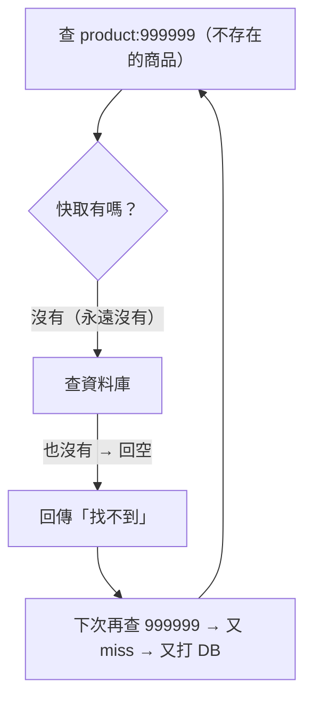
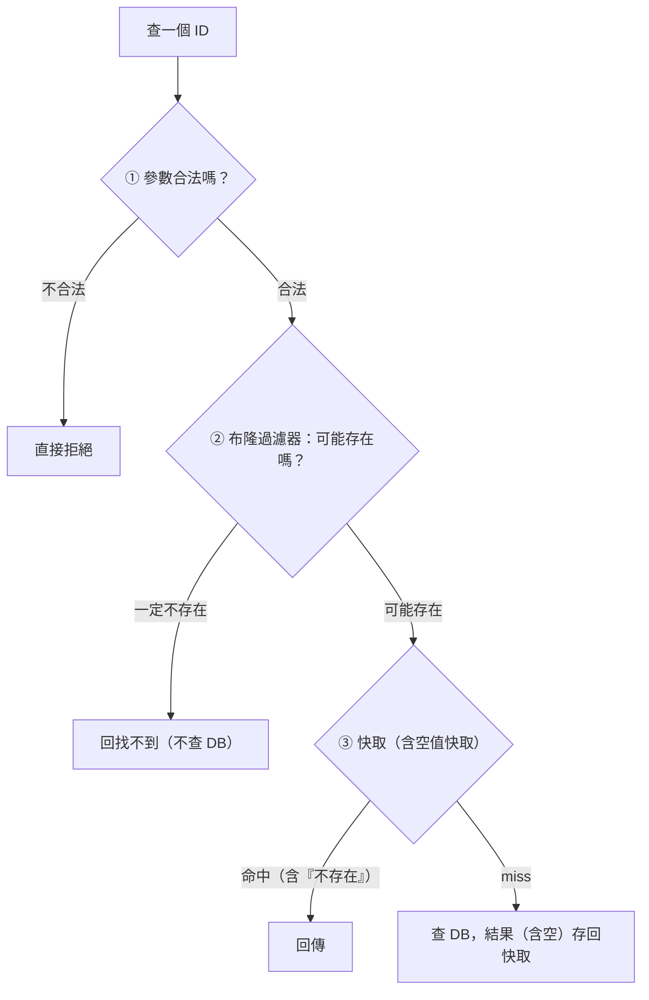

# [cache-6-3] 🕳️ 快取穿透：查不存在的資料一直打 DB

> **本章目標**：理解「快取穿透」這個坑——一直查「根本不存在」的資料，每次都繞過快取打資料庫，以及怎麼防（含惡意攻擊）。

## 你會學到

- 快取穿透（Cache Penetration）是什麼
- 為什麼「查不存在的資料」會繞過快取
- 它常被用來當攻擊手段
- 預防：快取空值、布隆過濾器

## 概念說明

### 穿透：查「不存在」的東西

cache-6-2 的雪崩是「快取裡的東西大量失效」。穿透不一樣——它是查「**快取和資料庫裡都根本沒有**」的資料：

> **快取穿透（Cache Penetration）：一直查詢「不存在」的資料。因為資料不存在，快取永遠不會有它（cache-aside 只快取「查到的」結果），所以每次都 miss、每次都穿過快取去打資料庫。**



問題核心：Cache-Aside（cache-1-3）只在「查到資料」時才存快取。查不存在的資料 → 查不到 → **不會存快取** → 下次再查還是 miss → 又打 DB。快取完全沒擋到它——請求「穿透」了快取。

---

### 為什麼這是個大問題（尤其惡意攻擊）

正常使用者偶爾查到不存在的東西沒關係。但這個坑**常被用來攻擊**：

> 攻擊者故意用「大量不存在的 ID」狂打你的 API（例如 `product:999999`、`product:888888`…一堆亂數）。因為這些都不存在 → 全部穿透快取 → **全部直接打資料庫** → 資料庫被打爆。

快取本來是保護資料庫的盾牌，但「查不存在的資料」讓盾牌失效——這就是穿透的危險。

---

### 預防方法

**① 快取「空值」（Cache Null）——最常用**

關鍵洞察：既然「查不到也是一種結果」，那就**把「查不到」這個結果也快取起來**！

```
查 product:999999 → DB 也沒有 → 把「不存在」這個結果快取（設短 TTL）
下次再查 999999 → 快取命中「不存在」→ 直接回，不打 DB ✅
```

這樣同一個不存在的 ID，第二次起就被快取擋住了。注意：

- 給「空值快取」設**較短的 TTL**（例如 30 秒）——因為這筆資料「之後可能會被建立」，TTL 短一點，建立後不會卡太久。
- 這是最簡單有效、最常用的防穿透方法。

**② 布隆過濾器（Bloom Filter）——進階**

對「攻擊者用海量不同的不存在 ID」的情況，光快取空值可能存太多無用的空值。這時用 **布隆過濾器（Bloom Filter）**：

> 布隆過濾器是一個「**超省空間的集合**」，能極快地判斷「**某個 ID 一定不存在**，還是**可能存在**」。

用它擋在快取前面：

```
查某 ID → 先問布隆過濾器「這 ID 可能存在嗎？」
  → 「一定不存在」→ 直接回「找不到」，連快取和 DB 都不用查 ✅
  → 「可能存在」→ 才走正常的快取/DB 流程
```

布隆過濾器的特性（你知道概念即可）：

- **省空間**：用很小的記憶體，記錄「哪些 ID 是存在的」。
- **判斷快**：瞬間回答「一定不存在」或「可能存在」。
- **有誤判但安全**：它可能把「不存在」誤判成「可能存在」（false positive），但**絕不會**把「存在」誤判成「不存在」——所以「它說不存在 = 真的不存在」，可以放心擋掉。

適合：要擋「大量、隨機的不存在查詢」（典型的惡意攻擊）。

**③ 參數驗證（基本防線）**

最基本的——**驗證輸入的合理性**。如果 ID 明顯不合法（負數、超出範圍、格式錯），直接拒絕，根本不查。這能擋掉一部分明顯亂來的請求。

---

### 三招配合



實務上：**「快取空值」是基本款（足以應付多數情況）**，「布隆過濾器」用在「需要擋大規模惡意攻擊」的進階場景，「參數驗證」是該有的基本衛生。

## 程式碼範例

快取空值防穿透（最常用，pseudo code）：

```
function 取得商品(id):
    key = "product:" + id
    快取 = redis.取(key)

    如果 快取 存在:
        如果 快取 == "NULL標記":         // 命中「不存在」的快取
            return 找不到                 // 直接回，不打 DB ✅
        return 快取                       // 正常命中

    // miss → 查 DB
    商品 = 資料庫.查(id)

    如果 商品 不存在:
        redis.set(key, "NULL標記", EX=30)  // ★ 把「不存在」也快取（短 TTL）
        return 找不到
    否則:
        redis.set(key, 商品, EX=300)
        return 商品
```

關鍵就是那一行 `redis.set(key, "NULL標記", ...)`——把「查不到」也快取起來，下次同樣的不存在查詢就被擋住了。

## 小練習

### 練習 1：穿透是什麼

用自己的話說明快取穿透。為什麼「查不存在的資料」會每次都打到資料庫？

---

### 練習 2：為什麼是攻擊手段

回答：攻擊者怎麼利用快取穿透打垮你的資料庫？為什麼一般的快取擋不住它？

---

### 練習 3：兩種防法

回答：

1. 「快取空值」怎麼防穿透？為什麼空值快取要設「短 TTL」？
2. 布隆過濾器適合擋什麼樣的穿透？它「絕不會誤判」的是哪個方向（存在還是不存在）？

## 課外讀物

> 防穿透是保護資料庫、避免被攻擊打垮的一環，呼應 SRE 的容量與限流 → 參見 **sre 課程** Part 7、Part 8-2
