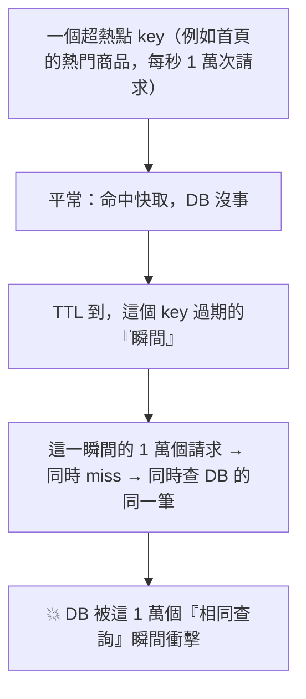
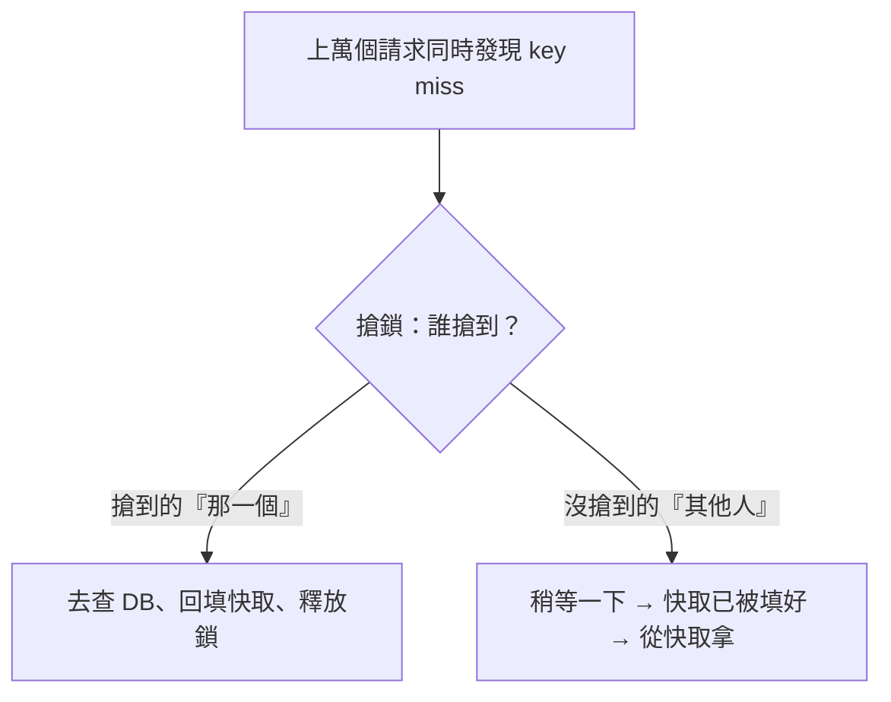

# [cache-6-4] 🕳️ 快取擊穿：熱點 key 過期的瞬間

> **本章目標**：理解「快取擊穿」——單一熱點 key 過期的瞬間，大量請求同時湧向資料庫，以及怎麼用互斥鎖或永不過期來防。

## 你會學到

- 快取擊穿（Cache Breakdown）是什麼
- 它和雪崩的差別（單一熱點 vs 大量 key）
- 預防：互斥鎖（mutex / single-flight）
- 預防：熱點永不過期 + 背景更新

## 概念說明

### 擊穿：單一熱點的瞬間崩潰

cache-6-2 雪崩是「**大量** key 同時失效」。擊穿是它的「**單點高併發**」版本：

> **快取擊穿（Cache Breakdown / Hotspot Invalid）：某個「超熱門」的 key 在過期的「那一瞬間」，剛好有大量請求同時要它。因為快取剛失效（miss），這些請求「同時」穿過去查資料庫——瞬間集中打在這一筆資料上。**



關鍵差別：

- **雪崩**：很多「不同的 key」一起失效（一大片）。
- **擊穿**：「單一個熱點 key」失效，但因為它超熱，過期瞬間的併發量極大，集中打在「同一筆查詢」上。

擊穿的諷刺之處：**越熱門的資料越容易擊穿**——因為它請求量大，過期瞬間湧入的請求就多。而且這些請求查的是「同一筆」，本來只需要查 DB 一次，卻因為「同時 miss」變成查了上萬次同樣的東西。

---

### 預防方法一：互斥鎖（Mutex / Single-Flight）

核心洞察：過期瞬間湧入的上萬個請求，其實**只需要「一個」去查資料庫、回填快取，其他人等它填好就行**——不需要每個都去查。

**互斥鎖（mutex lock）** 就是這個機制：



做法：

1. 大量請求同時 miss。
2. 它們去「搶一把鎖」。
3. **只有搶到鎖的「那一個」**去查資料庫、把結果回填快取、然後釋放鎖。
4. **其他沒搶到的**，稍等一下下、或直接等快取被填好，然後從快取拿。

效果：**過期瞬間，資料庫只被查「一次」**（搶到鎖的那個），而不是上萬次。這個「讓並發的相同請求只實際執行一次」的模式，也叫 **single-flight（單飛）**。

代價：沒搶到鎖的請求要「稍等」一下（多了一點延遲），但這遠比「DB 被打爆」好。

---

### 預防方法二：熱點「永不過期」+ 背景更新

另一個思路——**既然「過期的瞬間」是問題，那就讓熱點 key「不要過期」**：

> 對「超熱點」資料，**不設 TTL（邏輯上永不過期）**，改用一個**背景任務**定期更新它的內容。這樣它永遠在快取裡、永遠不會「過期 miss」，從根本上消除了擊穿的時機。

```
熱點商品 → 不設 TTL（快取裡永遠有）
背景任務 → 每隔 1 分鐘，主動重新查 DB、更新這個 key 的內容
→ 使用者永遠命中快取，從不 miss、從不擊穿
→ 代價：資料最多過時「一個背景更新週期」（最終一致，cache-6-1）
```

這招對「少數、已知的超熱點」很有效（例如首頁固定的熱門榜）。對「無法預知哪個會變熱」的情況，互斥鎖更通用。

---

### 兩招對照

| 方法 | 怎麼做 | 適合 |
|------|--------|------|
| **互斥鎖 / single-flight** | 過期 miss 時，只讓一個請求查 DB，其他等 | 通用，尤其「無法預知熱點」時 |
| **永不過期 + 背景更新** | 熱點不設 TTL，背景定期刷新 | 「少數、已知的超熱點」 |

實務上常**組合使用**——已知的超熱點用「永不過期」，一般資料用「互斥鎖」兜底。

---

### 雪崩 vs 擊穿 vs 穿透（完整區分）

三章看完，完整對照（呼應 cache-6-2 的預告）：

| 坑 | 問題 | 規模 | 主要解法 |
|----|------|------|---------|
| **雪崩** | 大量 key **同時過期** | 一大片 | TTL 加隨機、多級快取 |
| **擊穿**（本章）| **單一熱點** key 過期瞬間 | 單點高併發 | 互斥鎖、熱點永不過期 |
| **穿透** | 查**根本不存在**的資料 | 特定/惡意 | 快取空值、布隆過濾器 |

一句話記憶：

> **雪崩是「一大片塌了」，擊穿是「一個超熱的點破了」，穿透是「打一個本來就沒有的洞」。**

## 程式碼範例

互斥鎖防擊穿（pseudo code）：

```
function 取得熱門商品(id):
    key = "product:" + id
    快取 = redis.取(key)
    如果 快取 存在: return 快取            // 命中，正常

    // miss！可能是過期瞬間，大量請求同時到這
    鎖 = redis.嘗試上鎖("lock:" + key, 超時=5秒)

    如果 搶到鎖:
        商品 = 資料庫.查(id)              // 只有我查 DB
        redis.set(key, 商品, EX=隨機TTL)  // 回填快取
        redis.釋放鎖("lock:" + key)
        return 商品
    否則:                                 // 沒搶到鎖的其他請求
        稍等(50毫秒)                       // 等搶到的人填好快取
        return 取得熱門商品(id)            // 重試 → 這次應該命中快取了
```

熱點永不過期 + 背景更新（pseudo code）：

```
// 熱點資料不設 TTL
redis.set("hot:homepage", 資料)          // 沒有 EX，不會過期

// 背景任務，每分鐘刷新
每隔 60 秒:
    新資料 = 資料庫.查熱門商品()
    redis.set("hot:homepage", 新資料)     // 更新內容，但 key 一直在
// → 使用者永遠命中，從不擊穿
```

## 小練習

### 練習 1：擊穿 vs 雪崩

用自己的話說明擊穿和雪崩的差別。為什麼「越熱門的資料越容易擊穿」？

---

### 練習 2：互斥鎖的精髓

回答：過期瞬間上萬個請求同時 miss，為什麼「只需要一個去查 DB」？互斥鎖怎麼達成這件事？

---

### 練習 3：三坑總複習

不看表，用一句話分別說明雪崩、擊穿、穿透，以及各自的主要解法。

## 課外讀物

> 「single-flight / 只執行一次」的思維，與分散式的冪等、限流相通 → 參見 **sre 課程** Part 8；分散式鎖可用 Redis 實作 → 見本書 cache-5-2
