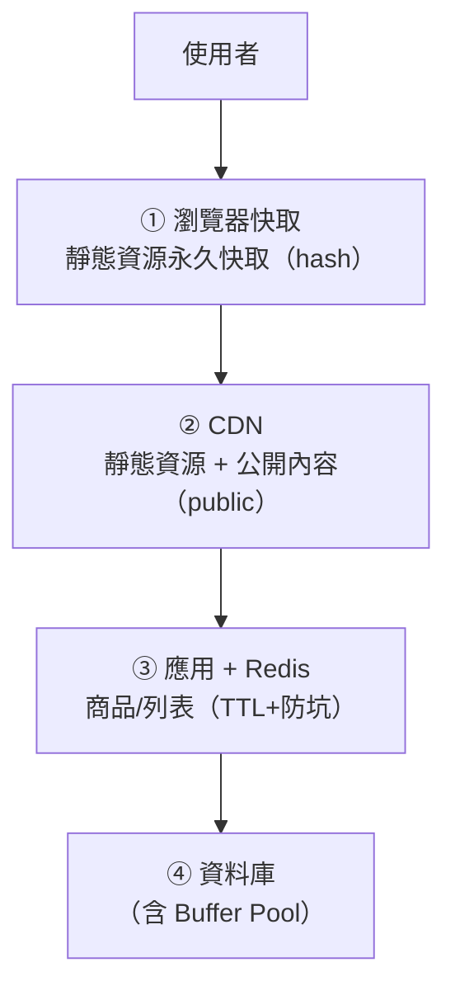

# [cache-6-6] 🏆 總整理：設計多層快取並避開所有坑

> **本章目標**：把整本書整合——為一個真實服務設計「瀏覽器 + CDN + Redis」的多層快取策略，並逐一檢查避開所有的坑。這是你的快取畢業專案。

## 你會學到

- 把各層快取（Part 2-5）整合成一套完整策略
- 用一份檢查清單，避開所有的坑（Part 6）
- 一個真實服務的完整快取設計
- 快取設計的決策框架

## 概念說明

### 你的快取畢業專案

走到這裡，你學完了快取的全貌——概念（Part 1）、各層（Part 2）、瀏覽器（Part 3）、CDN（Part 4）、Redis（Part 5）、坑（Part 6）。這一章把它們**整合成一套完整的設計**。

我們用一個具體服務示範：**一個電商網站**（有靜態資源、商品頁、即時庫存、使用者個人頁）。

---

### 第一步：盤點每種資料，決定快取策略

快取設計的第一步永遠是——**對每種資料，問 cache-1-2 的三個問題**（變動頻率？過時後果？重複讀取？），決定怎麼快取：

| 資料 | 變動 | 過時後果 | 快取策略 |
|------|------|---------|---------|
| JS/CSS/圖片（靜態） | 幾乎不變 | 無 | **瀏覽器+CDN 永久快取**（hash 檔名，cache-3-5）|
| 商品詳情 | 偶爾 | 小 | **Redis 快取**，TTL 5 分鐘（cache-5-1）|
| 熱門商品列表 | 偶爾、超熱 | 小 | Redis + **熱點防擊穿**（cache-6-4）|
| 即時庫存 | 頻繁 | 大（賣超）| **短 TTL（10秒）或不快取** |
| 使用者個人頁 | 因人而異 | 隱私！ | **private，不給 CDN**（cache-4-5）|
| 帳戶餘額 | 隨時 | 嚴重 | **不快取**（強一致，cache-6-1）|

這張表就是整套快取設計的藍圖——**每種資料各得其所**。

---

### 第二步：設計多層快取流程

把各層串起來（cache-2-1 的全景，具體化）：



- **靜態資源**：瀏覽器 + CDN 永久快取（hash 檔名，cache-3-5/4-4）→ 幾乎不碰伺服器。
- **公開動態內容**（商品頁）：CDN 短快取 + Redis 快取 → 大量請求被擋在 CDN/Redis。
- **個人化內容**：`private`（cache-4-5）→ 只瀏覽器快取，不給 CDN。
- **關鍵即時資料**（餘額）：不快取 → 直接查 DB（強一致）。

---

### 第三步：避坑檢查清單

設計完，用這份清單**逐一檢查每個坑**（Part 6 + Part 3-5/4-4/4-5）：

**前端部署坑（cache-3-5、4-4）**
- [ ] 靜態資源用 hash 檔名（內容變檔名變）
- [ ] hash 檔設永久快取 + immutable
- [ ] index.html 設 no-cache（總是拿最新指路牌）
- [ ] 部署時保留舊 hash 檔（新舊共存）、purge CDN 的 index.html

**快取錯東西坑（cache-4-5）**
- [ ] 個人化/私密內容設 private（CDN 不准快取）
- [ ] 含 Set-Cookie/session 的回應不被共享快取
- [ ] 敏感 API 設 no-store

**雪崩（cache-6-2）**
- [ ] TTL 加隨機抖動（避免大量 key 同時過期）
- [ ] 多級快取 / 降級保命機制

**穿透（cache-6-3）**
- [ ] 快取空值（擋「查不存在」）
- [ ] （必要時）布隆過濾器 / 參數驗證

**擊穿（cache-6-4）**
- [ ] 超熱點用互斥鎖 或 永不過期+背景更新

**一致性（cache-6-1、6-5）**
- [ ] 更新用「先更新 DB、再刪快取」
- [ ] 設合理 TTL 兜底
- [ ] 關鍵強一致資料「不快取」

走完這份清單，你的快取設計就「**既有快取的好處、又避開了所有的坑**」。

---

### 第四步：監控快取健康

設計上線後，要監控（呼應 cache-1-3、SRE Part 3）：

- **命中率（hit rate）**：太低代表快取設計有問題（快取錯東西、TTL 太短）。
- **資料庫負載**：快取有沒有真的擋掉請求。
- **Redis 記憶體使用 / 淘汰率**：會不會一直在淘汰（記憶體不夠，cache-5-4）。

快取不是「設好就不管」——靠監控持續驗證它真的有效（SRE 的觀測精神）。

---

### 快取設計決策框架（總結整本書）

面對任何快取需求，照這個框架走：

```
1. 這資料值得快取嗎？（cache-1-2：重複讀？過時可接受？來源慢？）
   → 不值得 → 別快取
2. 該在哪層快取？（cache-2-1：靜態→瀏覽器/CDN；動態→Redis）
3. 公開還是私密？（cache-4-5：public 可給 CDN；private 只給瀏覽器）
4. TTL 設多長？（cache-1-2/6-1：一致性 vs 效能的旋鈕，記得加隨機）
5. 怎麼更新/失效？（cache-6-5：先更新 DB 再刪快取 + TTL 兜底）
6. 防坑了嗎？（Part 6 清單：雪崩/穿透/擊穿）
7. 監控了嗎？（命中率、DB 負載）
```

掌握這個框架，你就能為任何服務設計出可靠的快取——這正是這本書要給你的能力。

## 程式碼範例

一個整合的快取設計（概念示意，把全書串起來）：

```
電商網站快取設計：

【靜態資源】Nginx/CDN：
  *.[hash].js/css → Cache-Control: max-age=31536000, immutable（永久）
  index.html → Cache-Control: no-cache
  → 部署：上傳新檔（留舊檔）、purge index.html

【商品詳情】Redis（Cache-Aside）：
  key: product:{id}, TTL: 300±60 秒（加抖動防雪崩）
  查不到 → 快取空值 30 秒（防穿透）
  更新商品 → 先更新 DB、再 del 快取（cache-6-5）

【熱門列表】Redis（防擊穿）：
  key: hot_products, 不設 TTL，背景任務每分鐘更新（防擊穿）

【個人頁】Cache-Control: private, no-cache（不給 CDN，防洩漏）

【帳戶餘額】不快取，直接查 DB（強一致）

【監控】Grafana 看：Redis 命中率、DB QPS、Redis 記憶體
```

這份設計就是整本書的濃縮——每種資料各得其所、每個坑都被防住、有監控驗證。

## 小練習

### 練習 1：設計一套快取

為一個「新聞網站」（有靜態資源、文章內容、即時熱門榜、使用者收藏）設計快取策略：每種資料在哪層快取、TTL、public/private、怎麼防坑。

---

### 練習 2：跑一遍避坑清單

針對你上題的設計，用本章的「避坑檢查清單」逐項檢查。有沒有漏掉的坑？

---

### 練習 3：用決策框架

挑一個你工作/專案中的真實資料，用「快取設計決策框架」走一遍：值得快取嗎？在哪層？TTL？怎麼失效？怎麼防坑？

> 恭喜你完成整本快取課程！你從「快取是什麼」開始，到能設計多層快取、避開所有經典坑。快取無所不在、也最多坑——你現在有能力駕馭它了。

## 課外讀物

> 快取監控呼應 SRE 觀測 → 參見 **sre 課程** Part 3；快取在雲端的實作 → 參見 **aws 課程** Part 6（CloudFront / ElastiCache）；一致性的分散式理論 → 課外讀物 E-13 分散式系統章節
