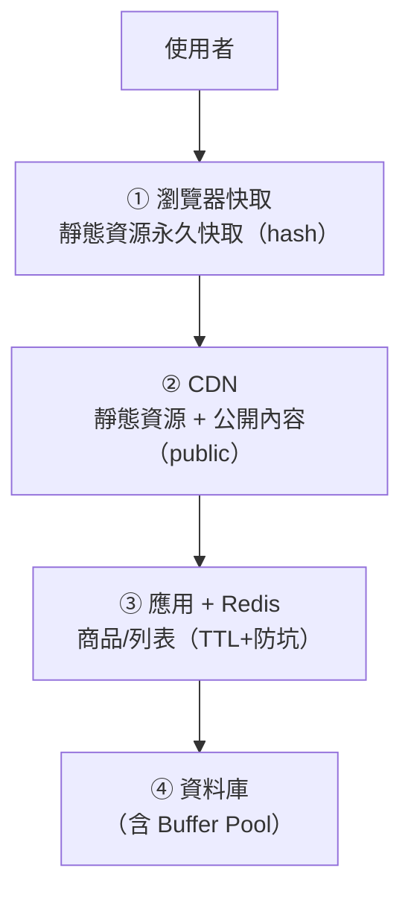

# [cache-6-6] 🏆 總整理：設計多層快取並避開所有坑

> **本章目標**：把整本書整合——為一個真實服務設計「瀏覽器 + CDN + Redis」的多層快取策略，並逐一檢查避開所有的坑。這是你的快取畢業專案。

## 你會學到

- 把各層快取（Part 2-5）整合成一套完整策略
- 用一份檢查清單，避開所有的坑（Part 6）
- 一個真實服務的完整快取設計
- 快取設計的決策框架

## 概念說明

### 你的快取畢業專案

走到這裡，你學完了快取的全貌——概念（Part 1）、各層（Part 2）、瀏覽器（Part 3）、CDN（Part 4）、Redis（Part 5）、坑（Part 6）。這一章把它們**整合成一套完整的設計**。

我們用一個具體服務示範：**一個電商網站**（有靜態資源、商品頁、即時庫存、使用者個人頁）。

---

### 第一步：盤點每種資料，決定快取策略

快取設計的第一步永遠是——**對每種資料，問 cache-1-2 的三個問題**（變動頻率？過時後果？重複讀取？），決定怎麼快取：

| 資料 | 變動 | 過時後果 | 快取策略 |
|------|------|---------|---------|
| JS/CSS/圖片（靜態） | 幾乎不變 | 無 | **瀏覽器+CDN 永久快取**（hash 檔名，cache-3-5）|
| 商品詳情 | 偶爾 | 小 | **Redis 快取**，TTL 5 分鐘（cache-5-1）|
| 熱門商品列表 | 偶爾、超熱 | 小 | Redis + **熱點防擊穿**（cache-6-4）|
| 即時庫存 | 頻繁 | 大（賣超）| **短 TTL（10秒）或不快取** |
| 使用者個人頁 | 因人而異 | 隱私！ | **private，不給 CDN**（cache-4-5）|
| 帳戶餘額 | 隨時 | 嚴重 | **不快取**（強一致，cache-6-1）|

這張表就是整套快取設計的藍圖——**每種資料各得其所**。

---

### 第二步：設計多層快取流程

把各層串起來（cache-2-1 的全景，具體化）：


```mermaid
graph TB
    USER["使用者"]
    USER --> BROWSER["① 瀏覽器快取<br/>靜態資源永久快取（hash）"]
    BROWSER --> CDN["② CDN<br/>靜態資源 + 公開內容（public）"]
    CDN --> APP["③ 應用 + Redis<br/>商品/列表（TTL+防坑）"]
    APP --> DB["④ 資料庫<br/>（含 Buffer Pool）"]
```

- **靜態資源**：瀏覽器 + CDN 永久快取（hash 檔名，cache-3-5/4-4）→ 幾乎不碰伺服器。
- **公開動態內容**（商品頁）：CDN 短快取 + Redis 快取 → 大量請求被擋在 CDN/Redis。
- **個人化內容**：`private`（cache-4-5）→ 只瀏覽器快取，不給 CDN。
- **關鍵即時資料**（餘額）：不快取 → 直接查 DB（強一致）。

---

### 第三步：避坑檢查清單

設計完，用這份清單**逐一檢查每個坑**（Part 6 + Part 3-5/4-4/4-5）：

**前端部署坑（cache-3-5、4-4）**
- [ ] 靜態資源用 hash 檔名（內容變檔名變）
- [ ] hash 檔設永久快取 + immutable
- [ ] index.html 設 no-cache（總是拿最新指路牌）
- [ ] 部署時保留舊 hash 檔（新舊共存）、purge CDN 的 index.html

**快取錯東西坑（cache-4-5）**
- [ ] 個人化/私密內容設 private（CDN 不准快取）
- [ ] 含 Set-Cookie/session 的回應不被共享快取
- [ ] 敏感 API 設 no-store

**雪崩（cache-6-2）**
- [ ] TTL 加隨機抖動（避免大量 key 同時過期）
- [ ] 多級快取 / 降級保命機制

**穿透（cache-6-3）**
- [ ] 快取空值（擋「查不存在」）
- [ ] （必要時）布隆過濾器 / 參數驗證

**擊穿（cache-6-4）**
- [ ] 超熱點用互斥鎖 或 永不過期+背景更新

**一致性（cache-6-1、6-5）**
- [ ] 更新用「先更新 DB、再刪快取」
- [ ] 設合理 TTL 兜底
- [ ] 關鍵強一致資料「不快取」

走完這份清單，你的快取設計就「**既有快取的好處、又避開了所有的坑**」。

---

### 第四步：監控快取健康

設計上線後，要監控（呼應 cache-1-3、SRE Part 3）：

- **命中率（hit rate）**：太低代表快取設計有問題（快取錯東西、TTL 太短）。
- **資料庫負載**：快取有沒有真的擋掉請求。
- **Redis 記憶體使用 / 淘汰率**：會不會一直在淘汰（記憶體不夠，cache-5-4）。

快取不是「設好就不管」——靠監控持續驗證它真的有效（SRE 的觀測精神）。

---

### 快取設計決策框架（總結整本書）

面對任何快取需求，照這個框架走：

```
1. 這資料值得快取嗎？（cache-1-2：重複讀？過時可接受？來源慢？）
   → 不值得 → 別快取
2. 該在哪層快取？（cache-2-1：靜態→瀏覽器/CDN；動態→Redis）
3. 公開還是私密？（cache-4-5：public 可給 CDN；private 只給瀏覽器）
4. TTL 設多長？（cache-1-2/6-1：一致性 vs 效能的旋鈕，記得加隨機）
5. 怎麼更新/失效？（cache-6-5：先更新 DB 再刪快取 + TTL 兜底）
6. 防坑了嗎？（Part 6 清單：雪崩/穿透/擊穿）
7. 監控了嗎？（命中率、DB 負載）
```

掌握這個框架，你就能為任何服務設計出可靠的快取——這正是這本書要給你的能力。

## 程式碼範例

一個整合的快取設計（概念示意，把全書串起來）：

```
電商網站快取設計：

【靜態資源】Nginx/CDN：
  *.[hash].js/css → Cache-Control: max-age=31536000, immutable（永久）
  index.html → Cache-Control: no-cache
  → 部署：上傳新檔（留舊檔）、purge index.html

【商品詳情】Redis（Cache-Aside）：
  key: product:{id}, TTL: 300±60 秒（加抖動防雪崩）
  查不到 → 快取空值 30 秒（防穿透）
  更新商品 → 先更新 DB、再 del 快取（cache-6-5）

【熱門列表】Redis（防擊穿）：
  key: hot_products, 不設 TTL，背景任務每分鐘更新（防擊穿）

【個人頁】Cache-Control: private, no-cache（不給 CDN，防洩漏）

【帳戶餘額】不快取，直接查 DB（強一致）

【監控】Grafana 看：Redis 命中率、DB QPS、Redis 記憶體
```

這份設計就是整本書的濃縮——每種資料各得其所、每個坑都被防住、有監控驗證。

## 小練習

### 練習 1：設計一套快取

為一個「新聞網站」（有靜態資源、文章內容、即時熱門榜、使用者收藏）設計快取策略：每種資料在哪層快取、TTL、public/private、怎麼防坑。

<details>
<summary>參考解答</summary>

這是開放題，沒有唯一正解，但一個好答案應該對「每種資料」都跑一遍決策：值得快取嗎？在哪層？public/private？TTL？怎麼失效？防哪個坑？下面是一份示範設計（你的答案只要邏輯站得住、每種資料各得其所即可）：

| 資料 | 變動 | 過時後果 | 快取層 | public/private | TTL | 防坑重點 |
|------|------|---------|--------|----------------|-----|---------|
| **JS/CSS/圖片（靜態）** | 幾乎不變 | 無 | 瀏覽器 + CDN | public | 永久（1 年）+ immutable | hash 檔名（cache-3-5）；index.html 設 no-cache；部署保留舊 hash、purge CDN 的 index.html |
| **文章內容** | 偶爾（發布後幾乎不改） | 小 | CDN（公開頁）+ Redis | public | Redis 5 分鐘 ± 隨機抖動 | TTL 加隨機防**雪崩**；查不到的文章 id 快取空值 30 秒防**穿透**；文章更新用「先更新 DB 再刪快取」 |
| **即時熱門榜** | 頻繁、超熱點 | 小 | Redis | public | 不設 TTL，背景任務每 1 分鐘刷新 | 熱點永不過期 + 背景更新防**擊穿**（單一超熱 key）；最終一致（最多過時一個刷新週期） |
| **使用者收藏** | 因人而異、會變 | 隱私 | 瀏覽器（private），伺服器端可用 Redis 以 userId 為 key | **private**（不給 CDN） | 短 TTL 或即時失效 | 設 `Cache-Control: private, no-cache`，**絕不給 CDN 共享快取**（防個資外洩，cache-4-5）；使用者改收藏時刪對應 key |

**設計說明的要點**：

- **靜態資源**用 hash 檔名走瀏覽器 + CDN 永久快取，幾乎不碰伺服器。
- **文章**是公開、偶爾變的動態內容，適合 CDN 短快取 + Redis，記得 TTL 加抖動、空值快取、正確的更新順序。
- **熱門榜**是典型「已知的單一超熱點」，最適合「永不過期 + 背景更新」根治擊穿。
- **收藏**是個人化／隱私資料，重點不在效能而在「絕不能被 CDN 當公開內容快取給別人」，必須 private。
- **有沒有不該快取的？** 若有像「使用者帳號安全設定」這類敏感即時資料，應設 `no-store` 或不快取。

</details>

---

### 練習 2：跑一遍避坑清單

針對你上題的設計，用本章的「避坑檢查清單」逐項檢查。有沒有漏掉的坑？

<details>
<summary>參考解答</summary>

拿練習 1 的新聞網站設計，對照本章清單逐項打勾（這題的價值在於「養成用清單自我審查」的習慣）：

**前端部署坑（cache-3-5、4-4）**
- [x] 靜態資源用 hash 檔名（內容變檔名變）
- [x] hash 檔設永久快取 + immutable
- [x] index.html 設 no-cache（總是拿最新指路牌）
- [x] 部署時保留舊 hash 檔、purge CDN 的 index.html

**快取錯東西坑（cache-4-5）**
- [x] 使用者收藏設 `private`（CDN 不准快取）
- [x] 含 Set-Cookie/session 的回應不被共享快取
- [x] 敏感 API（如帳號設定）設 no-store

**雪崩（cache-6-2）**
- [x] 文章 TTL 加隨機抖動（避免大量 key 同時過期）
- [ ] 多級快取 / 降級保命機制 ← **常被漏掉**：原設計沒提「Redis 整台掛掉」怎麼辦，應補「行程內快取兜底」或「DB 過載時降級回舊值」

**穿透（cache-6-3）**
- [x] 查不存在的文章 id → 快取空值 30 秒
- [ ] （必要時）布隆過濾器 / 參數驗證 ← 若擔心惡意用海量假 id 攻擊，可補布隆過濾器與 id 格式驗證

**擊穿（cache-6-4）**
- [x] 熱門榜（超熱點）用「永不過期 + 背景更新」

**一致性（cache-6-1、6-5）**
- [x] 文章更新用「先更新 DB、再刪快取」
- [x] 設合理 TTL 兜底
- [x] （新聞網站若有金流/會員點數等強一致資料）關鍵資料不快取

**檢查心得**：跑一遍清單後，最容易發現漏掉的通常是「情境二型的雪崩（Redis 整台掛的降級兜底）」和「防大規模惡意穿透的進階手段」——因為它們在「正常運作」時不會出事，容易被忽略。清單的價值就是強迫你把這些「平常沒事、出事很慘」的坑一個個檢查到。

</details>

---

### 練習 3：用決策框架

挑一個你工作/專案中的真實資料，用「快取設計決策框架」走一遍：值得快取嗎？在哪層？TTL？怎麼失效？怎麼防坑？

<details>
<summary>參考解答</summary>

這題要拿「你自己專案的真實資料」練習，答案因人而異——需自行套用到你實際的資料上。下面用一個常見例子「電商的商品評論列表」示範怎麼把決策框架（本章第七步）走一遍，你照著同樣的七步回答自己的資料即可：

1. **值得快取嗎？（cache-1-2：重複讀？過時可接受？來源慢？）**
   商品頁的評論列表會被大量使用者重複讀、來源是一個帶排序分頁的 DB 查詢（不便宜）、晚幾秒看到新評論沒差 → **三個條件都符合，值得快取**。
2. **在哪層快取？（cache-2-1）**
   評論是「公開、動態」內容 → 主要放 **Redis**（Cache-Aside），CDN 可做很短的邊緣快取。
3. **public 還是 private？（cache-4-5）**
   評論對所有人一樣、不含個資 → **public**，可給 CDN／共享快取。
4. **TTL 設多長？（cache-1-2 / 6-1，記得加隨機）**
   評論過時容忍度中等 → TTL 約 **60 秒 ± 隨機抖動**（防雪崩），在即時性和 DB 壓力間取平衡。
5. **怎麼更新／失效？（cache-6-5）**
   有人新增評論時 → **先寫 DB、再刪該商品的評論快取 key**，下次讀重新載入；配 TTL 兜底。
6. **防坑了嗎？（Part 6 清單）**
   查不存在的商品評論 → **快取空值**防穿透；若某爆紅商品評論是超熱點 → 對它用**互斥鎖或永不過期**防擊穿；TTL 已加抖動防雪崩。
7. **監控了嗎？**
   看這組 key 的**命中率**、DB 對評論查詢的 **QPS**、Redis 記憶體使用，確認快取真的擋掉了請求。

**檢查清單（自評你自己的答案有沒有走完）**：
- [ ] 有先問「值不值得快取」，而不是預設什麼都快取
- [ ] 有指定「哪一層」而不是含糊說「用快取」
- [ ] 有判斷 public/private（尤其別把個資設成 public）
- [ ] TTL 有具體數字且說明理由，並考慮加隨機抖動
- [ ] 有明確的失效策略（先更新 DB 再刪快取）+ TTL 兜底
- [ ] 逐一檢查了雪崩／穿透／擊穿三坑
- [ ] 有講怎麼監控驗證它有效

（實際套用到你自己的資料後，最好在測試環境量一下命中率與 DB 負載，用數據驗證設計是否真的有效——這步需自行實機驗證。）

</details>

> 恭喜你完成整本快取課程！你從「快取是什麼」開始，到能設計多層快取、避開所有經典坑。快取無所不在、也最多坑——你現在有能力駕馭它了。

## 課外讀物

> 快取監控呼應 SRE 觀測 → 參見 **sre 課程** Part 3；快取在雲端的實作 → 參見 **aws 課程** Part 6（CloudFront / ElastiCache）；一致性的分散式理論 → 課外讀物 E-13 分散式系統章節
