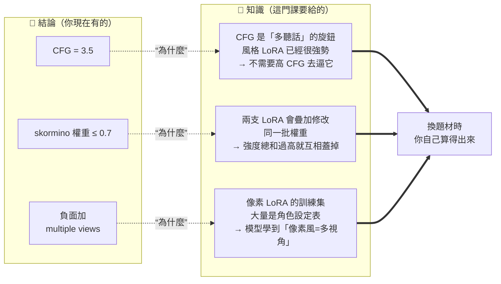
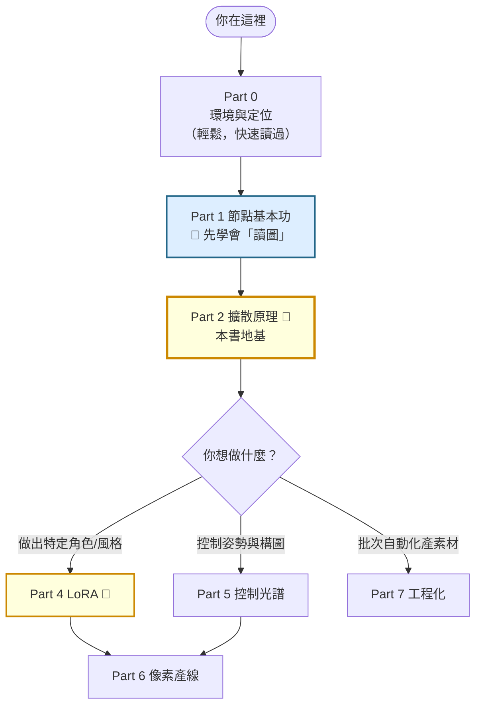

# comfy-0-1 為什麼你 vibe 得很順，卻什麼都沒學到

> **本章目標**：認清你手上那疊「有效的參數」其實是**結論**不是**知識**，並知道這門課要用什麼順序把知識補回來。

## 你會學到

- 「結論」與「知識」的差別，以及為什麼前者換個題材就失效
- 一個判斷自己懂不懂的簡單測試：**三個為什麼**
- 為什麼 AI 協作特別容易產生「會用但不懂」的狀態
- 這本書的閱讀路線，以及哪幾章不讀會卡住後面全部

---

## 概念說明

### 一個真實的場景

你的遊戲專案裡有這麼一行紀錄：

```
像素 LoRA：pixel-skormino-v8（觸發詞 pixpix, 8-bit, pixel_art，CFG 3.5 / dpmpp_2m / karras）
```

這行字**是對的**。照著設，圖就出得來。

但現在換一個問題：你要做一組**場景元件**，不是角色立繪。CFG 還是 3.5 嗎？dpmpp_2m 還是最好的選擇嗎？如果出來的圖太糊，你該動 CFG、動 steps、還是動 LoRA 權重？

如果你的回答是「問 AI」或「三個都試試看」——那就是本章要處理的狀態。

### 結論 vs 知識

用日常語言先講清楚這兩個詞：

```
結論 = 「在這個情況下，這樣做會成功」
知識 = 「因為機制是這樣，所以在這類情況下，這樣做會成功；
        而當條件變成那樣時，它就會失敗」
```

差別在**適用範圍**。結論是一個點，知識是一片區域。



這張圖在表達：左邊那些數字你已經有了，這門課不是要再給你更多數字，而是要補上中間那條虛線——**每個結論背後的機制**。有了機制，右邊那件事（換題材自己判斷）才可能發生。

### 為什麼 AI 協作特別容易掉進這個狀態

傳統學習路徑是這樣的：

```
遇到問題 → 查資料 → 看不懂 → 再查 → 慢慢懂 → 解決問題
                     ↑
              （痛苦，但知識在這裡長出來）
```

AI 協作路徑是這樣的：

```
遇到問題 → 問 AI → AI 解決了 → 下一個問題
                     ↑
              （順暢，但這裡什麼都沒長出來）
```

**這不是說 AI 協作不好**——你的專案能在幾天內產出四個版本的 LoRA、十輪場景迭代，這是傳統路徑做不到的速度。問題不在速度，在於：

> 那些「為什麼」的知識，AI 每次都重新想一遍，而你每次都沒有留下來。

結果就是你形容的狀態：**「聽一聽就忘記了」**。這其實不是記憶力問題——是因為那些說明沒有掛在任何結構上。零散的事實記不住，有結構的知識才記得住。

### 一個自我測試：三個為什麼

判斷自己是不是真懂，有個很省事的測試——對任何一條配方連問三次「為什麼」，看第幾層答不出來：

| 層 | 問題 | 你現在的狀態 |
|---|------|------------|
| 第 1 層 | CFG 要設多少？ | ✅ 3.5 |
| 第 2 層 | CFG 是什麼？ | ❓ 「提示詞的影響力？」 |
| 第 3 層 | 為什麼像素 LoRA 需要低 CFG，而寫實模型常用 7？ | ❌ |

**答不出第 3 層，就代表你只有結論。** 這門課的每一章，基本上都在把第 2 層和第 3 層補起來。

> 這個測試不是要讓你難堪。**答不出來是正常的**——你從來沒有機會學，因為 AI 直接跳過那段給你答案了。

### 這門課的三種章節

翻開大綱你會看到幾種標記，它們的讀法不一樣：

| 標記 | 意思 | 怎麼讀 |
|------|------|--------|
| 🔬 | 原理 | **要慢慢讀**。這些是「知識」本體，讀懂一次受用很久 |
| 📖 | 參考 | **不要背**。當字典查，需要時翻回來 |
| ⚠️ | 踩坑 | 你的專案真的踩過的坑，讀起來會有既視感 |
| 🔧 | 動手 | 一定要真的動手，看過不算 |

特別說明 📖 那類：本課有 21 章是參考章節（節點地圖、參數速查、名詞對照）。**它們存在的理由就是「你會忘記」**——忘記是正常的，有地方查就好。真正需要記住的只有 🔬 那些機制。

### 閱讀路線



這張圖在表達：**前四個 Part 是不能跳的主幹**（Part 0 → 1 → 2），過了地基之後才能依需求分支。

其中兩章的地位特別高：

- **Part 1**：不會讀 workflow 圖，後面每一章的範例你都看不懂。
- **Part 2**：不懂擴散在做什麼，你會繼續抄參數——只是這次抄的是這本書上的參數，本質沒變。

> **可以跳過的**：Part 8（sprite sheet）、Part 9（影片）、Part 10（成人向）是三條獨立支線，等真的有需求再回來讀。

---

## 程式碼範例

這章沒有程式碼，但有一段值得先看的東西——**你專案裡現有的一段紀錄**：

```
skormino 0.8 是上限：拉到 1.0 時大衣設計會走樣（跑出帽子、鈕扣變樣），
角色 LoRA 被蓋過去。
```

這段話目前對你來說是「一條要記住的規則」。讀完 Part 4 之後，它會變成這樣：

```
兩支 LoRA 都在修改 UNet 的同一批注意力權重。
風格 LoRA 權重拉高 → 它的修改量在總和中佔比變大
→ 角色 LoRA 貢獻的特徵（大衣的設計細節）被稀釋掉。
所以「上限在哪」不是固定值 0.8，而是取決於兩支 LoRA 各自的 rank 與訓練強度。
換一支風格 LoRA，這個上限就要重測。
```

**同一件事，第二種說法讓你知道換模型時該怎麼辦。** 這就是這門課要做的事。

---

## 小練習

1. **做一次三個為什麼**：從你專案的 `docs/art-pipeline.md` 裡挑一條你最常用的設定，對它連問三次「為什麼」，把你答得出來和答不出來的地方記下來。讀完 Part 2 和 Part 4 之後回來重做一次。

2. **分類你手上的知識**：把你記得的 ComfyUI 相關事實列成一張表，每一條標上「這是結論」或「這是機制」。多數人會發現九成以上都是結論——這是正常起點，不是失敗。

3. **預測一個失效情境**（有點難）：挑一條配方，想想看「什麼情況下這條規則會不成立」。想不出來就代表你只知道那個點，不知道那片區域。

---

## 課外讀物

> 「註解要寫為什麼，不寫是什麼」跟本章講的「結論 vs 知識」是同一件事的兩個場景——程式碼本身就是結論，註解要留的是機制 → [課外讀物 E-6-5：註解該怎麼寫](../../../課外讀物/E-6-best-practices/E-6-5-comments.md)
