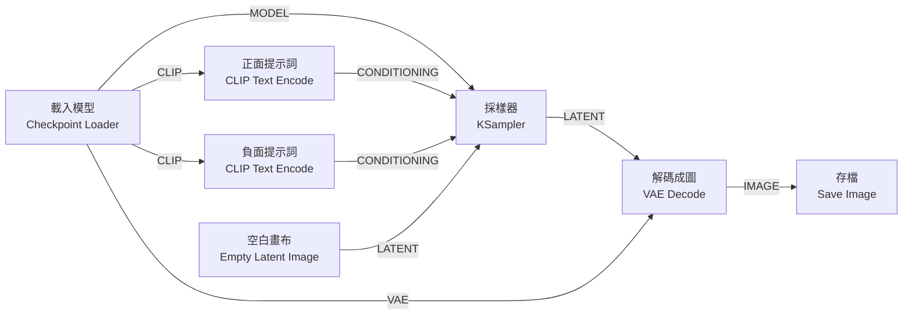
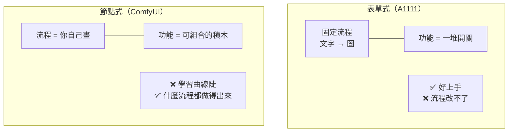

# comfy-0-2 ComfyUI 不是繪圖軟體，是「執行引擎」

> **本章目標**：建立正確的心智模型——ComfyUI 是一台**照著圖跑流程的機器**，不是一支畫圖工具。用錯比喻，後面每個功能你都會覺得奇怪。

## 你會學到

- 為什麼「ComfyUI 是 AI 繪圖軟體」這個說法會誤導你
- 什麼是 DAG（Directed Acyclic Graph，有向無環圖），以及為什麼產圖流程長成這樣
- 節點 = 函式、線 = 資料、widget = 參數：一組對得起工程師直覺的對照
- 為什麼 ComfyUI 比 A1111 難用，卻是專業產線的最終選擇

---

## 概念說明

### 先破除一個比喻

多數人第一次打開 ComfyUI，腦中的比喻是「這是一個 AI 版的 Photoshop」。

**這個比喻會害你。** 因為 Photoshop 的心智模型是「我對一張圖做操作」，而 ComfyUI 裡根本沒有「一張圖」這個東西存在——直到最後一個節點跑完之前，都沒有圖。

更接近的比喻，是你每天都在用的東西：

| 你熟悉的東西 | 對應到 ComfyUI |
|------------|---------------|
| **前端 build pipeline**（`tsc` → `bundler` → `minify` → `dist/`） | 每個節點是一個處理階段，資料一路被轉換到最後 |
| **Excel 公式**（改一格，依賴它的格子自動重算） | 改一個節點的參數，下游全部重跑 |
| **工廠產線** | 原料（雜訊）進去，經過一站站加工，成品（圖）出來 |
| **Unity 的 Shader Graph / Blueprint** | 用連線描述資料流，而不是寫程式碼 |

如果你用過 Shader Graph，那個感覺是最接近的：**你不是在畫東西，你是在描述「東西該怎麼被算出來」。**

### 什麼是 DAG

ComfyUI 官方文件把 workflow 稱為 graph（圖）。這裡的「圖」不是圖片，是**資料結構**裡的圖——點跟線構成的網路。

完整名稱是 **DAG（Directed Acyclic Graph，有向無環圖）**，拆開來看：

```
Directed（有向）  = 線是有方向的，資料只往一個方向流
Acyclic（無環）   = 不能繞回去，A→B→C→A 是非法的
Graph（圖）      = 由「節點」和「連線」組成的結構
```

用日常語言講，DAG 就是**一張不會鬼打牆的流程圖**。

為什麼必須無環？想想看：

```
如果 節點 A 需要 節點 B 的輸出：
    就要先跑 B
而 節點 B 又需要 節點 A 的輸出：
    就要先跑 A
→ 死結，誰都跑不了
```

所以 ComfyUI 在你連線時就會擋掉會形成環的接法。這不是限制，是**保證流程一定跑得完**。

> 圖這個資料結構的完整介紹 → [dsa-5-1：圖是什麼](../../dsa/part-5/dsa-5-1-graph.md)
> 「怎麼決定誰先跑」在演算法上叫**拓撲排序**，正是 ComfyUI 每次按下 Queue 時做的事 → [dsa-5-5：拓撲排序](../../dsa/part-5/dsa-5-5-topological-sort.md)

### 一張最小的產圖流程長什麼樣

先不解釋每個節點在做什麼（那是 Part 1 的事），只看**形狀**：



這張圖在表達：**資料從左往右流，每個節點吃特定型別的輸入、吐出特定型別的輸出。** 線上標的 `MODEL`、`CLIP`、`LATENT` 就是資料型別——這也是為什麼有些孔你怎麼拉都接不上去（型別不合），Part 1 會專門講。

注意一件事：**最後一個節點才產生「圖」（IMAGE）**。前面流動的都是模型、文字條件、latent（潛在空間資料）這些抽象的東西。這就是為什麼「Photoshop 比喻」會壞事——在 ComfyUI 裡，圖是流程的**產物**，不是流程的**對象**。

### 節點 = 函式：一組工程師友善的對照

如果把上面那張圖寫成程式碼，它其實長這樣：

```python
# 每個節點就是一次函式呼叫，每條線就是一個變數傳遞
model, clip, vae = load_checkpoint("waiIllustrious_v14.safetensors")

positive = clip_text_encode(clip, "masterpiece, 1girl, night park")
negative = clip_text_encode(clip, "multiple views, character sheet")

latent = empty_latent_image(width=832, height=1216, batch_size=1)

result = ksampler(
    model=model,
    positive=positive,
    negative=negative,
    latent=latent,
    seed=8888,
    steps=30,
    cfg=3.5,
    sampler_name="dpmpp_2m",
    scheduler="karras",
    denoise=1.0,
)

image = vae_decode(vae, result)
save_image(image, filename_prefix="heroine")
```

**這段程式碼跟上面那張節點圖是同一件事。** 對照關係：

| ComfyUI 裡的東西 | 程式碼裡的東西 |
|-----------------|--------------|
| 節點（node） | 一次函式呼叫 |
| 連線（link） | 把回傳值傳給下一個函式 |
| 輸出孔 | 函式的回傳值 |
| 輸入孔 | 函式的參數（**由別的節點提供**） |
| widget（節點上可直接填的欄位） | 函式的參數（**你直接寫死的值**，如 `steps=30`） |
| 資料型別（MODEL / LATENT…） | 參數的型別 |

> **這個對照非常有用**，之後看到任何複雜 workflow，都可以在心裡把它翻譯成一串函式呼叫。一張三十個節點的圖看起來嚇人，翻成程式碼往往只有三十行。

其中 **widget 與輸入孔的關係**要特別注意：它們是同一個參數的兩種提供方式。`steps=30` 你可以直接在節點上填（widget），也可以把它轉成一個輸入孔、拉一條線從別的節點餵值進來。這個轉換在 Part 1 會實際操作。

### 為什麼是節點式，而不是一個表單就好

早期（也是現在仍很多人用）的 Stable Diffusion 介面 A1111，長得像一張網頁表單：填 prompt、拉 slider、按 Generate。**那個介面好上手得多**，為什麼專業產線最後都跑到 ComfyUI？

因為表單式介面把流程**寫死**了。它假設你的流程一定是「文字 → 圖」，於是把每個功能做成一個開關。當你的需求變成：

- 先產一張圖 → 抽出它的深度圖 → 用深度圖控制第二張圖 → 只把臉的部分重繪 → 放大兩倍

表單式介面就沒辦法表達了，因為這個流程**不是它預設的形狀**。



這張圖在表達兩者的根本取捨：**A1111 幫你決定流程，ComfyUI 讓你決定流程。** 你的專案需要「色塊圖 → ControlNet → 產圖 → 去背 → 統一比例」這種自訂鏈路，只有後者做得到。

還有一個對工程師特別重要的理由：**ComfyUI 的 workflow 是一份 JSON**。JSON 可以進版控、可以用程式產生、可以被 HTTP API 送進去執行——這就是為什麼你的專案能寫出 `tools/comfy/generate.py` 這種腳本。表單式介面沒有這個東西。

> 這件事的完整發揮在 Part 7（工程化）。現在只要知道：**你點來點去畫的那張圖，本質是一份可被程式操作的資料。**

### 一個常見的誤解：節點多 ≠ 厲害

網路上下載的 workflow 常常有六七十個節點，看起來很嚇人。但拆開來看，其中大半通常是：

- **同一條鏈路的變體**（作者留了三種放大方式，用 Bypass 關掉兩種）
- **便利節點**（顯示預覽、印出參數、自動計算尺寸）
- **贅節點**（作者從別人那裡抄來、自己也沒刪的東西）

**真正決定成果的核心鏈路，通常就是前面那七個節點加上幾個控制節點。** Part 1 會教你一套閱讀法，從最後的存檔節點往回追，快速找出「主幹」在哪。

---

## 小練習

1. **翻譯練習**：打開 ComfyUI 的預設 workflow，試著把它寫成上面那種 Python 風格的函式呼叫（不用真的能跑，寫得出對應關係就好）。

2. **找出環**：想像一個「圖產生出來之後，再拿去改善原本的 prompt」的需求。畫畫看它的節點圖——你會發現它形成了環，而 DAG 不允許。想想看 ComfyUI 要怎麼表達這個需求？（提示：不是連回去，而是**再接一段**。）

3. **看一張真圖**：打開你專案的 `tools/comfy/heroine-lora.json`，先不要理解內容，只數一數裡面有幾個節點。跟本章那張最小流程的七個節點比較，多出來的是什麼？（Part 1 會完整拆解這個檔案，現在只要建立印象。）

---

## 課外讀物

> 「圖」這個資料結構的完整介紹（點、邊、有向無向） → [dsa-5-1：圖是什麼](../../dsa/part-5/dsa-5-1-graph.md)
> ComfyUI 決定節點執行順序用的演算法 → [dsa-5-5：拓撲排序](../../dsa/part-5/dsa-5-5-topological-sort.md)
