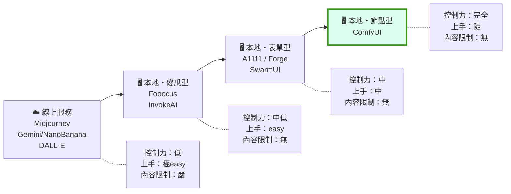

# comfy-0-3 ComfyUI vs 其他選擇：為什麼產線最後都走到這裡

> **本章目標**：搞清楚生成式繪圖工具的光譜，知道 ComfyUI 的位置、它換來什麼、犧牲什麼——以及什麼時候你**不該**用它。

## 你會學到

- 生成式繪圖工具的四個層級，以及各自服務什麼需求
- 「本地 vs 雲端」的三個決定性差異：成本、控制、內容限制
- 為什麼你的專案最後被迫自架（不是因為技術偏好，是被拒圖逼的）
- 一張決策表：什麼情況該用哪個工具

---

## 概念說明

### 工具光譜

把市面上的選擇排成一條線，橫軸是「**你能控制多少**」：



這張圖在表達：**控制力與上手難度基本上是同一件事的兩面**。你不可能同時要「什麼都能改」和「不用學就會」。

### 四個層級各是什麼

| 層級 | 代表 | 它幫你決定了什麼 | 適合誰 |
|------|------|----------------|--------|
| **線上服務** | Midjourney、Gemini、DALL·E | 幾乎所有事——模型、參數、風格傾向、內容界線 | 要一張好看的圖，不在乎細節可不可控 |
| **本地傻瓜型** | Fooocus、InvokeAI | 大部分參數（它把 SDXL 調到「隨便打都不錯」） | 想在自己機器上跑，但不想學參數 |
| **本地表單型** | A1111、Forge、SwarmUI | 流程的**形狀**（文生圖 / 圖生圖是分頁，不是可組合的積木） | 單張出圖為主，偶爾用擴充功能 |
| **本地節點型** | ComfyUI | 什麼都不幫你決定 | 需要自訂流程、要自動化、要進版控 |

> **一個常見誤解**：很多人以為 ComfyUI 產的圖「比較好」。**不對**——同樣的模型、同樣的參數，A1111 跟 ComfyUI 出來的圖幾乎一樣。差別不在畫質，在**你能不能表達你要的流程**。

### 本地 vs 雲端：三個決定性差異

這是整章最重要的部分。前面的分類是程度問題，這裡是**性質問題**。

#### 差異一：成本結構

```
雲端：一次一次付錢（訂閱或按張計費）
      → 你會下意識省著用，不敢做「產 200 張挑 5 張」這種事

本地：先付硬體錢，之後電費而已
      → 產 1000 張的邊際成本 ≈ 0，可以放心暴力嘗試
```

這件事會**改變你的工作方式**。你的專案能做「十輪場景迭代」「同 seed 掃八種權重做對照矩陣」，正是因為每張圖不用錢。在雲端你會捨不得。

#### 差異二：可控性與可重現性

雲端服務通常不告訴你用了什麼模型、什麼參數，而且**模型會在你不知情的時候被換掉**。今天調出來的風格，下個月可能就不見了。

本地則是：模型檔案在你硬碟上，只要不動它，**三年後同樣的 workflow 加同樣的 seed，會產出同樣的圖**。

> 對遊戲專案來說這是硬需求——素材要能補產。半年後要多做兩個場景元件，風格必須對得上。

#### 差異三：內容限制 ⚠️

這是你的專案**真正被逼著自架**的原因。

雲端服務有一層內容審查（安全過濾器），而且它的判斷標準：

- **不是**法律標準
- **不是**平台自己寫的條款字面
- 而是一個**寧可錯殺**的分類器

你的專案紀錄了一次實測：

```
題材：「大衣 + 比基尼 + 深夜公園」的角色立繪
→ 這是 SFW（safe for work）替身版本，穿著程度等同泳裝廣告
→ Gemini：Image Generation Request Declined
→ 使用者手動操作也一樣被拒
```

**同一組需求，本地 ComfyUI 一發就中。** 55 秒產出四張 832×1216。

為什麼差這麼多？因為本地開放權重模型**根本沒有那一層**——這不是「繞過」審查，是架構上就不存在審查元件。這件事的完整原理在 `comfy-10-1`，這裡只要建立一個判斷：

> **只要你的題材有任何「可能被誤判」的成分（泳裝、暴力、恐怖、宗教符號、甚至只是深夜場景 + 女性角色），雲端服務就是不可靠的生產工具。** 不是不能用，是不能依賴——你無法預測哪一次會被拒，而產線不能建立在會隨機失效的東西上。

### 那雲端還有什麼用

你的專案也留了結論：**Gemini 仍有「純場景、一次一件事」的備援價值**。

具體來說，雲端服務的強項是：

- **語意理解好**：你可以用一整段自然語言描述，它聽得懂。本地的 Illustrious 系模型只吃 tag，講句子沒用。
- **一次就到位**：不用選模型、調 LoRA、設參數。
- **概念發想階段**：還不知道要什麼的時候，快速產十個方向。

但它同時有幾個硬傷（你的專案也踩過）：

- ⚠️ **帶文字的 UI 面板會卡死**：要它畫「BET / CASH OUT / 倍率數字」那類介面，兩次都停在生成中零輸出 3~5 分鐘。**UI 一律程式畫，不要靠 AI 生**。
- ⚠️ **一次描述多個區塊會失敗**：三個面板各自一堆元素，直接卡住。要拆成「先場景 → 再在成品上加東西」。

### 決策表

| 你的情況 | 建議工具 | 理由 |
|---------|---------|------|
| 只是想要一張好看的圖 | 線上服務 | 不要為了一張圖裝 20GB 環境 |
| 概念發想、探索方向 | 線上服務 | 語意理解好、快 |
| 要固定角色 / 固定風格反覆產出 | **ComfyUI** | 需要 LoRA 與可重現性 |
| 需要精確控制構圖與姿勢 | **ComfyUI** | ControlNet 鏈路只有節點式做得好 |
| 要用程式批次產、接進專案 | **ComfyUI** | workflow 是 JSON，有 HTTP API |
| 題材可能觸發雲端審查 | **ComfyUI** | 唯一可靠的選擇 |
| 只想單張出圖、不想學節點 | Forge / Fooocus | ComfyUI 對這個需求是殺雞用牛刀 |

> **誠實的提醒**：如果你的需求只是「偶爾產一張圖」，ComfyUI 是過度投資。這門課假設你的需求是**產線**——固定角色、大量素材、可重現、要接進程式。那個情況下 ComfyUI 沒有替代品。

### 一個現實的補充：生態的變動

工具本身也在變。A1111 原專案的更新已明顯放緩，社群主力轉到 Forge / reForge 等分支；SwarmUI 則是個有趣的折衷（表單介面，底下實際跑 ComfyUI）。

**但這不影響本課的內容**：不管介面怎麼換，底下的機制（擴散、LoRA、ControlNet）是同一套。這也是為什麼本課把重量放在原理而不是介面操作——**介面會過時，機制不會**。

---

## 小練習

1. **算一筆帳**：估算你的專案至今產了多少張圖（包含被淘汰的）。如果每張要付 0.05 美元，總共多少錢？這個數字會讓你理解「邊際成本為零」對工作方式的影響。

2. **找出你的內容邊界**：列出你專案素材裡三個「可能被雲端誤判」的元素。這是判斷「必須自架」的依據。

3. **反向思考**：想一個你目前用 ComfyUI 做、但其實用雲端服務更快的任務。（提示：概念探索階段、以及不需要一致性的一次性圖。）

---

## 課外讀物

> 本地跑服務就等於自己當管理員——伺服器、網路、備份都要自己管 → [infra 課程大綱](../../infra/課程大綱.md)
> 雲端 vs 自架的取捨在基礎建設領域是同一組問題 → [infra-9-3：什麼時候該從自架搬上雲](../../infra/課程大綱.md)
