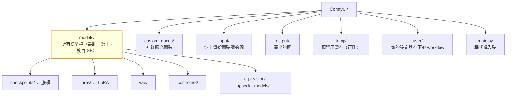

# comfy-0-4 安裝與目錄結構：東西都放在哪裡

> **本章目標**：搞懂 ComfyUI 資料夾的地圖——每個目錄放什麼、為什麼會分這麼多層、以及當 AI 叫你「把模型放進 models/loras」時你知道那是哪裡。

## 你會學到

- 三種安裝方式（Portable / Desktop / 手動）的差別與選擇
- `models/` 底下每個資料夾放什麼類型的檔案
- `custom_nodes/`、`input/`、`output/`、`user/` 各自的角色
- 一個常見混亂：**你有兩份 ComfyUI**，模型該怎麼共用

---

## 概念說明

### 三種安裝方式

| 方式 | 是什麼 | 適合 |
|------|--------|------|
| **Portable**（Windows） | 一個壓縮檔，裡面附了獨立的 Python 環境（`python_embeded/`），解壓就能跑 | Windows 使用者、**要遠端／腳本控制的產線機** |
| **Desktop App** | 有安裝程式的桌面應用，附自動更新、多實例管理 | 想要「像一般軟體」的體驗 |
| **手動安裝** | 自己 `git clone` + 建 venv + 裝 PyTorch | Linux / Mac、想完全掌控版本 |

> 你的產線機（`192.168.10.99`，RTX 4070）跑的是 **Portable**，路徑在 `D:\AI\ComfyUI\ComfyUI_windows_portable\`。這是產線機的正確選擇——沒有安裝程式的黑箱、整個環境是一個資料夾、要備份就整包複製。

**Portable 的一個關鍵細節**：它的 Python 不是系統的 Python，而是 `python_embeded\python.exe`。所以啟動指令長這樣：

```bash
# 注意：用的是資料夾裡自帶的 python，不是 PATH 上的 python
python_embeded\python.exe -s ComfyUI\main.py --windows-standalone-build
```

⚠️ 這也是你專案文件裡標註過的坑：**路徑有兩層 `ComfyUI`**——外層 `ComfyUI_windows_portable\` 是整包環境，內層 `ComfyUI\` 才是程式本體。少寫一層就會找不到 `main.py`。

### 資料夾地圖



這張圖在表達：**除了 `models/` 之外，其他資料夾都很小**。備份時真正的重點是 `models/`（可能好幾百 GB）與 `user/`（你的 workflow，很小但無可取代）。

### `models/` 底下各是什麼

這是你最常需要放檔案的地方。每個資料夾對應一種模型類型，**放錯地方 ComfyUI 就找不到**：

| 資料夾 | 放什麼 | 典型大小 | 對應的節點 |
|--------|--------|---------|-----------|
| `checkpoints/` | **底模**（主模型，如 WAI Illustrious） | 2~7 GB | `CheckpointLoaderSimple` |
| `loras/` | **LoRA**（風格 / 角色補丁） | 10~300 MB | `LoraLoader` |
| `vae/` | 外掛 VAE（解碼器） | ~300 MB | `VAELoader` |
| `controlnet/` | ControlNet 控制模型 | 1~3 GB | `ControlNetLoader` |
| `clip_vision/` | 圖像編碼器（IPAdapter 要用） | ~1 GB | `CLIPVisionLoader` |
| `ipadapter/` | IPAdapter 模型 | 50~700 MB | IPAdapter 節點 |
| `upscale_models/` | 放大模型（ESRGAN 系） | 20~70 MB | `UpscaleModelLoader` |
| `embeddings/` | Textual Inversion | 幾十 KB | 直接在 prompt 裡叫名字 |
| `unet/` `clip/` `diffusion_models/` | 拆開的模型元件（Flux 等新架構會用到） | 視情況 | `UNETLoader` / `CLIPLoader` |
| `vae_approx/` | 快速預覽用的近似解碼器 | 幾 MB | 系統自動用 |

> **一句話記法**：`models/` 的資料夾名稱，基本上就對應 ComfyUI 裡「Loader（載入器）」節點的種類。看到一個新的 Loader 節點找不到檔案，就去看它對應哪個資料夾。

### 其他資料夾

**`custom_nodes/`** — 社群做的擴充節點，一個子資料夾一個套件。這裡是最大的不穩定來源（下一章專門講）。想知道某個奇怪節點哪來的，就是翻這裡。

**`input/`** — `LoadImage` 節點的下拉選單就是讀這個資料夾。你的腳本要餵圖給 ComfyUI，就是先把圖上傳到這裡（透過 `/upload` API，見 Part 7）。

**`output/`** — `SaveImage` 節點的落點。可以在節點的 `filename_prefix` 欄位用斜線建子資料夾，例如填 `crashgame/portrait` 就會存到 `output/crashgame/portrait_00001_.png`。

> 你的專案就是這樣做的：產出留在 `D:\AI\ComfyUI\ComfyUI_windows_portable\ComfyUI\output\crashgame\`。

**`user/`** — 你的個人資料：介面設定、以及**在網頁介面裡存下來的 workflow**（`user/default/workflows/`）。

> ⚠️ **這個資料夾最容易被忽略也最不能弄丟**。模型可以重新下載，你調了三個月的 workflow 弄丟就沒了。備份至少要包含 `user/`。

**`temp/`** — 預覽圖暫存，可以隨時整個刪掉。硬碟滿了先看這裡。

### 一個常見的混亂：你有兩份 ComfyUI

很常見的情況：你先裝了 Portable，後來又裝了 Desktop 版試試看——現在你有兩套環境、兩份 `models/`，而模型動輒好幾 GB，複製兩份很浪費。

解法是 **`extra_model_paths.yaml`**。ComfyUI 根目錄有一個 `extra_model_paths.yaml.example`，把它改名成 `extra_model_paths.yaml`，內容大致長這樣：

```yaml
# 告訴這份 ComfyUI：除了自己的 models/，也去別的地方找模型
my_shared_models:
    base_path: D:/AI/SharedModels/
    checkpoints: checkpoints
    loras: loras
    vae: vae
    controlnet: controlnet
```

這樣兩份 ComfyUI 就能共用同一批模型檔案。**這也是從 A1111 搬過來的人最需要的設定**——直接指向 A1111 的模型資料夾，一個檔案都不用搬。

### 目錄結構的實務建議

給產線用的機器，建議這樣安排：

```
D:\AI\
├── ComfyUI\
│   └── ComfyUI_windows_portable\   ← ComfyUI 本體
│       └── ComfyUI\
│           ├── models\             ← 模型（最肥）
│           ├── output\
│           │   └── <專案名>\        ← 產出按專案分資料夾
│           └── user\               ← 一定要備份
├── lora-training\                  ← LoRA 訓練環境（獨立）
│   └── <lora名稱>\
│       ├── img\                    ← 訓練集
│       └── output\                 ← 訓練產出的 safetensors
└── tutorial\                       ← 你自己的筆記
```

> 你的專案就是這個結構。**訓練環境與 ComfyUI 分開**是對的——它們用不同的 Python 環境、不同的相依套件，混在一起遲早打架（Part 4 會講到）。

---

## 小練習

1. **畫出你的地圖**：連到你的產圖機，把 `models/` 底下每個資料夾的大小列出來（`du -sh` 或檔案總管內容），看看空間都被誰吃掉。

2. **找出你的 workflow 存在哪**：在 ComfyUI 網頁介面存一個 workflow，然後在硬碟上把那個檔案找出來。確認你知道備份時要抓哪個資料夾。

3. **檢查備份缺口**（重要）：如果那台機器的硬碟現在壞掉，你會永久失去什麼？列出來。多數人會發現 `user/` 和 `lora-training/` 從來沒備份過。

---

## 課外讀物

> 遠端操作那台產圖機、用 SSH 連線與傳檔 → [課外讀物 E-1-7：SSH 基礎](../../../課外讀物/E-1-terminal/E-1-7-ssh-basics.md)
> 檔案與目錄操作的終端機指令 → [課外讀物 E-1-3：檔案操作](../../../課外讀物/E-1-terminal/E-1-3-file-operations.md)
> 備份策略「3-2-1 原則」與「沒演練過的備份等於沒有」 → [infra 課程 Part 8](../../infra/課程大綱.md)
