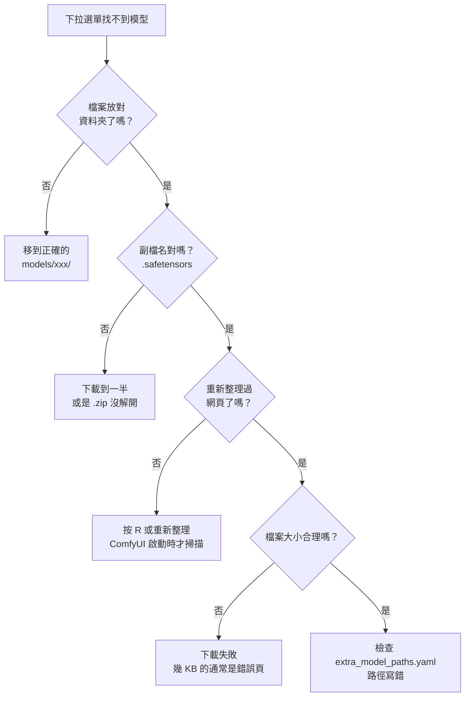

# comfy-0-5 模型從哪來、放哪裡、為什麼你的下拉選單是空的

> **本章目標**：學會自己找模型、下載、放對位置，並看懂模型頁面上那堆術語（base model、fp16、pruned、EMA）。

## 你會學到

- 兩大來源 Civitai 與 HuggingFace 的差別與各自的用法
- 模型檔名裡的暗號：`fp16` / `pruned` / `inpainting` / `GGUF` 各代表什麼
- 為什麼下拉選單是空的——五個原因的排查順序
- 下載模型時該記錄什麼（不記，三個月後你會複現不出來）

---

## 概念說明

### 兩大來源

| | **Civitai** | **HuggingFace** |
|---|---|---|
| 定位 | 社群模型市集 | 機器學習模型的 GitHub |
| 內容 | 大量社群微調模型與 LoRA，**有範例圖** | 官方原始模型、研究用權重 |
| 強項 | 看得到別人產的圖與**完整參數** | 版本清楚、下載穩定、有 API |
| 弱項 | 需登入才能下載、成人內容需調設定 | 沒有範例圖，看不出模型長什麼樣 |
| 什麼時候用 | 找風格、找 LoRA、找二次元底模 | 抓官方基礎模型、ControlNet、VAE |

**實務上你會兩邊都用**：底模與 LoRA 從 Civitai 找（因為要看範例圖），ControlNet 與官方元件從 HuggingFace 抓。

> **Civitai 最被低估的功能**：範例圖底下有完整的生成參數（prompt、CFG、sampler、seed、掛了哪些 LoRA）。**那等於作者把配方直接給你**。找到喜歡的風格時，第一件事是去看範例圖的參數，而不是自己亂試。

### 看懂模型頁面的術語

下載頁常常有好幾個檔案版本，名字裡的暗號：

| 標記 | 意思 | 你該選嗎 |
|------|------|---------|
| **fp16** | 半精度，檔案約一半大 | ✅ 幾乎都選這個。畫質差異肉眼看不出來 |
| **fp32 / full** | 全精度 | ❌ 除非你要拿它繼續訓練 |
| **pruned** | 修剪過，拿掉訓練才需要的資料 | ✅ 純產圖選 pruned |
| **EMA / no-EMA** | 訓練時的權重平均版本 | 產圖選 **EMA**（通常就是預設那個） |
| **inpainting** | 專門做局部重繪的變體 | 只在做 inpaint 時需要，見 `comfy-5-4` |
| **GGUF / Q4 / Q8** | 量化版本，用畫質換 VRAM | VRAM 不夠時才選，見 `comfy-3-6` |
| **safetensors** | 安全的權重格式 | ✅ **一律選這個** |
| **ckpt** | 舊格式，⚠️ **可能夾帶惡意程式碼** | ❌ 有 safetensors 就不要用 ckpt |

> ⚠️ **`.ckpt` 的資安問題是真的**：那個格式是 Python 的 pickle，載入時會執行裡面的程式碼。`safetensors` 就是為了解決這件事而生的純資料格式。現在幾乎所有模型都有 safetensors 版本，沒有理由再碰 ckpt。

### 還有一個關鍵欄位：Base Model

Civitai 每個模型都會標 **Base Model**（基礎架構），常見的有 `SD 1.5`、`SDXL 1.0`、`Pony`、`Illustrious`、`Flux.1 D`。

**這個欄位決定了相容性**：

```
LoRA 的 base model 必須跟你的底模對得上
    Illustrious 的 LoRA  → 掛在 Illustrious / NoobAI 系底模上 ✅
    Illustrious 的 LoRA  → 掛在 SD1.5 底模上                 ❌ 直接報錯或出垃圾
    SDXL 的 LoRA        → 掛在 Illustrious 上                ⚠️ 可能能跑，效果打折
```

為什麼？因為 LoRA 是「對特定模型權重的修改補丁」（原理見 `comfy-4-1`）。補丁要貼在對的地方才有意義——就像 Unity 的資源包不能直接丟進 Godot。

> Illustrious 是從 SDXL 架構延伸出來的，所以**廣義上相容 SDXL 的 ControlNet 與部分 LoRA**，但專為 Illustrious 訓練的 LoRA 效果最好。你專案的 `pixel-skormino-v8` 與 WAI Illustrious 就是這個組合。

### 為什麼你的下拉選單是空的

這是新手最常卡住的地方。排查順序：



這張圖在表達排查的順序——**由外而內、先確認最笨的可能性**。實務上九成以上是前兩項：放錯資料夾，或下載沒完成。

⚠️ **第三項特別容易中招**：ComfyUI 是在**啟動時**掃描模型資料夾的。你在檔案總管把模型丟進去，網頁上不會自動出現。按 `R` 重新整理節點定義，或重啟伺服器。

### 下載時要記錄什麼

這件事現在做很無聊，三個月後會救你一命。

至少記下來：

| 要記的 | 為什麼 |
|--------|--------|
| **完整模型名稱與版本號** | `waiNSFWIllustrious_v14` 跟 `v13` 是不同的模型，出圖不一樣 |
| **來源網址** | 之後要重下載、或要查作者的推薦參數 |
| **作者建議的參數** | CFG、sampler、steps——那是作者實測的起點 |
| **LoRA 的觸發詞** | ⚠️ **忘了觸發詞的 LoRA 幾乎等於廢的**（見 `comfy-4-7`） |
| **base model** | 之後配 LoRA 時要對得上 |

> 你的專案就有這樣的紀錄：
> ```
> 像素 LoRA：pixel-skormino-v8
> 觸發詞：pixpix, 8-bit, pixel_art
> 參數：CFG 3.5 / dpmpp_2m / karras（作者實測值）
> ```
> **這種紀錄要寫在會跟著專案走的文件裡**，不要留在對話紀錄或腦袋裡。

### 硬碟會爆炸：一個現實的提醒

模型很肥。一個粗略的估算：

```
底模（SDXL 系）      約 6.5 GB × 你想試的數量
ControlNet 全套      約 10~20 GB
IPAdapter + CLIP Vision  約 3 GB
LoRA                 每支 10~300 MB，但你會存幾十支
影片模型（Part 9）    單一模型就可能 15~40 GB
```

實務上一台認真在用的產圖機，`models/` 到 200~500 GB 是很正常的。

**建議的整理習慣**：

- 底模只留 2~3 個真的在用的（每個 6.5GB，試過不喜歡就刪）
- LoRA 用檔名分類（`pixel-`、`char-`、`style-` 前綴）
- 定期檢查 `output/` 與 `temp/`——那裡通常比模型還佔空間

---

## 小練習

1. **讀一次配方**：去 Civitai 找一個你沒看過的像素風 LoRA，打開它的範例圖，把完整生成參數抄下來。看看跟你專案現在用的配方差在哪。

2. **檢查你的紀錄完整度**：列出你機器上所有 LoRA，逐一問「我還記得它的觸發詞嗎？」。答不出來的那些，去 Civitai 把觸發詞查回來寫進文件。

3. **模擬排查**：故意把一個 LoRA 檔案改名成 `.txt`，看 ComfyUI 的下拉選單怎麼反應；改回來、重新整理，確認你熟悉這個循環。

---

## 課外讀物

> `.ckpt` 那個「載入時執行程式碼」的問題，屬於供應鏈安全的一種 → [課外讀物 E-10-1：Web Security 總覽](../../../課外讀物/E-10-security/E-10-1-web-security-overview.md)
> 為什麼要把配方寫進文件而不是記在腦袋裡 → [課外讀物 E-6-5：註解該怎麼寫](../../../課外讀物/E-6-best-practices/E-6-5-comments.md)
