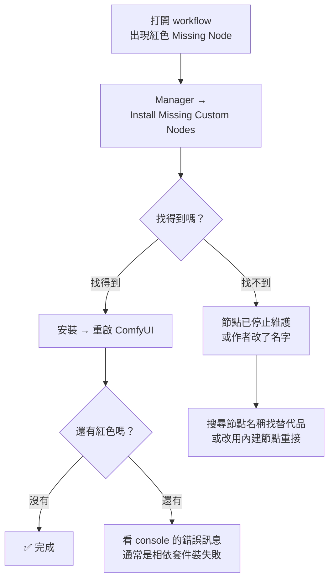

# comfy-0-6 ComfyUI Manager：最方便的工具，也是最大的不穩定來源

> **本章目標**：學會用 Manager 裝節點與修 missing node，同時建立正確的戒心——為什麼你的環境「昨天還能跑，今天壞了」，八成是這裡出的事。

## 你會學到

- Manager 是什麼、解決了什麼問題
- 「Missing Node」的完整處理流程
- ⚠️ 為什麼 custom node 是環境最大的風險來源（相依衝突與資安）
- 一套讓環境可回復的最小紀律

---

## 概念說明

### Manager 解決的問題

ComfyUI 本體只內建基本節點。你從網路上抓到的 workflow，通常會用到社群做的擴充節點——打開時就會看到一堆**紫紅色的錯誤方塊**，寫著 `Missing Node Type`。

在沒有 Manager 的年代，你得：

```
1. 看錯誤訊息猜這個節點屬於哪個套件
2. Google 找到那個 GitHub repo
3. git clone 到 custom_nodes/
4. 讀它的 README 裝相依套件
5. 重啟 ComfyUI
6. 發現還缺另一個 → 回到第 1 步
```

Manager 把這整套變成「按一個按鈕」。它做三件事：

| 功能 | 說明 |
|------|------|
| **Install Missing Custom Nodes** | 掃描目前 workflow 缺哪些節點，自動找到對應套件並安裝 |
| **Custom Nodes Manager** | 瀏覽 / 搜尋 / 安裝 / 停用 / 移除社群節點 |
| **Model Manager** | 直接從介面下載常見模型到正確的資料夾 |
| **Update All** | 一次更新 ComfyUI 本體與所有 custom node |

> 新版 ComfyUI 已內建 Manager（舊版要自己裝）。介面在頂端選單或側邊欄，不同版本位置會變。

### Missing Node 的處理流程



這張圖在表達：**九成情況按一個按鈕就解決，剩下一成才是真正麻煩的**。而那一成通常是「這張 workflow 太舊，它用的節點已經沒人維護了」。

⚠️ **一個重要提醒**：安裝完**一定要重啟 ComfyUI**（不是重新整理網頁）。Python 套件要重新載入才生效。很多人卡在「我明明裝了啊」，就是因為沒重啟。

### 為什麼 Manager 是最大的不穩定來源

這是本章真正重要的部分。方便是有代價的。

#### 風險一：相依套件衝突

每個 custom node 都是別人寫的 Python 專案，各自宣告自己要什麼版本的套件：

```
節點套件 A 要 numpy >= 2.0
節點套件 B 要 numpy < 2.0
→ 裝了 B 之後 A 壞掉，反之亦然
```

而且它們全部裝在**同一個 Python 環境**裡（Portable 版就是 `python_embeded/`）。所以：

> ⚠️ **裝一個新節點，可能弄壞一個你三個月沒動過、原本好好的 workflow。**

這就是「昨天還能跑」現象的主因。而且症狀常常不是明確報錯，而是某個節點行為變了、或啟動時默默載入失敗。

#### 風險二：Update All 是個陷阱

「一次更新全部」聽起來很好，實際上是把上面那個衝突風險**一次全押**。

**建議紀律**：

- ❌ 不要在產線正忙的時候按 Update All
- ✅ 要更新就挑一個時間，更新完立刻跑一次你的主力 workflow 驗證
- ✅ 更新前先確認你有回復手段（見下面）

#### 風險三：資安（這個要說清楚）

custom node 是**會被執行的 Python 程式碼**，不是設定檔。裝一個 custom node，等於在你機器上跑一個陌生人寫的程式，權限跟你一樣大。

歷史上真的發生過：2024 年有 custom node 套件被發現會竊取使用者的瀏覽器憑證與 Civitai token。

**實務上的判斷標準**：

| 訊號 | 意義 |
|------|------|
| GitHub star 數多、更新頻繁、有很多 issue 討論 | 相對安全（有很多眼睛在看） |
| Manager 清單裡標示為官方認證 | 相對安全 |
| 沒沒無聞、最近才出現、star 個位數 | ⚠️ 先看一眼原始碼再裝 |
| 從 Discord / 論壇連結直接下載的 zip | ❌ 不要 |

> 這不是要你疑神疑鬼——多數 custom node 是正派的開源專案。但要知道**這件事的風險等級等同於「執行下載來的 exe」**，而不是「安裝一個瀏覽器擴充」。

### 幾乎必裝的套件

在建立戒心之後，有幾個套件的投報率高到值得推薦（詳細用途見 `comfy-1-14`）：

| 套件 | 解決什麼 |
|------|---------|
| **ComfyUI-Manager** | 上面講的全部 |
| **rgthree-comfy** | 節點整理與品質改善（快速 Bypass、進度條、種子控制） |
| **ComfyUI's ControlNet Auxiliary Preprocessors** | ControlNet 的預處理器（openpose / depth / canny…），做控制一定會用到 |
| **ComfyUI-Custom-Scripts**（pythongosssss） | 介面便利功能（prompt 自動補全、圖片預覽） |

其他的等你**遇到具體需求**再裝。⚠️ **不要因為「看起來很厲害」就先裝著**——每裝一個都是在增加環境的脆弱度。

### 讓環境可回復的最小紀律

你的產線不能建立在「壞了就重裝」上面。三件事就夠：

**1. 記錄你裝了什麼**

Manager 裡可以匯出已安裝節點清單（`Snapshot`）。定期存一份，跟你的專案文件放一起。

**2. 環境整包備份**

Portable 版的優點在這裡發揮——整個資料夾複製一份就是完整備份（模型可以排除，那些能重下載）。**在做重大更新之前備份一次**。

**3. 一個「驗證 workflow」**

準備一張最簡單、一定會動的 workflow（例如你的 `heroine-lora.json`）。每次更新完就跑一次。

```
更新 → 跑驗證 workflow → 圖出得來 → ✅ 安心
                        → 出不來   → 立刻回復備份，不要繼續改
```

> 這個做法在軟體工程叫 **smoke test（冒煙測試）**——不求測全，只求最快知道「有沒有整個燒起來」。

---

## 小練習

1. **匯出快照**：打開 Manager，把目前已安裝的 custom node 清單匯出，存進你的專案文件資料夾。看看你裝了幾個——多數人會發現有一半自己不記得為什麼裝。

2. **檢查來源**：從清單裡挑三個你不記得的套件，去 GitHub 看它們的 star 數與最後更新日期。判斷要不要移除。

3. **建立你的驗證 workflow**：指定一張最小、最穩的 workflow 當 smoke test，把它存成 `smoke-test.json`，並在你的專案文件裡寫明「更新後要跑這張」。

---

## 課外讀物

> 「執行來路不明的程式碼」是供應鏈攻擊的典型形式 → [課外讀物 E-10-1：Web Security 總覽](../../../課外讀物/E-10-security/E-10-1-web-security-overview.md)
> 環境備份與「沒演練過的備份等於沒有」 → [infra 課程 Part 8](../../infra/課程大綱.md)
> npm 生態有一模一樣的相依地獄 → [課外讀物 E-2-2：dependencies 與版本衝突](../../../課外讀物/E-2-npm/E-2-2-dependencies-vs-devdependencies.md)
> 一個套件毀掉整個生態的真實事故（跟 custom node 的風險同一種） → [課外讀物 E-2-5：left-pad 事件](../../../課外讀物/E-2-npm/E-2-5-left-pad.md)
