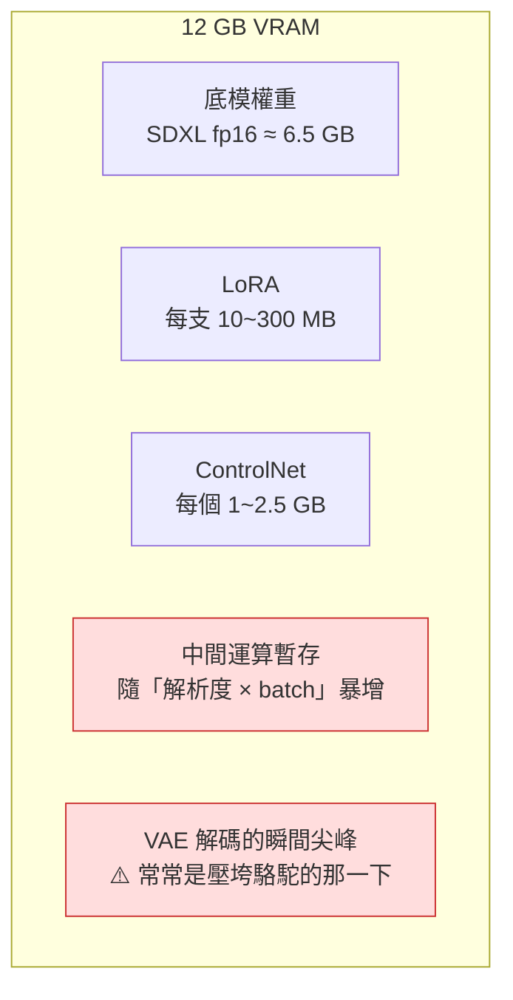

# comfy-0-7 硬體現實：VRAM 決定你能做什麼

> **本章目標**：建立一張「12GB 能做什麼、不能做什麼」的能力地圖，讓你在下載 40GB 模型之前就知道跑不跑得動。

## 你會學到

- 為什麼 VRAM（顯示記憶體）是唯一真正的瓶頸，而不是顯卡速度
- 產一張圖時，VRAM 到底被誰吃掉
- RTX 4070 12GB 的能力邊界：能做什麼、要妥協什麼、完全別想什麼
- VRAM 不夠時的四種對策，以及它們各自的代價

---

## 概念說明

### 為什麼是 VRAM，不是速度

顯卡有兩個常被混淆的指標：

```
運算速度（TFLOPS / CUDA 核心數） → 決定「跑多快」
VRAM 容量（GB）                  → 決定「跑不跑得動」
```

差別很關鍵：

> **速度不夠，你只是要等比較久。VRAM 不夠，是直接 Out Of Memory 崩掉，一張圖都產不出來。**

所以買卡 / 評估任務時，**先看 VRAM 夠不夠，再看速度**。一張慢但 VRAM 大的卡，能做的事比快但 VRAM 小的卡多。

> VRAM 為什麼不能用系統記憶體代替？因為 GPU 運算需要資料就在它旁邊。放到系統記憶體要透過 PCIe 傳輸，慢上幾十倍——這正是記憶體階層的經典問題 → [cs-3-4：記憶體階層](../../cs/part-3/cs-3-4-memory-hierarchy.md)

### VRAM 被誰吃掉

產一張圖時，VRAM 大致這樣分配：



這張圖在表達：**固定成本（模型權重）你算得出來，變動成本（中間暫存）才是會爆的那個**。

三個重點：

1. **模型權重是固定開銷**：SDXL 系底模 fp16 大約 6.5GB，一載入就佔著。
2. **解析度的影響是平方級的**：1024×1024 的中間資料量大約是 512×512 的**四倍**。
3. ⚠️ **VAE 解碼是尖峰時刻**：latent 轉成圖片的那一步會瞬間需要大量 VRAM。很多人的 OOM 發生在「進度條跑完了、圖卻沒出來」——就是死在這裡（對策見下面）。

### RTX 4070 12GB 的能力地圖

這是你的產線機。實務上的邊界：

| 任務 | 12GB 可行嗎 | 備註 |
|------|:---------:|------|
| SDXL / Illustrious 產圖 1024×1536 | ✅ 輕鬆 | 你的日常，4 張約 55 秒 |
| 掛 2~3 支 LoRA | ✅ | LoRA 很小，不是瓶頸 |
| 掛 1~2 個 ControlNet | ✅ | 三個以上要注意 |
| IPAdapter + ControlNet 同時 | ✅ 但接近上限 | 要留意 batch size |
| 高解析度修復（2 倍放大到 2048+） | ⚠️ 要用 tiled | 直接放大會 OOM |
| **訓練 SDXL LoRA** | ✅ | 你已經做過四次。⚠️ **必須先關掉 ComfyUI** |
| Flux dev 全精度 | ❌ | 要 fp8 或 GGUF 量化版 |
| 影片模型 Wan 2.2 14B 原版 | ❌ | 要 GGUF 量化版，且慢 |
| 影片模型（5B 輕量版 / 量化版） | ⚠️ 可行但慢 | 見 Part 9 |
| 訓練底模（full finetune） | ❌ | 那是 24GB+ 起跳的事 |

> ⚠️ **「訓練前必關 ComfyUI」是你專案踩過的坑**：ComfyUI 會把模型駐留在 VRAM 裡，訓練程式啟動時就搶不到記憶體。而且 ComfyUI 的 Python 行程在 SSH 斷線後不會自己結束，要手動 `Stop-Process` 殺掉。

### VRAM 不夠時的四種對策

當你 OOM 了，依「代價由小到大」排序：

#### 對策一：降低變動成本（最先試）

```
降解析度      → 1024×1536 改成 832×1216
batch size 改 1 → 一次產一張，不要一次四張
關掉不需要的 ControlNet
```

**代價最小**，而且常常是最合理的——你的專案就發現 832×1216 反而更接近想要的像素顆粒感（見 `comfy-2-3`）。

#### 對策二：開啟 tiled VAE

針對前面說的「VAE 解碼尖峰」。原理是把圖切成小塊分批解碼，用時間換空間。

```
一次解碼整張 2048×2048  → 尖峰 VRAM 很高
切成 512×512 的塊逐一解碼 → 尖峰低很多，但慢一點
```

⚠️ 副作用：塊與塊的接縫處**可能有輕微色差**。多數情況看不出來，但做純色背景立繪時要留意。

#### 對策三：啟動參數 offload

ComfyUI 的啟動旗標：

| 旗標 | 做什麼 | 代價 |
|------|--------|------|
| （預設） | 盡量把模型留在 VRAM | 最快 |
| `--lowvram` | 把模型拆開，用到哪部分才載入 | 慢一些 |
| `--novram` | 幾乎全部放系統記憶體 | 很慢，但能跑 |
| `--cpu` | 完全不用 GPU | 極慢，只用於除錯 |

> 12GB 做一般產圖**不需要**這些旗標。它們是給 6~8GB 的卡、或跑影片模型時用的。

#### 對策四：換量化模型

用畫質換空間，把 fp16 換成 fp8 或 GGUF 量化版。這是跑 Flux、影片模型在 12GB 上的**唯一辦法**。細節見 `comfy-3-6` 與 `comfy-9-4`。

### 系統記憶體（RAM）也要夠

一個常被忽略的點：**VRAM 不是唯一的記憶體需求**。

模型載入時要先經過系統記憶體，切換模型時舊的會被暫存在那裡。實務建議：

```
系統 RAM ≥ VRAM × 2，且至少 32GB
```

⚠️ 症狀辨識：如果你的 ComfyUI **在切換模型時整台機器卡死**（不是 OOM 錯誤，是系統沒反應），那通常是系統記憶體不足在硬碟上瘋狂 swap，不是 VRAM 的問題。

### 一個實用的估算習慣

看到一個新模型想試，下載前先做這個心算：

```
需要的 VRAM ≈ 模型檔案大小 × 1.2  ＋  中間暫存（解析度決定）

例：Flux dev fp16 是 23GB 的檔案
   → 23 × 1.2 = 27.6GB，加暫存超過 30GB
   → 12GB 顯然跑不動 → 去找 GGUF Q4 版本（約 6~7GB）
```

**這個心算會幫你省下很多下載 40GB 之後發現跑不動的時間。**

---

## 小練習

1. **查你的實際用量**：產一張你日常規格的圖，同時用工作管理員（或 `nvidia-smi`）看 VRAM 用了多少。這個數字是你的「基準線」，之後加東西時心裡有底。

2. **找出你的天花板**：從你日常的解析度開始，逐步往上加（batch size、ControlNet 數量、解析度），記錄在哪一步 OOM。**知道邊界在哪，比每次都保守使用更有效率。**

3. **做一次估算**：挑一個你想試但沒試過的模型（例如某個影片模型），用上面的公式估算它需要多少 VRAM，再去查別人的實測值對照。

---

## 課外讀物

> 為什麼「資料離運算單元愈近愈快」——記憶體階層的完整說明 → [cs-3-4：記憶體階層](../../cs/part-3/cs-3-4-memory-hierarchy.md)
> RAM 到底是什麼、為什麼不夠會 swap → [cs-3-5：RAM](../../cs/part-3/cs-3-5-ram.md)
