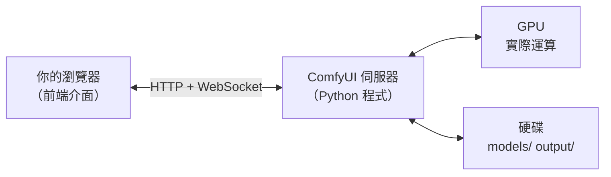
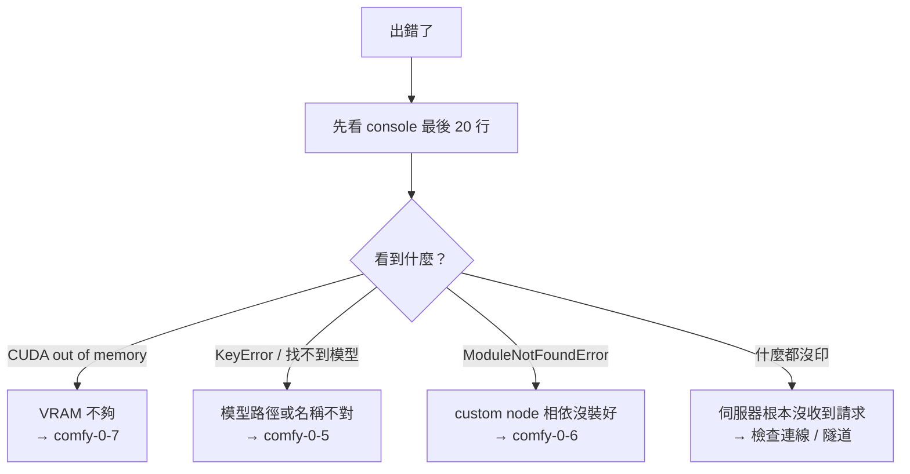

# comfy-0-8 跑通第一張圖

> **本章目標**：把伺服器跑起來、產出第一張圖，並建立一個「出問題時該看哪裡」的習慣。**這章先照做就好**——下一個 Part 會把這張流程整個拆開講。

## 你會學到

- 本機啟動與遠端啟動（含 SSH 隧道）兩種方式
- 產出第一張圖的最短路徑
- ⚠️ 遠端執行時最容易踩的三個坑
- 出問題時的第一個動作：看 console

---

## 概念說明

### ComfyUI 是一個伺服器

先建立一個觀念：ComfyUI **不是一個桌面程式，是一個網頁伺服器**。



這張圖在表達：**畫面跟運算是分開的**。這帶來一個很實用的結果——瀏覽器跟伺服器不必在同一台機器上。你可以在 Mac 上開瀏覽器，實際運算跑在那台裝了 RTX 4070 的 Windows 機器上。

（這也是為什麼關掉瀏覽器分頁，正在跑的任務不會停——真正在做事的是伺服器那邊。）

### 情況 A：本機啟動

如果 ComfyUI 就裝在你面前這台機器：

```bash
# Portable 版（Windows）
python_embeded\python.exe -s ComfyUI\main.py --windows-standalone-build

# 手動安裝版（Mac / Linux）
python main.py
```

啟動後 console 會印出網址，通常是 `http://127.0.0.1:8188`。用瀏覽器打開就是介面。

### 情況 B：遠端啟動（你的實際情況）

你的 ComfyUI 跑在區網另一台 Windows 機器上。有兩個問題要解決：**怎麼讓它接受外部連線**，以及**怎麼連進去**。

#### 步驟 1：讓伺服器監聽外部連線

預設 ComfyUI 只接受本機連線。加上 `--listen`：

```bash
python_embeded\python.exe -s ComfyUI\main.py --windows-standalone-build --listen 0.0.0.0 --port 8188
```

`--listen 0.0.0.0` 的意思是「接受來自任何網路介面的連線」。

> ⚠️ **這件事有資安意義**：加上 `--listen` 等於把 ComfyUI 開放給整個區網。ComfyUI **沒有帳號密碼機制**，任何連得到的人都能操作它、下載你的產出、甚至透過某些 custom node 讀你的檔案。**只在信任的區網裡這樣做，絕對不要對公網開放。**

#### 步驟 2：從你的機器連進去

有兩條路：

| 方式 | 做法 | 取捨 |
|------|------|------|
| **直接連 IP** | 瀏覽器開 `http://192.168.10.99:8188` | 簡單，但要開 Windows 防火牆 |
| **SSH 隧道** | 把遠端的 8188 映射到本機的 8188 | 不必開防火牆，連線加密 |

你的專案用的是 SSH 隧道：

```bash
# 把遠端的 127.0.0.1:8188 接到本機的 8188
ssh -N -L 8188:127.0.0.1:8188 windows
```

之後在本機瀏覽器開 `http://127.0.0.1:8188`，流量會自動走 SSH 通道過去。

> SSH 隧道的原理 → [課外讀物 E-1-7：SSH 基礎](../../../課外讀物/E-1-terminal/E-1-7-ssh-basics.md)

#### ⚠️ 遠端執行的三個坑（你的專案都踩過）

**坑一：SSH session 斷掉，伺服器就跟著死**

ComfyUI 是那條 SSH 連線的子行程，連線斷了它就被一起收掉。解法是用 `nohup` 讓它脫離終端機，並開啟保活：

```bash
nohup ssh -o ServerAliveInterval=30 windows "cd /d D:\AI\ComfyUI\ComfyUI_windows_portable && python_embeded\python.exe -s ComfyUI\main.py --windows-standalone-build --listen 0.0.0.0 --port 8188" > /tmp/comfyui-server.log 2>&1 &
```

`ServerAliveInterval=30` 是每 30 秒送一個心跳封包，避免連線因閒置被中斷。

> ⚠️ 你的專案紀錄了一個**反面經驗**：試過用 Windows 的 `Start-Process` 與 `schtasks` 讓它背景常駐，**實測都活不下來**。老老實實用 nohup + SSH 保活。

**坑二：程式沒有真的死掉**

ComfyUI 的 Python 行程在 SSH 斷線後**不會自己結束**。它會繼續佔著 VRAM。所以你以為關掉了，實際上下次要訓練 LoRA 時會搶不到記憶體。

要真的殺掉它，得明確下手（Windows 用 `Stop-Process`）。

**坑三：驗證要用程式，不要用眼睛**

啟動之後不要只是「打開網頁看看有沒有出來」，用 API 確認：

```bash
curl -s http://127.0.0.1:8188/system_stats
```

有回傳 JSON（裡面會列出 GPU 型號與 VRAM）就代表伺服器活著、隧道也通。**這一步能區分「伺服器沒起來」與「隧道沒通」兩種不同的問題。**

### 產出第一張圖

介面打開之後，畫面上已經有一張預設的 workflow（就是 `comfy-0-2` 那七個節點）。最短路徑：

```
1. 在 Checkpoint Loader 節點的下拉選單選一個底模
   （選單是空的 → 回去看 comfy-0-5）

2. 在上面那個文字框（正面提示詞）打字
   Illustrious 系模型請用 tag：
   masterpiece, 1girl, solo, night park

3. 下面那個文字框是負面提示詞，先留著預設的就好

4. 按 Queue Prompt（有些版本叫 Run）

5. 等進度條跑完，圖會出現在最後一個節點上
```

**第一次會比較久**（要把 6.5GB 模型從硬碟載進 VRAM），第二次開始就快了——模型已經在 VRAM 裡。

### 出問題時：先看 console

這是本章最重要的習慣。

**網頁介面上的錯誤訊息通常很簡略**，真正的資訊在啟動 ComfyUI 那個終端機視窗裡（console）。它會印出完整的 Python 錯誤堆疊。



這張圖在表達一個排查習慣：**console 的錯誤訊息會直接告訴你是哪一類問題**，不用猜。遠端執行時，那些輸出就在你 `nohup` 指定的 log 檔裡（例如 `/tmp/comfyui-server.log`）。

> Part 11 會有完整的錯誤訊息對照表。現在只要養成「先看 console」這個反射動作。

---

## 小練習

1. **完整跑一次啟動流程**：從零開始——啟動伺服器、建立隧道、用 `curl` 驗證、開瀏覽器、產一張圖。**把每個指令記下來**，這是你之後每次都要做的事。

2. **故意製造一個錯誤**：把 Checkpoint Loader 的模型名稱改成不存在的，按 Queue，然後去 console 看錯誤長什麼樣。**認得錯誤訊息的樣子，比事後 Google 快十倍。**

3. **確認你能殺乾淨**：關掉 ComfyUI 之後，去確認那個 Python 行程真的不見了、VRAM 真的釋放了。（這件事在你要訓練 LoRA 之前是必修。）

---

## 課外讀物

> SSH 連線、隧道、免密碼登入 → [課外讀物 E-1-7：SSH 基礎](../../../課外讀物/E-1-terminal/E-1-7-ssh-basics.md)
> 行程（process）是什麼、怎麼看與殺掉 → [課外讀物 E-1-6：行程管理](../../../課外讀物/E-1-terminal/E-1-6-process-management.md)
> 為什麼「不要對公網開放沒有驗證的服務」 → [課外讀物 E-10-1：Web Security 總覽](../../../課外讀物/E-10-security/E-10-1-web-security-overview.md)
