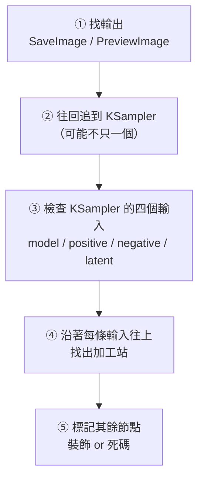

# comfy-1-11 怎麼讀一張陌生的 workflow

> **本章目標**：學會一套**可重複的拆解步驟**——不管別人（或 AI）丟給你多亂的一張圖，你都能在五分鐘內說出「它在做什麼」。

## 你會學到

- 為什麼要**從輸出往回讀**，而不是從左往右
- 五步拆解法
- 怎麼快速判斷「哪些節點是主幹、哪些是裝飾」
- ⚠️ 三個會誤導你的陷阱

---

## 概念說明

### 為什麼不從左往右讀

一張下載來的 workflow 常常是這樣：節點散落各處、線交錯纏繞、有些區塊灰掉、還有一堆你沒看過的節點名稱。

**從左往右讀會失敗**，因為：

- 節點的**視覺位置與執行順序無關**（作者只是隨手擺）
- 左邊可能有一堆根本沒被使用的實驗殘骸
- 你不知道哪條線才是主線

**正確的方向是從輸出往回追**——這也是 ComfyUI 自己執行時的邏輯（`comfy-1-4` 講過：它從輸出節點反向找依賴）。

> **比喻**：你要看懂一個陌生的程式，不會從第一行讀到最後一行，而是**找到 `main()` 然後往下追**。讀 workflow 同理，`SaveImage` 就是那個 main。

---

### 五步拆解法



#### 步驟 ① 找輸出節點

先問：**這張圖最後產生了什麼？**

- 只有一個 `SaveImage` → 單一產物，好讀
- 有好幾個 → 它可能同時輸出多個版本（原圖 + 放大版 + 遮罩），或有幾個是除錯用的預覽

#### 步驟 ② 往回追到 KSampler

從輸出往回，通常會經過 `VAEDecode`，然後到 `KSampler`。

**數一數有幾個 KSampler**——這是判斷複雜度最快的指標：

| KSampler 數量 | 代表什麼 |
|:---:|---|
| 1 | 單階段，最單純 |
| 2 | 兩階段（hires fix、refiner、或先構圖後細節） |
| 3+ | 多階段流程，通常是「產圖 → 放大 → 局部修臉」這類產線 |

#### 步驟 ③ 檢查 KSampler 的四個輸入 ⚠️ 最關鍵的一步

對每個 KSampler，問這四個問題：

| 輸入 | 問題 | 你會發現 |
|------|------|---------|
| `model` | 中間經過幾個 LoRA Loader？ | **掛了哪些 LoRA、權重多少** |
| `positive` | 有沒有經過 ControlNet Apply？ | **有沒有做空間控制** |
| `negative` | 同上 | 通常跟 positive 走同一條 |
| `latent_image` | 來自 EmptyLatent 還是 VAEEncode？ | **這是 txt2img 還是 img2img** |

> **這四個問題答完，你已經懂了這張圖八成的內容。** 剩下的都是細節。

#### 步驟 ④ 沿著輸入往上找加工站

「加工站」＝ 吃某型別、吐同型別的節點（`comfy-1-2` 講過）。它們是流程的關鍵轉折：

```
MODEL 線上的加工站  → LoraLoader、ModelSamplingDiscrete
COND 線上的加工站   → ControlNetApply、ConditioningSetArea、Combine
LATENT 線上的加工站 → LatentUpscale、SetLatentNoiseMask
IMAGE 線上的加工站  → ImageScale、預處理器
```

#### 步驟 ⑤ 標記其餘節點

追完主幹之後，剩下的節點分成三類：

| 類型 | 特徵 | 怎麼處理 |
|------|------|---------|
| **便利節點** | Note、Reroute、預覽、印出參數 | 忽略 |
| **被關掉的分支** | 灰掉（Bypass / Mute） | 看一眼是什麼，通常是作者留的替代方案 |
| **死碼** | 沒連到任何輸出 | **忽略，甚至可以刪掉** |

---

### 三個會誤導你的陷阱 ⚠️

#### 陷阱一：權重為 0 的 LoRA

你會看到一個 `LoraLoader` 好端端地接在鏈路上，但 `strength_model` 是 `0.0`。

**它等於不存在**——權重 0 代表完全不套用。

為什麼作者要留著？兩種可能：

1. **給腳本覆寫用**——workflow 只是模板，實際權重由外部程式在執行時填入
2. 作者在試驗時關掉了，忘了刪

> ⚠️ **你專案的 `heroine-lora.json` 就是第一種**：skormino 的權重寫死 0.0，實際跑的時候由 `generate_stages_v4.py` 用 `--set` 覆寫。**看檔案會以為沒掛風格 LoRA，其實有。** 這是讀 API 格式 workflow 特有的陷阱。

#### 陷阱二：PLACEHOLDER 文字

同理，你會看到 `CLIPTextEncode` 的內容是 `PLACEHOLDER` 或空字串。

那代表**這張 workflow 是給程式用的模板**，prompt 由外部填入。不是作者忘了寫。

#### 陷阱三：節點編號不連續

API 格式的 workflow（JSON）裡，節點編號可能是 `1, 3, 4, 5, 6, 7, 8, 9, 20, 21, 22, 23`——中間跳號。

**這不代表缺了什麼**。編號只是識別碼，作者刪過節點、或後來加的節點從 20 開始編，都很正常。

---

### 一個快速判斷表

拆完之後，用這張表總結你讀到的東西：

| 問題 | 答案在哪 |
|------|---------|
| 這是 txt2img 還是 img2img？ | KSampler 的 `latent_image` 來源 |
| 用什麼底模？ | `CheckpointLoaderSimple` |
| 掛了哪些 LoRA、權重多少？ | MODEL 線上的 `LoraLoader` 們 |
| 有沒有空間控制？ | COND 線上有沒有 `ControlNetApply` |
| 幾階段？ | KSampler 的數量 |
| 產出尺寸？ | `EmptyLatentImage` 或來源圖 |
| 存到哪？ | `SaveImage` 的 `filename_prefix` |

**把這七個問題答完，就等於讀懂了。**

---

## 程式碼範例

用 `comfy-0-2` 的翻譯法，讀圖的過程其實就是**把節點圖還原成函式呼叫**。

一張讀懂的 workflow，摘要起來會像這樣：

```python
# 從 SaveImage 往回追，得到的主幹：
model, clip, vae = load_checkpoint("waiIllustriousSDXL_v170")
model, clip = load_lora(model, clip, "nightheroine-v1", 1.0, 1.0)   # 角色
model, clip = load_lora(model, clip, "pixel-skormino-v8", 0.0, 0.0) # ⚠️ 權重 0，由腳本覆寫

positive = encode(clip, "masterpiece, nightheroine, 1girl, ...")
negative = encode(clip, "bad quality, worst quality, ...")
latent   = empty_latent(832, 1216, batch=2)          # → txt2img

result = ksampler(model, positive, negative, latent,
                  seed=8888, steps=30, cfg=3.5,
                  sampler="dpmpp_2m", scheduler="karras", denoise=1.0)

save(vae_decode(vae, result), prefix="crashgame/lora-test")
```

**十行就講完了一張圖。** 這就是讀圖的目標——不是記住每個節點的位置，而是能寫出這段摘要。

---

## 小練習

1. **練習五步法**：從網路上（Civitai 的範例圖、或 ComfyUI 官方模板）隨便抓一張你沒看過的 workflow，用五步法拆解，寫出上面那張「快速判斷表」的七個答案。

2. **找出死碼**：在同一張圖裡，找出沒有連到任何輸出的節點。有些下載來的 workflow 有超過三分之一是死碼。

3. **寫摘要**：把那張 workflow 翻譯成十行左右的偽程式碼。**寫得出來就是真的讀懂了。**

---

## 課外讀物

> 為什麼從輸出往回追——ComfyUI 的執行模型 → `comfy-1-4`
> 下一章直接拿你專案的兩張 workflow 實作一次 → `comfy-1-12`
