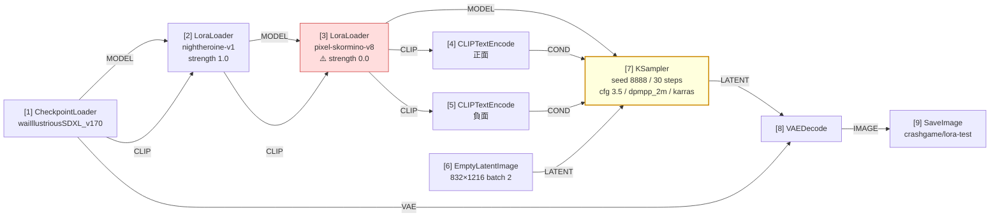
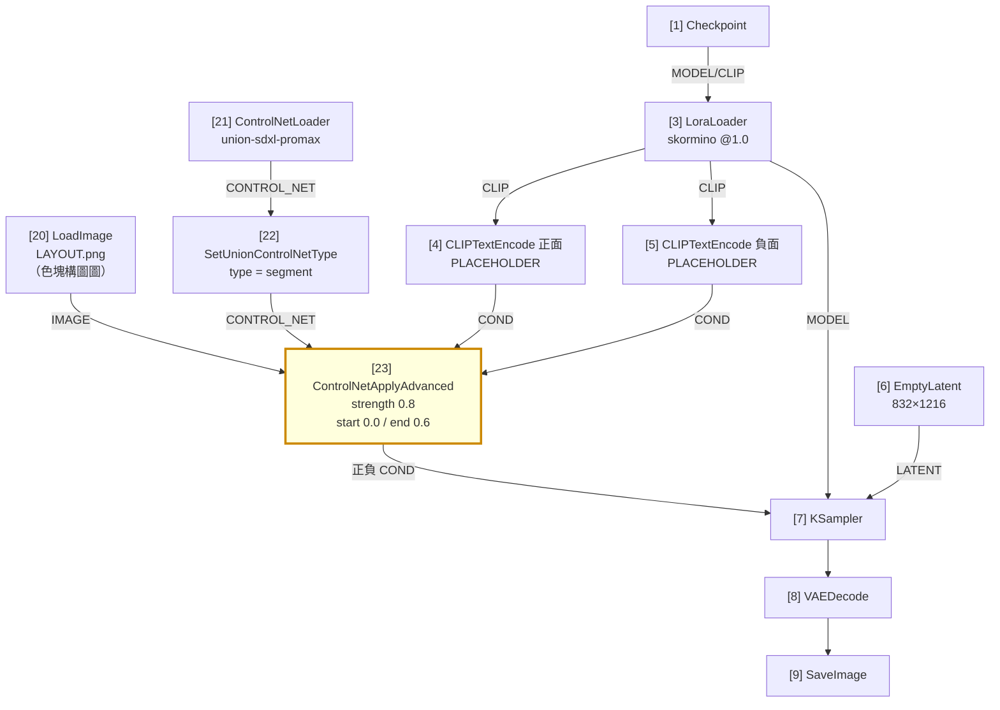
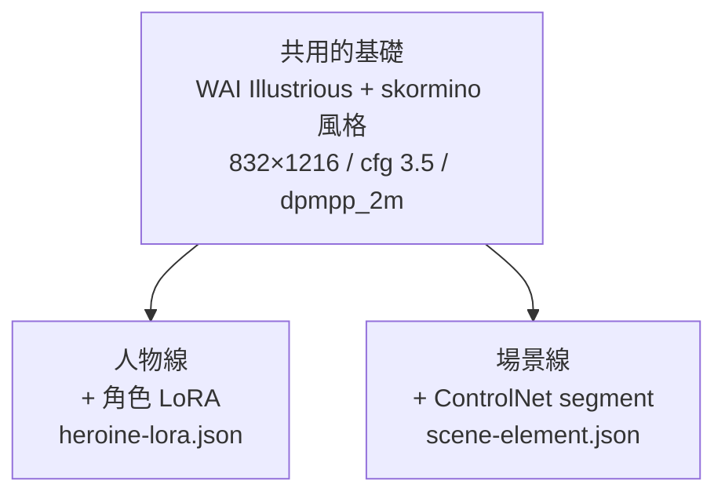

# comfy-1-12 🔧 讀圖實戰：拆解你自己的兩張 workflow

> **本章目標**：用上一章的五步法，把 `crashgame` 專案實際在用的兩張 workflow 完整拆開。**這是你每天在用、卻沒看過內部的東西。**

## 你會學到

- 一張「標準 + LoRA」的 workflow 長什麼樣（9 個節點）
- 一張「加上 ControlNet」的 workflow 多了什麼（12 個節點）
- ⚠️ 兩張圖的差異，正好示範了「什麼時候該共用 workflow、什麼時候必須分開」
- 從真實檔案裡看出三個實務設計決策

---

## 概念說明

### 第一張：`heroine-lora.json`（人物立繪）

先用五步法。**步驟①** 找輸出：只有一個 `SaveImage`（節點 9）。**步驟②** 往回追：`VAEDecode`（8）→ `KSampler`（7）。**只有一個 KSampler → 單階段流程。**

**步驟③** 檢查 KSampler 的四個輸入：



**七個問題的答案**：

| 問題 | 答案 |
|------|------|
| txt2img 還是 img2img？ | **txt2img**（latent 來自 EmptyLatentImage） |
| 底模 | `waiIllustriousSDXL_v170` |
| LoRA | 角色 `nightheroine-v1` @1.0；風格 `pixel-skormino-v8` @**0.0** ⚠️ |
| 空間控制 | **無** |
| 幾階段 | 1 |
| 尺寸 | 832×1216，一次 2 張 |
| 存到 | `output/crashgame/lora-test` |

**結構是「標準七節點 + 兩個 LoraLoader」。** 就這樣——你每天在用的立繪產線，本質上就是預設 workflow 插了兩個 LoRA。

---

### ⚠️ 三個值得注意的設計決策

#### 決策一：skormino 權重寫死 0.0

這正是 `comfy-1-11` 講的**陷阱一**。看檔案會以為沒掛風格 LoRA——但實際跑的時候，`generate_stages_v4.py` 會用 `--set 3.strength_model=0.5` 之類的方式覆寫。

> **為什麼要留一個權重 0 的節點？** 因為「節點圖的形狀」必須先存在，腳本才能改它的值。這是 API 格式 workflow 的常見手法：**JSON 是模板，變動的參數由外部注入**（完整說明見 `comfy-7-3`）。
>
> 這也是為什麼權重 0 不能直接把節點刪掉——刪掉就沒東西可覆寫了。

#### 決策二：兩個 CLIPTextEncode 都從節點 3 取 CLIP

注意 `[4]` 和 `[5]` 的 `clip` 都來自 `<-node3[1]`，也就是**經過兩個 LoRA 修改後的 CLIP**。

這是正確做法：LoRA 會改變詞的意義（例如讓 `nightheroine` 這個觸發詞有意義），所以文字編碼要用改造過的 CLIP。

> ⚠️ **接錯的症狀**：如果從 `node1[1]`（原始 CLIP）取，觸發詞會失效——LoRA 的畫風還在，但角色特徵叫不出來。這是很難察覺的 bug，因為圖還是產得出來，只是「怪怪的」。

#### 決策三：VAE 直接從節點 1 取

`VAEDecode` 的 `vae` 來自 `<-node1[2]`，也就是底模自帶的 VAE，**沒有經過 LoRA**。

這也是對的——LoRA 不會修改 VAE，所以直接從源頭取最乾淨。

---

### 第二張：`scene-element.json`（場景元件）

同樣五步法。輸出是 `SaveImage`（9）→ `VAEDecode`（8）→ `KSampler`（7）。一樣單階段。

但**步驟③檢查輸入時，出現關鍵差異**：

```
positive ← node23[0]   ⚠️ 不是直接來自 CLIPTextEncode
negative ← node23[1]   ⚠️ 同上
```

節點 23 是 `ControlNetApplyAdvanced`。**條件鏈路上多了一個加工站。**



**多出來的就是 ControlNet 四件組**：

| 節點 | 角色 |
|------|------|
| `[20] LoadImage` | 讀入色塊構圖圖（控制的**內容**） |
| `[21] ControlNetLoader` | 載入 ControlNet 模型（控制的**能力**） |
| `[22] SetUnionControlNetType` | 指定用哪種控制（這裡是 `segment`） |
| `[23] ControlNetApplyAdvanced` | **真正起作用的地方**——把控制疊加到條件上 |

> **記住這個形狀。** 所有 ControlNet workflow 都是這四件組，只是型別與參數不同。

---

### 兩張圖的比較：一個重要的工程判斷 ⚠️

把兩張圖並排：

| | `heroine-lora.json` | `scene-element.json` |
|---|---|---|
| 節點數 | 9 | 12 |
| 底模 | 同一個 | 同一個 |
| KSampler 參數 | 30 / 3.5 / dpmpp_2m / karras | **完全相同** |
| 尺寸 | 832×1216 | **相同** |
| LoRA | 角色 + 風格 | 只有風格 |
| **差別** | — | **多了 ControlNet 四件組** |

這正好示範了你專案文件裡那條規則：

> **只有參數不同就共用**（LoRA 權重、畫布、prompt、seed）——腳本去改節點裡的值就好。
> **節點圖的形狀變了就必須分開**，那不是改值能做到的。

兩張圖的 KSampler 參數一模一樣、底模一樣、尺寸一樣——**如果差別只有這些，它們應該是同一張 workflow 加不同參數**。

但 `scene-element.json` 多了四個節點，**且 KSampler 的 positive/negative 來源改變了**。這是**形狀的改變**，不是值的改變，所以必須是兩個檔案。

> 這條規則其實就是軟體工程的老問題：什麼時候該抽象共用、什麼時候該複製分開。判準是「**變的是參數還是結構**」。
> → [課外讀物 E-7-2：S — Single Responsibility Principle](../../../課外讀物/E-7-solid/E-7-2-srp.md)

---

### 從這兩張圖能看出的產線設計

拆完之後，回頭看整個產線的設計意圖：



**風格由底模與 skormino 統一，兩條線各自加上自己需要的控制手段。** 這是很乾淨的設計——不管人物還是場景，畫風都對得上，因為它們共用同一組風格參數。

---

## 小練習

1. **自己拆一次**：不看本章，打開 `tools/comfy/heroine-lora.json`，用五步法拆解並寫出七個問題的答案。對照本章確認。

2. **預測改動的影響**：如果你想在場景 workflow 上「換成 depth 控制」，需要改哪個節點的哪個值？（答案：節點 22 的 `type`。這是**改值**，所以不需要新開一個 workflow。）

3. **判斷該不該分開**：以下四個需求，哪些可以共用 `heroine-lora.json`、哪些必須新開檔案？
   - (a) 換一個角色 LoRA
   - (b) 產出改成 1024×1536
   - (c) 改成 img2img（用既有立繪當底）
   - (d) 加上臉部局部重繪
   
   （提示：用「變的是參數還是結構」判斷。）

---

## 課外讀物

> workflow 什麼時候共用、什麼時候分開的完整討論 → `comfy-7-4`
> 為什麼 JSON 是模板、參數由腳本注入 → `comfy-7-3`
> ControlNet 四件組的完整原理 → `comfy-5-6` ~ `comfy-5-9`
