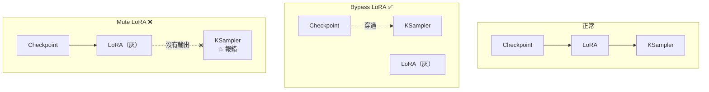
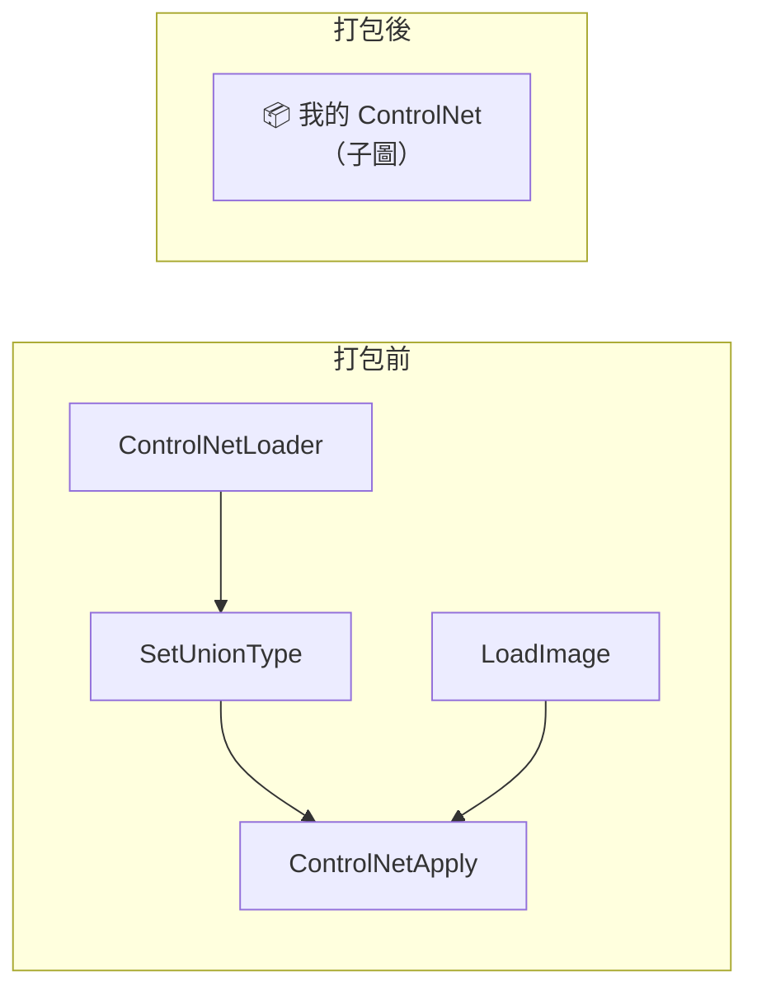

# comfy-1-13 讓大圖可維護：Mute、Bypass、Group、Reroute、Subgraph

> **本章目標**：學會整理節點圖的五個工具——特別是 **Bypass**，它不只是整理術，更是**除錯的第一步**。

## 你會學到

- ⚠️ Mute 與 Bypass 的關鍵差別（很多人一直搞混）
- 為什麼 Bypass 是最好用的除錯手段
- Group、Reroute、Note 的使用時機
- Subgraph：把一組節點打包成一個

---

## 概念說明

### Mute vs Bypass ⚠️

兩者都是「暫時關掉一個節點」，但**行為完全不同**：

| | **Mute**（靜音） | **Bypass**（繞過） |
|---|---|---|
| 快捷鍵 | `Ctrl/Cmd + M` | `Ctrl/Cmd + B` |
| 行為 | 節點**不執行**，也**不輸出** | 節點不執行，但**把輸入直接傳給輸出** |
| 下游會怎樣 | ⚠️ **斷掉**（下游拿不到資料，通常整條失敗） | **正常運作**（像這個節點不存在） |
| 用途 | 關掉整條分支（例如第二個 SaveImage） | **暫時移除鏈路中的一環** |

用圖說明差別：



這張圖在表達關鍵差異：**Bypass 會讓資料「穿過去」，Mute 會讓資料「斷在那裡」**。

**所以判斷很簡單**：

```
這個節點在鏈路「中間」（吃 X 吐 X 的加工站）→ 用 Bypass
這個節點在鏈路「末端」（SaveImage、PreviewImage）→ 用 Mute
```

⚠️ **Bypass 只在型別對得上時有效**。`LoraLoader` 吃 MODEL 吐 MODEL，所以能穿過去；但如果一個節點吃 IMAGE 吐 LATENT，Bypass 它就會讓下游拿到錯誤型別而報錯。

---

### 為什麼 Bypass 是除錯的第一步

假設你的圖產出不如預期。**最有效的除錯法是逐一 Bypass**：

```
Bypass 風格 LoRA → 出圖變好了？ → 問題在那支 LoRA
Bypass ControlNet → 出圖變好了？ → 問題在控制參數
Bypass 第二階段  → 出圖變好了？ → 問題在放大那段
```

這在軟體工程叫**二分法除錯**——不要猜，用排除法。**每次只關掉一個東西，看變化。**

> ⚠️ 你的專案就是用這個方法找到「openpose 會毀臉」的：Bypass 掉 ControlNet 之後臉就正常了，才鎖定問題在 preprocessor 抓不到頭部節點（見 `comfy-5-10`）。

**紀律**：

```
❌ 壞掉時同時改五個參數，然後不知道是哪個修好的
✅ 一次 Bypass 一個，記錄每次的結果
```

---

### Group（群組）

把一組相關節點框起來，可以：

- 一起移動
- 一起 Mute / Bypass（**很實用**——例如「放大區塊」整組關掉）
- 加上標題與顏色，讓大圖一眼看得懂結構

**實用的分組方式**：

```
[載入區]   Checkpoint、LoRA
[提示詞區] 正面、負面
[控制區]   ControlNet 四件組
[採樣區]   Latent、KSampler
[輸出區]   VAEDecode、Save
```

> 分組沒有功能上的影響，純粹是給人看的。但一張三十節點的圖有沒有分組，可讀性差很多。

---

### Reroute（轉接點）

一個什麼都不做的節點，只是讓線**轉個彎**。

**什麼時候用**：

- 一條線要拉很遠，中間穿過一堆節點很亂 → 用 Reroute 讓走線整齊
- 一個輸出要接給很多節點 → 先接到 Reroute，再從它分出去（改接的時候只要改一個地方）

⚠️ **不要濫用**。Reroute 太多會讓圖更難讀，而且追線時要多跳好幾站。**只在真的糾纏時才用。**

---

### Note（便條）

純文字便條，不影響執行。

**最有價值的用法**：

| 寫什麼 | 為什麼 |
|--------|--------|
| **這張圖的用途** | 三個月後你會忘記 |
| **參數為什麼是這個值** | ⚠️ **這是最重要的**——記錄「為什麼」而不是「是什麼」 |
| 被 Bypass 的分支是幹嘛的 | 否則你不敢刪也不敢開 |
| 觸發詞 | LoRA 的觸發詞忘了就等於廢了 |

> 例如在你的立繪 workflow 上，值得寫一張 Note：
> ```
> cfg 3.5 不是隨便設的：skormino 風格 LoRA 已經很強勢，
> 高 CFG 會讓它過飽和。作者實測值。
> 832×1216 不是為了省 VRAM——是因為 skormino 色塊固定 8px，
> 畫布愈小相對顆粒愈粗，這個尺寸才對得上 canon。
> ```
>
> 這正是 `comfy-0-1` 講的「結論 vs 知識」——**把為什麼寫下來**，不然三個月後只剩一組不敢動的魔法數字。
> → [課外讀物 E-6-5：註解該怎麼寫](../../../課外讀物/E-6-best-practices/E-6-5-comments.md)

---

### Subgraph（子圖）

較新的功能：**把一組節點打包成一個節點**。



**好處**：

- 大圖變乾淨（把重複的鏈路收起來）
- 可以**重複使用**（同一組 ControlNet 鏈路用在多個地方）
- 支援巢狀（子圖裡還能有子圖）

**注意事項**：

- 需要較新的 ComfyUI 前端版本
- ⚠️ **打包之後就看不到內部了**——對「要教別人看懂」的 workflow 反而是負面的
- 可以隨時展開（unpack）回原本的節點

> **建議**：自己的產線用得順手就用；**要分享或要當教材的 workflow 不要打包**，別人看不到裡面。

---

### 一個實務建議：命名節點

`comfy-1-3` 提過節點標題可以雙擊改名。這件事的價值在大圖上會放大：

| 預設 | 改名後 |
|------|--------|
| `CLIPTextEncode` | `正面：角色描述` |
| `CLIPTextEncode` | `負面：品質詞` |
| `LoraLoader` | `角色 LoRA` |
| `LoraLoader` | `風格 LoRA（腳本覆寫）` |

**特別是有多個同類節點的時候**——三個 `CLIPTextEncode` 擺在一起，不改名根本分不出誰是誰。

> ⚠️ 這也是防止「正負接反」那個經典 bug 的最好辦法（見 `comfy-1-5`）。

---

## 小練習

1. **驗證 Mute 與 Bypass 的差別**：在你的立繪 workflow 上，對同一個 `LoraLoader` 分別做 Mute 與 Bypass，觀察哪個會報錯、哪個正常出圖。**這個對照做過一次就永遠不會忘。**

2. **練習二分法除錯**：故意把某個參數改壞（例如 cfg 設成 20），然後用 Bypass 逐一排除的方式找出問題來源。

3. **整理一張圖**：拿你專案的 `scene-element.json` 載入 ComfyUI，加上 Group（分成載入 / 提示詞 / 控制 / 採樣 / 輸出五區）、把節點改名、並寫一張 Note 說明色塊圖的用途。**存下來取代原本的版本。**

---

## 課外讀物

> 註解要寫「為什麼」不寫「是什麼」——Note 的正確用法 → [課外讀物 E-6-5：註解該怎麼寫](../../../課外讀物/E-6-best-practices/E-6-5-comments.md)
> 「壞掉時一次只改一個東西」是除錯的通用原則 → `comfy-11-2`
