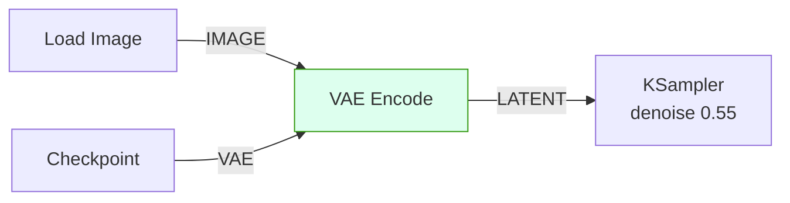

# comfy-1-15 🔧 從零手接一張 workflow

> **本章目標**：不複製貼上、不載入範本，從空白畫布接出一張完整的產圖流程。**接得出來，Part 1 才算過關。**

## 你會學到

- 從空白畫布建立完整 txt2img 流程的順序
- 用「拉線探索法」在不記得節點名稱時也能接出來
- 把它擴充成 img2img、再擴充成掛 LoRA
- 一個自我檢驗清單

---

## 概念說明

### 為什麼要手接

你可能會想：載入範本改一改不就好了？

因為**讀懂和寫得出來是兩回事**。就像你能讀懂一段程式碼，不代表你寫得出來。手接一次，你會遇到：

- 「這個孔要接什麼？」→ 逼你回想型別
- 「這個節點叫什麼名字？」→ 逼你用拉線探索
- 「為什麼報錯？」→ 逼你理解必接與選接

**這些卡住的地方，就是你還沒真的懂的地方。**

---

## 任務一：txt2img（七個節點）

### 建議順序：從左往右接

雖然**讀**圖要從右往左，但**接**圖從左往右比較順（因為每個節點的輸入都已經備妥）。

#### 步驟 1：載入模型

```
空白處雙擊 → 打 "checkpoint" → 選 Load Checkpoint
→ 在下拉選單選一個底模
```

現在你有三個輸出孔：`MODEL` / `CLIP` / `VAE`。

#### 步驟 2：用拉線探索法接提示詞

**這裡刻意不告訴你節點名稱**，用 `comfy-1-1` 教的技巧：

```
從 CLIP 孔拉一條線出來 → 放在空白處
→ 選單會列出所有吃 CLIP 的節點
→ 選 CLIPTextEncode
```

**再做一次**，接出第二個（負面用）。

> 💡 **馬上做一件事**：把兩個節點改名成「正面」「負面」（雙擊標題）。這個習慣會幫你省下很多次「接反了」的意外。

#### 步驟 3：空白畫布

```
雙擊 → 打 "empty" → Empty Latent Image
→ 設 832×1216（或你慣用的尺寸）
```

#### 步驟 4：KSampler

```
雙擊 → 打 "ksampler" → KSampler
```

現在它有四個空的輸入孔。**依序接上**：

| 孔 | 從哪接 |
|----|--------|
| `model` | Checkpoint 的 MODEL |
| `positive` | 「正面」節點的輸出 |
| `negative` | 「負面」節點的輸出 |
| `latent_image` | Empty Latent Image |

#### 步驟 5：解碼與存檔

```
從 KSampler 的 LATENT 拉線 → 選 VAE Decode
→ 它還缺 vae 孔 → 從 Checkpoint 的 VAE 接過去
從 VAE Decode 拉線 → 選 Preview Image
```

> 用 `PreviewImage` 而不是 `SaveImage`——練習階段不要製造垃圾檔案。

#### 步驟 6：填 prompt 並執行

正面填 tag（Illustrious 系）：

```
masterpiece, 1girl, solo, long hair, night park, from side
```

負面先填基本的：

```
bad quality, worst quality, bad anatomy, multiple views
```

按 `Queue Prompt`。

---

### ✅ 檢驗清單一

- [ ] 出圖了
- [ ] 我知道每個節點為什麼在那裡
- [ ] 我沒有複製貼上任何東西
- [ ] 兩個文字節點我改過名字

⚠️ **如果報錯**，對照這張表：

| 錯誤 | 原因 |
|------|------|
| `Required input is missing` | 有孔沒接 |
| 出圖但完全不像 prompt | **正負接反了** |
| 圖是灰的 / 全糊 | VAE 沒接對，或底模的 VAE 有問題 |
| `CUDA out of memory` | 尺寸太大或 batch 太多 |

---

## 任務二：改成 img2img

在剛才那張圖上改造。**只要動兩個地方**：

```
1. 把 Empty Latent Image 刪掉（或 Mute 掉）
2. 加入 Load Image → VAE Encode → 接到 KSampler 的 latent_image
   （VAE Encode 的 vae 孔記得從 Checkpoint 接）
3. 把 KSampler 的 denoise 從 1.0 改成 0.55
```



**試三個 denoise 值**：0.3 / 0.55 / 0.8，各產一張。

> 這個練習會讓你對 denoise 建立手感——**這是 Part 5 最重要的參數**，現在先用身體記住它。

---

## 任務三：加上 LoRA

回到 txt2img 版本，插入一個 LoRA：

```
1. 在 Checkpoint 與其他節點之間，插入 LoraLoader
2. Checkpoint 的 MODEL + CLIP → LoraLoader
3. LoraLoader 的 MODEL → KSampler
4. LoraLoader 的 CLIP → 兩個文字編碼節點  ⚠️ 這步很多人漏掉
5. 在正面 prompt 最前面加上 LoRA 的觸發詞
```

⚠️ **步驟 4 是重點**：文字編碼要用**經過 LoRA 修改的 CLIP**，否則觸發詞會失效（`comfy-1-12` 講過這個 bug）。

**驗證方法**：

```
把 strength_model 與 strength_clip 都設成 0.0，產一張（seed 固定）
再改成 1.0，產一張
→ 兩張明顯不同 = 接對了
→ 兩張一模一樣 = LoRA 根本沒接進鏈路
```

> 這個「權重 0 vs 1 對照」是驗證 LoRA 有沒有真的生效的標準手法。你的專案在測 skormino 影響時就是這樣做的。

---

## ✅ 最終檢驗清單

Part 1 過關的標準：

- [ ] 我能從空白畫布接出 txt2img，不看筆記
- [ ] 我知道 KSampler 的四個輸入分別從哪來
- [ ] 我能說出 `LATENT` 和 `IMAGE` 的差別
- [ ] 我知道怎麼把 txt2img 改成 img2img（改哪裡）
- [ ] 我知道 LoRA 要接兩條線（MODEL 和 CLIP）
- [ ] 我能用 Bypass 排除問題
- [ ] 拿到一張陌生的 workflow，我能用五步法說出它在做什麼

**全部打勾 → 你已經不是白紙了。** 接下來 Part 2 會回答「這些參數為什麼是那些值」。

---

## 小練習

1. **限時挑戰**：計時，看你多久能從空白畫布接出可運作的 txt2img。第一次可能十分鐘，第三次應該兩分鐘內。

2. **接一張有 ControlNet 的**（進階）：參考 `comfy-1-12` 拆解過的 `scene-element.json`，試著自己接出那個四件組。接不出來沒關係——Part 5 會完整教，這裡只是先體驗。

3. **存成你的模板**：把接好的 txt2img 存成 `my-base-txt2img.json`，之後所有實驗都從它開始。**這是你自己的起點，比任何下載來的範本都好用**——因為每個節點你都知道為什麼在那裡。

---

## 課外讀物

> 這些參數為什麼是那些值 → 本書 Part 2（擴散模型原理）
> 恭喜你完成 Part 1。**回頭看一次 `comfy-1-2` 的型別總圖**，現在它應該完全看得懂了。
