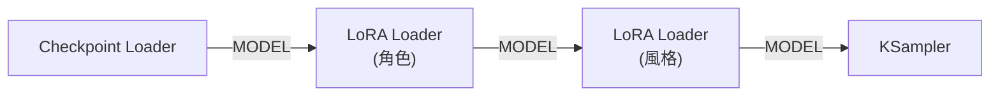
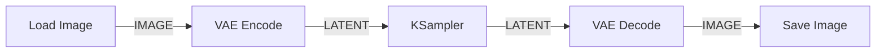
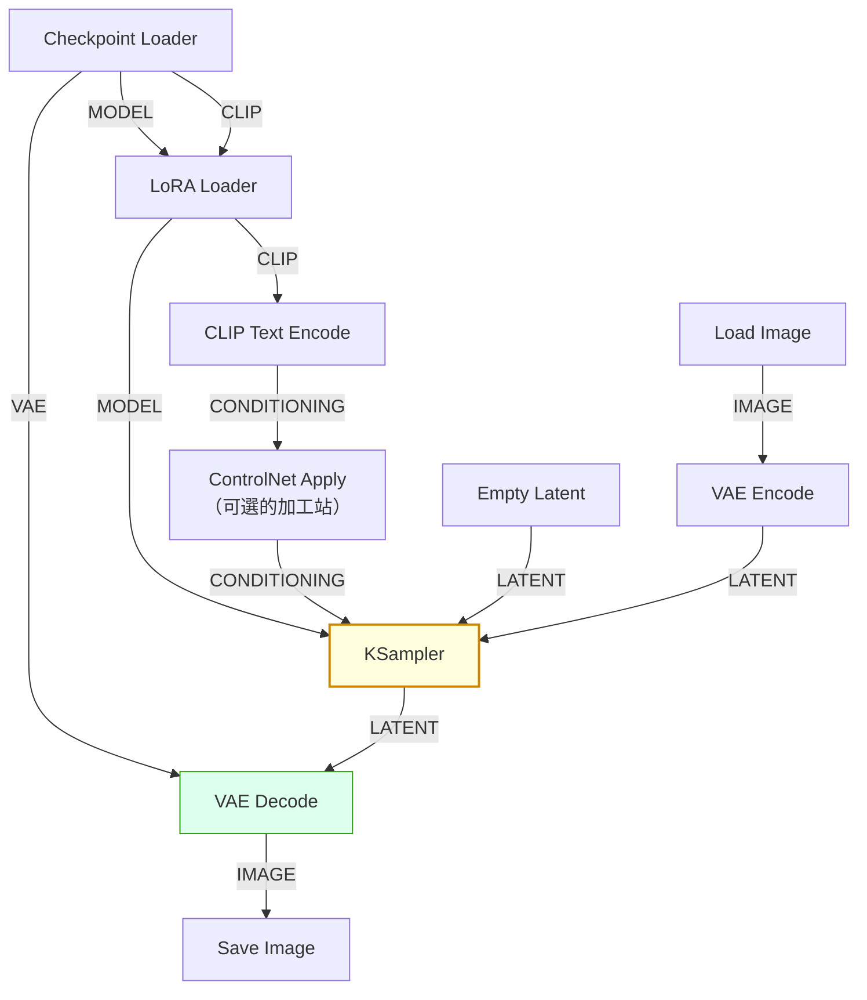

# comfy-1-2 線為什麼接不上去：ComfyUI 的資料型別系統

> **本章目標**：搞懂 ComfyUI 的七種核心資料型別。這是整個 Part 1 最重要的一章——**懂了型別，你就懂了「哪些節點可以接在一起」，也就懂了 workflow 的骨架。**

## 你會學到

- 為什麼 ComfyUI 要有型別系統（以及它跟 TypeScript 是同一個道理）
- 七種核心型別：`MODEL` / `CLIP` / `VAE` / `CONDITIONING` / `LATENT` / `IMAGE` / `MASK`
- 每種型別「長什麼樣、誰產生它、誰消費它」
- 一個關鍵區分：⚠️ **`LATENT` 和 `IMAGE` 不是同一種東西**

---

## 概念說明

### 為什麼會接不上去

你一定遇過：想從某個孔拉線到另一個孔，但線就是黏不上去。

原因是 **ComfyUI 有型別系統**：每個輸出孔和輸入孔都有一個型別，**只有型別相同才接得上**。

這跟你熟悉的 TypeScript 是完全一樣的道理：

```typescript
function vaeDecode(vae: VAE, samples: LATENT): IMAGE { ... }

// 這樣呼叫會被編譯器擋下來，因為型別不對
vaeDecode(myVae, myImage);  // ❌ IMAGE 不是 LATENT
```

ComfyUI 只是把這個檢查搬到了視覺介面上——**接不上去，就是型別檢查在保護你**。

> 而且畫布上的線是**有顏色的**，同一種型別同一個顏色。看久了會形成直覺：看到粉紅色的線就知道那是 MODEL。

### 七種核心型別

先給一張總表，之後再逐個說明：

| 型別 | 是什麼 | 誰產生它 | 誰消費它 |
|------|--------|---------|---------|
| `MODEL` | 主模型（去噪的那個大腦） | Checkpoint Loader、LoRA Loader | KSampler |
| `CLIP` | 文字編碼器 | Checkpoint Loader、LoRA Loader | CLIP Text Encode |
| `VAE` | 編解碼器（latent ↔ 圖） | Checkpoint Loader、VAE Loader | VAE Encode / Decode |
| `CONDITIONING` | **編碼後的提示詞** | CLIP Text Encode | KSampler、ControlNet |
| `LATENT` | 潛在空間的圖（**不是圖片**） | Empty Latent、VAE Encode、KSampler | KSampler、VAE Decode |
| `IMAGE` | 真正的圖片像素 | VAE Decode、Load Image | Save Image、預處理器 |
| `MASK` | 遮罩（黑白的選取範圍） | Load Image、遮罩節點 | Inpaint 相關節點 |

### 用一個比喻先建立直覺

把產圖想像成**沖洗底片**：

```
MODEL      = 沖洗師傅（知道怎麼把模糊的東西弄清楚）
CLIP       = 翻譯（把你的中文需求翻成師傅聽得懂的話）
CONDITIONING = 翻譯完的工單（師傅實際看的東西）
LATENT     = 底片（有影像資訊，但你看不懂）
VAE        = 沖印機（把底片變成照片，或把照片掃回底片）
IMAGE      = 沖出來的照片
MASK       = 貼在照片上的遮擋紙（只處理沒被遮住的部分）
```

**最關鍵的一組對應是 LATENT 與 IMAGE**：底片跟照片都承載同一個影像，但它們**不是同一種東西**，中間一定要經過沖印機（VAE）。

### 逐個說明

#### `MODEL` — 去噪的大腦

真正做「從雜訊裡雕出圖」這件事的模型（技術上叫 UNet 或 diffusion model）。

**重要特性：它會被一路修改。**



這張圖在表達一件很重要的事：**LoRA Loader 吃 MODEL、吐 MODEL**。它像一個中間層，把模型改造之後再傳下去。所以掛兩支 LoRA 就是串兩個 LoRA Loader——這也是為什麼它們會互相影響（見 `comfy-4-6`）。

> 這個「吃 X 吐 X」的模式在 ComfyUI 到處都是。看到某個節點的輸入輸出型別相同，就知道**它是個加工站，不是產生器**。

#### `CLIP` — 文字編碼器

把你打的文字轉成模型看得懂的數字。

注意 `CLIP` 也會被 LoRA 修改（LoRA Loader 同時吐出 `MODEL` 和 `CLIP`）——因為 LoRA 除了改畫法，也可能改變某些詞的意義（例如讓觸發詞 `pixpix` 代表一種畫風）。

#### `CONDITIONING` — 編碼後的提示詞 ⚠️

**這是最容易誤解的型別。**

很多人以為 KSampler 是直接吃文字的。不是——它吃的是 `CONDITIONING`，也就是**已經被 CLIP 編碼過的向量**。

```
你打的字  →  [CLIP Text Encode]  →  CONDITIONING  →  KSampler
"1girl"        （翻譯這一步）         （一堆數字）
```

為什麼要區分？因為 `CONDITIONING` 是可以**被加工**的：

- 兩段提示詞合併（`ConditioningCombine`）
- 指定只作用在畫面某個區域（`ConditioningSetArea`）
- **ControlNet 就是在這裡插手**——它把空間約束疊加到 CONDITIONING 上

> 這件事現在知道就好：**ControlNet 節點吃 CONDITIONING、吐 CONDITIONING**，也是一個加工站。理解這點，Part 5 的所有 ControlNet 接法你一看就懂。

#### `LATENT` — 潛在空間的圖 ⚠️

**這是整個 ComfyUI 最核心、也最反直覺的型別。**

擴散模型不是直接在像素上工作的，而是在一個壓縮過的空間（latent space）裡工作。一張 1024×1024 的圖，在 latent 空間裡是 128×128×4 的數字陣列——**小了 64 倍**。

```
為什麼要這樣？
→ 直接在 1024×1024×3 個像素上做幾十次去噪，運算量太大
→ 壓縮到 latent 空間算完，最後再解碼回來，快非常多
```

實務上你要記住的：

| 事實 | 影響 |
|------|------|
| latent 看不懂 | 中途想看圖，一定要先 `VAE Decode` |
| latent 的尺寸是圖的 1/8 | **這就是為什麼畫布尺寸必須是 8 的倍數** |
| KSampler 吃 latent 吐 latent | 所以可以串接多個 KSampler 做多階段處理 |

> 完整原理（為什麼是 8、VAE 到底在壓縮什麼）在 `comfy-2-2`。這裡只要建立「latent ≠ 圖片」這個區分。

#### `IMAGE` — 真正的圖片

RGB 像素陣列。你看得懂的東西。

**產生它的只有兩種節點**：`VAE Decode`（從 latent 解碼）與 `Load Image`（從檔案讀取）。

⚠️ 一個新手常見錯誤：**想把 `Load Image` 直接接到 `KSampler`**。接不上去，因為 KSampler 要的是 `LATENT`。要做 img2img，中間必須放一個 `VAE Encode` 把圖轉成 latent。



這張圖就是 **img2img 的骨架**——你會發現它跟 txt2img 的差別只在於「起點是 Load Image + VAE Encode，而不是 Empty Latent Image」。

#### `MASK` — 遮罩

黑白（其實是灰階）的選取範圍，白色代表「這裡要處理」。用在局部重繪（inpaint）。

`MASK` 和 `IMAGE` 之間有轉換節點（一張黑白圖可以當遮罩用，反之亦然）。

### 型別關係總圖



這張圖在表達 ComfyUI 的**整體骨架**。幾乎所有 workflow 都是這個形狀的變形：

- **左邊是載入區**（模型、圖片）
- **中間是條件與 latent 的準備區**
- **KSampler 是匯流點**——所有東西都往它匯集
- **右邊是解碼與輸出**

> **看懂這張圖，你就有能力拆解任何 workflow。** 遇到複雜的圖，先找到 KSampler，然後問「餵給它的四樣東西（model / positive / negative / latent）分別從哪來」。

### 一個實用的推論

型別系統給了你一個很強的推理工具：

```
「我想在 X 之後做 Y」
→ X 吐出什麼型別？Y 吃什麼型別？
→ 型別對得上 → 直接接
→ 型別對不上 → 中間需要一個轉換節點（去找吃 X 型別、吐 Y 型別的節點）
```

**這個推理方式能解決你之後八成的「這個要怎麼接」問題。**

---

## 小練習

1. **型別配對**：不看上面的表，寫出這幾個節點各自吃什麼、吐什麼：`VAE Decode`、`CLIP Text Encode`、`LoRA Loader`、`Empty Latent Image`。

2. **推理練習**：你想「載入一張圖，把它放大兩倍，然後存檔」。用型別推理法想想看需要哪些節點、順序如何。（提示：放大有兩種——在 IMAGE 上放大，或在 LATENT 上放大，兩者結果不同，見 `comfy-1-8`。）

3. **找出加工站**：打開你專案的 `heroine-lora.json`，找出所有「吃某型別、吐同型別」的節點。那些就是加工站，它們是理解一張 workflow 在做什麼的關鍵。

---

## 課外讀物

> 型別系統為什麼能在你出錯前擋下來——TypeScript 的同一套道理 → [課外讀物 E-6-4：TypeScript Best Practices](../../../課外讀物/E-6-best-practices/E-6-4-typescript-best-practices.md)
> 介面設計「只暴露必要的東西」與型別的關係 → [課外讀物 E-7-5：I — Interface Segregation Principle](../../../課外讀物/E-7-solid/E-7-5-isp.md)
