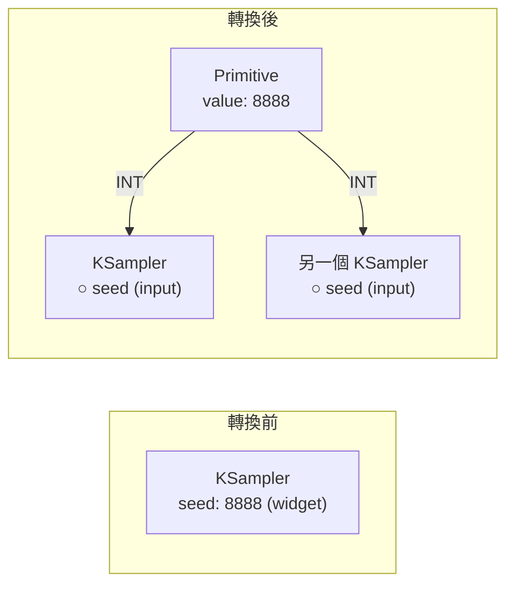

# comfy-1-3 節點的解剖：輸入孔、輸出孔、widget

> **本章目標**：搞懂節點上那些欄位與圓點各是什麼，特別是 **widget 與 input 的關係**——這是很多人用了半年還沒搞清楚的事。

## 你會學到

- 節點的四個組成部分
- widget（可直接填的欄位）與 input（要拉線的孔）的差別
- **怎麼把 widget 轉成 input**，以及為什麼你會需要這樣做
- 特殊 widget：seed 的 control_after_generate、以及多行文字框

---

## 概念說明

### 節點的四個部分

拿最典型的 `KSampler` 來解剖：

```
┌─────────────────────────────┐
│      KSampler        ← ①標題列
├─────────────────────────────┤
│ ○ model            LATENT ● │ ← ②輸入孔（左）  ③輸出孔（右）
│ ○ positive                  │
│ ○ negative                  │
│ ○ latent_image              │
├─────────────────────────────┤
│ seed         [  8888  ]     │ ← ④widget（可直接填的欄位）
│ steps        [   30   ]     │
│ cfg          [  3.5   ]     │
│ sampler_name [dpmpp_2m]     │
│ scheduler    [ karras ]     │
│ denoise      [  1.00  ]     │
└─────────────────────────────┘
```

| 部分 | 說明 |
|------|------|
| **① 標題列** | 節點名稱。可以雙擊改成自訂名稱（整理大圖時很有用） |
| **② 輸入孔**（左側圓點） | 資料從別的節點流進來的地方。**必須連線**，沒接就報錯 |
| **③ 輸出孔**（右側圓點） | 資料流出去的地方。可以接到多個地方（一對多是合法的） |
| **④ widget** | 直接在節點上填的參數 |

### widget 與 input 的關係 ⚠️

**這是本章的重點。**

回想 `comfy-0-2` 的程式碼對照——節點就是函式呼叫：

```python
ksampler(
    model=model,           # ← 這是 input（值從別的節點來）
    positive=positive,     # ← input
    negative=negative,     # ← input
    latent_image=latent,   # ← input
    seed=8888,             # ← 這是 widget（值直接寫死）
    steps=30,              # ← widget
    cfg=3.5,               # ← widget
)
```

**兩者本質是同一件事：函式的參數。** 差別只在於「值從哪裡來」：

```
widget → 值是你手動填的常數
input  → 值由另一個節點在執行時算出來
```

### 為什麼要能互相轉換

有時候你會希望某個 widget 的值**不要寫死**，而是由別的地方決定。典型情境：

| 情境 | 為什麼需要 |
|------|-----------|
| **多個 KSampler 要用同一個 seed** | 手動改三個地方會忘記其中一個 |
| **畫布寬高要跟載入的圖一致** | 用 `Get Image Size` 算出來，自動帶入 |
| **prompt 由多段組合而成** | 共用的品質詞寫一次，接到多個地方 |
| **腳本要覆寫參數** | 集中在一個節點比較好找（見 Part 7） |

於是 ComfyUI 允許：**把 widget 轉成 input**。

**做法**：在 widget 上右鍵 → `Convert widget to input`（新版介面直接把線拉到 widget 上就會自動轉換）。

轉換之後，那個欄位會消失、變成一個輸入孔，你就可以從別的節點拉線進來。



這張圖在表達轉換的價值：**一個值餵給多個地方**。改一次，全部跟著改。

> 反過來也可以：`Convert input to widget`，把孔變回欄位。

### Primitive 節點

轉成 input 之後要有東西餵它，最基本的就是 **Primitive 節點**（分類在 `utils`）。

它很特別：**它沒有固定型別**。你把它接到哪個 input，它就自動變成那個型別。

```
接到 seed（INT）      → 變成整數輸入框
接到 cfg（FLOAT）     → 變成浮點數輸入框
接到 text（STRING）   → 變成文字框
接到 sampler_name     → 變成那個下拉選單
```

> 這個「跟著接的地方變型別」的設計很聰明，但也常讓新手困惑——**Primitive 必須先接上去，才知道自己是什麼**。沒接的時候它看起來是空的。

### 特殊 widget 一：seed 的 control_after_generate

`seed` 欄位下面跟著一個下拉選單，值有：

| 值 | 行為 |
|----|------|
| `fixed` | 每次都用同一個 seed（**做對照實驗時必選**） |
| `randomize` | 每次執行後換一個隨機 seed（探索用） |
| `increment` | 每次 +1 |
| `decrement` | 每次 -1 |

⚠️ **這個設定最常害人的地方**：你產出一張很滿意的圖，想微調 prompt 再產一次——結果 seed 已經自動換掉了，出來完全不同的構圖，原本那張再也回不去。

**紀律**：

```
探索階段 → randomize（大量嘗試）
一旦看到滿意的 → 立刻改成 fixed，再開始微調其他參數
```

> 找回舊 seed 的辦法：看歷史紀錄，或把產出的 PNG 拖回畫布（metadata 裡有）。但養成習慣比事後補救好。

### 特殊 widget 二：多行文字框

`CLIP Text Encode` 的文字框可以拉大。實務上：

- 支援換行，但**換行不影響語意**（跟空格一樣）
- ⚠️ **不支援註解語法**——你寫 `# 這段先關掉` 不會被忽略，會被當成提示詞的一部分送進去

想暫時關掉某段 prompt，正確做法是把它剪下貼到一個 Note 節點裡（見 `comfy-1-13`）。

### 節點的視覺狀態

執行過程中，節點的外觀會給你資訊：

| 狀態 | 意思 |
|------|------|
| 邊框發亮 / 有進度條 | 正在執行這個節點 |
| 半透明 / 灰掉 | 被 Bypass 或 Mute（見 `comfy-1-13`） |
| 紅色邊框 | 出錯了，或這個節點類型不存在（missing node） |
| 沒有任何變化就跳過 | **快取命中**——這個節點的輸入沒變，直接用上次的結果 |

最後一項是下一章的主題。

---

## 小練習

1. **做一次轉換**：把 `KSampler` 的 `seed` 轉成 input，接一個 Primitive 上去，然後複製一個 KSampler 也接同一個 Primitive。改 Primitive 的值，確認兩邊都跟著變。

2. **踩一次 seed 的坑**（故意的）：把 seed 設成 randomize，產一張圖，記住它的樣子。改一個 prompt 的字再產一次——體會「回不去了」的感覺。然後從歷史紀錄把它找回來。

3. **觀察快取**：連按兩次 Queue Prompt（不改任何東西），看第二次哪些節點被跳過了、花了多少時間。想想為什麼。（答案在下一章。）

---

## 課外讀物

> widget / input 的本質是「參數怎麼傳」——函式參數設計的原則 → [課外讀物 E-6-3：函式設計](../../../課外讀物/E-6-best-practices/E-6-3-function-design.md)
