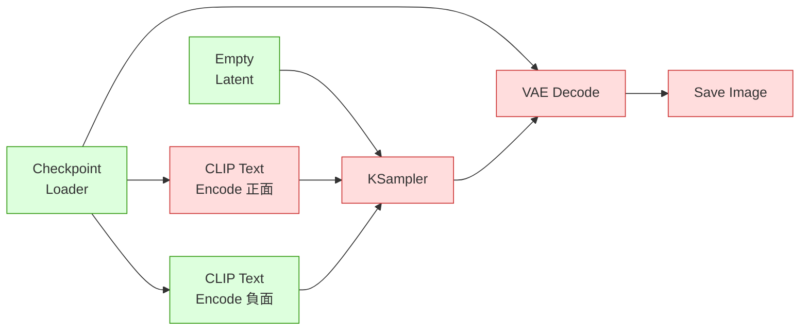

# comfy-1-4 按下 Queue 之後發生什麼：執行順序與快取

> **本章目標**：理解 ComfyUI 的執行模型——它怎麼決定誰先跑、以及**為什麼有時候只重跑一半**。這會讓你的迭代速度差好幾倍。

## 你會學到

- ComfyUI 怎麼決定節點的執行順序（拓撲排序）
- 🔬 **快取機制**：為什麼改 prompt 只重跑一半，改 seed 卻整條重跑
- 怎麼利用快取讓迭代變快
- 一個常見困惑：明明改了東西，結果卻沒變

---

## 概念說明

### 執行順序：從輸出往回推

按下 Queue 之後，ComfyUI 做的第一件事**不是**從左邊開始跑，而是：

```
1. 找出所有「輸出節點」（Save Image、Preview Image 這類）
2. 從它們往回追，看要算出它們需要哪些節點
3. 把需要的節點排出一個執行順序
4. 依序執行
```

這個「排順序」的演算法就是 **拓撲排序（topological sort）**——把一張有依賴關係的圖，排成一個「每個節點跑的時候，它依賴的東西都已經算好了」的線性順序。

> 演算法本身的完整說明 → [dsa-5-5：拓撲排序](../../dsa/part-5/dsa-5-5-topological-sort.md)

**一個重要的推論**：

> ⚠️ **沒有連到任何輸出節點的節點，根本不會執行。**

這解釋了一個常見困惑：你在畫布角落放了一堆節點在做實驗，但按 Queue 完全沒反應——因為它們沒接到輸出，ComfyUI 判斷「不需要」。

### 快取：為什麼只重跑一半

ComfyUI 會記住每個節點上次的執行結果。再次執行時：

```
對每個節點問：「你的輸入跟上次一樣嗎？」
    一樣 → 跳過，直接用上次的結果（快取命中）
    不一樣 → 重新執行，而且下游全部跟著重跑
```

這跟 Excel 的重算邏輯、或前端的 build cache 是同一個道理。

用一張圖看效果：



這張圖表達的情境：**你只改了正面提示詞**。

- 🟢 綠色 = 快取命中，跳過（模型不用重載、負面詞不用重編碼）
- 🔴 紅色 = 重新執行（改動的節點，以及它的所有下游）

**最大的一筆節省是 Checkpoint Loader**——載入 6.5GB 模型要好幾秒，快取命中就是零秒。這就是為什麼第一張圖慢、之後就快了。

### 「改動」的判定標準

一個節點的輸入包含 widget 值與上游傳來的資料。**任何一項變了就算變**：

| 你做的事 | 影響範圍 |
|---------|---------|
| 改正面 prompt | 正面編碼節點 → KSampler → 下游全部 |
| 改 seed | **KSampler → 下游全部**（模型與兩個編碼節點都保留） |
| 改 steps / cfg / sampler | 同上 |
| 換底模 | ⚠️ **幾乎全部重跑**（Checkpoint 是最上游） |
| 改 LoRA 權重 | LoRA Loader → 下游全部（Checkpoint 保留） |
| 改 SaveImage 的檔名前綴 | **只有 SaveImage 重跑**（不用重算圖！） |
| 移動節點位置 | 什麼都不會重跑（位置不是輸入） |

### 實用推論：把貴的東西放上游

理解快取之後，有一個很實用的設計原則：

> **迭代時會頻繁改動的東西，要盡量放在流程下游。**

例子：假設你要對同一張圖試十種放大方式。

```
❌ 笨做法：每次都從頭產圖 → 放大
   （每次都要跑完整的 KSampler，10 次 = 10 倍時間）

✅ 聰明做法：先產一次圖存下來 → 用 Load Image 讀進來 → 接不同的放大
   （產圖只跑一次，之後只重跑放大那一段）
```

同樣的邏輯用在你的產線上：**測 LoRA 權重時，把 seed 固定住**——這樣每次只有 LoRA Loader 以下重跑，而且你比較的是同一個構圖的差異（見 `comfy-4-9`）。

### 一個常見困惑：改了東西，結果沒變

三種可能，依常見程度排序：

**1. 你改的節點沒有連到輸出**

最常見。改了一個被 Bypass 掉、或根本沒接線的節點。

**2. 隨機性本來就存在**

改了 seed 以外的東西，但你以為結果應該一樣。實際上多數參數都會改變結果。

**3. ⚠️ 真的快取沒失效（罕見但存在）**

某些 custom node 沒有正確實作「我的輸出變了」的判定，導致 ComfyUI 以為它沒變。症狀是：你改了它的參數，但下游完全沒重跑。

> **這種情況的處理**：改一下上游任何一個值（例如 seed）強制整條重跑。或重啟 ComfyUI 清空快取。如果某個 custom node 常常這樣，那是它的 bug。

### 佇列與批次的關係

按 Queue 三次 = 排三個任務。它們**共用快取**，所以：

```
第一次：載模型（慢）+ 產圖
第二次：模型快取命中，只產圖（快）
第三次：同上（快）
```

⚠️ 但如果你的 seed 設成 `randomize`，每次 KSampler 的輸入都不同，所以 KSampler 以下每次都會重跑——**這是預期行為，不是快取失效**。

### 執行中斷與清除

| 動作 | 效果 |
|------|------|
| **Interrupt / Cancel** | 中斷目前這個任務，佇列裡剩下的繼續 |
| **Clear Queue** | 清掉還沒開始的任務 |
| **Free model / unload** | 把模型從 VRAM 卸載（要換大模型、或要騰出 VRAM 給訓練時用） |

> 最後那個對你有用：訓練 LoRA 前要釋放 VRAM，比整個關掉 ComfyUI 溫和一些。但你的專案紀錄顯示**最保險還是整個關掉**（因為 Python 行程本身也佔記憶體）。

---

## 小練習

1. **觀察快取**：跑一次完整流程，然後分別做這三件事各跑一次，記錄花費時間——(a) 只改 SaveImage 的檔名前綴、(b) 只改 seed、(c) 換一個底模。時間差會讓快取機制變得很具體。

2. **設計一個省時的實驗**：你要比較五種負面提示詞的效果。怎麼安排才能讓模型只載入一次、且每次只重跑必要的部分？

3. **找出孤兒節點**：打開一張你手上比較複雜的 workflow，找出「沒有連到任何輸出節點」的部分。那些是死碼——它們在畫布上占空間但從不執行。

---

## 課外讀物

> ComfyUI 決定執行順序用的演算法 → [dsa-5-5：拓撲排序](../../dsa/part-5/dsa-5-5-topological-sort.md)
> 「輸入沒變就用上次結果」是快取的核心思想，前端到資料庫都在用 → [cache 課程大綱](../../cache/課程大綱.md)
> 快取最難的問題永遠是「什麼時候該失效」 → [課外讀物 E-11-8：快取的層層堆疊](../../../課外讀物/E-11-performance/E-11-8-cache-layers.md)
