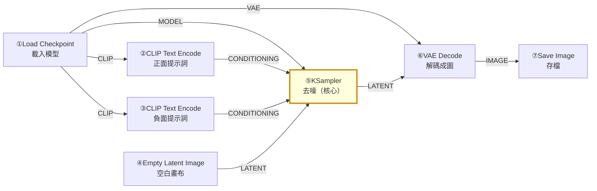
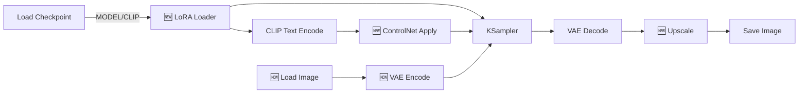

# comfy-1-5 預設 workflow 逐節點導覽：七個節點的完整拆解

> **本章目標**：把 ComfyUI 開啟時那張預設流程，一個節點一個節點講完。**這七個節點是所有 workflow 的骨架**——之後看到的每一張複雜圖，都是在它們周圍加東西。

## 你會學到

- 七個核心節點各自吃什麼、吐什麼、做什麼
- 每個節點上的參數意義（**先給結論，原理在 Part 2**）
- 為什麼是這個順序、能不能改
- 一個關鍵觀察：哪三個節點是「必須」，哪些是「方便」

---

## 概念說明

### 全貌



先看形狀：**所有東西都往 KSampler 匯集，然後從它流出去**。這是理解任何 workflow 的第一個著力點。

翻成程式碼就是 `comfy-0-2` 那段：四個東西準備好 → 呼叫 ksampler → 解碼 → 存檔。

---

### ① Load Checkpoint（載入底模）

```
輸入：無（它是起點）
輸出：MODEL / CLIP / VAE
```

**做什麼**：從 `models/checkpoints/` 讀取一個模型檔，並把裡面的三個元件拆出來。

一個 checkpoint 檔案裡面裝了三樣東西（`comfy-3-5` 會細講）：

| 輸出 | 是什麼 | 接去哪 |
|------|--------|--------|
| `MODEL` | 去噪的大腦（UNet） | KSampler |
| `CLIP` | 文字編碼器 | 兩個 CLIP Text Encode |
| `VAE` | 編解碼器 | VAE Decode |

**參數**：只有一個下拉選單 `ckpt_name`，選模型檔。

> ⚠️ 選單是空的 → 回去看 `comfy-0-5`。
> 有些模型的 VAE 是壞的或沒附，這時要另外用 `VAELoader` 載入外掛 VAE，不接這裡的 VAE 輸出。症狀是**產出的圖顏色詭異、灰灰的或整片糊**。

---

### ②③ CLIP Text Encode（提示詞編碼）

```
輸入：CLIP
輸出：CONDITIONING
```

**做什麼**：把你打的文字，用 CLIP 編碼成模型看得懂的向量。

**兩個一模一樣的節點**，差別只在於接到 KSampler 的哪個孔：

- 接到 `positive` → 這是你**想要**的
- 接到 `negative` → 這是你**不想要**的

> ⚠️ **節點本身沒有「正面/負面」的屬性**。它們完全相同，是「接到哪個孔」決定了角色。所以**接反了不會報錯，只會產出很怪的圖**——這是新手最常見的靈異事件之一。
>
> 實務建議：把節點標題改名成「正面」「負面」（`comfy-1-3` 講過標題可以改），一眼看得出來。

**參數**：一個多行文字框。

Illustrious 系模型（你在用的）吃 **Danbooru tag** 而不是句子：

```
✅ masterpiece, 1girl, solo, long hair, night park, from side
❌ A beautiful girl with long hair standing in a park at night
```

為什麼？因為那個模型是用 tag 標註的圖訓練的。詳見 `comfy-3-3`。

---

### ④ Empty Latent Image（空白畫布）

```
輸入：無
輸出：LATENT
```

**做什麼**：產生一張「空白的 latent」，作為去噪的起點。

> ⚠️ 名字叫 Empty（空的），但它不是白色畫布——它是**全零的 latent**，KSampler 會在上面加入隨機雜訊當起點。真正決定初始長相的是 seed。

**參數**：

| 參數 | 意義 | 注意 |
|------|------|------|
| `width` / `height` | 畫布尺寸（像素） | **必須是 8 的倍數**，實務上建議 64 的倍數 |
| `batch_size` | 一次產幾張 | 吃 VRAM，見 `comfy-0-7` |

**尺寸不能亂設**。SDXL 系模型是用特定尺寸訓練的，偏離太多會構圖崩壞（長出多餘的頭、身體被切斷）。常用的合法組合：

```
1024×1024（正方）   1152×896（橫）    896×1152（直）
1216×832（橫）      832×1216（直）    1344×768（寬）
```

> ⚠️ **你的專案有一個關鍵發現**：832×1216 與 1024×1536 產出的像素顆粒粗細不同——因為風格 LoRA 的色塊絕對大小固定是 8px，畫布愈小、相對顆粒愈粗。**畫布尺寸不只是解析度，它是畫風的一部分**（見 `comfy-2-3`）。

---

### ⑤ KSampler（核心）

```
輸入：MODEL / positive(CONDITIONING) / negative(CONDITIONING) / latent_image(LATENT)
輸出：LATENT
```

**做什麼**：**這是真正產圖的地方。** 從雜訊開始，依據正負提示詞的指引，一步一步去噪，最後得到一個「有內容的 latent」。

前面所有節點都只是在準備它的四個輸入；後面兩個節點只是把結果變成檔案。

**參數**（先給實務結論，原理在 Part 2）：

| 參數 | 一句話說明 | 常用值 |
|------|-----------|--------|
| `seed` | 決定初始雜訊。**同 seed 同參數 = 同一張圖** | 探索時 randomize，滿意後 fixed |
| `control_after_generate` | 執行後怎麼改 seed | 見 `comfy-1-3` |
| `steps` | 去噪幾步。太少沒成形，太多浪費時間 | 20~35 |
| `cfg` | **多聽提示詞的話**。太低放飛，太高燒焦 | 一般 5~8；**你的像素 LoRA 用 3.5** |
| `sampler_name` | 去噪演算法 | `dpmpp_2m`（通用好選擇） |
| `scheduler` | 噪聲遞減的排程 | `karras` |
| `denoise` | **去噪的程度**（1.0 = 完全重畫） | txt2img 固定 1.0 |

> ⚠️ **`denoise` 是最重要也最常被忽略的參數**。它在 txt2img 永遠是 1.0，但在 img2img 就是**核心旋鈕**——0.3 只微調、0.75 大改。這個參數是 Part 5 的主角之一。

---

### ⑥ VAE Decode（解碼）

```
輸入：samples(LATENT) / vae(VAE)
輸出：IMAGE
```

**做什麼**：把 KSampler 產出的 latent，解碼成你看得懂的 RGB 圖片。

**沒有任何參數**——它就是個轉換器。

> ⚠️ 這一步是**VRAM 的尖峰時刻**（見 `comfy-0-7`）。「進度條跑完了但圖沒出來就 OOM」通常死在這裡，解法是換成 `VAEDecodeTiled`。

---

### ⑦ Save Image（存檔）

```
輸入：IMAGE
輸出：無（它是終點）
```

**做什麼**：把圖存到 `output/`，**並且把整張 workflow 寫進 PNG 的 metadata**。

**參數**：`filename_prefix`——檔名前綴，可以用斜線建子資料夾：

```
填 crashgame/portrait
→ 存到 output/crashgame/portrait_00001_.png
```

> **替代節點**：`PreviewImage` 只顯示不存檔（試驗階段用，避免產一堆垃圾檔案）。兩者可以並存。

---

### 哪些是必須，哪些是方便

看完七個節點，做個歸納：

| 節點 | 地位 |
|------|------|
| Load Checkpoint | **必須**——沒有模型什麼都做不了 |
| CLIP Text Encode ×2 | **必須**——KSampler 的 positive/negative 是必接的孔（但內容可以留空） |
| Empty Latent Image | **可替換**——img2img 時換成 `Load Image` + `VAE Encode` |
| **KSampler** | **絕對核心** |
| VAE Decode | **必須**——不解碼你看不到圖 |
| Save Image | 可換成 PreviewImage |

**所以真正的骨架是**：`模型 → 條件 → 起點 latent → KSampler → 解碼`。

> **這個歸納是你之後拆解複雜 workflow 的基準線**。看到一張三十個節點的圖，先找出這五樣，剩下的都是「加工站」或「便利節點」。

### 常見的第一批擴充

實務上，這七個節點很快會長出這些東西：



這張圖在表達：**擴充都是「插在中間」的加工站**。骨架沒變，只是在 MODEL、CONDITIONING、LATENT、IMAGE 這幾條線上各插了東西。

---

## 小練習

1. **蓋住答案自我測驗**：不看本章，寫出七個節點的名稱與順序，以及每個節點吃什麼型別、吐什麼型別。

2. **故意接反**：把正面與負面提示詞的線互換，產一張圖看看會發生什麼。**這個經驗會讓你以後一眼認出「圖怪怪的」是不是接反了。**

3. **改成 img2img**：把 `Empty Latent Image` 刪掉，換成 `Load Image` + `VAE Encode`，接到 KSampler。然後把 `denoise` 從 1.0 慢慢調到 0.3，觀察變化。（這就是 Part 5 的預習。）

---

## 課外讀物

> 這七個節點的參數為什麼是那些值——完整原理 → 見本書 Part 2（擴散模型原理）
> 「一個函式只做一件事」在節點設計上的體現：每個節點職責單一，所以可以自由組合 → [課外讀物 E-7-2：S — Single Responsibility Principle](../../../課外讀物/E-7-solid/E-7-2-srp.md)
