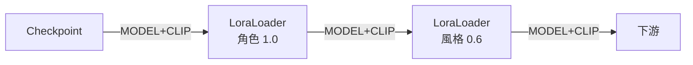
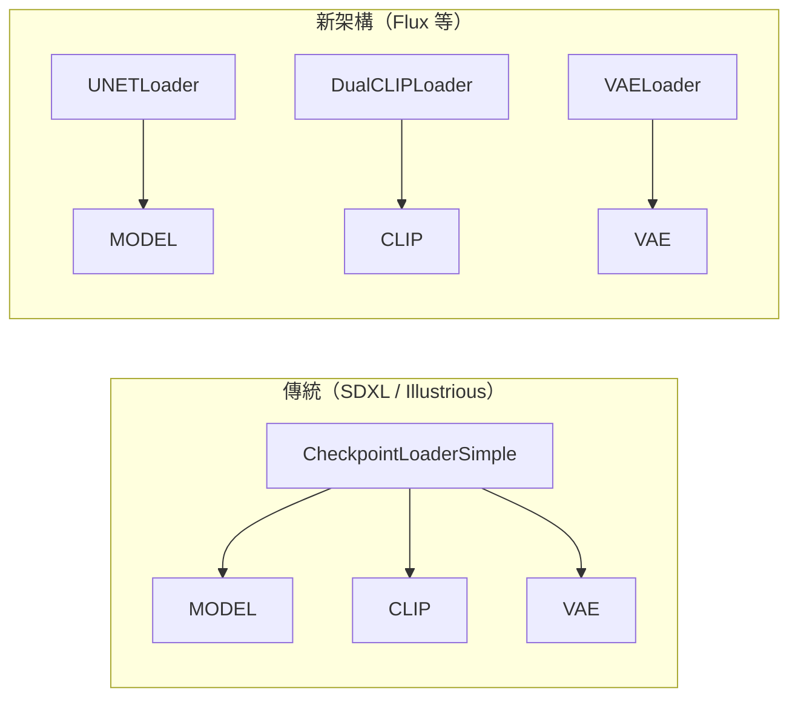

# comfy-1-6 📖 節點地圖（一）：載入類

> **本章目標**：認識所有「把檔案讀進來」的節點。**這是參考章節**——不用背，需要時翻回來查。

## 你會學到

- 每種 Loader 對應 `models/` 底下哪個資料夾
- 載入類節點的共同模式：**沒有輸入、只有輸出**
- 什麼時候需要「拆開載入」（`UNETLoader` + `CLIPLoader` + `VAELoader`）
- LoRA Loader 的特殊之處：它是**加工站**，不是純載入器

---

## 概念說明

### 共同模式

載入類節點幾乎都長一樣：

```
輸入：無（它們是流程的起點）
參數：一個下拉選單（選檔案）
輸出：一個或多個模型元件
```

而且**下拉選單的內容 = 對應資料夾裡的檔案**。所以看到選單是空的，就知道去哪個資料夾放檔案。

> 唯一的例外是 `LoraLoader` 與 `ControlNetApply` 這類——它們吃東西也吐東西，是加工站。下面會標出來。

---

## 節點速查

### `CheckpointLoaderSimple`（載入底模）

| | |
|---|---|
| **中文常稱** | Load Checkpoint |
| **讀哪裡** | `models/checkpoints/` |
| **輸入** | 無 |
| **輸出** | `MODEL` / `CLIP` / `VAE` |
| **什麼時候用** | **幾乎每張 workflow 的第一個節點** |

⚠️ 有些模型內附的 VAE 有問題（產出灰糊或顏色詭異），這時不要用它吐出的 `VAE`，改用 `VAELoader` 外掛一個。

---

### `LoraLoader`（載入 LoRA）⚠️ 這是加工站

| | |
|---|---|
| **讀哪裡** | `models/loras/` |
| **輸入** | `MODEL` / `CLIP` |
| **輸出** | `MODEL` / `CLIP`（**改造過的**） |
| **參數** | `lora_name`、`strength_model`、`strength_clip` |

**這是最重要的一個特例**。它不只是載入，而是**把 LoRA 的修改套用到傳進來的模型上，再傳出去**。

所以掛多支 LoRA 就是串接：



⚠️ **順序原則上不影響結果**（數學上是相加），但**強度會累積**——這就是你專案裡「skormino 拉到 1.0 會蓋掉角色 LoRA」的來源（見 `comfy-4-6`）。

**兩個 strength 的差別**：

| 參數 | 控制什麼 |
|------|---------|
| `strength_model` | 影響**畫法**（構圖、筆觸、造型） |
| `strength_clip` | 影響**詞的意義**（觸發詞的作用強度） |

實務上多數情況兩者設一樣。要微調時，`strength_clip` 調低可以「保留畫風但減弱觸發詞的綁定」。

> **相關節點**：`LoraLoaderModelOnly` 只吃 MODEL 不吃 CLIP，用在不需要改變詞義的場合（也是訓練 LoRA 時 UNet only 模式的對應）。

---

### `VAELoader`（外掛 VAE）

| | |
|---|---|
| **讀哪裡** | `models/vae/` |
| **輸出** | `VAE` |
| **什麼時候用** | 底模的 VAE 壞掉、或想換一個解碼風格 |

⚠️ **SDXL 與 SD1.5 的 VAE 不通用**，接錯會產出雜訊或色塊。

---

### `ControlNetLoader` / `DiffControlNetLoader`

| | |
|---|---|
| **讀哪裡** | `models/controlnet/` |
| **輸出** | `CONTROL_NET` |
| **接去哪** | `ControlNetApplyAdvanced`（那才是真正起作用的節點） |

⚠️ **載入不等於生效**。很多人只放了 Loader 就以為在控制了——`CONTROL_NET` 要接到 Apply 節點、Apply 節點要接進 CONDITIONING 鏈路，才真的有作用。詳見 Part 5。

---

### `CLIPVisionLoader`

| | |
|---|---|
| **讀哪裡** | `models/clip_vision/` |
| **輸出** | `CLIP_VISION` |
| **什麼時候用** | IPAdapter（用圖片當 prompt）、以及某些 img2img 變體 |

注意跟 `CLIP` 的差別：`CLIP` 編碼**文字**，`CLIP_VISION` 編碼**圖片**。

---

### `UpscaleModelLoader`

| | |
|---|---|
| **讀哪裡** | `models/upscale_models/` |
| **輸出** | `UPSCALE_MODEL` |
| **接去哪** | `ImageUpscaleWithModel` |

⚠️ 這類模型（ESRGAN 系）是在 **IMAGE 上**放大，不是 latent。跟 `LatentUpscale` 是完全不同的做法（見 `comfy-1-8`）。

---

### 拆開載入：`UNETLoader` / `CLIPLoader` / `DualCLIPLoader`

| | |
|---|---|
| **讀哪裡** | `models/unet/`（或 `diffusion_models/`）、`models/clip/` |
| **什麼時候用** | **Flux、SD3.5 這類新架構** |

為什麼要拆開？因為新一代模型不再把三件套打包成一個 checkpoint，而是各自獨立發布——好處是可以混搭（例如換一個文字編碼器、或用量化版的 UNet 省 VRAM）。



這張圖在表達：**同樣的三個東西，只是打包方式不同**。看到一張 workflow 開頭有三個 Loader 而不是一個，就知道它跑的是新架構模型。

> `DualCLIPLoader`（雙文字編碼器）是 Flux 的特色——它同時用兩個文字模型理解你的 prompt，這是它 prompt 服從度高的原因之一。

---

### `LoadImage` / `LoadImageMask`

嚴格說不是模型載入，但也是「讀檔案」：

| | |
|---|---|
| **讀哪裡** | `input/` 資料夾 |
| **輸出** | `IMAGE` / `MASK` |
| **什麼時候用** | img2img、ControlNet 參考圖、inpaint |

⚠️ **它讀的是伺服器上的 `input/` 資料夾**，不是你本機的檔案。用介面上傳會自動放進去；用腳本則要透過 `/upload` API（見 `comfy-7-2`）。

---

## 對照總表

| 節點 | 資料夾 | 吐出 | 是加工站？ |
|------|--------|------|:---:|
| `CheckpointLoaderSimple` | `checkpoints/` | MODEL, CLIP, VAE | |
| `LoraLoader` | `loras/` | MODEL, CLIP | ✅ |
| `VAELoader` | `vae/` | VAE | |
| `ControlNetLoader` | `controlnet/` | CONTROL_NET | |
| `CLIPVisionLoader` | `clip_vision/` | CLIP_VISION | |
| `UpscaleModelLoader` | `upscale_models/` | UPSCALE_MODEL | |
| `UNETLoader` | `unet/` | MODEL | |
| `CLIPLoader` / `DualCLIPLoader` | `clip/` | CLIP | |
| `LoadImage` | `input/` | IMAGE, MASK | |

---

## 小練習

1. **對應練習**：打開你的 `models/` 資料夾，對照上表，確認每個資料夾你都知道對應哪個節點。

2. **找出加工站**：本章只有一個節點被標成加工站。想想看為什麼 `LoraLoader` 要設計成這樣，而不是像 ControlNet 那樣「載入」與「套用」分成兩個節點？（提示：LoRA 的作用對象是模型本身，ControlNet 的作用對象是條件。）

---

## 課外讀物

> LoRA 為什麼是「改造模型」而不是「載入模型」——低秩微調的原理 → 見 `comfy-4-1`
> 節點各司其職、可自由組合，正是單一職責的體現 → [課外讀物 E-7-2：S — Single Responsibility Principle](../../../課外讀物/E-7-solid/E-7-2-srp.md)
