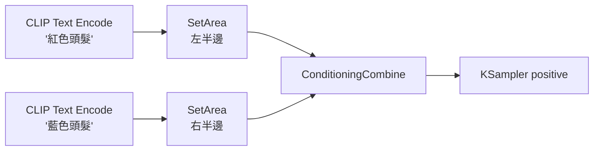
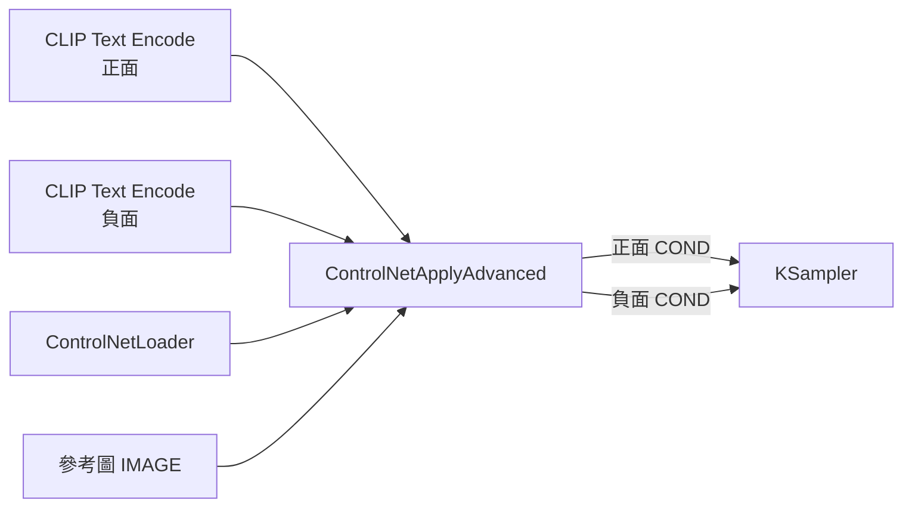
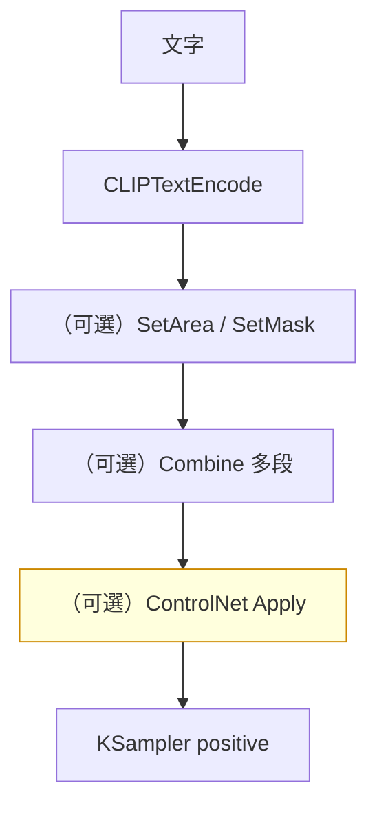

# comfy-1-7 📖 節點地圖（二）：條件類

> **本章目標**：認識所有處理 `CONDITIONING` 的節點。**條件鏈路是 ComfyUI 最容易被忽略、卻最有威力的地方**——ControlNet、區域控制、風格混合全都發生在這裡。

## 你會學到

- `CONDITIONING` 到底是什麼形狀的資料
- 提示詞編碼的三個變體節點
- 條件的組合、串接、區域限定
- ⚠️ `Combine` 與 `Concat` 的差別（很多人一直搞錯）

---

## 概念說明

### 先複習：CONDITIONING 是什麼

`comfy-1-2` 講過：**它是已經被 CLIP 編碼過的提示詞**，不是文字。

技術上它是一組向量（模型看得懂的數字），而且**帶有附加資訊**——例如「這段條件只作用在畫面的哪個區域」「ControlNet 的空間約束」。

> 這個「附加資訊」的設計，正是條件類節點能做那麼多花樣的原因。

---

## 節點速查

### `CLIPTextEncode`（提示詞編碼）

| | |
|---|---|
| **輸入** | `CLIP` |
| **輸出** | `CONDITIONING` |
| **參數** | 多行文字框 |

最基本、也最常用的節點。前一章講過，不重複。

**提示詞裡可用的語法**（Part 2 講原理，這裡先列）：

| 語法 | 效果 |
|------|------|
| `(word:1.2)` | 加權（>1 加強，<1 減弱） |
| `(word)` | 等同 `(word:1.1)` |
| `[word]` | 等同 `(word:0.909)` |
| `embedding:名稱` | 引用 `models/embeddings/` 裡的 embedding |
| `BREAK` | 強制分段（避免不同概念互相污染） |

⚠️ **權重不要亂加到 1.5 以上**——會出現色塊崩壞、肢體變形。實務上 0.7~1.3 是安全區間。

---

### `CLIPTextEncodeSDXL`（SDXL 專用編碼）

SDXL 架構其實有**兩個文字編碼器**，這個節點讓你分別餵不同的文字給它們，並額外指定訓練用的解析度參數。

| | |
|---|---|
| **什麼時候用** | 想精細控制 SDXL 的雙編碼器時 |
| **老實說** | ⚠️ **多數情況不需要**。一般的 `CLIPTextEncode` 會自動把同一段文字餵給兩邊，效果通常一樣好 |

> 看到別人的 workflow 用這個節點，不用緊張——它不是什麼高級技巧，多半可以換回普通版本。

---

### `ConditioningCombine`（合併）vs `ConditioningConcat`（串接）⚠️

**這兩個最容易搞混。**

| | `ConditioningCombine` | `ConditioningConcat` |
|---|---|---|
| **做什麼** | 兩段條件**同時作用**（各自獨立引導） | 把兩段文字的編碼**接成一串** |
| **比喻** | 兩個師傅同時對畫面提意見 | 把兩張工單黏成一張長工單 |
| **典型用途** | 區域控制（各自管一塊）、風格混合 | 突破 77 token 限制、共用前綴 |
| **結果傾向** | 兩邊都會出現，但可能互相干擾 | 比較接近「寫成一段長 prompt」 |

實務上的判斷：

```
你想要「畫面左邊是 A，右邊是 B」
    → Combine（配合 SetArea）

你的 prompt 太長被截斷了
    → Concat

你只是想把品質詞跟內容詞分開管理
    → Concat（或乾脆寫在同一個文字框）
```

---

### `ConditioningSetArea` / `ConditioningSetAreaPercentage`

| | |
|---|---|
| **輸入** | `CONDITIONING` |
| **輸出** | `CONDITIONING`（**加工站**） |
| **參數** | `width` / `height` / `x` / `y` / `strength` |

**做什麼**：告訴模型「這段提示詞只作用在畫面的這個矩形區域」。



這張圖在表達**區域控制的基本形狀**：各自限定區域 → 合併 → 送進 KSampler。

⚠️ **效果沒有想像中精準**。擴散模型不是照著矩形填色的，邊界會糊、內容會溢出。要精確控制構圖，ControlNet 才是正解（見 Part 5）。這個節點適合「大致分區」而不是「精確切割」。

---

### `ConditioningSetMask`

跟 SetArea 類似，但用 `MASK` 指定範圍而不是矩形。比較靈活，適合不規則區域。

---

### `ConditioningZeroOut`

把條件清成「空的」。

**什麼時候用**：某些工作流需要「有這個輸入孔，但實際上不要任何引導」。例如某些 Flux workflow 的負面條件、或做特定的條件實驗。

---

### `ControlNetApplyAdvanced`（ControlNet 的真正作用點）⚠️

| | |
|---|---|
| **輸入** | `positive`(COND) / `negative`(COND) / `control_net` / `image` |
| **輸出** | `positive`(COND) / `negative`(COND) |
| **參數** | `strength` / `start_percent` / `end_percent` |

**這是 Part 5 的主角**，先在這裡登記它的位置：

> **ControlNet 不是獨立的一條線，它是插在 CONDITIONING 鏈路上的加工站。**



看懂這個形狀，你就看懂了所有 ControlNet workflow——**它同時吃正負兩條條件、加工完再吐回去**。多個 ControlNet 就是串接多個 Apply 節點。

> 舊版的 `ControlNetApply`（非 Advanced）只吃正面條件、沒有 start/end percent。**建議一律用 Advanced 版**。

---

### `SetUnionControlNetType`

搭配 union / promax 這類「多合一」ControlNet 模型使用，指定這次要用哪種控制型別（depth / segment / openpose…）。

> 你的專案就用這個做場景構圖：`SetUnionControlNetType` = segment、strength 0.7~0.8、end_percent 0.6（見 `comfy-5-13`）。

---

### `InpaintModelConditioning`

給 inpaint 專用模型使用的條件節點，把遮罩資訊編進條件裡。見 `comfy-5-4`。

---

## 條件鏈路的整體形狀

把上面的東西串起來，一個「有控制」的 workflow，它的條件段長這樣：



這張圖在表達：**條件從文字出發，中間可以經過任意多個加工站，最後才進 KSampler**。你看到的每一個複雜 workflow，條件段都是這個形狀的展開。

---

## 小練習

1. **辨認鏈路**：打開你專案的 `scene-element.json`，找出從 `CLIPTextEncode` 到 `KSampler` 之間經過了哪些加工站。

2. **試 Combine 與 Concat**：用同一組兩段文字，分別接 Combine 與 Concat，同 seed 各產一張，比較差異。（你會發現差異比想像中小——這也是為什麼很多人搞混。）

3. **試區域控制的極限**：用 SetArea 做「左邊紅髮、右邊藍髮」，看看實際出來多精準。體會為什麼 Part 5 說「精確構圖要靠 ControlNet」。

---

## 課外讀物

> 提示詞權重語法背後的原理、以及 77 token 限制 → `comfy-2-4`、`comfy-2-5`
> ControlNet 為什麼作用在條件上而不是模型上 → `comfy-5-6`
