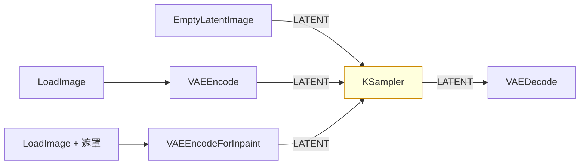
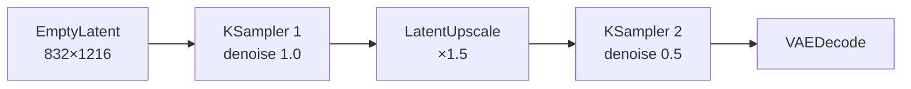

# comfy-1-8 📖 節點地圖（三）：Latent 類

> **本章目標**：認識所有處理 `LATENT` 的節點。**latent 是 ComfyUI 的血液**——搞懂這一類，img2img、inpaint、放大、多階段流程就全通了。

## 你會學到

- 產生 latent 的三種方式，以及它們代表的三種流程
- ⚠️ **在 latent 放大 vs 在 image 放大**：差在哪、什麼時候用哪個
- inpaint 的兩種做法：`VAEEncodeForInpaint` vs `SetLatentNoiseMask`
- latent 的合成與批次操作

---

## 概念說明

### 產生 latent 的三種方式 = 三種流程

一個 workflow 的性質，基本上由「latent 從哪來」決定：

| 起點 | 流程類型 | denoise 設定 |
|------|---------|-------------|
| `EmptyLatentImage` | **txt2img**（從零生成） | 1.0 |
| `VAEEncode`（讀一張圖） | **img2img**（改造既有圖） | 0.3~0.8 |
| `VAEEncodeForInpaint`（圖 + 遮罩） | **inpaint**（局部重繪） | 1.0（通常） |

這張圖在表達一件重要的事：**KSampler 本身不知道你在做 txt2img 還是 img2img**。它只是拿到一個 latent 然後去噪——**是「餵給它什麼 latent」決定了流程的性質**。

> 這個理解很關鍵。很多人以為 img2img 是一個「模式」，其實它只是換了 latent 的來源。

---

## 節點速查

### `EmptyLatentImage`

| | |
|---|---|
| **輸出** | `LATENT` |
| **參數** | `width` / `height` / `batch_size` |

前面講過。補充一點：**它產生的是全零 latent**，不是白色或黑色的圖。真正的隨機性來自 KSampler 的 seed。

> SD3 / Flux 有對應的 `EmptySD3LatentImage`——latent 通道數不同，不能混用。

---

### `VAEEncode`

| | |
|---|---|
| **輸入** | `pixels`(IMAGE) / `vae`(VAE) |
| **輸出** | `LATENT` |

把圖片壓進 latent 空間。**img2img 的必備節點**。

⚠️ **輸入圖的尺寸要合理**：它會照原尺寸編碼，如果你丟一張 3000×2000 的照片進去，等於在做 3000×2000 的生成——VRAM 會爆。先用 `ImageScale` 縮到合理尺寸。

---

### `VAEEncodeForInpaint`

| | |
|---|---|
| **輸入** | `pixels` / `vae` / `mask` |
| **參數** | `grow_mask_by` |

專為 inpaint 設計：它會把遮罩區域的內容**清掉**再編碼，等於告訴模型「這塊重畫」。

`grow_mask_by` 把遮罩往外擴幾像素，讓接縫比較自然（預設 6 通常夠用）。

---

### `SetLatentNoiseMask` ⚠️ 與上者的關鍵差別

| | |
|---|---|
| **輸入** | `samples`(LATENT) / `mask`(MASK) |
| **輸出** | `LATENT` |

也是做 inpaint，但機制不同：

| | `VAEEncodeForInpaint` | `SetLatentNoiseMask` |
|---|---|---|
| **遮罩區的原內容** | 清掉（完全重畫） | **保留**（可部分保留） |
| **搭配 denoise** | 通常 1.0 | **可以調低做「輕改」** |
| **遮罩外** | 理論上不變 | 理論上不變 |
| **適合** | 換掉整個物件 | 微調既有內容（改表情、改細節） |

> **實務建議**：想「保留原本的姿勢但改個細節」用 `SetLatentNoiseMask` + 低 denoise；想「這塊完全換掉」用 `VAEEncodeForInpaint`。
>
> ⚠️ 兩者都有一個共同問題：**遮罩外的區域經過 VAE 編解碼會有極輕微的變化**（不是逐位元相同）。要求絕對不變的話，最後要在 IMAGE 層用遮罩合成回去。

---

### `LatentUpscale` / `LatentUpscaleBy` ⚠️ 重點章節

| | |
|---|---|
| **輸入** | `samples`(LATENT) |
| **輸出** | `LATENT` |
| **參數** | 目標尺寸或倍率、`upscale_method`、`crop` |

**在 latent 空間放大**。這是「高解析度修復（hires fix）」的核心。

**典型用法**：

這張圖在表達 **兩階段生成**：先在低解析度產出構圖（快、構圖穩），放大後用低 denoise 再跑一次補細節。

⚠️ **為什麼不能直接產高解析度**？因為模型是在特定尺寸訓練的，直接產 2048×2048 會出現「重複的頭」「兩個身體」這類構圖崩壞。兩階段法是繞過這個限制的標準做法。

---

### latent 放大 vs image 放大 ⚠️

這是本章最重要的區分：

| | **LatentUpscale** | **ImageUpscaleWithModel**（ESRGAN 等） |
|---|---|---|
| **在哪放大** | latent 空間 | 像素空間 |
| **要不要再跑 KSampler** | **要**（否則會糊） | 不用 |
| **會不會改變內容** | ⚠️ **會**（第二次採樣會重新想像細節） | 不會（只是放大既有像素） |
| **速度** | 慢（多跑一次採樣） | 快 |
| **適合** | 補細節、提升質感 | 單純要大尺寸、**不希望內容改變** |

> ⚠️ **對你的像素風產線，這個區分特別關鍵**：
> - LatentUpscale + 二次採樣會**重新想像細節** → 像素格線會被打亂
> - 要放大像素圖，正確做法是 **NEAREST 整數倍放大**（`ImageScaleBy` 選 nearest-exact），完全不經過模型
>
> 這跟你專案 LoRA v3 的教訓是同一件事：**任何非整數倍的重新取樣都會殺死格線**（見 `comfy-4-17`）。

---

### `LatentComposite` / `LatentCompositeMasked`

把兩個 latent 疊在一起（可指定位置與遮罩）。

**什麼時候用**：把不同來源的內容拼在同一張圖裡，然後用低 denoise 跑一次讓接縫融合。

⚠️ 進階技巧，新手很少用到。看到別人 workflow 裡有它，通常是在做「多角色分別生成再合成」。

---

### `LatentBlend`

把兩個 latent 依比例混合。用於風格插值等實驗性玩法。

---

### `LatentFlip` / `LatentRotate` / `LatentCrop`

在 latent 空間做翻轉、旋轉、裁切。

> ⚠️ 這些通常**不如在 IMAGE 層做**——latent 的空間對應不是完美的，操作後可能有偽影。除非你有特定理由，否則用 `ImageFlip` 之類的在像素層做。

---

### `LatentFromBatch` / `RepeatLatentBatch`

處理 batch（一次多張）的工具：

| 節點 | 做什麼 |
|------|--------|
| `RepeatLatentBatch` | 把一個 latent 複製成 N 份（做同起點多變化） |
| `LatentFromBatch` | 從一批 latent 裡取出第 N 個（挑出想要的那張繼續處理） |

**實用情境**：batch 產了 4 張，只有第 3 張好——用 `LatentFromBatch` 取出它，接續做放大，不用重產。

---

## 對照總表

| 節點 | 吃 | 吐 | 一句話 |
|------|---|---|--------|
| `EmptyLatentImage` | — | LATENT | txt2img 的起點 |
| `VAEEncode` | IMAGE | LATENT | img2img 的起點 |
| `VAEEncodeForInpaint` | IMAGE+MASK | LATENT | inpaint（清空重畫） |
| `SetLatentNoiseMask` | LATENT+MASK | LATENT | inpaint（保留原內容） |
| `VAEDecode` | LATENT | IMAGE | 出圖 |
| `VAEDecodeTiled` | LATENT | IMAGE | 同上，省 VRAM |
| `LatentUpscale` | LATENT | LATENT | 兩階段放大 |
| `LatentComposite` | LATENT×2 | LATENT | 拼接 |
| `LatentFromBatch` | LATENT | LATENT | 從批次取一張 |

---

## 小練習

1. **三種起點都試一次**：同一組 prompt，分別用 EmptyLatent（denoise 1.0）、VAEEncode（denoise 0.5）、VAEEncodeForInpaint 各產一張，體會三種流程的差別。

2. **比較兩種放大**：拿一張你的像素風立繪，分別用 (a) LatentUpscale + 二次採樣、(b) ImageScaleBy nearest-exact 整數倍，放大兩倍。**放大看臉**，比較格線有沒有被破壞。

3. **用 LatentFromBatch 省時間**：產一批 4 張，挑出最好的那張，只對它做放大。

---

## 課外讀物

> latent 空間到底是什麼、為什麼尺寸要 8 的倍數 → `comfy-2-2`
> 為什麼像素風最怕重新取樣 → `comfy-4-17`、`comfy-6-1`
