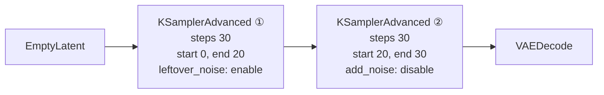
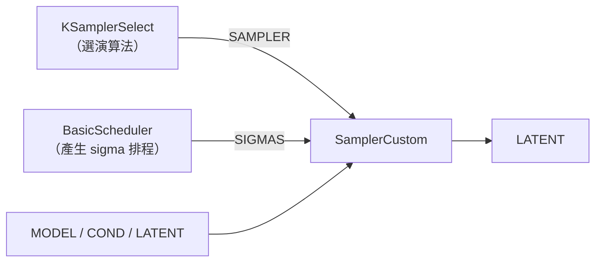

# comfy-1-9 📖 節點地圖（四）：取樣類

> **本章目標**：搞懂 `KSampler`、`KSamplerAdvanced`、`SamplerCustom` 三者的差別，以及什麼時候真的需要進階版本。

## 你會學到

- 三種取樣節點的能力差異
- ⚠️ `KSamplerAdvanced` 的 `start_at_step` / `end_at_step`：多階段流程的關鍵
- `add_noise` 與 `return_with_leftover_noise` 在幹嘛
- 什麼時候你**不需要**進階版（多數時候）

---

## 概念說明

### 三個節點的定位

| 節點 | 定位 | 你會用到嗎 |
|------|------|-----------|
| `KSampler` | 標準版，涵蓋九成需求 | ✅ **日常都用這個** |
| `KSamplerAdvanced` | 可以控制「從第幾步跑到第幾步」 | 做多階段流程時 |
| `SamplerCustom` + 一組零件 | 把採樣拆成可替換的元件 | 進階實驗、特殊模型 |

> **先給結論**：你目前的產線用 `KSampler` 就夠。看到別人用 Advanced 不用緊張，多數情況是在做兩階段生成。

---

## `KSampler`（標準版）

參數在 `comfy-1-5` 講過，這裡補充幾個實務要點。

### `denoise` 的真正意義

這個參數常被誤解成「去噪強度」，更準確的說法是：

> **從第幾步開始跑。**

```
steps = 30, denoise = 1.0  →  跑完整的 30 步（從純雜訊開始）
steps = 30, denoise = 0.5  →  只跑後 15 步（從「半成品」開始）
steps = 30, denoise = 0.3  →  只跑後 9 步（原圖大致保留）
```

這解釋了一個常見困惑：**為什麼 img2img 的 denoise 調低之後，出圖速度也變快了**？因為它真的少跑了幾步。

⚠️ 也解釋了另一件事：**denoise 很低時，steps 設太少會出問題**。denoise 0.2 × steps 10 = 只跑 2 步，根本來不及做任何事。低 denoise 時要把 steps 拉高才有足夠的步數。

---

## `KSamplerAdvanced`（進階版）

多了四個參數：

| 參數 | 意義 |
|------|------|
| `add_noise` | 要不要在開始前加入雜訊（`enable` / `disable`） |
| `start_at_step` | 從第幾步開始 |
| `end_at_step` | 跑到第幾步停 |
| `return_with_leftover_noise` | 結束時要不要保留剩餘雜訊 |

### 為什麼需要這些

它讓你把「一次完整的去噪」**切成好幾段，中間插入其他處理**。

典型用途——**兩階段生成（base + refiner）**：



這張圖在表達：**第一段跑前 20 步、第二段接著跑後 10 步**。

關鍵在兩個開關：

- 第一段 `return_with_leftover_noise = enable` → **把還沒去完的雜訊留著**交給下一段
- 第二段 `add_noise = disable` → **不要再加新雜訊**，接著上一段的狀態繼續

⚠️ **這兩個開關設錯是最常見的 bug**：第二段忘了關 `add_noise`，等於重新加雜訊，前一段白做了（症狀是出圖跟預期完全不同）。

### 兩階段有什麼用

| 情境 | 怎麼切 |
|------|--------|
| **SDXL base + refiner** | 前段用 base 模型、後段換 refiner 模型 |
| **中途換 prompt** | 前段畫構圖、後段換成細節描述 |
| **中途換 LoRA 權重** | 前段不掛風格 LoRA 定構圖，後段掛上去出風格 |
| **中途插入放大** | 見 `comfy-1-8` 的 hires fix |

> 最後兩項對你的像素風產線有潛在價值：**構圖階段與風格階段分離**，可以避免風格 LoRA 影響構圖。這是 Part 6 會探討的方向之一。

---

## `SamplerCustom` 家族（拆解版）

把採樣拆成獨立零件：



這張圖在表達：**`KSampler` 裡面本來就有這些零件，只是被打包起來了**。拆開之後你可以：

- 自訂 sigma 排程（`SplitSigmas` 把排程切兩半做多階段）
- 用特殊的 guider（例如 Flux 需要的 `BasicGuider`）
- 做研究性質的實驗

| 節點 | 做什麼 |
|------|--------|
| `KSamplerSelect` | 只選取樣演算法，吐出 `SAMPLER` |
| `BasicScheduler` | 依 scheduler + steps + denoise 產生 `SIGMAS` |
| `SplitSigmas` | 把 sigma 排程切成兩段（多階段用） |
| `SamplerCustomAdvanced` | 吃上述零件執行採樣 |
| `BasicGuider` / `CFGGuider` | 控制條件引導方式 |

> ⚠️ **什麼時候你會被迫用它**：跑 Flux 系模型時，很多官方 workflow 用的是這組節點（因為 Flux 的引導機制跟 SDXL 不同）。**那時候照抄就好，不用自己組**。

---

## 一個實用的判斷

看到 workflow 裡有進階採樣節點時，先問：

```
它有沒有分成兩段以上？
    有 → 在做多階段（refiner / hires fix / 換 prompt）
    沒有 → 可能只是作者習慣，換成普通 KSampler 通常一樣
```

**不要因為「看起來比較專業」就改用進階版**——多一個參數就多一個出錯的地方。

---

## 相關：預覽與除錯

| 節點 | 用途 |
|------|------|
| `PreviewImage` | 中途看結果不存檔 |
| 採樣預覽（設定裡開） | 看去噪過程的即時預覽——**除錯時很有用**，能看出是哪一步壞掉 |

> 開啟採樣預覽會稍微變慢，但在調參數階段值得。它讓你看到「圖是怎麼從雜訊長出來的」，對理解 Part 2 的原理也很有幫助。

---

## 小練習

1. **驗證 denoise 的意義**：固定 steps = 30，分別用 denoise 1.0 / 0.5 / 0.2 跑 img2img，記錄各花多少時間。確認時間比例接近 30 : 15 : 6。

2. **做一次兩階段**：用兩個 `KSamplerAdvanced` 切成 0~15 步與 15~30 步，確認產出跟單一 KSampler 跑 30 步**幾乎一樣**。然後故意把第二段的 `add_noise` 打開，看看壞成什麼樣——**這個經驗能讓你以後一眼認出這個 bug**。

3. **中途換 prompt**：兩階段流程裡，第一段用構圖描述、第二段用細節描述，看看效果。

---

## 課外讀物

> sampler / scheduler / CFG / steps 的完整原理 → `comfy-2-8` ~ `comfy-2-10`
> 為什麼多數參數對你的像素格線沒有影響 → `comfy-2-13`
