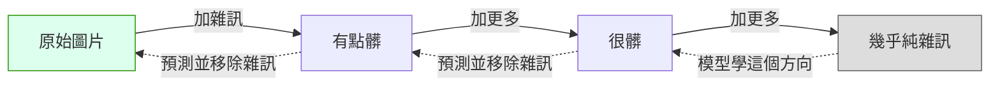
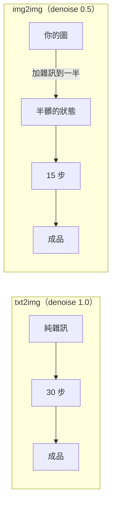

# comfy-2-1 🔬 從雜訊到圖：擴散到底在做什麼

> **本章目標**：搞懂擴散模型的核心機制——**它不是在「畫圖」，是在「預測雜訊」**。這個認知是後面十二章所有參數的基礎。

## 你會學到

- 為什麼「AI 畫圖」這個說法會誤導你
- 訓練時模型學的是什麼（答案出乎意料：學怎麼**認出雜訊**）
- 產圖時的迭代過程，以及為什麼不能一步到位
- 這個機制怎麼解釋 `steps`、`seed`、`denoise` 三個參數

---

## 概念說明

### 先破除「AI 在畫圖」的想像

多數人腦中的想像是：AI 拿著筆，從空白畫布開始，一筆一筆畫出角色。

**完全不是這樣。** 實際過程比較接近：

> 給你一張**全是雜訊的電視雪花畫面**，然後說「這裡面藏著一張圖，把不屬於它的雜訊擦掉」。

米開朗基羅有一句被廣為引用的話大意是：雕像本來就在石頭裡，我只是把多餘的部分去掉。**擴散模型就是字面意義上在做這件事**——圖「本來就在」那堆雜訊裡，模型的工作是決定哪些是雜訊、哪些是圖。

### 訓練時模型學了什麼

這是最反直覺的部分。訓練過程是這樣的：

```
1. 拿一張真實的圖（例如一張標了 "1girl, long hair" 的插畫）
2. 往上面加一點隨機雜訊 → 得到「有點髒的圖」
3. 問模型：「你覺得我剛剛加了什麼雜訊？」
4. 比對模型的答案與真正加的雜訊，修正模型
5. 重複幾十億次，每次加的雜訊量不同（從一點點到幾乎全毀）
```

⚠️ **注意模型學的目標**：它不是學「怎麼畫一個女孩」，而是學**「認出雜訊長什麼樣」**。

這聽起來像是繞遠路，但很聰明——因為「能認出雜訊」等價於「知道乾淨的圖該長什麼樣」。你要能指出哪一筆是多餘的，就必須知道原本應該是什麼。



這張圖在表達擴散的兩個方向：**上排（加噪）是訓練時人為製造的題目，下排（去噪）是產圖時模型實際走的路。**

> 加噪的方向叫 **forward process**，去噪的方向叫 **reverse process**。你在 ComfyUI 裡做的每一件事，都發生在 reverse 方向。

### 產圖時發生什麼

理解了訓練，產圖就好懂了：

```
1. 產生一張純隨機雜訊（← 這就是 seed 決定的東西）
2. 問模型：「這裡面的雜訊是什麼？」
3. 模型給出預測 → 減掉一部分
4. 得到「稍微乾淨一點」的東西
5. 重複第 2~4 步 N 次（← 這就是 steps）
6. 最後剩下的就是圖
```

**每一步都在問同一個問題**：「這裡面有多少雜訊？」只是每問一次，圖就變乾淨一點。

### 為什麼不能一步到位

一個合理的疑問：既然模型能預測雜訊，為什麼不一次全部減掉？

**試過，效果很差。** 原因用一個類比說明：

```
從純雜訊直接跳到成品
  = 要求模型從完全沒有資訊的狀態，一次猜出所有細節
  → 它只能給出一個「所有可能圖片的平均」，結果是一團模糊

分成 30 步慢慢來
  = 第 1 步只要決定「大概是個人形，在畫面中間」
    第 10 步決定「頭髮是長的、穿深色衣服」
    第 25 步決定「眼睛的高光在哪」
  → 每一步的決定都建立在前一步已確定的基礎上
```

> **這就是 `steps` 參數的意義**：你給模型幾次修正機會。太少來不及成形（圖會糊或結構崩壞），太多則是浪費——後面幾步已經沒東西可修了。

### 提示詞插在哪裡

到目前為止都還沒講到文字。它是這樣參與的：

```
每一步問模型的問題，其實不是
    「這裡面的雜訊是什麼？」
而是
    「假設這張圖是 "1girl, long hair, night park"，那雜訊是什麼？」
```

**提示詞是「假設」，是條件。** 模型在這個假設之下去判斷什麼算雜訊。

所以：

- 你說「長髮」→ 模型會把「短髮的可能性」當成雜訊擦掉
- 你說「夜晚」→ 模型會把明亮的區域當成雜訊往下壓

> ⚠️ **這解釋了一個常見困惑**：為什麼提示詞寫了但沒出現？因為提示詞不是指令，是**傾向**。模型在每一步都只是「往那個方向偏一點」，如果其他因素（底模習慣、其他 tag、seed 的初始結構）拉得更用力，它就被蓋過去了。
>
> 你專案的髮色問題就是這樣：`black hair` 這個 tag 在跟 skormino LoRA 的「所有頭髮都是銀白」拉鋸，而 LoRA 贏了。**tag 不是命令**（見 `comfy-4-8`）。

### 三個參數立刻有了意義

有了這個機制，三個參數不用背了：

| 參數 | 在機制裡是什麼 |
|------|--------------|
| **`seed`** | 決定第 1 步那張**初始雜訊長什麼樣**。不同的雜霧 → 雕出不同的圖 |
| **`steps`** | 問幾次「雜訊是什麼」。給模型幾次修正機會 |
| **`denoise`** | **從第幾步開始**。1.0 = 從純雜訊開始；0.5 = 從「半乾淨」的狀態開始（所以需要一張既有的圖當起點） |

⚠️ 特別看 `denoise`：這解釋了 `comfy-1-9` 提過的事——**denoise 0.5 的 img2img 真的只跑一半的步數**，因為它跳過了前半段。



這張圖在表達 img2img 的真相：**它先把你的圖「弄髒」到某個程度，再從那裡開始去噪。** denoise 愈高，弄得愈髒，原圖的痕跡留下愈少。

> 這就是為什麼 denoise 0.3 只會微調、0.8 幾乎重畫——**不是模型「參考」你的圖，而是你的圖被當成去噪的中途狀態**。

---

## 程式碼範例

用偽程式碼描述整個產圖過程，你會發現它短得驚人：

```
函式 產圖(提示詞, seed, steps, denoise):

    條件 = CLIP編碼(提示詞)               # 把文字變成模型看得懂的東西

    如果 是txt2img：
        目前狀態 = 隨機雜訊(seed)          # 從純雜訊開始
        起始步 = 0
    否則（img2img）：
        目前狀態 = 加雜訊(你的圖, 程度=denoise)
        起始步 = steps × (1 - denoise)     # 跳過前面幾步

    對於 每一步 從 起始步 到 steps：
        預測的雜訊 = 模型(目前狀態, 條件, 目前是第幾步)
        目前狀態 = 目前狀態 - 一小部分的預測雜訊    # ← 核心就這一行

    回傳 目前狀態
```

**整個擴散模型的推論過程，核心就是那個迴圈裡的兩行。** 剩下的參數（sampler、scheduler、CFG）都是在調整「一小部分」到底是多少、怎麼減。

> ⚠️ 注意 `模型(目前狀態, 條件, 目前是第幾步)` 的第三個參數：**模型知道現在是第幾步**。這很重要——它在第 2 步和第 28 步的行為完全不同（前者處理大結構，後者處理細節）。這也是 `comfy-5-8` 講 ControlNet 的 `end_percent` 時的關鍵。

---

## 小練習

1. **看著它長出來**：在 ComfyUI 設定裡開啟採樣預覽（sampler preview），產一張圖，**看它從雜訊變成圖的過程**。特別注意前 5 步與後 5 步的變化幅度差異。

2. **極端 steps 實驗**：固定 seed，分別用 steps = 1 / 4 / 10 / 30 / 80 各產一張。你會發現：(a) 太少時圖沒成形；(b) 30 之後幾乎沒差別。**找出你的模型的「夠用點」在哪。**

3. **理解 denoise**：拿一張既有的圖做 img2img，denoise 從 0.1 慢慢加到 1.0（每 0.1 一張）。觀察原圖在哪個值開始「認不出來」。

---

## 課外讀物

> 下一章會回答：為什麼這些運算不是在像素上做的 → `comfy-2-2`
> 提示詞怎麼變成「條件」 → `comfy-2-4`
