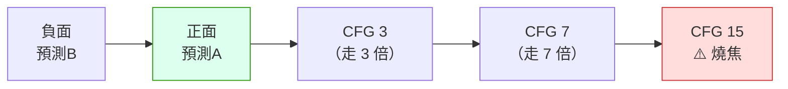

# comfy-2-10 🔬 CFG scale：為什麼你的像素 LoRA 要用 3.5

> **本章目標**：搞懂 CFG 這個「聽話程度」旋鈕的兩難，並回答本書開頭那個問題——**為什麼像素 LoRA 用 3.5，而一般寫實模型用 7**。

## 你會學到

- 🔬 CFG 在公式裡是什麼（複習 `comfy-2-6`，這次看數值）
- 高 CFG 與低 CFG 各自的症狀
- ⚠️ **為什麼強勢的 LoRA 需要低 CFG**——這是你那個 3.5 的答案
- 不同模型家族的 CFG 區間，以及 Flux 為什麼用 1.0

---

## 概念說明

### 複習公式，這次看那個數字

```
最終預測 = 預測B + CFG × (預測A − 預測B)
                   ↑
              就是這個倍數
```

**CFG 是「外插的倍數」**——從負面往正面的方向，走幾倍的距離。



這張圖在表達關鍵：**CFG = 1 時剛好停在「正面預測」，大於 1 就是往外超出。** 所謂「更聽話」，其實是「把正負的差異放大」。

---

### 兩端的症狀 📖

| CFG | 症狀 | 為什麼 |
|:---:|------|--------|
| **1.0** | 負面完全失效（見 `comfy-2-6`） | 數學上剛好抵銷 |
| **2~4** | 柔和、自然，但可能不太聽 prompt | 外插量小，接近模型的「自然分布」 |
| **5~8** | ✅ 一般模型的常用區間 | 平衡點 |
| **9~13** | 對比變高、顏色變濃、細節變硬 | 外插開始過度 |
| **14+** | ❌ **燒焦**：過飽和色塊、輪廓出現黑邊、結構融化 | 數值超出正常範圍 |

⚠️ **「燒焦」的辨識特徵**：

- 顏色過飽和到失真（膚色變橘紅、白色變螢光）
- 邊緣出現不自然的深色描邊
- 大面積的純色色塊
- 腮紅之類的柔和上色**變成硬邊條狀**

> 最後一項眼熟嗎？`comfy-2-7` 裡「腮紅變條狀」就是這個症狀——**那次不是 CFG 太高，但機制同源**：矛盾的負面詞讓 `(預測A − 預測B)` 這個差值變得異常，等效於外插過度。

---

### ⚠️ 為什麼強勢的 LoRA 需要低 CFG

**這是你那個 3.5 的答案。**

先建立一個直覺：CFG 在做的事是「**把模型的傾向放大**」。所以問題變成——

```
如果模型本身的傾向已經很強，還需要放大嗎？
```

對照兩種情況：

| | 一般寫實模型 | 你的 skormino 像素 LoRA |
|---|---|---|
| 模型對「畫成什麼樣」的傾向 | 相對中性，什麼風格都能畫 | ⚠️ **極度強勢**——它只想畫 8px 色塊的像素畫 |
| 正面預測（預測A）本身 | 需要 prompt 推一把才有明確方向 | **本身就有很明確的方向** |
| 所以需要的外插倍數 | 高（7 左右） | **低（3~4 就夠）** |

用類比：

> CFG 是**擴音器的音量**。
> 一般模型講話小聲 → 要開大聲一點才聽得清楚。
> 風格 LoRA 本來就在大吼 → 再開大聲就是**破音**。

**破音在圖上的表現**，正是你專案記錄過的：

> skormino 拉到 1.0（LoRA 權重）時大衣設計會走樣（跑出帽子、鈕扣變樣）

⚠️ 注意那是 LoRA 權重不是 CFG，但**兩者是同一類問題**：某個影響力被放大到蓋過其他訊號。**CFG 和 LoRA 權重會互相加乘**——這也是為什麼作者建議 skormino 配 CFG 3.5，那是他實測出「LoRA 全開時不會破音」的音量。

---

### 一個實用的推論

理解之後，可以推導出一條規則：

> **模型／LoRA 愈強勢、風格愈特殊 → CFG 應該愈低。**

| 情況 | 建議 CFG | 理由 |
|------|:---:|------|
| 底模 + 無 LoRA | 6~8 | 需要 prompt 用力推 |
| 底模 + 弱 LoRA（0.3~0.5） | 5~7 | |
| 底模 + **強勢風格 LoRA**（0.8~1.0） | **3~5** | ⚠️ 你的情況 |
| **蒸餾模型**（Turbo / LCM / Lightning） | **1~2** | 它們被訓練成「不需要 CFG」 |
| **Flux dev** | **1.0**（用 guidance 參數代替） | 見下 |

---

### Flux 為什麼用 CFG 1.0

Flux dev 的官方建議是 CFG = 1.0，另外有一個獨立的 `guidance` 參數（常設 3.5）。

原因：**它是蒸餾模型**。訓練時就把「CFG 的效果」直接烤進模型裡了，所以推論時不需要再跑兩次（正面 + 負面）。

**兩個實際影響**：

1. ✅ **速度快一倍**（每步只跑一次模型）
2. ⚠️ **負面提示詞失效**（CFG = 1 的數學必然）

> 所以在 Flux 上寫負面提示詞是白費工。要壓制什麼，得用別的手段（正面描述、LoRA、ControlNet）。
>
> **這是模型家族的架構差異，不是設定問題。** 換模型時要一併換掉你的 prompt 習慣。

---

### CFG 與其他參數的互動 ⚠️

| 互動 | 說明 |
|------|------|
| **CFG × LoRA 權重** | 兩者加乘。LoRA 權重調高時，CFG 可能要調低 |
| **CFG × steps** | 高 CFG 需要更多步才能穩定（外插量大，誤差累積快） |
| **CFG × 提示詞權重** | 也是加乘。`(word:1.5)` + CFG 12 = 崩壞 |
| **CFG × 速度** | ⚠️ CFG > 1 要跑兩次模型，**CFG = 1 快一倍** |

> **除錯提示**：出現燒焦症狀時，先降 CFG 而不是降 LoRA 權重——CFG 是全域的，改它不會影響你辛苦調好的 LoRA 配方。

---

### 進階：CFG rescale

有些 custom node 提供 `CFG rescale` 或 `dynamic thresholding`，作用是**在高 CFG 下抑制過飽和**——讓你能用高 CFG 的「聽話」但不要它的「燒焦」。

> ⚠️ **對你目前的產線用不到**（你已經在低 CFG 區間）。知道它存在就好，需要高 CFG 又不想燒焦時再回來查。

---

## 程式碼範例

把 CFG 的成本寫清楚：

```python
def sampling_step_with_cfg(model, latent, positive, negative, cfg, step):
    """一步採樣。注意 cfg == 1.0 時的短路優化。"""

    if cfg == 1.0:
        # ⚠️ 負面完全不影響結果，所以直接跳過那次運算
        # 這就是 Flux / Turbo 系模型速度快一倍的原因
        return model(latent, positive, step)

    noise_pos = model(latent, positive, step)
    noise_neg = model(latent, negative, step)      # ← 額外的一次完整運算

    return noise_neg + cfg * (noise_pos - noise_neg)
```

> **這段程式碼解釋了一個實務現象**：把 CFG 從 1.0 調到 1.1，速度會突然慢一倍。那不是 bug，是因為跨過了短路優化的門檻。

---

## 小練習

1. **找出你的燒焦點**：固定 seed 與 prompt，CFG 從 2 到 16 每次 +2 產一張。**記下從哪個值開始出現過飽和**。這個數字對你的模型 + LoRA 組合是有價值的參考。

2. **驗證 CFG × LoRA 的加乘**：把 skormino 權重設 0.3（弱），找出這時最好的 CFG；再設 1.0（強），重新找一次。**確認強權重時的最佳 CFG 比較低。**

3. **測速度差異**：同一張圖，CFG 1.0 與 CFG 3.5 各跑一次，記錄時間。**應該差將近一倍。**

---

## 課外讀物

> CFG 的公式與負面提示詞的機制 → `comfy-2-6`
> 為什麼矛盾的負面詞會產生類似燒焦的症狀 → `comfy-2-7`
> LoRA 權重的疊加與打架 → `comfy-4-6`
