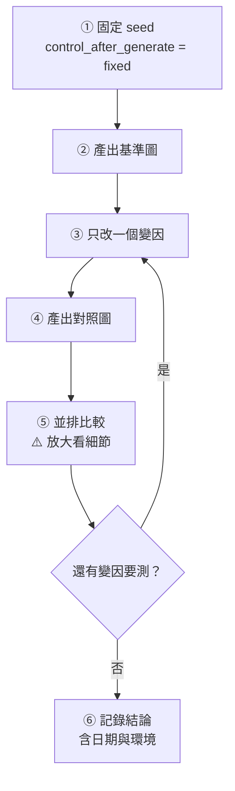

# comfy-2-11 🔬 Seed 與可重現性：它保證什麼，不保證什麼

> **本章目標**：搞懂 seed 的作用範圍——以及**哪些東西會在你不知情的時候破壞可重現性**。對要補產素材的遊戲專案，這是硬需求。

## 你會學到

- 🔬 seed 到底決定了什麼（答案：只有一件事）
- ⚠️ 六個會破壞可重現性的因素，包含一個很反直覺的
- 「同 seed 對照法」的正確做法
- 要複現三個月前的成果，該記錄哪些東西

---

## 概念說明

### seed 只決定一件事

回想 `comfy-2-1`：產圖從一張純隨機雜訊開始。

**seed 就是那張雜訊的編號。**

```
seed = 8888 → 產生一組特定的隨機數 → 一張特定的初始雜訊
seed = 8889 → 完全不同的初始雜訊
```

就這樣。**seed 不決定風格、不決定品質、不決定構圖**——它只決定「從哪塊石頭開始雕」。

> 但因為擴散是**確定性**的過程（收斂型 sampler 的情況下），同一塊石頭 + 同樣的雕法 = 同一個雕像。所以 seed 間接決定了最終結果。

### 「好 seed」是相對的 ⚠️

常見誤解：「這個 seed 很好用」。

**seed 沒有絕對的好壞**。一個 seed 在某組 prompt 下產出很棒的構圖，換一組 prompt 就毫無意義——因為初始雜訊只有配上特定的引導方向才會長成那個樣子。

```
seed 8888 + "1girl, standing"      → 很好的站姿構圖
seed 8888 + "1girl, sitting"       → 跟前者毫無關係的結果
```

> ⚠️ 所以**不要收集「萬用好 seed」**。要收集的是**「這組 prompt + 這個 seed」的組合**——那才是有意義的配方。

---

### ⚠️ 六個破壞可重現性的因素

這是本章的重點。**同 seed 不保證同圖**，以下都會破壞它：

#### 1. 任何參數改變

顯然的：steps、cfg、sampler、scheduler、尺寸、prompt 的任何一個字。

⚠️ **包括你以為無關的**：把 prompt 的 `1girl, solo` 改成 `1girl,solo`（少一個空格）會改變 tokenize 結果，圖就變了。

#### 2. 模型或 LoRA 版本

`waiIllustriousSDXL_v170` 與 `v140` 是兩個不同的模型。同 seed 產出完全不同的圖。

> ⚠️ 這是最常見的「三個月後複現不出來」的原因——你把模型更新了。

#### 3. ⚠️ batch 中的位置（最反直覺的一個）

```
batch_size = 1，seed = 8888  → 圖 A
batch_size = 4，seed = 8888  → 第一張是圖 A，但第 2、3、4 張是別的
```

看起來合理。但反過來：

```
你在 batch 裡看到第 3 張很棒，想單獨重產它
→ ⚠️ 沒辦法直接用 seed 8888 產出來
```

因為 batch 裡每一張用的是「seed 衍生出來的不同雜訊」，第 3 張對應的不是 seed 8888 也不是 8890。

> **解法**：
> - 用 `LatentFromBatch` 從批次中取出那一張繼續處理（`comfy-1-8`）
> - 或改用 batch_size = 1 + 遞增 seed，這樣每張都有明確對應的 seed
>
> ⚠️ **對需要精確補產的產線，建議用後者**。犧牲一點速度換可追溯性。

#### 4. ComfyUI / PyTorch 版本

更新之後，某些運算的實作細節可能改變，導致同樣輸入產出略微不同的結果。

通常差異很小（肉眼難辨），但**對逐位元比對就是不同**。

#### 5. 硬體

不同型號的 GPU、甚至不同的 CUDA 版本，浮點運算的細微差異會累積。

> 你在 RTX 4070 上產的圖，拿到別台機器用完全相同的設定跑，**可能有肉眼可見的細微差異**。

#### 6. custom node 的隨機性

某些 custom node 內部有自己的隨機來源，不受 ComfyUI 的 seed 控制。

⚠️ **症狀**：你什麼都沒改，連按兩次 Queue，出來兩張不同的圖。

---

### 可重現性的實務分級

依你的需求選擇要做到哪一級：

| 等級 | 保證 | 需要做什麼 |
|:---:|------|-----------|
| **A. 對照實驗級** | 同一次工作階段內，同 seed = 同圖 | 固定 seed、一次只改一個變因 |
| **B. 補產級** | 三個月後能產出**風格一致**的素材 | 記錄完整配方（見下）、模型不要亂更新 |
| **C. 逐位元級** | 完全相同的檔案 | ⚠️ **實務上做不到也不需要**——鎖版本、鎖硬體才有機會 |

**你的專案需要的是 B**：半年後要補兩個場景元件，風格要對得上。**不需要 C。**

---

### 要複現，該記錄什麼 📖

一份足以「補產」的配方要包含：

| 項目 | 為什麼 |
|------|--------|
| **底模完整名稱 + 版本** | `waiIllustriousSDXL_v170`，不是「WAI」 |
| **所有 LoRA 名稱 + 版本 + 權重** | ⚠️ 包含權重 0 的那些（因為腳本會覆寫） |
| **完整的正面 / 負面 prompt** | 一字不差，包含空格 |
| **seed** | |
| **steps / cfg / sampler / scheduler / denoise** | |
| **畫布尺寸** | ⚠️ 對你的產線這是**畫風**（`comfy-2-3`） |
| **ControlNet 模型 + 參數 + 控制圖** | 控制圖本身也要存 |
| 記錄日期 | 之後才知道當時的環境 |

> ✅ **好消息**：ComfyUI 的 `SaveImage` 會把整張 workflow 寫進 PNG metadata（`comfy-1-1`、`comfy-7-5`）。**只要你留著那張 PNG，配方就在裡面**——拖回畫布就能還原。
>
> ⚠️ **但要注意**：metadata 記錄的是「節點與參數」，**不包含模型檔案本身**。模型被刪掉或更新，還原出來的 workflow 也跑不出同樣的圖。

---

### 同 seed 對照法：正確做法 🔧

這是你做每一次參數實驗都該遵守的紀律：



⚠️ **三個最常犯的錯**：

| 錯誤 | 後果 |
|------|------|
| seed 忘了設 fixed | 你比較的是兩個完全不同的東西 |
| 一次改兩個參數 | 不知道是哪個造成的 |
| 只看縮圖 | **看不出臉糊掉**（你專案踩過，見 `comfy-6-4`） |

> 你專案的 LoRA 權重矩陣實驗就是這樣做的：**同 seed 8888、30 steps、CFG 3.5、WAI Illustrious**，只掃 skormino 權重。**這個做法是對的**——所有結論才能歸因到權重。

---

## 程式碼範例

看 seed 怎麼變成雜訊，以及 batch 的問題出在哪：

```python
def generate_initial_noise(seed: int, height: int, width: int, batch_size: int):
    """從 seed 產生初始雜訊。

    ⚠️ 注意 batch 裡每一張用的是連續產生的隨機數，
    所以第 N 張的雜訊「不等於」用另一個 seed 單獨產生的結果。
    """
    generator = torch.Generator().manual_seed(seed)

    # 一次產生整個 batch 的雜訊——這就是「第 3 張無法用某個 seed 重現」的原因
    return torch.randn(
        (batch_size, 4, height // 8, width // 8),   # ← 8 是 VAE 的下採樣率
        generator=generator,
    )
```

⚠️ 注意 `height // 8`——**這就是 `comfy-2-2` 講的「必須是 8 的倍數」在程式碼裡的樣子**。

---

## 小練習

1. **驗證 batch 的陷阱**：用 batch_size = 4、seed = 8888 產四張。記住第 3 張的樣子，然後用 batch_size = 1、seed = 8888 產一張。**確認它等於第 1 張而不是第 3 張。**

2. **測試 prompt 的敏感度**：同 seed，把 prompt 裡某個逗號後的空格刪掉，產一張。**確認結果真的變了**——這會讓你以後複製 prompt 時更小心。

3. **建立你的配方模板**：把上面的「該記錄什麼」做成一個範本檔案，之後每次定案一組設定就填一份。**這是 Part 12 整合專案的預習。**

---

## 課外讀物

> PNG metadata 怎麼讀出來、怎麼逆推配方 → `comfy-7-5`
> 可重現性的完整工程做法 → `comfy-7-6`
> 為什麼版本管理對產線這麼重要 → [課外讀物 E-8-1：Git 的內部原理](../../../課外讀物/E-8-git/E-8-1-git-internals.md)
