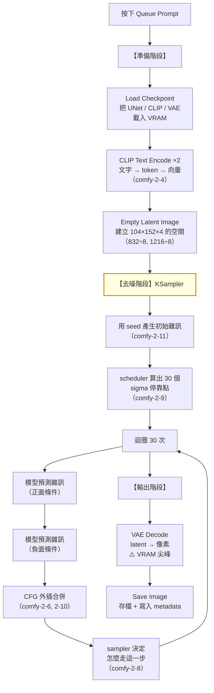

# comfy-2-12 🔧 一張圖的完整生命週期：把節點對回原理

> **本章目標**：把 Part 1 手接的那張 workflow，每一個節點、每一個參數，全部對回這個 Part 講的原理。**這章是 Part 1 與 Part 2 的接縫。**

## 你會學到

- 從按下 Queue 到圖片存檔，完整的時間軸
- 每個節點在原理上對應什麼
- 每個參數在機制裡的位置
- 🔧 一個「說得出為什麼」的自我檢驗

---

## 概念說明

### 完整時間軸

**注意 C1→C2→C3→C4 那個迴圈跑了 30 次。** 那是整張圖 95% 的運算時間所在。

---

### 節點 ↔ 原理對照表

| 節點 | 它在原理上做什麼 | 章節 |
|------|----------------|------|
| `CheckpointLoaderSimple` | 載入三個元件：預測雜訊的 UNet、編碼文字的 CLIP、latent↔像素的 VAE | `comfy-2-2` |
| `CLIPTextEncode`（正面） | 文字 → token → 向量。**這是「假設」，不是指令** | `comfy-2-1`、`comfy-2-4` |
| `CLIPTextEncode`（負面） | ⚠️ 定義「外插的起點」，不是排除清單 | `comfy-2-6` |
| `EmptyLatentImage` | 在**壓縮空間**開一塊 104×152×4 的區域（不是 832×1216） | `comfy-2-2` |
| `KSampler` | **整個擴散迴圈** | `comfy-2-1` |
| `VAEDecode` | 從壓縮空間還原成像素。⚠️ 有損 | `comfy-2-2` |
| `SaveImage` | 存檔，並把配方寫進 metadata | `comfy-2-11` |

---

### 參數 ↔ 機制對照表

| 參數 | 在機制裡是什麼 | 常見誤解 |
|------|--------------|---------|
| `width` / `height` | latent 的尺寸 × 8。⚠️ **對像素風產線它是畫風** | 以為只是解析度 |
| `batch_size` | 一次算幾張。⚠️ 第 N 張無法單獨用 seed 重現 | 以為每張都有自己的 seed |
| `seed` | 初始雜訊的編號 | 以為有「萬用好 seed」 |
| `steps` | 問模型幾次「雜訊是什麼」 | 以為愈多愈好 |
| `cfg` | 外插倍數。⚠️ **>1 時每步跑兩次模型** | 以為是「品質」 |
| `sampler_name` | 知道方向後**怎麼走下一步** | 以為差異很大 |
| `scheduler` | 30 步的力氣**怎麼分配** | 以為跟 sampler 是同一件事 |
| `denoise` | **從第幾步開始**（不是「強度」） | 以為是「參考原圖的程度」 |

---

### 用你的實際配方走一遍

拿你專案 `heroine-lora.json` 的設定，逐項說出「為什麼是這個值」：

| 設定 | 為什麼 |
|------|--------|
| `waiIllustriousSDXL_v170` | Danbooru tag 訓練 → 吃 tag 不吃句子（`comfy-3-3`） |
| **832×1216** | ⚠️ **不是為了省 VRAM**——是因為 skormino 色塊固定 8px，這個尺寸的邏輯解析度是 145，對得上 canon（`comfy-2-3`） |
| `steps 30` | 在收斂區間內，再多沒有邊際效益（`comfy-2-9`） |
| **`cfg 3.5`** | ⚠️ **風格 LoRA 已經很強勢，高 CFG 會破音**（`comfy-2-10`） |
| `dpmpp_2m` | **收斂型**——做對照實驗與批次產素材需要可重現（`comfy-2-8`） |
| `karras` | 後期停靠點密集，細節階段分配更多步數（`comfy-2-9`） |
| `denoise 1.0` | txt2img 從純雜訊開始（`comfy-2-1`） |
| `seed 8888` 固定 | 做 LoRA 權重對照實驗，必須消除 seed 這個變因（`comfy-2-11`） |
| 負面只有必要的幾條 | ⚠️ **負面愈長臉愈糊**（`comfy-2-7`） |

> **對照 `comfy-0-1` 的「三個為什麼」測試**——現在你應該三層都答得出來了。

---

## 🔧 動手：把原理跑一遍

### 練習一：追蹤一張圖的誕生

1. 開啟採樣預覽（設定裡的 sampler preview）
2. 用你手接的 workflow 產一張圖
3. **邊看邊對照**：
   - 前 5 步在決定什麼？（大結構）
   - 第 15 步左右在決定什麼？（服裝、髮型）
   - 最後 5 步在決定什麼？（細節、高光）

> 這個觀察會讓 `comfy-2-9` 的「karras 把力氣花在後期」變得非常具體。

### 練習二：把每個參數推到極端

固定 seed，一次只推一個參數到極端，觀察並解釋：

| 實驗 | 預期症狀 | 你能解釋嗎 |
|------|---------|-----------|
| steps = 3 | 沒成形 | 修正次數不夠 |
| cfg = 20 | 燒焦、過飽和 | 外插過度 |
| cfg = 1 | 負面失效 | 數學上抵銷 |
| denoise = 0.1（img2img） | 幾乎沒變 | 只跑了 3 步 |
| 尺寸 832×2400 | 兩個頭 / 斷身 | 偏離訓練分布 |
| 負面塞矛盾詞 | 臉變糊 | 外插起點混亂 |

**六個實驗都做完，並且每個都說得出原因 → Part 2 過關。**

---

## ✅ Part 2 自我檢驗

- [ ] 我能說出擴散模型「在預測什麼」（不是「在畫圖」）
- [ ] 我知道 latent 和 image 的差別，以及為什麼尺寸要 8 的倍數
- [ ] **我能解釋為什麼畫布尺寸會改變我的像素顆粒**
- [ ] 我知道負面提示詞不是排除清單，而是外插的起點
- [ ] **我能解釋為什麼我的 CFG 是 3.5 而不是 7**
- [ ] 我知道 sampler 的收斂與不收斂差在哪，以及為什麼我該用收斂型
- [ ] 我知道 denoise 是「從第幾步開始」，所以低 denoise 要拉高 steps
- [ ] 我知道哪些東西會破壞可重現性
- [ ] **我知道什麼時候該停止調參數、往上跳一層**

> 最後一項是 Part 2 最重要的產出，下一章專門講。

---

## 小練習

1. **對你的配方做一次三個為什麼**：回到 `comfy-0-1` 的練習 1，把你當時答不出來的地方重新回答一次。

2. **寫一張 Note**：在你的 workflow 上加一個 Note 節點（`comfy-1-13`），把「為什麼是 832×1216」「為什麼 CFG 3.5」寫進去。**這是把知識固化進專案的動作。**

3. **教別人一次**：找一個不懂的人（或對著空氣），用五分鐘解釋「AI 產圖是怎麼運作的」。**講不順的地方就是你還沒懂的地方。**

---

## 課外讀物

> 下一章：為什麼調參數常常是在錯的地方使力 → `comfy-2-13`
> 接下來 Part 3 會講模型的選擇——那是比參數更大的槓桿
