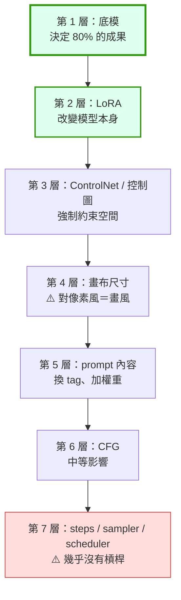
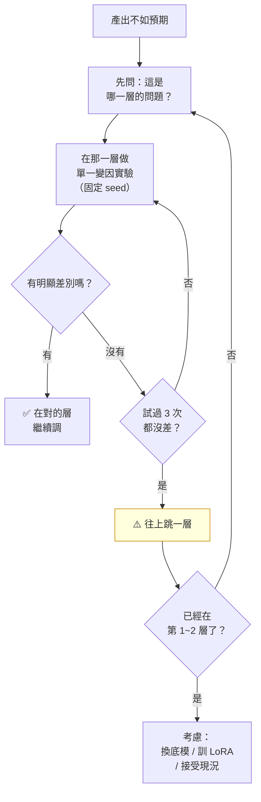

# comfy-2-13 ⚠️ 參數不是萬能槓桿：學會辨認「這題的施力點不在這裡」

> **本章目標**：學會一件比任何參數知識都值錢的事——**判斷你正在使力的地方，到底有沒有槓桿**。

## 你會學到

- 你專案那次「掃遍所有取樣參數」的實驗，以及它證明了什麼
- 🔬 **影響力階層**：一張排序表，告訴你該往哪裡使力
- ⚠️ 四個「你正在錯的地方使力」的警訊
- 一套決定「還要不要繼續調」的流程

---

## 概念說明

### 一次昂貴但值錢的實驗

你的專案為了改善像素格線，做了一次徹底的參數掃描：

```
掃描範圍：
    6 種 sampler
    3 種 scheduler
    CFG 2 ~ 7
    steps 20 ~ 45

量測指標：臉部格線相位集中度 R

結果：全部落在 ±0.06 之內
```

**結論寫得很直接**：

> **取樣參數不是這題的槓桿，別在上面耗時間。**

而真正有效的只有兩個：

| 真正的槓桿 | 影響 |
|-----------|------|
| **skormino 權重** | R：0 → 0.157、0.5 → 0.63、1.0 → 0.83 |
| **畫布尺寸** | 直接決定邏輯解析度（`comfy-2-3`） |

**看那個對比**：取樣參數全掃一輪，動了 0.06；LoRA 權重從 0 拉到 1.0，動了 0.67。**差了十倍以上。**

---

### 🔬 影響力階層

把這個發現一般化，得到一張排序表。**這是 Part 2 最有價值的產出**：



**使用方式**：遇到問題時，先問「這個問題屬於哪一層」，然後**從那一層開始使力**。

| 你的問題 | 該在哪一層解決 |
|---------|--------------|
| 畫風不對 | 第 1~2 層（底模 / 風格 LoRA） |
| 角色長得不一樣 | 第 2 層（角色 LoRA） |
| 姿勢 / 構圖不對 | 第 3 層（ControlNet） |
| 像素顆粒粗細不對 | 第 2 或第 4 層 |
| 某個物件沒出現 | 第 5 層（prompt） |
| 圖太糊 / 太銳利 | 第 6 層（CFG） |
| **細節不夠精緻** | ⚠️ **多半不是第 7 層**——先檢查上面幾層 |

---

### ⚠️ 四個警訊：你正在錯的地方使力

#### 警訊一：改動的效果落在噪音範圍內

```
你改了參數，產出兩張圖
→ 「好像有一點不一樣？」
→ ⚠️ 如果你要瞇眼睛才看得出差別，那就是沒有差別
```

**判斷標準**：把改動前後的圖給別人看，問「哪張比較好」。如果對方答不出來，那個參數對你的問題沒有槓桿。

#### 警訊二：你開始試「組合」

```
「CFG 4 + steps 35 不行，那 CFG 4.5 + steps 32 呢？」
```

⚠️ **當你開始排列組合，通常代表單一變因都沒有明顯效果**。這是「該往上跳一層」的強烈訊號。

#### 警訊三：同樣的問題反覆出現

你的專案有一個完美的案例——髮色問題：

```
試過 dark grey hair          → 不行
試過 black hair              → 不行
試過各種權重混合             → 命中率約 15%
```

**三次都在第 5 層（prompt）使力，三次都失敗。**

真正的解法在第 2 層：**把髮色訓進角色 LoRA**。而根因分析更深——`comfy-4-12` 會講到，v2 那次訓練失敗是因為**訓練集 31 張全是銀白**，模型只能學到它看過的東西。

> **這個案例的教訓**：反覆在同一層失敗，代表問題的根源在更上層。

#### 警訊四：你在跟模型的「本性」對抗

```
skormino LoRA 會把所有深色頭髮翻成銀白
→ 你用 tag 去拉 → 命中率 15%
```

⚠️ 這不是參數沒調好，是**你要的東西跟模型學到的東西衝突**。

用 tag 對抗 LoRA，就像用一根手指去推一輛車——不是你用力不夠，是工具的量級不對。

---

### 決策流程

當你卡住時：



⚠️ **「三次法則」**：同一層試三次單一變因實驗都沒有明顯差別，就往上跳一層。不要在同一層試第十次。

---

### 「接受現況」也是一個合法選項

流程圖最後那個 `接受現況` 不是敷衍。你的專案做過好幾次這個決定：

| 問題 | 最後的決定 |
|------|-----------|
| 髮色是銀白不是深灰 RGB(116,116,116) | **接受銀白**，不重訓、不強壓 |
| 手部崩壞 | **不處理**——「小尺寸看不出來，不要在這上面耗時間」 |
| 頭身比在階段間有差異 | 四條路全部退回，**維持原設定** |
| 顆粒感 vs 臉部可讀 | **選臉部可讀**，接受顆粒較細 |

> **這些都是好決定。** 判斷「這個問題不值得再投入」跟「知道怎麼解決」一樣重要。
>
> ⚠️ 差別在於：**你要知道自己在接受什麼、為什麼接受**。這跟「調不出來所以放棄」是兩回事——前者是決策，後者是挫敗。

---

### 一個反向的提醒

⚠️ 這章不是說「參數不重要」。它們重要，只是**重要的方式跟你以為的不同**：

| 參數的真正價值 | 說明 |
|--------------|------|
| **設對就不用再管** | CFG 3.5 / dpmpp_2m / karras 設好，之後專心處理別的 |
| **設錯會毀掉一切** | CFG 20 或 steps 3，上面幾層做得再好也沒用 |
| **是「及格線」不是「加分項」** | 參數的作用是不要扯後腿 |

> 用類比：參數就像相機的曝光設定。設對是基本要求，但**一張好照片靠的是拍什麼、怎麼構圖**，不是把光圈從 f/2.8 調到 f/2.9。

---

## 程式碼範例

把「三次法則」寫成一個可執行的實驗紀錄格式：

```python
# 實驗紀錄的最小格式——重點是「歸因」欄位
EXPERIMENT_LOG = [
    {
        "date": "2026-08-16",
        "layer": 7,                         # 影響力階層
        "variable": "sampler",              # ⚠️ 一次只能有一個
        "values_tested": ["euler", "dpmpp_2m", "dpmpp_3m_sde",
                          "heun", "uni_pc", "ddim"],
        "fixed": {"seed": 8888, "steps": 30, "cfg": 3.5,
                  "size": "832x1216", "lora": "skormino@1.0"},
        "metric": "grain_phase_R",
        "result_range": [0.80, 0.86],       # 全距 0.06
        "conclusion": "無槓桿。不再調整取樣參數。",
    },
    {
        "date": "2026-08-16",
        "layer": 2,                         # ← 往上跳了五層
        "variable": "skormino_weight",
        "values_tested": [0.0, 0.5, 1.0],
        "metric": "grain_phase_R",
        "result_range": [0.157, 0.83],      # 全距 0.67 ⚠️ 十倍以上
        "conclusion": "這才是槓桿。但 0.7 起大衣褪色 → 上限 0.7。",
    },
]
```

> ⚠️ **注意第二筆的 `conclusion`**：找到槓桿之後，馬上發現了新的約束（大衣褪色）。**真正的槓桿往往帶著副作用**——這才是需要你判斷的地方，而不是在沒有槓桿的參數上打轉。

---

## 小練習

1. **對你目前的困擾做分層**：列出三個你目前對產出不滿意的地方，用影響力階層表判斷它們各屬於哪一層。**你可能會發現自己一直在錯的層使力。**

2. **做一次「無槓桿」驗證**：挑一個你習慣性會調的參數，固定其他所有變因，掃過它的合理範圍。**如果差異都在噪音內，以後就不要再調它了**——這會替你省下大量時間。

3. **寫下你接受的現況**：列出三個你決定「不處理」的問題，並寫明為什麼。**這份清單會讓你以後不再重複掙扎同一件事。**

---

## 課外讀物

> **Part 2 到此結束。** 你現在有了判斷參數的能力，接下來 Part 3 要處理更上層的槓桿：**選對底模**
> 第 2 層的槓桿（LoRA）在 Part 4 → `comfy-4-1`
> 第 3 層的槓桿（ControlNet）在 Part 5 → `comfy-5-1`
> 「不要過早最佳化」是同一個思維 → [課外讀物 E-6-6：反模式大全](../../../課外讀物/E-6-best-practices/E-6-6-anti-patterns.md)
