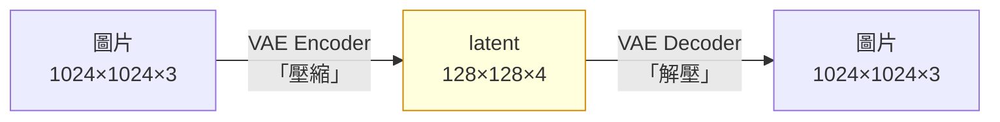

# comfy-2-2 🔬 latent space 與 VAE：為什麼尺寸必須是 8 的倍數

> **本章目標**：搞懂「潛在空間」是什麼、VAE 在做什麼，以及為什麼畫布尺寸有那麼多限制。

## 你會學到

- 為什麼擴散不在像素上做，而在一個壓縮空間裡做
- VAE 是什麼、它壓縮掉了什麼
- 🔬 **8 的倍數的真正來源**（以及為什麼實務上建議 64 的倍數）
- 為什麼尺寸偏離訓練值會產生「兩個頭」

---

## 概念說明

### 一個算術問題

上一章說擴散要迭代 30 次。我們來算一下如果直接在像素上做，成本是多少：

```
一張 1024×1024 的彩色圖 = 1024 × 1024 × 3 = 約 314 萬個數字
每一步都要對這 314 萬個數字做一次完整的神經網路運算
30 步 = 9400 萬次…（而且每次運算本身就很重）
```

**太貴了。** 早期的擴散模型（如原始 DDPM）就是這樣做的，只能產 256×256 的小圖，而且很慢。

Stable Diffusion 的關鍵突破就是：**別在像素上做，先壓縮**。

### 潛在空間（latent space）

想法很簡單：一張圖裡有大量冗餘資訊。

```
一片藍天有幾十萬個像素，但它們攜帶的資訊其實只有
「這裡是一片漸層的藍」——不需要記錄每一個像素。
```

所以先用一個壓縮器把圖壓成「精華」，在精華上做擴散，最後再解壓縮回來。

| | 像素空間 | latent 空間 |
|---|---|---|
| 1024×1024 的圖 | 1024 × 1024 × 3 ≈ **314 萬** 個數字 | 128 × 128 × 4 = **6.5 萬** 個數字 |
| 比例 | 100% | **約 1/48** |

**運算量降到約 1/48**，這就是為什麼你的 RTX 4070 能在 55 秒內產四張圖。

> ⚠️ **這裡有個常見誤解**：latent 不是「縮小版的圖」。它是 128×128×**4 個通道**的抽象特徵——那 4 個通道不對應 RGB，你把它當圖看會是一團看不懂的彩色雜訊（ComfyUI 的採樣預覽其實就是用一個近似解碼器把它粗略轉成圖給你看）。

### VAE 是那個壓縮器

**VAE**（Variational AutoEncoder，變分自編碼器）是一個獨立訓練的模型，做兩件事：



對應到 ComfyUI 的節點：

| 方向 | 節點 | 什麼時候用 |
|------|------|-----------|
| 圖 → latent | `VAEEncode` | img2img 的起點 |
| latent → 圖 | `VAEDecode` | **每張圖的最後一步** |

> 這解釋了 `comfy-1-2` 講的型別區分：`LATENT` 與 `IMAGE` 之間**一定要經過 VAE**，因為它們是兩個不同空間的東西。

### VAE 壓縮掉了什麼 ⚠️

壓縮到 1/48 一定有損失。VAE 丟掉的主要是**高頻細節**——極細的紋理、單像素的硬邊。

這在一般插畫上幾乎看不出來，**但對你的像素風產線是有意義的**：

> ⚠️ **像素風的本質就是硬邊**。一個 8×8 的純色方塊，邊界是刀切的。VAE 編解碼會讓那個邊界稍微「軟」一點。
>
> 這是為什麼 `comfy-1-8` 提到「遮罩外的區域經過 VAE 編解碼不是逐位元相同」——**每一次進出 latent 空間都是一次輕微的品質損耗**。
>
> 實務推論：**能少一次編解碼就少一次**。例如需要對產出做像素化後製，在外部腳本做（不要解碼→處理→再編碼→再解碼）。

### 為什麼是 8 的倍數 🔬

VAE 的壓縮率是固定的 **8 倍下採樣**（每個方向）：

```
1024 ÷ 8 = 128  ✅ 整除
1000 ÷ 8 = 125  ✅ 整除
1020 ÷ 8 = 127.5 ❌ 不整除 → 沒辦法對應
```

**latent 的邊長必須是整數**，所以圖片尺寸必須被 8 整除。這是硬性的架構限制，不是建議。

> ComfyUI 的 `EmptyLatentImage` 節點其實會幫你把數字調到合法值，但如果你從外部餵一張奇怪尺寸的圖進 `VAEEncode`，就可能出問題。

### 那為什麼實務上建議 64 的倍數

因為 VAE 之外，**UNet（去噪的那個大腦）內部還有好幾層下採樣**。

```
latent 進 UNet 後：128 → 64 → 32 → 16 → 再上採樣回來
```

如果 latent 的邊長不是 8 的倍數（也就是原圖不是 64 的倍數），中間某一層可能出現非整數，導致上採樣回來時尺寸對不上——症狀是**報錯，或是邊緣出現詭異的接縫**。

> **實務結論**：
> - **必須**：8 的倍數（VAE 的硬限制）
> - **建議**：64 的倍數（避開 UNet 的內部問題）
> - 常見的 SDXL 尺寸都是 64 的倍數：832、1024、1152、1216、1536

### 尺寸的另一個限制：訓練分布 ⚠️

即使尺寸合法，也不代表隨便設都行。

SDXL 系模型是在**特定的尺寸組合**上訓練的（總像素約 1024×1024，以不同長寬比分佈）。偏離太多會發生：

| 症狀 | 原因 |
|------|------|
| **長出第二個頭** | 畫布太高，模型「不知道」該畫什麼，於是重複它熟悉的東西 |
| **身體被切斷** | 同理，構圖比例超出訓練分布 |
| **左右鏡像重複** | 畫布太寬 |

這也是為什麼有一組「標準尺寸」：

```
1024×1024（1:1）    1152×896（9:7）     896×1152（7:9）
1216×832（19:13）   832×1216（13:19）   1344×768（7:4）   768×1344
```

> 它們的共同點：**總像素數都接近 1024×1024 ≈ 105 萬**。這就是模型的舒適區。
>
> 想產更大的圖，正確做法不是把畫布拉大，而是**兩階段生成**（見 `comfy-1-8` 的 hires fix）。

### 一個實用推論

理解了 latent 之後，`comfy-1-8` 那個「latent 放大 vs image 放大」的區別就有了解釋：

| | LatentUpscale | ImageScale |
|---|---|---|
| 在哪操作 | **在抽象特徵上**放大 | 在像素上放大 |
| 之後要做什麼 | **必須再跑一次 KSampler**，讓模型「重新想像」細節 | 什麼都不用 |
| 結果 | 細節是新生成的（會變） | 只是像素變多（不會變） |

> ⚠️ **為什麼 latent 放大後不重新採樣會糊**：你把 128×128 的特徵圖硬拉成 192×192，中間的值是插值猜的——那不是有效的 latent，解碼出來就是糊的。必須讓模型跑一遍把它「修正」成合法的 latent。

---

## 程式碼範例

用偽程式碼把整個空間轉換講一次：

```
# txt2img：全程在 latent 空間，只在最後解碼一次
latent = 空白latent(寬=832, 高=1216)        # → 內部其實是 104×152×4
latent = 去噪迴圈(latent, 條件, 30步)        # ← 所有運算都在這個小空間裡
圖片   = VAE解碼(latent)                     # ← 唯一一次進像素空間

# img2img：多一次編碼
圖片   = 讀檔("canon.png")
latent = VAE編碼(圖片)                       # ← 進 latent 空間（⚠️ 有損）
latent = 去噪迴圈(latent, 條件, 15步)
圖片   = VAE解碼(latent)                     # ← 再出來（⚠️ 又一次損耗）
```

**數一數編解碼的次數**——txt2img 一次、img2img 兩次。每一次都是一點點細節損失。

> ⚠️ **這對你的 LoRA 訓練集有直接影響**：你專案用 img2img 產了 9 張一致性樣本當訓練集。那些圖比 txt2img 產的多經歷了一次編解碼——這是「世代衰減」（`comfy-4-20`）的其中一條路徑。

---

## 小練習

1. **驗證 8 的倍數**：在 `EmptyLatentImage` 填一個不是 8 倍數的數字（例如 833），看 ComfyUI 怎麼處理它。

2. **踩一次尺寸的坑**（很有教育意義）：把畫布設成 832×2048（遠超訓練分布），用你平常的人物 prompt 產一張。**看看會長出什麼**——多半是兩個頭或斷掉的身體。這個畫面會讓你永遠記得「尺寸有舒適區」。

3. **測 VAE 的損耗**：做一個「`LoadImage` → `VAEEncode` → `VAEDecode` → `SaveImage`」的流程（**中間完全不採樣**），比較輸入輸出。放大看邊緣——這就是純粹的編解碼損耗。用你的像素立繪做這個實驗特別明顯。

---

## 課外讀物

> 為什麼畫布尺寸會改變像素顆粒的粗細——下一章 → `comfy-2-3`
> 圖片本身怎麼變成 0 和 1、有損壓縮丟掉了什麼 → [cs-1-6：圖片、聲音、影片怎麼變成 0 和 1](../../cs/part-1/cs-1-6-media-encoding.md)
> 浮點數的精度問題（fp16 / fp32 的差別就是這個） → [cs-1-4：浮點數與它的精度陷阱](../../cs/part-1/cs-1-4-floating-point.md)
