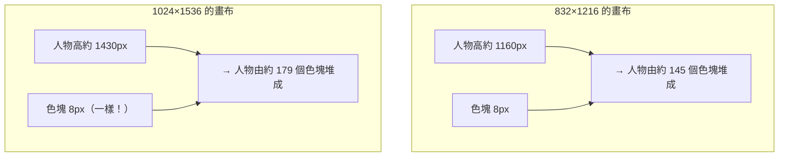
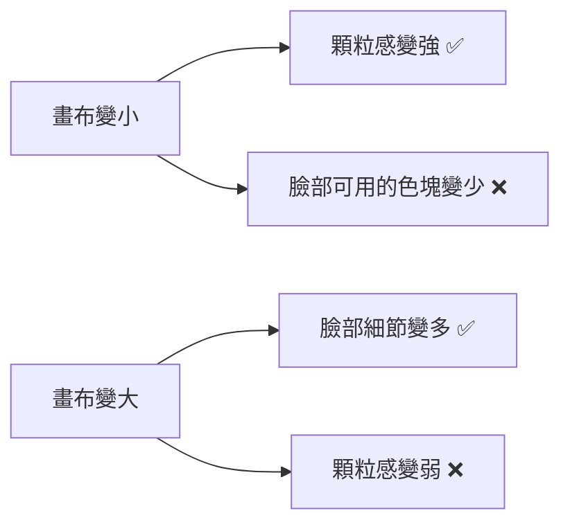

# comfy-2-3 🔬 ⚠️ 畫布尺寸就是畫風

> **本章目標**：理解一個反直覺但對你至關重要的事實——**在像素風產線裡，畫布尺寸不是「解析度設定」，它是畫風本身的一部分**。

## 你會學到

- 為什麼同一組參數在 832×1216 和 1024×1536 產出的「像素感」完全不同
- 🔬 **邏輯解析度**：判斷像素風對不對的正確單位
- 你專案的三組實測數據，以及它們背後的通則
- ⚠️ 一個無法兩全的取捨：顆粒感 vs 臉部可讀性

---

## 概念說明

### 一個令人困惑的現象

你的專案紀錄了這件事：

```
canon 圖（832×1216）    → 顆粒粗，是想要的樣子
換成 1024×1536         → 同樣的 LoRA、同樣的參數、同樣的 seed
                        → 顆粒變細了，看起來「不夠像素風」
```

**參數一個字都沒改，只改了畫布，畫風就變了。** 為什麼？

### 關鍵：色塊的絕對大小是固定的

風格 LoRA（你的 `pixel-skormino-v8`）學到的東西是：**「畫面應該由大約 8×8 像素的色塊構成」**。

⚠️ **注意這是「絕對大小」，不是「相對比例」**。不管你的畫布多大，它畫出來的色塊就是大約 8px 見方。

於是：



這張圖在表達核心機制：**畫布變大，色塊沒變大，所以人物是由「更多、相對更小」的色塊組成的。**

用一個類比：

> 你用固定大小的樂高積木堆一個人。
> 堆一個 145 塊高的人 → 看起來很有顆粒感，方方正正。
> 堆一個 179 塊高的人 → 細節多了，但「積木感」變弱了。
>
> **積木沒變，是人變大了。**

---

### 邏輯解析度：正確的量測單位

這帶出一個關鍵概念——**判斷像素風對不對，不能看畫布尺寸，要看「邏輯解析度」**：

```
邏輯解析度 = 主體高度 ÷ 色塊大小
           = 「這個角色相當於幾個像素高」
```

這才是真正的像素畫規格。真的像素畫家會說「這是一個 32px 高的角色」「這是 64×64 的圖標」——**他們講的就是邏輯解析度**。

你專案的實測數據：

| 畫布 | 人物邏輯高度 | 評價 |
|------|:---:|------|
| 768×1152 | 135 | 太粗 |
| **832×1216** | **145** | ✅ **對**（canon 用的） |
| 1024×1536 | 179 | 太細 |
| 參考圖 `reference_v2` | **150** | 目標值 |

> ⚠️ **參考圖那組特別值得看**：`docs/reference_v2/` 那批是 **160×160 上採樣到 1024** 產生的——所以它的格線週期是 1024 ÷ 160 = **6.44px**，人物 150 邏輯像素高。
>
> **這就是「規格」**。不是「1024×1024 的圖」，而是「160 邏輯像素的畫，放大到 1024 顯示」。

---

### 所以「調畫布」是在調什麼

理解之後，這件事就不再神秘了：

| 你想要 | 該怎麼做 |
|--------|---------|
| 顆粒**更粗** | **縮小畫布**（人物佔更少邏輯像素） |
| 顆粒**更細** | 放大畫布 |
| 顆粒不變、圖更大 | ⚠️ **辦不到**——除非用整數倍 NEAREST 放大成品 |

最後一項很重要：**如果你要一張「顆粒感跟 canon 一樣、但尺寸大兩倍」的圖**，正確做法不是把畫布設成兩倍，而是：

```
832×1216 產圖 → 用 nearest-exact 整數倍放大到 1664×2432
```

這樣色塊也跟著變成 16px，**邏輯解析度保持 145 不變**。

> ⚠️ 用 `LatentUpscale` + 二次採樣則會**破壞**它——模型會在放大後的畫布上重新想像細節，色塊又變回 8px，邏輯解析度就跑掉了（見 `comfy-1-8`）。

---

### ⚠️ 一個無法兩全的取捨

你的專案撞上了一個真實的衝突：

```
GD §8.1 規定立繪用 1024×1536
理由：臉部要可讀（玩家要看得清楚表情）

但 1024×1536 的邏輯解析度是 179 → 顆粒太細，不像 canon
要顆粒對就得用 832×1216 → 但臉部細節變少
```

**這兩件事在物理上就是衝突的**：



**這不是參數沒調好，是像素藝術的本質限制。** 真的像素畫家也面對同一個問題：32px 的角色畫不出細膩表情，那不是技術問題，是規格選擇。

可能的解法（各有代價）：

| 方案 | 做法 | 代價 |
|------|------|------|
| 選一邊 | 決定是要顆粒還是要臉 | 犧牲另一個 |
| **分開處理** | 立繪用大畫布（要臉）、sprite 用小畫布（要顆粒） | 兩種畫風可能對不上 |
| 後製對格 | 大畫布產圖 → 事後 pixelize 到目標邏輯解析度 | ⚠️ 條件很嚴（見 `comfy-6-12`） |
| 提高色塊大小 | 訓一支「16px 色塊」的風格 LoRA | 要重訓 |

> 你的專案目前選的是**第一種**（維持 1024×1536，接受顆粒較細）。**這是合理的決定**——臉部可讀對遊戲體驗更重要。重點是**知道自己在取捨什麼**，而不是以為參數沒調好。

---

### 通則：這件事不只發生在像素風

把這章的發現抽象一層：

> **任何「絕對尺寸固定」的視覺元素，都會隨畫布尺寸改變它的相對觀感。**

其他例子：

| 元素 | 絕對大小固定 | 所以畫布變大時… |
|------|------------|---------------|
| 像素色塊 | ~8px | 顆粒感變弱 |
| 筆觸紋理 LoRA | 筆刷寬度固定 | 筆觸感變細膩 |
| 網點 / 半調 | 網點大小固定 | 網點變密 |
| 線稿的線寬 | 線寬固定 | 線變細 |

**所以換畫布尺寸時，永遠要重新驗收風格**，不能假設「只是解析度不同」。

---

## 程式碼範例

把邏輯解析度的計算寫成可執行的檢查：

```python
def logical_resolution(subject_height_px: int, block_size_px: float) -> float:
    """算出主體相當於幾個「邏輯像素」高。

    這是像素風真正的規格單位——畫布尺寸只是它的表現形式。
    """
    return subject_height_px / block_size_px


# 你專案的三組數據
CANON_BLOCK_SIZE = 8.0        # skormino 的色塊大小，實測值

print(logical_resolution(1160, CANON_BLOCK_SIZE))  # 832×1216  → 145 ✅
print(logical_resolution(1430, CANON_BLOCK_SIZE))  # 1024×1536 → 179 ✗ 太細
print(logical_resolution(1090, CANON_BLOCK_SIZE))  # 768×1152  → 136 ✗ 太粗

# 參考圖的規格反推
REFERENCE_GRID = 1024 / 160   # = 6.44px，因為它是 160px 的圖上採樣到 1024
print(logical_resolution(966, REFERENCE_GRID))     # → 150（目標值）
```

> ⚠️ **注意 `block_size` 是量出來的，不是設定的**。你不能叫模型「用 8px 色塊」——那是 LoRA 學來的性質。要知道它是多少，得**實際量**（方法見 `comfy-6-3`）。

---

## 小練習

1. **重現這個現象**：固定 seed 與 prompt，只改畫布尺寸（768×1152 / 832×1216 / 1024×1536），各產一張。**並排放大看臉**，確認顆粒粗細確實不同。

2. **算一次邏輯解析度**：量出三張圖裡人物的實際高度（像素），除以 8，看看是否符合上表的數字。

3. **驗證整數倍放大**：把 832×1216 那張用 `ImageScaleBy` 的 `nearest-exact` 放大 2 倍，跟直接產 1664×2432 的版本比較。**兩者的顆粒感應該天差地遠。**

---

## 課外讀物

> 怎麼實際量出色塊大小與格線 → `comfy-6-3`
> 為什麼像素風訓練集絕對不能非整數倍縮放 → `comfy-4-17`
> 像素風的本質（格線、調色盤、邏輯解析度） → `comfy-6-1`
