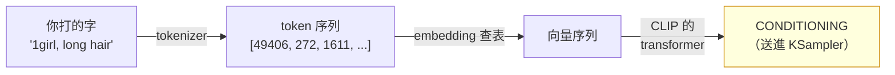
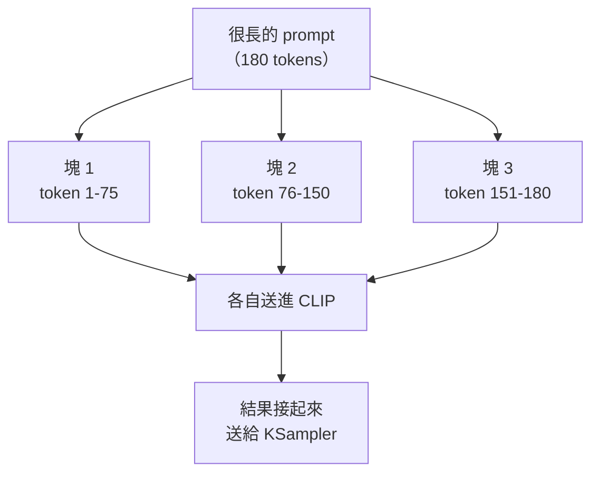

# comfy-2-4 🔬 文字怎麼變成條件：CLIP、token 與 77 的限制

> **本章目標**：搞懂你打的字如何變成模型看得懂的東西，以及為什麼「模型看不懂你的詞」這件事會發生。

## 你會學到

- CLIP 是什麼、它為什麼能連結文字與圖像
- 🔬 **token 不是字也不是詞**——以及這造成什麼實際影響
- 77 token 限制的真相，以及 ComfyUI 怎麼繞過它
- ⚠️ 為什麼「模型不認識的詞」比「沒寫」更糟

---

## 概念說明

### CLIP 是什麼

**CLIP**（Contrastive Language-Image Pre-training）是一個獨立訓練的模型，它的本事是：**把文字和圖片放進同一個空間裡比對**。

訓練方式很暴力但有效：

```
餵給它幾億組「圖片 + 說明文字」的配對
訓練目標：讓「配對的圖與文字」在數學空間裡靠近，
          「不配對的」互相遠離
```

結果就是：CLIP 學會了把「一段文字」轉成一組數字（向量），而**那組數字在幾何上會靠近符合這段描述的圖片**。

> 這就是擴散模型能「聽懂」提示詞的基礎——它並不是真的理解語言，而是有一個工具能把文字轉成「圖片空間裡的一個方向」。

### 完整的轉換鏈



這張圖在表達：**`CLIPTextEncode` 節點裡面其實有三個步驟**。多數問題發生在第一步（tokenizer）。

---

### 🔬 token 不是字，也不是詞

**這是最容易誤解的地方。**

tokenizer 把文字切成「token」，切法是統計上最有效率的方式，結果常常反直覺：

| 你打的 | 被切成幾個 token | 說明 |
|--------|:---:|------|
| `girl` | 1 | 常見詞，有專屬 token |
| `1girl` | 1~2 | Danbooru 常用詞，可能有專屬 token |
| `nightheroine` | **3~5** ⚠️ | 模型沒看過，被拆成 `night` + `hero` + `ine` 之類的碎片 |
| `pixpix` | **2~3** ⚠️ | 同上 |
| 一個中文字 | 1~3 | 中文的 token 效率很差 |

**這造成兩個實際影響**：

#### 影響一：自創的詞會被拆碎

你的 LoRA 觸發詞 `nightheroine` 會被拆成幾個碎片。**這正是 LoRA 訓練有效的原因，也是它的限制**：

```
訓練前：nightheroine → [night][hero][ine] → 意義大約是「夜晚+英雄」的混合
訓練後：LoRA 修改了 CLIP，讓這串碎片的組合指向「你的角色」
```

> ⚠️ **推論一**：觸發詞應該選**沒有既有意義的組合**。如果你的觸發詞叫 `nightgirl`，它原本就有很強的既有語意（夜晚的女孩），LoRA 要跟那個既有意義競爭。
>
> ⚠️ **推論二**：觸發詞打錯一個字母，整串 token 都變了，LoRA **完全叫不出來**。這不像人類的容錯——`nightheroin` 和 `nightheroine` 對模型是兩個毫不相干的東西。

#### 影響二：模型沒看過的詞不是「被忽略」，而是「亂猜」

很多人以為打一個模型不認識的詞，它會忽略。**不會**——它會把碎片的意義加起來，產生一個你預料不到的方向。

```
你寫 "cyberpunkish"（自創詞）
→ 拆成 [cyber][punk][ish]
→ 模型往「賽博 + 龐克 + 形容詞後綴」的方向偏
→ 可能有效，也可能產生奇怪的東西
```

> ⚠️ **這比「沒寫」更糟**：沒寫至少是中性的，寫了看不懂的詞是**往隨機方向拉**。
>
> **實務建議**：用 tag 自動補全工具（`comfy-1-14` 提過的 pythongosssss 套件），它會顯示每個 Danbooru tag 的實際使用次數。**使用次數少於幾百的 tag，模型多半沒學好。**

---

### 77 token 的限制

CLIP 一次只能處理 **77 個 token**（其中 2 個是開頭與結尾的標記，所以實際可用 **75 個**）。

```
"masterpiece, nightheroine, 1girl, solo, full body, standing,
 open coat, bikini, hands on hips, night park"
→ 大約 25~30 個 token，還很寬裕

一段三百字的英文描述
→ 遠超 75，會被切斷或分塊
```

#### ComfyUI 怎麼處理超長 prompt

它會**自動分塊**：每 75 個 token 切一塊，各自編碼，然後把結果接起來。



⚠️ **但分塊有代價**：

> **同一塊裡的詞會互相影響，跨塊的不會**（或影響很弱）。
>
> 因為 CLIP 的 transformer 是在一塊之內計算「詞與詞的關聯」的。第 74 個 token 和第 76 個 token 雖然在你的文字裡相鄰，但被切到兩塊，模型**看不到它們的關係**。

這造成一個實際問題：

```
"...(前面 74 個 token)..., red hair, blue eyes"
                            ↑ 這裡剛好被切開
→ "red" 在塊 1 結尾、"hair" 在塊 2 開頭
→ 模型可能理解成「有紅色的東西」+「有頭髮」，而不是「紅色的頭髮」
```

#### BREAK 就是手動控制切點

`BREAK` 關鍵字的作用：**強制在這裡結束目前這塊，剩下的補空白**。

```
1girl, solo, red hair, blue eyes
BREAK
night park, streetlight, bench
```

這樣角色描述在一塊、場景描述在另一塊，**避免它們互相污染**。

> ⚠️ **BREAK 是否有用是有爭議的**。它確實控制了分塊位置，但「分開就不會互相污染」的效果，實測上因模型而異、也沒有想像中明顯。
>
> **誠實的定位**：這是**社群慣例層級**的技巧，不是必須。你的專案 prompt 都在 75 token 以內，**根本用不到**。知道它存在就好。

---

### 這解釋了你專案的一個結論

你的產線 prompt 是這樣的：

```
masterpiece, nightheroine, 1girl, solo, <姿勢/鏡頭/大衣狀態/情緒>, night park
```

**短、精準、全部在一塊之內。** 這是對的做法，理由現在很清楚：

| 你做對的事 | 原理 |
|-----------|------|
| prompt 保持短 | 全部在同一塊，詞之間的關聯完整保留 |
| 觸發詞放最前面 | 見下一章（順序的影響） |
| 不寫髮色髮箍臉身 | 那些由 LoRA 管（`comfy-4-7`），寫了反而變成可被覆蓋的開關 |
| 用 tag 不用句子 | Illustrious 是 Danbooru tag 訓練的（`comfy-3-3`） |

---

### 順帶：為什麼有些模型有兩個 CLIP

SDXL 架構用了**兩個文字編碼器**（一大一小），把兩者的輸出合併使用。目的是增加對文字的理解能力。

`comfy-1-7` 提過的 `CLIPTextEncodeSDXL` 就是讓你分別控制這兩個。**多數情況不需要**——一般的 `CLIPTextEncode` 會自動把同一段文字餵給兩邊。

Flux 更進一步，用了 CLIP + T5（一個真正的語言模型），這是它 prompt 服從度高的主因——**T5 真的能理解句子結構**，而 CLIP 基本上只是在做「關鍵詞的向量疊加」。

> ⚠️ **這解釋了一個常見困惑**：為什麼 SDXL 系模型寫「一個女孩站在樹的**左邊**」沒用？因為 CLIP 對空間關係、否定、計數的理解本來就很弱。**它主要在做關鍵詞匹配**，不是理解句子。
>
> 要精確控制位置 → 用 ControlNet（Part 5），不要跟 CLIP 硬拚。

---

## 程式碼範例

用偽程式碼看清楚 `CLIPTextEncode` 內部：

```
函式 CLIP編碼(clip模型, 文字):

    tokens = 切詞(文字)              # "1girl, long hair" → [272, 1611, 4633, ...]

    # 77 token 限制
    如果 len(tokens) > 75：
        分成幾塊 = 每 75 個切一塊     # ⚠️ 這裡會切斷詞之間的關聯

    對於 每一塊：
        補上開頭標記與結尾標記         # 這就是 77 = 75 + 2 的來源
        向量 = clip模型.編碼(這一塊)

    回傳 所有塊的向量接起來            # → CONDITIONING
```

**注意 `切詞` 那一步**——它決定了你的每個詞會變成什麼。想知道你的 prompt 被切成幾個 token，可以用 CLIP tokenizer 的線上工具，或某些 custom node 會直接顯示 token 數。

---

## 小練習

1. **測試觸發詞的脆弱性**：把你的 LoRA 觸發詞故意打錯一個字母（`nightheroine` → `nightheroin`），同 seed 產一張。**角色應該完全叫不出來。** 這個實驗會讓你永遠記得觸發詞不能打錯。

2. **測試不存在的詞**：在 prompt 裡加一個你自創的詞（例如 `flumbergast`），同 seed 產兩張（有加 / 沒加）。**它不會被忽略**——看看它往哪個方向拉。

3. **超長 prompt 實驗**：寫一段 150 token 以上的 prompt，把一個關鍵描述（例如 `red hair`）放在第 74~76 個 token 的位置，看它會不會失效。

---

## 課外讀物

> 為什麼 tag 的順序會影響權重 → 下一章 `comfy-2-5`
> 文字怎麼被編碼成數字（ASCII / Unicode 的同一組問題） → [cs-1-5：文字怎麼存](../../cs/part-1/cs-1-5-text-encoding.md)
