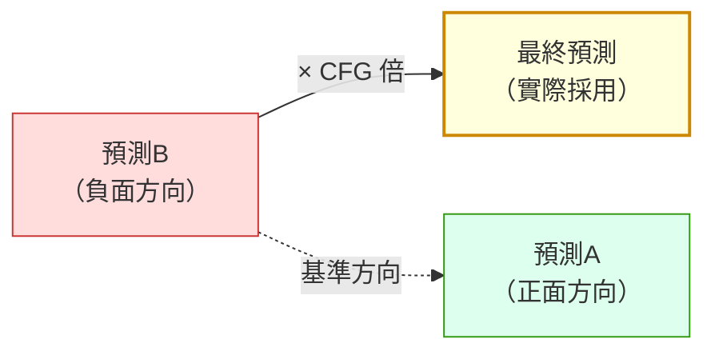

# comfy-2-6 🔬 負面提示詞的真相：它不是「不要這個」

> **本章目標**：搞懂負面提示詞的真正機制——它**不是排除清單**，而是「模型要從哪裡逃離的起點」。理解這件事，下一章那個「負面愈長臉愈糊」的現象就有解釋了。

## 你會學到

- 🔬 **CFG 的核心公式**（只有一行，但它解釋一切）
- 為什麼負面提示詞會影響整張圖的風格，而不只是移除某個東西
- 為什麼 CFG = 1 時負面提示詞完全失效
- ⚠️ 負面提示詞的正確用法與常見誤用

---

## 概念說明

### 先破除「排除清單」的想像

多數人腦中的模型是：

```
❌ 錯誤的想像：
   模型畫完圖 → 檢查有沒有負面詞裡的東西 → 有就擦掉
```

**完全不是。** 負面提示詞從頭到尾參與每一步運算，而且它的作用方式很特別。

### 🔬 核心公式

回想 `comfy-2-1`：每一步模型都在預測「這裡面的雜訊是什麼」。

實際上，**模型每一步會做兩次預測**：

```
預測A = 模型認為「如果這是張 <正面提示詞> 的圖」，雜訊是什麼
預測B = 模型認為「如果這是張 <負面提示詞> 的圖」，雜訊是什麼
```

然後把兩者組合成最終答案：

```
最終預測 = 預測B + CFG × (預測A − 預測B)
```

**這一行就是 CFG（Classifier-Free Guidance）的全部。** 拆開來看它在做什麼：

```
(預測A − 預測B)  = 「從負面指向正面」的方向
CFG × 那個方向    = 往那個方向走 CFG 倍的距離
從 預測B 出發     = ⚠️ 起點是負面，不是零
```

用一張圖：



這張圖在表達關鍵：**最終結果是「從負面出發、朝正面方向、超出正面繼續走」。** 這叫**外插（extrapolation）**——不是在 A 和 B 之間取平均，而是穿過 A 往外走。

---

### 三個立刻可得的推論

#### 推論一：CFG = 1 時，負面完全失效

把 CFG = 1 代入公式：

```
最終預測 = 預測B + 1 × (預測A − 預測B)
        = 預測B + 預測A − 預測B
        = 預測A          ← 負面完全消失了
```

**這是數學上的必然，不是 bug。**

> ⚠️ 所以看到有人說「我的負面提示詞沒作用」，第一件事是檢查 CFG 是不是 1（或非常接近 1）。
>
> 這也影響到你：**某些模型（如 Flux）建議用 CFG 1.0**，在那些模型上寫負面提示詞是白費工——它們用的是別的引導機制（distilled guidance）。

#### 推論二：負面提示詞會影響整張圖，不只是「移除某物」

因為**起點是負面預測**。負面提示詞定義了「模型認為的反面世界長什麼樣」，而最終結果是從那個世界往外推的。

```
負面寫 "blurry"
→ 預測B 是「一張模糊的圖該有的樣子」
→ 最終結果是「從模糊往清晰的反方向推」
→ 效果：整張圖變銳利 ✅ 這是你要的

負面寫 "petite, young girl, flat chest, childlike body, huge breasts, obese, fat"
→ 預測B 是「一個同時又瘦又胖又幼態又豐滿的混亂概念」
→ ⚠️ 那個「起點」本身就是矛盾的、沒有明確方向的
→ 最終結果的方向也跟著不穩
```

> ⚠️ **你專案的實測完全符合這個機制**：加了那串體型負面詞之後，用同 seed 做消去法比對，**臉明顯變濁、腮紅變條狀**。
>
> 你當時的結論是「負面愈長臉愈糊」——**現在你知道為什麼了**。詳細分析在下一章。

#### 推論三：負面提示詞應該描述「一張壞圖」，而不是「不要的東西」

這是最實用的心法轉換：

| ❌ 排除清單思維 | ✅ 反面世界思維 |
|---|---|
| 「我不要多視角」 | 「一張壞圖會有多視角」 |
| 「我不要紅色」 | ⚠️ 難以表達——顏色的反面是什麼？ |
| 「我不要手畫壞」 | 「一張壞圖會有 bad hands」 |

**能寫進負面的，是「能構成一張連貫的壞圖」的描述**。寫「不要紅色」這種指令式的東西效果很差，因為「紅色」不是一張圖的整體特質。

> **要移除特定物件，正確工具不是負面提示詞，而是 inpaint**（`comfy-5-4`）。

---

### 負面提示詞的正確用法

依可靠程度排序：

| 用途 | 例子 | 可靠度 |
|------|------|:---:|
| **壓制模型的已知壞習慣** | `multiple views, character sheet` | ✅ 高 |
| **整體品質方向** | `worst quality, blurry, jpeg artifacts` | ✅ 高 |
| **明確的內容紅線** | `child, loli`（你的 GD 紅線） | ✅ 高 |
| **壓制構圖傾向** | `starry sky, vanishing point, perspective` | ⚠️ 中 |
| 移除特定物件 | `no hat` | ❌ 低（用 inpaint） |
| 微調身材比例 | `flat chest, obese` | ❌ **低且有害**（你已實測） |

> ⚠️ 你專案的負面提示詞是這樣設計的：
> ```
> 必加：multiple views, character sheet     ← 壓制像素 LoRA 愛出多視角的習慣
> 本專案再加：child, loli, school uniform, sailor collar   ← GD 紅線
> 場景加：starry sky, stars, vanishing point, perspective  ← 壓制構圖傾向
> ```
> **每一條都有明確的理由，沒有一條是抄來的萬用負面詞包。** 這正是對的做法。

---

### 為什麼「萬用負面詞包」是可疑的

網路上流傳的長串負面詞（或 `easynegative` 這類 embedding），問題在於：

1. **多數是 SD1.5 時代的產物**，那個世代的模型缺陷跟現在不同
2. **它們定義了一個很具體的「反面世界」**，而那個世界可能跟你的題材無關
3. ⚠️ **它會偷偷影響你的畫風**——因為起點變了，整個外插方向都變了

**判斷方式很簡單**：

```
同 seed，一張帶負面詞包、一張只帶必要的幾個
→ 並排比較
→ 如果差異只是「都不錯，風格不同」，那個詞包對你沒價值
```

> 這個實驗值得對你手上每一組沿用已久的負面詞做一次。

---

## 程式碼範例

把 CFG 的實際運算寫出來（這是 KSampler 每一步都在做的事）：

```python
def one_denoising_step(model, latent, positive_cond, negative_cond, cfg, step):
    """去噪的其中一步。整個 CFG 機制就在這裡。"""

    # ⚠️ 注意：每一步都要跑「兩次」模型——這就是為什麼 CFG > 1 比 CFG = 1 慢一倍
    noise_positive = model(latent, positive_cond, step)
    noise_negative = model(latent, negative_cond, step)

    # 核心公式：從負面出發，朝正面方向外插 cfg 倍
    noise_final = noise_negative + cfg * (noise_positive - noise_negative)

    return latent - step_size * noise_final
```

⚠️ **注意那個「跑兩次模型」**：

> **CFG > 1 的產圖速度大約是 CFG = 1 的一半**，因為每一步都要算兩次。
>
> 這也是為什麼 Flux 那種「CFG 1.0」的模型跑起來相對快——它省掉了負面那次運算。

---

## 小練習

1. **驗證 CFG = 1 讓負面失效**：在負面提示詞裡寫一個很誇張的東西（例如 `1girl, solo`——跟你正面一樣），然後分別用 CFG 1.0 與 CFG 7.0 產圖。**CFG 1.0 那張應該完全不受負面影響。**

2. **測你的負面詞包值不值得**：同 seed，一張帶你目前完整的負面提示詞、一張只帶 `multiple views, character sheet`。**並排看臉**。

3. **體驗「反面世界」**：把負面提示詞設成 `masterpiece, best quality, 1girl`（也就是把好東西放進負面），CFG 設 7，看看產出什麼。**這個實驗最能讓你直覺理解「負面是起點」。**

---

## 課外讀物

> 下一章用這個機制解釋你專案「負面愈長臉愈糊」的實測 → `comfy-2-7`
> CFG 數值本身的完整討論 → `comfy-2-10`
