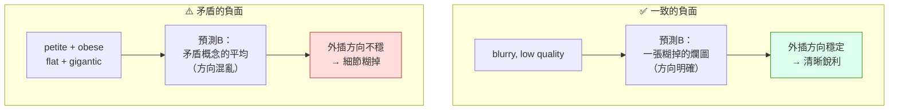
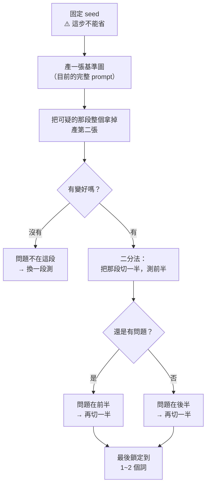

# comfy-2-7 ⚠️ 為什麼負面詞愈長，臉愈糊

> **本章目標**：用上一章的機制，解釋你專案實測到的現象——並學會一套**找出「是哪個詞在害我」的診斷流程**。

## 你會學到

- 你專案那組體型負面詞為什麼會讓臉變糊（機制推論）
- 為什麼**臉**是最先壞掉的部位
- 🔧 消去法診斷流程：怎麼抓出害你的那個詞
- ⚠️ 一個誠實的界線：哪些是機制、哪些是推論

---

## 概念說明

### 現場紀錄

你的專案為了修正「階段 4／5 的頭比前幾階段大、胸圍變小」，在負面提示詞加了這一串：

```
petite, young girl, flat chest, childlike body,
huge breasts, gigantic breasts, obese, fat
```

用同 seed 做消去法比對後的結論：

> **臉明顯變濁、腮紅變條狀。負面愈長臉愈糊，體型交給正面 tag 處理就好。**

這個結論是對的。現在來看它為什麼會發生。

---

### 解釋一：這串負面詞本身是矛盾的

回想 `comfy-2-6` 的公式：

```
最終預測 = 預測B + CFG × (預測A − 預測B)
                ↑
          起點是「負面世界」
```

**預測B 是模型想像的「一張符合負面提示詞的圖」。** 現在看看那串詞要求它想像什麼：

```
petite（嬌小）+ obese（肥胖）
flat chest（平胸）+ gigantic breasts（巨大胸部）
childlike body（孩童體型）+ fat（胖）
```

⚠️ **這是互相矛盾的。** 模型被要求想像一個「同時又瘦又胖、又平又巨」的東西。

它給出的預測B 不會是一個清晰的方向，而是**這些矛盾概念的混亂平均**。



這張圖在表達關鍵差異：**負面提示詞要能構成「一張連貫的壞圖」**。矛盾的負面詞讓起點失去明確方向，而最終結果是從那個起點外插出去的——**起點糊，結果就糊**。

---

### 解釋二：為什麼是「臉」先壞

這是很合理的疑問——為什麼副作用集中在臉，而不是背景或衣服？

三個原因疊加：

**原因一：臉是最高頻的細節**

一張立繪裡，資訊密度最高的區域就是臉（眼睛的高光、瞳孔、睫毛、嘴角）。這些細節是在**去噪的最後幾步**才確定的。

而 CFG 的外插誤差**在後期步驟影響最大**——前期在決定大結構（人在哪、什麼姿勢），那時候方向稍微歪一點無所謂；後期在雕細節，方向不穩就直接反映成模糊。

**原因二：你的負面詞全部關於人體**

`petite`、`childlike body`、`flat chest`、`obese`——**這些詞的向量全部集中在「人物軀體」這個語意區域**。

它們拉扯的方向，跟你正面提示詞裡的角色描述**高度重疊**。等於在同一個區域裡正負互相拉鋸，而臉是那個區域裡最脆弱的部分。

> 對照組：`starry sky, vanishing point` 這種**場景類**負面詞就不會傷到臉，因為它們作用的語意區域跟臉不重疊。**這解釋了為什麼你的場景負面詞沒有同樣的副作用。**

**原因三：腮紅變條狀是典型的「外插過度」症狀**

顏色溢出成條狀、色塊邊界失控——這跟 CFG 調太高的症狀是同一類（見 `comfy-2-10`）。**機制也確實相關**：兩者都是外插量過大導致數值超出正常範圍。

---

### ⚠️ 誠實的界線

上面三個解釋，可信度不一樣，我要標清楚：

| 說法 | 等級 |
|------|------|
| CFG 公式（負面是起點、外插） | ✅ **確定的機制**，可從公式直接推導 |
| CFG=1 時負面失效 | ✅ **確定的機制**，數學上的必然 |
| 矛盾的負面詞讓預測B 方向不明確 | ✅ **合理且幾乎必然**，符合公式行為 |
| 「後期步驟受外插誤差影響更大」 | ⚠️ **合理推論**，方向正確但我沒有嚴格實驗證明 |
| 「負面詞的語意區域與正面重疊會加劇」 | ⚠️ **合理推論**，符合觀察但未經對照實驗驗證 |
| **「負面愈長臉愈糊」** | ✅ **你的實測**（同 seed 消去法）——**這是最可靠的一條** |

> **重點**：你的實測結論比我的機制解釋更可靠。機制解釋的價值不在於「證明」，而在於**讓你能推廣到新情況**——例如你現在應該能預測：「加一串關於**背景**的矛盾負面詞，大概不會傷到臉，但會讓背景糊」。**那個預測能力才是這章的產出。**

---

## 🔧 消去法診斷流程

這是本章最實用的部分。當你懷疑某組 prompt 有問題時：



**關鍵紀律**：

| ✅ 要做 | ❌ 不要做 |
|--------|---------|
| **固定 seed** | 每次換 seed（你會分不出是 seed 還是 prompt 的差異） |
| 一次只改一個東西 | 同時改三個參數 |
| 用二分法（每次砍一半） | 一個一個試（詞多時太慢） |
| **並排比較、放大看臉** | 憑印象「感覺好像好一點」 |
| 記錄每次的結果 | 靠記憶 |

> ⚠️ **「放大看臉」是你專案自己的教訓**：`comfy-6-4` 記錄過一次——量測指標全綠（R 0.962、雜訊 0、邏輯高完美命中），臉其實已經糊掉了。**數字漂亮不等於東西對。**

---

## 從這個案例學到的通則

把它抽象成可以帶走的原則：

| 原則 | 說明 |
|------|------|
| **負面提示詞要一致，不要互相矛盾** | 它必須能構成一張連貫的「壞圖」 |
| **不要用負面詞做微調** | 負面是粗調工具。要微調體型 → 用正面 tag 或 LoRA |
| **負面愈短愈安全** | 每加一個詞都在改變起點 |
| **跟正面同語意區域的負面詞要特別小心** | 它們會互相拉鋸 |
| **加負面詞之後要重新驗收品質**，不能只看「目標問題有沒有解決」 | 副作用常常出現在你沒在看的地方 |

⚠️ 最後一條特別重要。你當時加那串詞是為了解決「頭身比」，如果只檢查頭身比，會以為成功了——**是因為做了消去法比對才發現臉壞了**。

---

### 那體型問題該怎麼解

既然負面詞不行，你專案試過的其他路（也都退回了）：

| 試過的方法 | 結果 |
|-----------|------|
| 負面塞體型詞 | ❌ 臉變糊（本章） |
| 正面加 `curvy figure, wide hips` | ❌ **衝過頭**，變成過度豐滿，離 canon 更遠 |
| 負面放 `small breasts` | ❌ 同樣衝過頭 |
| openpose ControlNet 鎖骨架 | ❌ **毀臉**（`comfy-5-10`） |
| depth ControlNet | ❌ **把衣服帶過去**（`comfy-5-11`） |

**四條路全部退回**，最後維持不加任何體型控制的版本。

> 這不是失敗——**這是把解空間探索完了**。剩下的真正解法只有一條：**把正確的體型訓進角色 LoRA**（讓模型「知道這個角色長這樣」，而不是每次用 tag 去拉）。這正是 Part 4 的主題。
>
> 這也呼應 `comfy-2-5` 的優先序表：**當 prompt 怎麼調都調不動時，訊號是「該往上跳一層了」**。

---

## 小練習

1. **重現這個實驗**：固定 seed，一張帶那串體型負面詞、一張不帶。並排放大看臉。**確認你看得出差異**——看不出來的話，你的驗收標準需要調整。

2. **做一次二分法**：拿你目前最長的那組負面提示詞，用二分法找出「拿掉之後圖沒有變差」的部分。多數人會發現一半以上的負面詞是無效的。

3. **驗證語意區域的推論**：加一串關於**背景**的矛盾負面詞（例如 `bright daylight, dark night, indoor, outdoor`），看臉會不會受影響。**如果臉沒事但背景糊了，就驗證了「語意區域」那個推論。**

---

## 課外讀物

> 負面提示詞的機制本體 → `comfy-2-6`
> CFG 過高的症狀（跟這章的腮紅條狀是同一類） → `comfy-2-10`
> 為什麼最終解法是訓 LoRA → `comfy-4-13`（訓練集缺口的分析）
