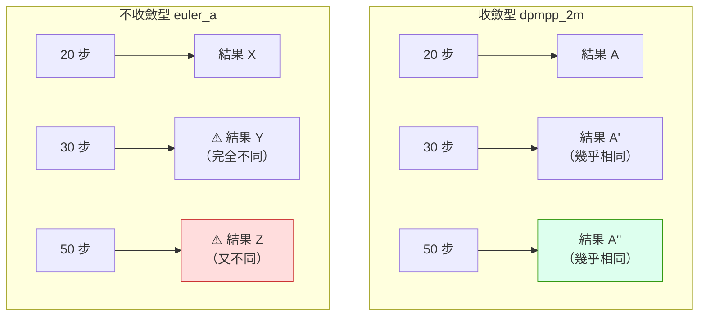

# comfy-2-8 🔬 📖 Sampler 全解：那堆名字到底差在哪

> **本章目標**：搞懂 sampler 在做什麼、名字裡的暗號代表什麼，以及**哪些差異真的重要**（比你以為的少）。

## 你會學到

- 🔬 sampler 是什麼：一個「怎麼走下一步」的策略
- 名字裡的暗號：`_a` / `sde` / `2m` / `3m` 各代表什麼
- ⚠️ **收斂 vs 不收斂**——這是最重要的分類
- 一張實用的選擇表（以及為什麼你不該在這上面耗時間）

---

## 概念說明

### sampler 在做什麼

回想 `comfy-2-1` 的核心迴圈：

```
每一步：
    預測的雜訊 = 模型(目前狀態, 條件, 第幾步)
    目前狀態 = 目前狀態 - 一小部分的預測雜訊    ← sampler 決定這裡怎麼算
```

模型只負責「預測雜訊」。**至於知道了雜訊之後該怎麼往下走一步，那是 sampler 的工作。**

用一個類比：

> 你在山上要下山（目標是山谷）。模型是**指南針**——它告訴你「往這個方向是下坡」。
> sampler 是**你的走法**：
> - 一步一步小心走（穩，但慢）
> - 大步跨（快，但可能走過頭）
> - 先試探一步再決定（準，但要多花力氣）
> - 邊走邊隨機晃一下（每次路徑都不同）

---

### 名字裡的暗號 📖

| 暗號 | 意思 | 影響 |
|------|------|------|
| `euler` | 最簡單的走法：照著方向直直走一步 | 快、穩定、可預測 |
| `heun` | 走一步試探 → 修正 → 才真的走 | ⚠️ **要跑兩次模型，慢一倍** |
| `dpm` | 專為擴散模型設計的解法 | 效率好 |
| `dpmpp` / `dpm++` | DPM 的改良版 | **目前的主流** |
| `2s` / `2m` / `3m` | 用幾階、單步還是多步 | 數字大 = 用更多歷史資訊，通常品質好一點 |
| **`_ancestral` / `_a`** | ⚠️ **每一步額外加入新的隨機雜訊** | **不收斂**（見下） |
| **`sde`** | 隨機微分方程版本，也會加噪 | 同樣不收斂，但機制不同 |
| `uni_pc` | 統一預測-校正框架 | 低步數表現好 |
| `ddim` | 最早期的 sampler | 舊，但某些 inpaint 流程仍用 |
| `lcm` | 給 LCM 蒸餾模型專用 | **只有配 LCM LoRA 才能用** |

---

### ⚠️ 最重要的分類：收斂 vs 不收斂

這是你唯一**必須**搞懂的區分。

#### 收斂型（`euler`、`dpmpp_2m`、`ddim`、`uni_pc`…）

```
steps 20 → 一張圖
steps 30 → 幾乎同一張圖，細節多一點
steps 50 → 還是同一張圖，幾乎沒差
```

**步數增加，結果趨向穩定。** 超過某個點就是浪費時間。

#### 不收斂型（帶 `_a` 或 `sde` 的）

```
steps 20 → 一張圖
steps 30 → ⚠️ 不同的圖
steps 50 → ⚠️ 又是不同的圖
```

因為**每一步都會加入新的隨機雜訊**，步數改變 = 加噪的次數改變 = 完全不同的結果。



**這對你的產線有直接影響**：

| 你的需求 | 該用哪類 |
|---------|---------|
| **可重現性**（要能複製三個月前的成果） | ✅ **收斂型** |
| 做對照實驗（掃參數矩陣） | ✅ **收斂型**（否則變因不只一個） |
| 批次產素材、要求一致性 | ✅ **收斂型** |
| 探索階段、想要多樣性 | 不收斂型也可以 |

> ⚠️ **你的專案用 `dpmpp_2m`（收斂型）是對的**。做 LoRA 權重矩陣、格線量測這類實驗，用不收斂的 sampler 會讓數據無法解讀——你分不出差異來自參數還是來自 sampler 的隨機性。

---

### 實用選擇表 📖

| 情境 | 推薦 | 理由 |
|------|------|------|
| **日常通用** | `dpmpp_2m` + `karras` | 收斂、品質好、速度合理。**沒特殊理由就用它** |
| 想要更細緻 | `dpmpp_3m_sde` + `karras` | ⚠️ 不收斂 |
| 低步數（8~15） | `uni_pc` 或 `dpmpp_2m` | 低步數表現較好 |
| 極低步數（4~8） | `lcm` / `euler` | **必須配合 LCM / Turbo / Lightning 模型** |
| inpaint | `ddim` 或 `dpmpp_2m` | 某些流程對 ddim 有偏好 |
| 做對照實驗 | **`dpmpp_2m`**（固定不動） | 減少變因 |

> **多數人的最佳策略**：選 `dpmpp_2m` + `karras`，然後**再也不要動它**，把注意力放在真正有影響的地方（模型、LoRA、ControlNet、prompt）。

---

### ⚠️ 誠實的說明：差異比你以為的小

網路上有大量「sampler 大比拚」的文章，貼出十六種 sampler 的對照圖。看起來很有學問，但實際上：

```
在足夠的步數（25+）下，收斂型 sampler 之間的差異
通常小於「換一個 seed」的差異
```

**你的專案已經量化驗證過這件事**：

> 掃過六種 sampler、三種 scheduler、CFG 2~7、steps 20~45，
> 對像素格線相位集中度 R 的影響**全部在 ±0.06 內**。
>
> **取樣參數不是這題的槓桿，別在上面耗時間。**

這是很有價值的實測結論。它的一般化版本：

| 真正的槓桿 | 幾乎不是槓桿 |
|-----------|-------------|
| 底模選擇 | sampler 選擇 |
| LoRA 與權重 | scheduler 選擇 |
| ControlNet | steps（超過 25 之後） |
| prompt 內容 | CFG 的小幅調整（±1） |
| **畫布尺寸**（你的案例） | |

> ⚠️ **這不代表 sampler 完全沒差**——低步數時差異明顯，某些特殊模型有特定要求。但**當你在調 sampler 找答案時，八成是找錯地方了**。

---

### 一個例外：作者的建議值

模型或 LoRA 的作者常會標明「建議用 X sampler」。**那個要聽**——因為他們是用那組參數測試的。

> 你的 `pixel-skormino-v8` 標的是 `CFG 3.5 / dpmpp_2m / karras`，那是作者實測值。**照用是對的**，不用自己重新探索。

---

## 程式碼範例

用偽程式碼看 euler 與 ancestral 的差別（就差一行）：

```python
# Euler：最單純的收斂型
def euler_step(latent, noise_pred, sigma_now, sigma_next):
    direction = (latent - denoised(latent, noise_pred)) / sigma_now
    return latent + direction * (sigma_next - sigma_now)


# Euler Ancestral：多了最後一行
def euler_ancestral_step(latent, noise_pred, sigma_now, sigma_next):
    direction = (latent - denoised(latent, noise_pred)) / sigma_now
    latent = latent + direction * (sigma_next - sigma_now)

    # ⚠️ 這一行就是「不收斂」的來源：每步注入新的隨機雜訊
    latent = latent + random_noise() * sigma_up

    return latent
```

**差別只有最後那一行**，但它造成了「換 steps 就換一張圖」的根本差異。

---

## 小練習

1. **驗證收斂性**：固定 seed 與 prompt，用 `dpmpp_2m` 分別跑 steps = 20 / 30 / 50，並排比較（應該幾乎相同）。再用 `euler_a` 跑同樣三組（應該完全不同）。**這個對照做過一次就終身受用。**

2. **量化 sampler 的影響**：固定所有其他參數，換六種收斂型 sampler 各產一張。**它們的差異，跟你只換 seed 產的兩張比，哪個大？**

3. **找出你的步數夠用點**：用 `dpmpp_2m`，從 steps 10 開始每次 +5，找出「再加也看不出差別」的那個值。之後就用那個值，不要再多跑。

---

## 課外讀物

> scheduler（karras / normal / beta）與 steps 的關係 → `comfy-2-9`
> 為什麼「參數不是萬能槓桿」 → `comfy-2-13`
