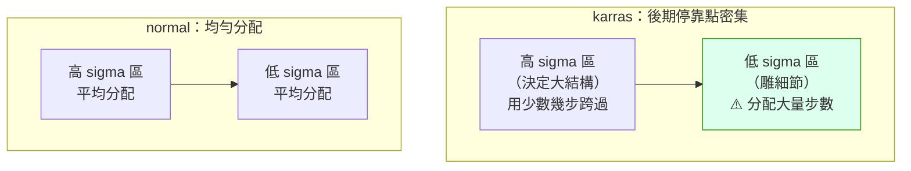

# comfy-2-9 🔬 Scheduler 與 steps：噪聲的下降曲線

> **本章目標**：搞懂 scheduler 在控制什麼——它決定「30 步的力氣要怎麼分配」，而這比「總共跑幾步」更值得理解。

## 你會學到

- 🔬 **sigma**（噪聲水平）是什麼，以及 scheduler 怎麼安排它
- 為什麼 `karras` 是主流推薦
- steps 與 scheduler 的互動：為什麼低 denoise 時 steps 要加高
- ⚠️ 什麼時候 scheduler 真的會有差（很少）

---

## 概念說明

### sigma：每一步的「髒污程度」

回想 `comfy-2-1`：擴散是從純雜訊一路去噪到乾淨。那條路上的每一個點，都有一個「目前有多髒」的數值——這就是 **sigma（σ）**。

```
sigma 很高（例如 14.6）→ 幾乎全是雜訊，看不出任何東西
sigma 中等（例如 2.0） → 大致的形狀出來了
sigma 很低（例如 0.1） → 幾乎乾淨，只剩細節要修
sigma = 0             → 完成
```

**scheduler 的工作就是：決定這 30 步要在哪些 sigma 值上停靠。**

```
steps = 30 表示「停 30 次」
scheduler 決定「這 30 個停靠點怎麼分佈」
```

---

### 兩種分配策略

用一個類比：你要從 14.6 樓走到 0 樓，可以搭 30 次電梯。**每次要下降幾層？**

#### `normal`（均勻分配）

```
14.6 → 14.1 → 13.6 → ... → 1.0 → 0.5 → 0
每次下降差不多的量
```

#### `karras`（前期大步、後期小步）

```
14.6 → 10.2 → 7.1 → 4.8 → ... → 0.4 → 0.2 → 0.1 → 0
       ↑ 前期跨很大                  ↑ 後期磨很細
```



這張圖在表達 karras 的核心思想：**把力氣花在真正影響觀感的地方**。

**為什麼這樣比較好**？因為：

```
高 sigma 階段（前期）：在決定「大概是個人形、站在中間」
                    → 這件事很粗略，不需要很多步

低 sigma 階段（後期）：在決定「睫毛的形狀、高光的位置」
                    → 這件事很細膩，多幾步差很多
```

> **所以 `karras` 成為主流推薦**，因為在同樣的 steps 下，它把更多預算花在細節階段。這是**有機制根據的偏好**，不是玄學。

---

### 其他 scheduler 📖

| scheduler | 特性 | 什麼時候用 |
|-----------|------|-----------|
| **`karras`** | 後期密集 | ✅ **預設選擇**，尤其配 dpmpp 系 |
| `normal` | 均勻 | 通用，某些模型的原生設定 |
| `exponential` | 指數下降 | 效果介於兩者之間 |
| `sgm_uniform` | SGM 論文的排程 | 某些新模型（SD3、Flux）指定 |
| `simple` | 簡化版 | Flux 常見 |
| `beta` | 較新的排程 | 實驗性 |
| `ddim_uniform` | 配合 ddim | 舊流程 |

> ⚠️ **和 sampler 一樣，多數情況差異很小**。你的專案掃過三種 scheduler，對格線的影響在 ±0.06 內。
>
> **建議**：`karras` 用到底，除非模型作者指定別的（Flux 系常指定 `simple` 或 `sgm_uniform`——那要聽）。

---

### steps 要設多少

#### 一般情況

| steps | 效果 |
|:---:|------|
| < 10 | ⚠️ 通常不夠（除非用 Turbo / LCM / Lightning 這類蒸餾模型） |
| 15~20 | 可用，細節略少 |
| **25~35** | ✅ **甜蜜點**（你的專案用 30） |
| 40~60 | 邊際效益很低 |
| > 60 | ❌ 純粹浪費時間 |

**怎麼找你自己的甜蜜點**：固定 seed，從 10 開始每次 +5，找到「再加也看不出差別」的那個值。

#### ⚠️ 低 denoise 時的陷阱

這是 `comfy-1-9` 提過、值得再強調的：

```
denoise 決定「從第幾步開始」，不是「跑幾步」

steps 30, denoise 1.0  → 實際跑 30 步  ✅
steps 30, denoise 0.5  → 實際跑 15 步  ✅ 還行
steps 30, denoise 0.2  → 實際跑 6 步   ⚠️ 可能不夠
steps 20, denoise 0.2  → 實際跑 4 步   ❌ 太少，出來會怪
```

**所以做低 denoise 的 img2img 或修圖時，要把 steps 拉高**：

```
想要「輕微修飾」（denoise 0.25）且實際跑滿 15 步
→ steps 要設 60
```

> ⚠️ **這是很多人 img2img 效果不好的隱藏原因**：以為 denoise 調低就是輕改，卻不知道步數也跟著砍到只剩幾步。

---

### scheduler 與 sampler 的搭配

社群的常見組合（**都是慣例層級，不是強制**）：

| 組合 | 定位 |
|------|------|
| `dpmpp_2m` + `karras` | ✅ **最通用**，你的專案用這個 |
| `dpmpp_2m_sde` + `karras` | 質感略不同，⚠️ 不收斂 |
| `euler` + `normal` | 最單純，除錯時的基準 |
| `euler` + `simple` | Flux 常見 |
| `dpmpp_3m_sde` + `exponential` | 追求細節，⚠️ 不收斂 |

> **誠實校準**：這些組合是**社群慣例**，不是官方標準。不同模型作者的建議也不一樣。**一致性比選哪個更重要**——選定一組，然後專心調真正有影響的東西。

---

## 程式碼範例

看 scheduler 實際產生了什麼：

```python
# scheduler 的產出就是一串數字——30 個停靠點
def karras_sigmas(steps=30, sigma_min=0.03, sigma_max=14.6, rho=7.0):
    """Karras 排程：用一個指數曲線分配停靠點，讓低 sigma 區更密集。

    rho 控制曲線的彎曲程度，7.0 是論文的建議值。
    """
    ramp = [i / (steps - 1) for i in range(steps)]
    min_inv_rho = sigma_min ** (1 / rho)
    max_inv_rho = sigma_max ** (1 / rho)

    sigmas = [(max_inv_rho + t * (min_inv_rho - max_inv_rho)) ** rho for t in ramp]
    return sigmas + [0.0]      # 最後一定要到 0


# 印出來看看分佈
# karras: [14.6, 9.3, 5.9, 3.7, 2.3, 1.4, 0.9, 0.5, 0.3, 0.2, 0.1, ..., 0]
#          ↑ 前面跨很大                            ↑ 後面磨很細
```

> **這就是為什麼 ComfyUI 有 `BasicScheduler` 節點**（`comfy-1-9` 提過）——它把這串 sigma 抽出來變成 `SIGMAS` 型別，讓你能自訂或切割它（例如 `SplitSigmas` 做兩階段）。

---

## 小練習

1. **驗證低 denoise 的陷阱**：做一次 img2img，denoise 0.2，分別用 steps 20 與 steps 80。**後者應該明顯好很多**——因為前者實際只跑了 4 步。

2. **比較 scheduler**：固定 seed 與 sampler，換三種 scheduler 各產一張。**確認差異真的很小**，以校準你的期待。

3. **找步數甜蜜點**：對你日常的產線設定，找出「再加也沒差」的 steps 值。如果它比 30 小，你就省下了每張圖的時間。

---

## 課外讀物

> sampler 與收斂性 → `comfy-2-8`
> CFG——真正比較有影響的那個參數 → `comfy-2-10`
