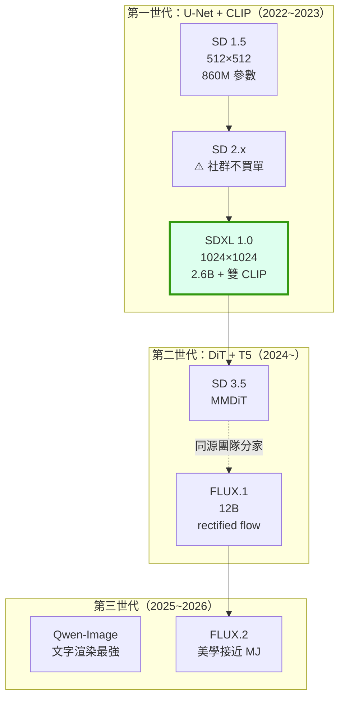
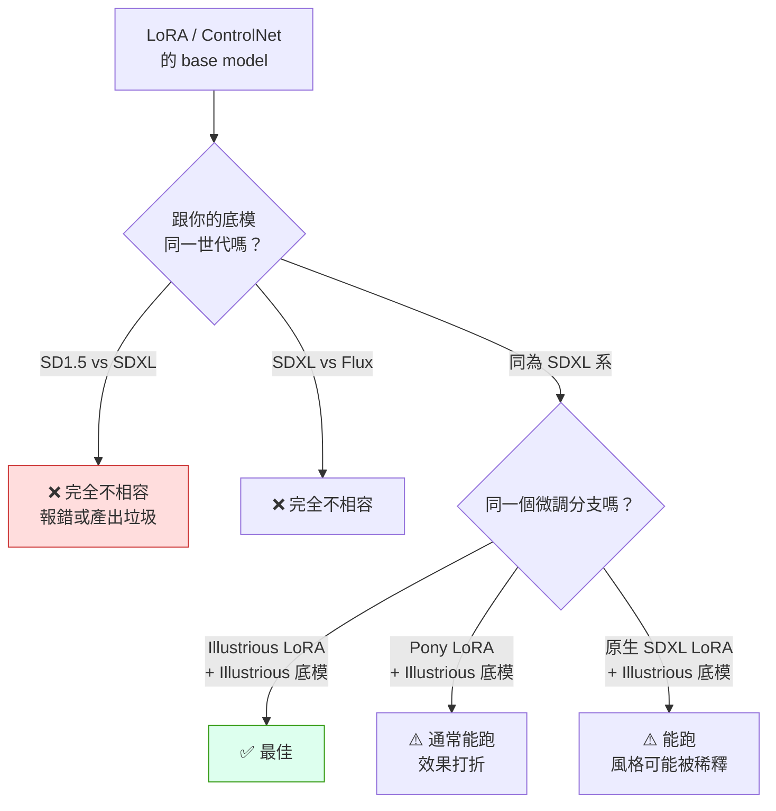

# comfy-3-1 📖 模型家族圖譜：你在用的東西從哪來

> **本章目標**：建立一張生成式圖像模型的族譜。**知道你的模型屬於哪一支，就知道它吃什麼 prompt、配什麼 LoRA、有什麼毛病。**

> ⚠️ **時效性聲明**：本章的族譜（歷史脈絡與架構差異）不會過時；具體的「目前最好用的模型」會過時。撰寫時間 **2026 年 8 月**，請以架構理解為主、型號為輔。

## 你會學到

- 三個世代的架構演進，以及每次換代解決了什麼
- 📖 一張族譜圖：SD1.5 / SDXL / SD3 / Flux / Qwen 的關係
- ⚠️ **相容性的真正邊界**——為什麼 LoRA 不能亂配
- 為什麼「最新的」不等於「最適合你的」

---

## 概念說明

### 為什麼要懂族譜

一個很實際的理由：**相容性**。

```
你下載了一支很棒的 LoRA
→ 它的 base model 寫 "Pony"
→ 你的底模是 Illustrious
→ 能用嗎？效果會打折嗎？
```

答不出來，你就只能一支一支試。懂族譜就能直接判斷。

---

### 三個世代



**你在用的 Illustrious 屬於 SDXL 那一支**（綠框）。這很重要——它決定了你的整個生態。

---

### 世代一：SD1.5 與 SDXL

#### SD 1.5（2022）

- 原生 512×512
- 單一 CLIP 文字編碼器
- **社群生態最龐大**（幾年累積下來的 LoRA、ControlNet、工具鏈）
- ⚠️ 現在主要價值是「輕量」與「老工具相容」

#### SD 2.x（2023）— 一個失敗的案例

Stability 換了文字編碼器並在訓練資料上做了大幅過濾，結果**人體結構明顯變差**，社群幾乎直接跳過這一代。

> **這個案例值得記住**：訓練資料的過濾會影響模型的基礎能力，而且影響範圍常常超出預期。這跟你專案的 LoRA 訓練集問題是同一類教訓（`comfy-4-12`）——**模型只會學到它看過的東西**。

#### SDXL（2023）— 目前的生態中心

- 原生 1024×1024
- **兩個文字編碼器**（`comfy-2-4` 提過）
- 參數量大三倍
- ✅ **社群生態最活躍**：ControlNet 完整、LoRA 訓練工具成熟、微調模型多到爆炸

> ⚠️ **重點**：SDXL 已經是 2023 年的架構，但**到 2026 年它仍是二次元與遊戲素材領域的主流**。原因不是它最強，而是**生態最完整**。

---

### 世代二：DiT 架構（Flux / SD3）

架構上的根本改變：**把 U-Net 換成 Transformer（DiT，Diffusion Transformer）**，並且引入 **T5** 這個真正的語言模型當文字編碼器。

| | SDXL | Flux / SD3.5 |
|---|---|---|
| 主幹架構 | U-Net（卷積為主） | Transformer |
| 文字理解 | CLIP ×2（關鍵詞匹配） | **CLIP + T5**（真正理解句子） |
| prompt 風格 | tag 式 | **自然語言** |
| 圖中文字 | ❌ 幾乎不行 | ✅ 可以 |
| 空間關係（「左邊」） | ❌ 很弱 | ✅ 好很多 |
| VRAM 需求 | 6.5GB | **12~24GB**（要量化才能上 12GB 卡） |
| LoRA 生態 | ✅ **極豐富** | 相對少 |

> **Flux 的血統**：Black Forest Labs 由原 Stable Diffusion 核心成員創立。所以它不是 Stability 的產品，但技術上同源。

---

### ⚠️ 相容性的真正邊界

**這是本章最實用的部分。**



**規則整理**：

| 組合 | 結果 |
|------|------|
| 跨世代（SD1.5 ↔ SDXL ↔ Flux） | ❌ **完全不相容** |
| 同為 SDXL 系，不同微調分支 | ⚠️ **技術上可跑，效果不保證** |
| 同一分支（Illustrious ↔ Illustrious） | ✅ 最佳 |

> **ControlNet 也適用同一套規則**：你專案用的 `controlnet-union-sdxl-promax` 是 SDXL 系的，所以能配 Illustrious 用。換成 Flux 就要換一整套 ControlNet。

---

### ⚠️ 為什麼「最新的」不等於「最適合你的」

一個很常見的誤區：看到 Flux.2 或 Qwen-Image 的評測分數比 SDXL 高，就想換過去。

**對你的產線來說，換過去大概率是退步**。理由：

| 因素 | SDXL / Illustrious | Flux 系 |
|------|:---:|:---:|
| 你現有的角色 LoRA | ✅ 可用 | ❌ **全部作廢，要重訓** |
| 你現有的風格 LoRA（skormino） | ✅ 可用 | ❌ **要找替代品或重訓** |
| 你現有的 ControlNet 流程 | ✅ 可用 | ❌ 要換模型重調 |
| 你熟悉的 tag 語法 | ✅ | ❌ 換成自然語言 |
| 12GB VRAM | ✅ 輕鬆 | ⚠️ 要量化 |
| 二次元 / 像素風的生態 | ✅ **極豐富** | ⚠️ 少很多 |
| 圖中文字、複雜空間關係 | ❌ | ✅ |

> **判斷準則**：**除非你的瓶頸正好是 Flux 的強項（圖中文字、複雜構圖語意），否則不要換。** 換模型的成本不是下載時間，是整套生態重建。
>
> 你的產線瓶頸是「像素格線」與「角色一致性」——**那兩件事跟底模世代無關**，換 Flux 一點幫助都沒有。

---

### 一個例外：新模型當「輔助工具」

不換主力，但可以把新模型當單點工具用：

| 需求 | 用什麼 |
|------|--------|
| 主力產圖 | Illustrious（不動） |
| 需要圖中有文字的素材 | ⚠️ **不要用 AI**（你的專案已有結論：UI 一律程式畫） |
| 角色轉面 / 三視圖 | Qwen-Image Edit 之類的編輯模型（見 `comfy-8-8`） |
| 概念發想 | 線上服務 |

---

## 📖 快速查表

| 模型 | 世代 | 原生尺寸 | 文字編碼 | prompt 風格 | 12GB 可跑 |
|------|:---:|:---:|---|---|:---:|
| SD 1.5 | 一 | 512 | CLIP | tag / 短句 | ✅ 輕鬆 |
| **SDXL / Illustrious** | 一 | 1024 | CLIP ×2 | **tag** | ✅ |
| SD 3.5 Large | 二 | 1024 | CLIP ×2 + T5 | 自然語言 | ⚠️ 要量化 |
| FLUX.1 dev | 二 | 1024 | CLIP + T5 | 自然語言 | ⚠️ 要量化 |
| FLUX.1 schnell | 二 | 1024 | CLIP + T5 | 自然語言 | ⚠️ 要量化（步數少） |
| Qwen-Image 系 | 三 | 1024~2K | 自家 | 自然語言 | ⚠️ 要量化 |

---

## 小練習

1. **確認你的生態**：列出你機器上所有 LoRA 與 ControlNet 的 base model，確認它們都是 SDXL 系。**找出任何不相容的，那些是佔空間的死檔案。**

2. **做一次相容性測試**：找一支標示為 `Pony` 的 LoRA，掛在你的 Illustrious 底模上，同 seed 比較有掛與沒掛。**體會「能跑但效果打折」是什麼意思。**

3. **算換模型的成本**：假設你要換到 Flux，列出所有需要重做的東西（LoRA、ControlNet、prompt 習慣、workflow）。**這個清單會讓你對「換模型」有正確的成本認知。**

---

## 課外讀物

> 二次元支線的完整脈絡（Pony / Illustrious / NoobAI） → `comfy-3-2`
> checkpoint 裡面到底裝了什麼 → `comfy-3-5`
> 量化與 VRAM 的取捨 → `comfy-3-6`
