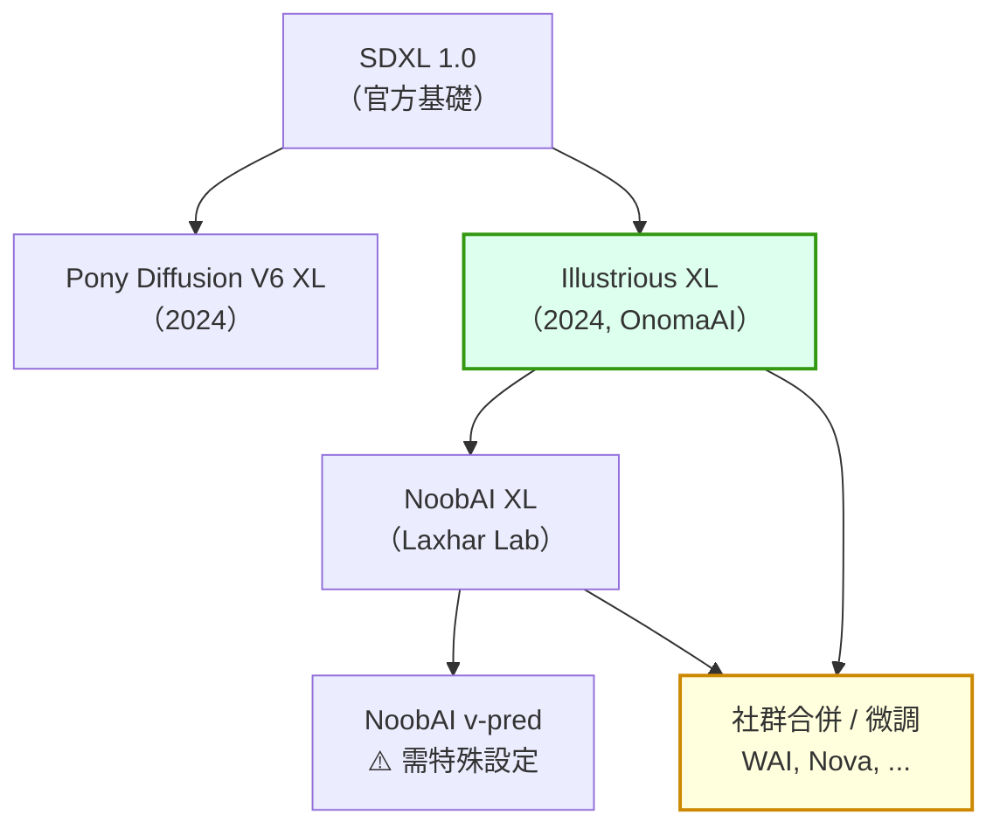
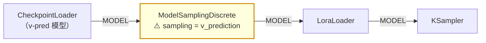

# comfy-3-2 二次元支線：Pony、Illustrious、NoobAI 的來龍去脈

> **本章目標**：搞懂你正在用的模型屬於哪一支、它的兄弟姊妹有哪些——以及**為什麼二次元領域會長出一條獨立的演化線**。

> ⚠️ **時效性**：撰寫於 **2026 年 8 月**。這條線變化很快，請以「分支邏輯」為主、具體型號為輔。

## 你會學到

- 為什麼官方模型畫不好二次元，社群必須自己來
- 📖 三大分支的來歷、特性與生態規模
- ⚠️ **v-prediction 的坑**——換模型時最容易踩的一個
- 怎麼判斷一個陌生模型屬於哪一支

---

## 概念說明

### 起點：官方模型畫不好動漫

Stable Diffusion 原始模型是用網路上的通用圖像訓練的。結果是：

```
畫寫實照片      → 還行
畫動漫 / 插畫    → ⚠️ 很糟：比例怪、線條髒、風格不穩
懂「特定角色」   → ❌ 完全不會
```

原因不難理解——訓練資料裡動漫圖佔比小，而且**沒有結構化的標註**。你打 `1girl, twintails, school uniform`，原始模型不知道這些是什麼。

於是社群自己動手。

---

### 關鍵基礎建設：Danbooru tag 體系

二次元支線之所以能發展起來，靠的是一個現成的東西：**Danbooru 的標籤體系**。

那是一個動漫圖片站，由使用者為每張圖標註結構化標籤：

```
角色數量：1girl, 2girls, solo
髮型：long hair, twintails, blunt bangs
眼睛：purple eyes, jitome, closed eyes
服裝：school uniform, bikini, coat
動作：hands on hips, sitting, from side
構圖：full body, cowboy shot, upper body
```

**幾百萬張圖 × 精確一致的標籤 = 完美的訓練資料。**

> ⚠️ **這就是為什麼二次元模型吃 tag 不吃句子**（`comfy-3-3` 會細講）。它們是用這套標籤訓練的，你講句子它反而不熟。

---

### 一個爭議性的歷史節點

2022 年 10 月，付費服務 NovelAI 的模型權重外洩，被社群廣泛取用與衍生。這件事在技術上有重大影響——它讓社群第一次拿到「真正用 Danbooru 資料好好訓練過」的模型，後續的二次元模型幾乎都受它影響。

> **陳述立場**：這是模型生態史上的客觀事件，理解它有助於你看懂為什麼社群模型的血統這麼糾纏。但**外洩的權重涉及智慧財產爭議**，商業使用前務必確認你的模型授權（`comfy-3-7` 會講怎麼看授權）。

---

### 📖 三大分支



#### Pony Diffusion V6 XL

| | |
|---|---|
| **做法** | 大規模**重新標註**訓練資料，不完全沿用 Danbooru 原標籤 |
| **特色** | 引入 `score_9, score_8_up...` 這類品質分數標籤 |
| **強項** | ⚠️ **LoRA 生態最龐大**（到 2026 年仍是） |
| **弱項** | 構圖有時「booru 味」重、線條相對不夠乾淨、對具名角色的準確度較弱 |
| **⚠️ 特殊要求** | prompt 開頭要加 `score_9, score_8_up, score_7_up` 這串（不加品質明顯下降） |

> 那串 `score_` 標籤是 Pony 特有的，**在 Illustrious 上寫它是無效的**（甚至可能有害，因為那是模型不認識的詞——見 `comfy-2-4`）。從 Pony 換過來時記得刪掉。

#### Illustrious XL

| | |
|---|---|
| **做法** | 直接用 **Danbooru 原生 tag** 體系訓練 |
| **強項** | 線條乾淨、色彩一致、**對具名角色的準確度高**、tag 服從度好 |
| **弱項** | LoRA 生態約為 Pony 的三成左右（2026 年） |
| **prompt** | 純 Danbooru tag，不需要特殊品質前綴 |

> ✅ **你的專案用的 `waiIllustriousSDXL_v170` 屬於這一支**（WAI 是社群基於 Illustrious 的微調／合併版本）。

#### NoobAI XL

| | |
|---|---|
| **做法** | 站在 Illustrious 上繼續訓練，加入更多資料源 |
| **強項** | tag 理解力更強、解剖結構更準 |
| **⚠️ 特殊** | 有 **eps-pred** 與 **v-pred** 兩種變體 |

---

### ⚠️ v-prediction 的坑

**這是換模型時最容易踩的一個，值得單獨講。**

擴散模型有兩種「預測目標」的訓練方式：

| 類型 | 模型預測什麼 | ComfyUI 需要什麼設定 |
|------|------------|---------------------|
| **eps-prediction**（epsilon） | 預測「加了什麼雜訊」 | ✅ 預設就是這個，不用設定 |
| **v-prediction** | 預測一個「速度」向量 | ⚠️ **必須明確告訴 ComfyUI** |

**如果你把 v-pred 模型當成 eps 模型跑**：

```
症狀：出圖是一團彩色雜訊、或整片灰、或顏色嚴重異常
⚠️ 而且不會報錯 —— 它只是安靜地產出垃圾
```

**正確做法**：在 MODEL 線上插一個 `ModelSamplingDiscrete` 節點，把 `sampling` 設成 `v_prediction`。



> ⚠️ **另外**：v-pred 模型常常對 sampler 有特定要求（社群多建議搭配 `euler`），而且 CFG 的適用區間也不同。**下載 v-pred 模型時，一定要看作者的說明頁**。
>
> **給你的建議**：你目前的產線很穩定，**沒有理由去碰 v-pred**。知道這個坑存在，是為了在別人的 workflow 裡看到 `ModelSamplingDiscrete` 時不會困惑。

---

### 合併模型（merge）是怎麼回事

Civitai 上大量模型的描述會寫「這是 A + B + C 的合併」。

**合併就是字面意思**：把幾個模型的權重按比例平均起來。它很便宜（不用訓練，幾分鐘就好），所以社群模型絕大多數是合併出來的。

| 優點 | 缺點 |
|------|------|
| 可以取各家之長（這個的臉 + 那個的背景） | ⚠️ **血統會變得極度混亂** |
| 成本極低 | 沒有人（包括作者）能準確說明它為什麼這樣表現 |
| 常常真的很好用 | ⚠️ 授權可能不清不楚 |

> ⚠️ **實務影響**：這就是為什麼「Illustrious 系的 LoRA 配某個合併模型」有時效果打折——那個合併模型可能混了 Pony 的成分進去。
>
> **判斷方法**：看模型頁的 `Base Model` 標籤，以及作者寫的合併配方。寫得愈清楚的作者通常愈可靠。

---

### 怎麼判斷一個陌生模型屬於哪一支

依可靠度排序：

| 方法 | 說明 |
|------|------|
| 1. **看 Civitai 的 Base Model 欄位** | 最直接 |
| 2. **看作者的 prompt 範例** | 有 `score_9` → Pony；純 Danbooru tag → Illustrious 系 |
| 3. **看它推薦的負面詞與 CFG** | v-pred 模型通常會特別註明 |
| 4. **實測**：用同一組 tag 跑一次 | 風格與服從度會告訴你 |

---

## 📖 分支速查

| 分支 | prompt 前綴 | LoRA 生態 | 特色 |
|------|-----------|:---:|------|
| **Pony V6 XL** | ⚠️ `score_9, score_8_up, ...` | 最大 | 生態豐富，構圖較粗獷 |
| **Illustrious XL** | 不需要 | 中 | ✅ 乾淨、tag 準確（你在用的） |
| **NoobAI（eps）** | 不需要 | 中 | tag 理解更強 |
| **NoobAI（v-pred）** | 不需要 | 中 | ⚠️ **需要 `ModelSamplingDiscrete`** |
| 社群合併模型 | 看作者說明 | — | 血統混亂，實測為準 |

---

## 小練習

1. **確認你的模型血統**：去 Civitai 找 `waiIllustriousSDXL_v170` 的頁面，看它的 Base Model 標籤與作者說明的合併配方。**確認它確實是 Illustrious 系。**

2. **測試跨分支 prompt**：在你的 Illustrious 底模上，prompt 開頭加 `score_9, score_8_up, score_7_up`，同 seed 跟不加的比較。**它不會被忽略**（`comfy-2-4`）——看看它把圖往哪裡拉。

3. **看懂一張陌生 workflow**：找一張用 NoobAI v-pred 的 workflow，確認它有沒有 `ModelSamplingDiscrete` 節點。**沒有的話那張 workflow 是壞的。**

---

## 課外讀物

> 為什麼這條線的模型吃 tag 不吃句子 → `comfy-3-3`
> Danbooru tag 的完整寫法慣例 → `comfy-3-8`
> 模型授權要注意什麼 → `comfy-3-7`
