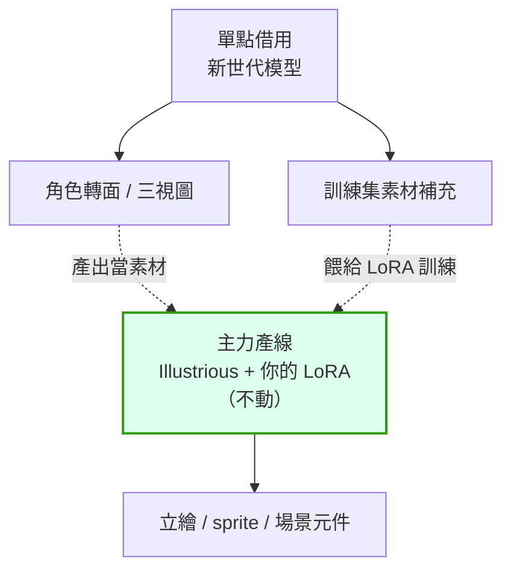

# comfy-3-4 Flux / Qwen 什麼時候值得用

> **本章目標**：知道新世代模型的真實強項與代價，並學會**自己做這個評估**——因為具體型號會換，判斷方法不會。

> ⚠️ **時效性**：撰寫於 **2026 年 8 月**。本章的重點是**評估框架**；型號請以你當下查到的為準。

## 你會學到

- 新世代模型真正贏在哪（三件事）
- ⚠️ 換過去的完整代價清單
- 一個「不換主力，單點借用」的實用模式
- 🔧 怎麼自己重做這個評估（半年後再用一次）

---

## 概念說明

### 它們真正贏在哪

不看行銷素材，看**能力差異**：

#### 強項一：prompt 服從度

因為有 T5 這個真正的語言模型（`comfy-3-3`），它們能處理 CLIP 處理不了的東西：

```
✅ "a girl standing to the left of a lamppost,
    holding a red umbrella in her right hand"
    → 方位、持有關係、左右手，Flux 大致能做對
    → ⚠️ Illustrious 基本上只會理解成「女孩、路燈、紅傘」
```

#### 強項二：圖中文字

這是最明顯的代差。SDXL 系寫字幾乎必然是亂碼，新世代能寫出可讀的文字（Qwen-Image 系在中英文標題上尤其突出）。

> ⚠️ **但對你的專案沒用**：你已經有結論——**UI 一律程式畫**。而且那個結論比「用 AI 產文字」更正確，理由是可控性與可維護性，不是技術限制。

#### 強項三：複雜構圖的一次到位

多物件、多層次的場景，新世代不需要 ControlNet 就能大致排對。

> ⚠️ **對你也幫助有限**：你的場景需求是**精確的分層構圖**（天空 → 遠景樹海 → 近景三棵樹 → 草叢 → 路燈 → 石板路），而且要能反覆微調。**那個精度只有 ControlNet 色塊圖給得起**——不是 prompt 服從度好就能取代的。

---

### ⚠️ 換過去的完整代價

| 項目 | 代價 |
|------|------|
| **角色 LoRA** | ❌ **全部作廢**，要重訓（你已經訓了四版） |
| **風格 LoRA** | ❌ skormino 沒有 Flux 版，要找替代或自己訓 |
| **ControlNet** | ❌ 整套換掉，參數要重調 |
| **prompt 習慣** | ⚠️ tag → 自然語言，全部重寫 |
| **VRAM** | ⚠️ 12GB 要跑量化版，畫質與速度都有損 |
| **速度** | ⚠️ 明顯變慢 |
| **生態** | ⚠️ 二次元 / 像素風的 LoRA 少非常多 |
| **你累積的參數知識** | ⚠️ CFG 的意義都不同了（Flux 用 guidance） |

**粗估：整套產線重建，加上重訓 LoRA 的時間。**

> **結論很清楚**：**不要換。** 你的瓶頸（像素格線、角色一致性）跟底模世代無關。

---

### ✅ 「不換主力，單點借用」

但完全不碰新模型也是浪費。實用的模式是**把它們當工具，不當主力**：



**具體可以借用的地方**：

| 需求 | 借用什麼 | 為什麼 |
|------|---------|--------|
| **角色轉面（正面 → 側面 / 背面）** | 圖像編輯模型（Qwen-Image Edit 類） | ⚠️ 你的 v1 LoRA 就卡在「img2img 改不動姿勢」 |
| **補訓練集的多樣性** | 新模型產出的多視角圖 | 你的 `reference_v2` 就是外部產的 |
| **概念發想** | 任何服從度好的模型 | 快速探索方向 |

> ⚠️ **借用時的關鍵注意**：拿新模型的產出當 LoRA 訓練集，會引入**風格不一致**。你專案的 v3 就吃過類似的虧——`reference_v2` 那批的格線是 6.44px，跟 skormino 的 8px 是兩種規格（`comfy-2-3`）。
>
> **借用前先確認風格對得上**，或接受要多一道統一處理。

---

## 🔧 怎麼自己重做這個評估

**這是本章最重要的部分**——因為半年後型號會變，但流程不變。

### 步驟一：先寫下你的實際瓶頸

不要問「哪個模型最好」，問「**我目前做不到什麼**」。

```
範例（你的專案）：
1. 像素格線在角色 LoRA 產出上留不住
2. 角色跨姿勢的一致性
3. 場景元件要分層產出
4. 五個服裝階段的穩定切換
```

### 步驟二：對每個瓶頸問「換底模有幫助嗎」

| 瓶頸 | 換底模有幫助嗎 | 真正的解法在哪 |
|------|:---:|---------------|
| 像素格線 | ❌ | 風格 LoRA + 畫布尺寸（第 2、4 層） |
| 角色一致性 | ❌ | 角色 LoRA 的訓練集（第 2 層） |
| 分層場景 | ❌ | ControlNet + 分開產（第 3 層） |
| 服裝階段切換 | ❌ | LoRA 的 caption 策略（第 2 層） |

> **四個瓶頸全部不在底模層。** 這個表格做完，「要不要換模型」就有答案了。
>
> 這正是 `comfy-2-13` 影響力階層的應用——**底模是第 1 層，但只有當你的問題真的在第 1 層時，動它才有意義。**

### 步驟三：如果真的需要，用固定測試組做對照

```
準備：
  - 3~5 個你的實際需求場景（不是通用測試圖）
  - 每個場景一組 prompt（各自用該模型的最佳寫法）
  - 固定 seed

比較：
  - 產出品質
  - ⚠️ 產出「達到可用」需要幾次嘗試（這比單張品質重要）
  - 單張耗時
  - VRAM 用量
```

⚠️ **不要用網路上的評測**。那些用的是通用測試圖（風景、人像、靜物），跟你的「像素風角色立繪 + 特定 LoRA」毫無關係。

---

### 一個誠實的預測

**什麼情況你才真的該換？**

| 訊號 | 說明 |
|------|------|
| Illustrious 系停止更新且工具鏈開始壞掉 | 生態理由，不是能力理由 |
| 出現「原生支援像素風」的新架構模型 | 那會是真正的代差 |
| 你的需求變成「要圖中文字」或「複雜語意構圖」 | 需求變了 |
| ⚠️ **新世代出現成熟的二次元微調分支且 LoRA 生態追上** | 這是最可能的觸發點 |

> 最後一項值得每半年查一次。生態遷移通常不是一夕之間，而是「某天你發現想要的 LoRA 都只有新架構的版本」。

---

## 小練習

1. **做一次瓶頸盤點**：用步驟一、二的表格，列出你目前三到五個實際瓶頸，判斷各屬於哪一層。**結果很可能跟本章一樣——都不在底模層。**

2. **設計你的固定測試組**：準備 3 個你最常做的素材類型（立繪 / 小人 / 場景元件），各寫一組 prompt 存起來。**這組測試以後每次評估新模型都能重複使用。**

3. **試一次單點借用**：用線上的圖像編輯模型，拿你的 canon 圖做一次「轉成側面」，看產出能不能用。**這是你 v1 LoRA 卡住的那個問題。**

---

## 課外讀物

> 為什麼你的瓶頸都不在底模層 → `comfy-2-13`
> 角色轉面與三視圖的完整討論 → `comfy-8-8`
> 12GB 跑量化模型的實際限制 → `comfy-3-6`、`comfy-9-4`
