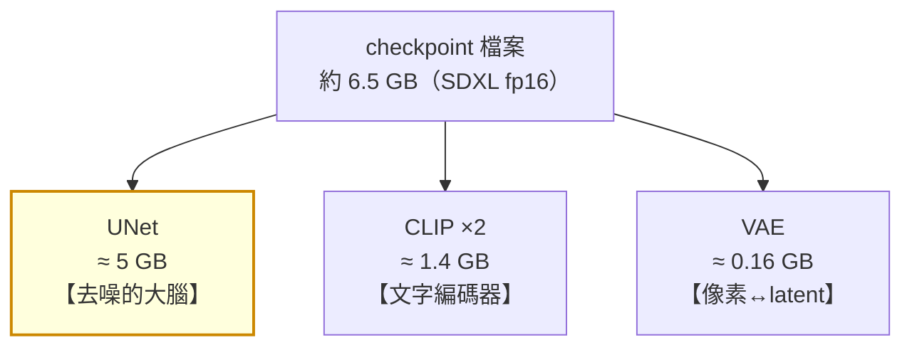
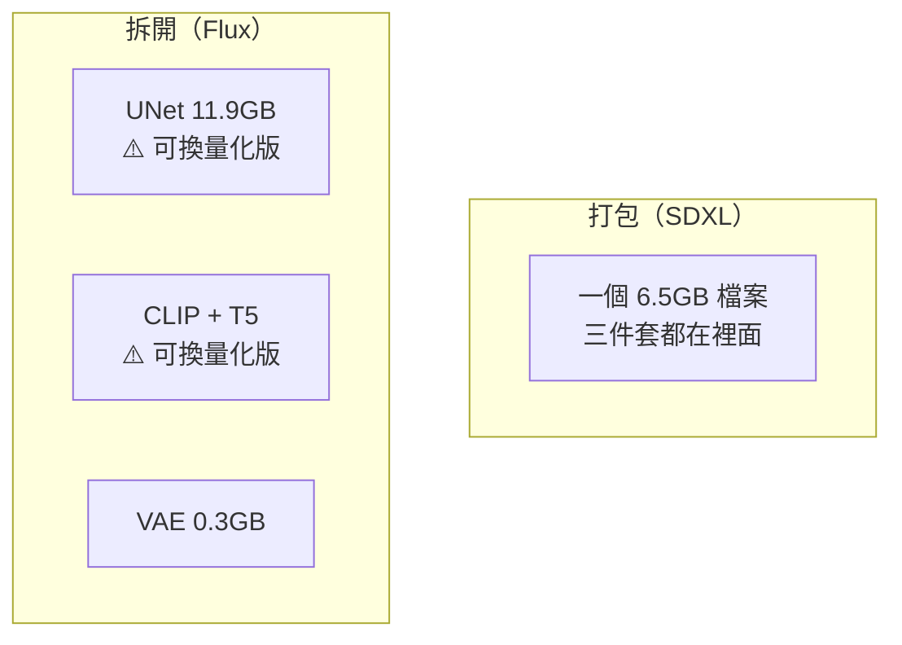

# comfy-3-5 🔬 checkpoint 裡面裝了什麼

> **本章目標**：打開那個 6.5GB 的檔案看看裡面有什麼——並理解為什麼有時候要外掛 VAE、為什麼新架構要三個 Loader。

## 你會學到

- 🔬 checkpoint 的三件套：UNet / CLIP / VAE 各佔多少、各做什麼
- ⚠️ **VAE 壞掉的症狀辨識**，以及什麼時候該外掛
- 為什麼 Flux 系要拆成三個檔案
- LoRA 修改的到底是哪一部分（Part 4 的預習）

---

## 概念說明

### 三件套

`comfy-1-5` 講過 `CheckpointLoaderSimple` 吐出三個東西。現在看它們的實際分量：



| 元件 | 佔比 | 做什麼 | 決定了什麼 |
|------|:---:|--------|-----------|
| **UNet** | 約 77% | 每一步預測雜訊 | ⚠️ **畫風、構圖、內容——幾乎一切** |
| **CLIP** | 約 21% | 文字 → 條件 | 它「聽得懂」哪些詞 |
| **VAE** | 約 2% | latent ↔ 像素 | 顏色還原、細節銳利度 |

> **重點**：模型之間的差異，**九成來自 UNet**。CLIP 通常是共用的（同一架構的模型多半用同一個 CLIP），VAE 也常常直接沿用官方版本。
>
> 所以「這個模型畫風不一樣」= UNet 的權重不一樣。

---

### UNet：去噪的大腦

它是 `comfy-2-1` 裡那個被反覆呼叫 30 次的東西。

**名字的由來**：它的結構長得像字母 U——先把資料一層層壓縮（往下），再一層層還原（往上），中間有橫向的連接。

```
輸入 latent（104×152）
    ↓ 壓縮 → 52×76 → 26×38 → 13×19（最小，處理「整體結構」）
    ↑ 還原 → 26×38 → 52×76 → 104×152
輸出：預測的雜訊
```

**為什麼要這個形狀**：

| 層級 | 在處理什麼 |
|------|-----------|
| 最上層（大尺寸） | 細節、紋理、邊緣 |
| 中間層 | 局部結構（一隻手、一個眼睛） |
| **最深層（小尺寸）** | ⚠️ **整體構圖、語意**（「這是一個人站著」） |

> ⚠️ **這解釋了 `comfy-2-2` 講的「尺寸偏離會長出兩個頭」**：最深層的感受範圍是固定的，畫布太大時它「看不完」整張圖，於是把局部當成整體處理——結果就是重複的頭或身體。
>
> 也解釋了為什麼 ControlNet 要**在早期步驟**注入（`comfy-5-8`）——早期在決定的正是深層的整體結構。

---

### CLIP：文字編碼器

`comfy-2-4` 講過機制。這裡補充一個實務點：

**多數同架構模型的 CLIP 是相同或極相似的**。這帶來一個好處：

```
你的 LoRA 學會的觸發詞（nightheroine）
→ 只要底模的 CLIP 沒被大改，換一個同架構的底模，觸發詞通常還能用
```

> ⚠️ 但**不保證**。合併模型（`comfy-3-2`）有時會混到不同的 CLIP，導致觸發詞的效果改變。換底模時要重新驗證你的 LoRA。

---

### ⚠️ VAE：小但會毀掉一切

只佔 2% 的體積，但它壞掉時整張圖都完了。

#### VAE 壞掉的症狀辨識 📖

| 症狀 | 可能原因 |
|------|---------|
| **整張圖灰灰的、對比很低** | VAE 不對或損壞 |
| **顏色嚴重偏移**（膚色變紫、白色變黃） | VAE 不匹配 |
| **出現規則的方格狀雜訊** | VAE 與模型架構不符 |
| **細節整片糊掉但構圖正常** | ⚠️ 這通常**不是** VAE，是 steps / denoise 問題 |

**判斷方法**：構圖對不對？

```
構圖正常但顏色/質感詭異  → ⚠️ VAE 的問題
構圖本身就崩壞          → 不是 VAE（是 UNet 層級的問題）
```

因為 VAE 只負責最後的解碼，**它影響不了構圖**。

#### 什麼時候該外掛 VAE

| 情況 | 做法 |
|------|------|
| 模型作者說明頁寫「需要外掛 VAE」 | 照做 |
| 出現上述症狀 | 換官方 VAE 試試 |
| 模型檔案特別小（例如 SDXL 只有 5GB） | ⚠️ 可能是「不含 VAE」的版本 |
| 一切正常 | ✅ **不要動**——外掛不會讓好的變更好 |

> ⚠️ **SDXL 與 SD1.5 的 VAE 不能互換**（`comfy-1-6` 提過）。放錯會產出色塊或雜訊。

---

### 為什麼 Flux 要拆成三個檔案

`comfy-1-6` 提過新架構要用 `UNETLoader` + `CLIPLoader` + `VAELoader`。理由現在很清楚：



**拆開的好處**：

| 好處 | 說明 |
|------|------|
| ⚠️ **可以混搭量化版本** | UNet 用 Q4 省 VRAM，VAE 用全精度保畫質 |
| 省硬碟 | 十個 Flux 微調模型可以共用同一個 T5（那個檔案很大） |
| 彈性 | 換文字編碼器不用重下整包 |

> **對 12GB 卡這是關鍵**：Flux 之所以能在 12GB 上跑，就是因為可以只把 UNet 換成量化版（`comfy-3-6`）。

---

### LoRA 改的是哪一部分（Part 4 預習）

`comfy-1-6` 講過 `LoraLoader` 吃 MODEL + CLIP、吐 MODEL + CLIP。現在你知道它們是什麼了：

| LoRA 修改 | 效果 |
|-----------|------|
| **UNet 的權重** | ⚠️ **改變畫法**——這是主要作用 |
| **CLIP 的權重** | 改變某些詞的意義（讓觸發詞有意義） |
| VAE | ❌ **不改**（所以 VAE 可以直接從 checkpoint 取，見 `comfy-1-12`） |

> 這就是 `LoraLoader` 有兩個 strength 的原因：`strength_model` 調 UNet 的修改幅度，`strength_clip` 調 CLIP 的。

---

## 程式碼範例

用偽程式碼看載入過程：

```python
def load_checkpoint(path):
    """checkpoint 就是一個大字典，key 是權重名稱。"""
    state_dict = load_safetensors(path)

    # 依 key 的前綴分成三份
    unet_weights = {k: v for k, v in state_dict.items()
                    if k.startswith("model.diffusion_model.")}
    clip_weights = {k: v for k, v in state_dict.items()
                    if k.startswith("conditioner.")}     # SDXL 的命名
    vae_weights  = {k: v for k, v in state_dict.items()
                    if k.startswith("first_stage_model.")}

    # ⚠️ 如果 vae_weights 是空的，就是「不含 VAE」的版本
    if not vae_weights:
        print("⚠️ 這個 checkpoint 沒有內建 VAE，需要外掛 VAELoader")

    return build_unet(unet_weights), build_clip(clip_weights), build_vae(vae_weights)
```

> **這也是為什麼 `.safetensors` 比 `.ckpt` 安全**（`comfy-0-5`）：safetensors 就是一個「名稱 → 數字陣列」的純資料檔，載入時不會執行任何程式碼。

---

## 小練習

1. **確認你的 checkpoint 有沒有 VAE**：看檔案大小。SDXL fp16 完整版約 6.5GB；明顯小於這個數字的可能缺 VAE 或是量化版。

2. **測試 VAE 的影響**：同 seed 產一張，然後外掛一個不同的 SDXL VAE 再產一次。**比較顏色與細節**——你會發現差異存在但很小（因為 VAE 只佔 2%）。

3. **驗證「構圖 vs VAE」的判斷法**：故意接一個 SD1.5 的 VAE 到 SDXL 流程（如果你有的話），看產出。**構圖應該還在，但顏色完全壞掉**——這驗證了 VAE 影響不了構圖。

---

## 課外讀物

> VAE 的原理與 latent 空間 → `comfy-2-2`
> 量化版本怎麼選 → `comfy-3-6`
> LoRA 到底怎麼修改這些權重 → `comfy-4-1`
