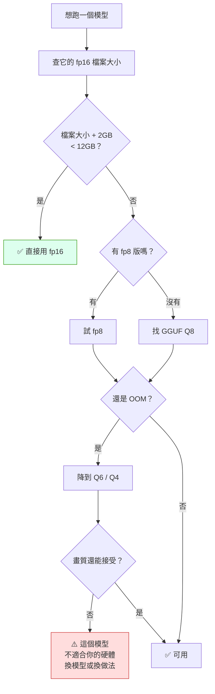

# comfy-3-6 檔案格式與量化：用畫質換 VRAM 的取捨表

> **本章目標**：搞懂 fp16 / fp8 / GGUF 這些標記代表什麼，以及**在 12GB 上該怎麼選**。

## 你會學到

- 🔬 精度是什麼：為什麼同一個模型有好幾種大小
- fp32 / fp16 / bf16 / fp8 / GGUF 的取捨表
- ⚠️ 量化的代價**不是均勻的**——哪些東西先壞
- 12GB 的實用決策流程

---

## 概念說明

### 模型就是一堆數字

一個模型的「權重」就是幾十億個小數。**用多少位元存一個小數，就決定了檔案多大**：

```
同一個模型（假設 20 億個權重）：
    每個權重用 32 bit → 8.0 GB
    每個權重用 16 bit → 4.0 GB     ← 一半
    每個權重用  8 bit → 2.0 GB     ← 四分之一
    每個權重用  4 bit → 1.0 GB     ← 八分之一
```

**這就是量化**：用比較少的位元存同一組數字，接受一點精度損失。

> 這跟 `cs-1-4` 講的浮點數精度是同一件事 → [cs-1-4：浮點數與它的精度陷阱](../../cs/part-1/cs-1-4-floating-point.md)

---

### 📖 格式對照表

| 格式 | 位元 | 相對大小 | 畫質 | 什麼時候用 |
|------|:---:|:---:|:---:|------|
| **fp32 / full** | 32 | 100% | 基準 | ❌ 產圖用不到；只有訓練才需要 |
| **fp16** | 16 | 50% | ✅ 幾乎無損 | ✅ **預設選擇** |
| **bf16** | 16 | 50% | ✅ 幾乎無損 | 訓練時較常見，產圖跟 fp16 差不多 |
| **fp8** | 8 | 25% | ⚠️ 輕微損失 | VRAM 不夠時的第一步 |
| **GGUF Q8** | ~8 | ~27% | ⚠️ 輕微損失 | 類似 fp8，但相容性更廣 |
| **GGUF Q6_K** | ~6 | ~21% | ⚠️ 可察覺 | 折衷 |
| **GGUF Q4_K_M** | ~4 | ~14% | ❌ 明顯損失 | ⚠️ **12GB 跑大模型的最後手段** |

> **一句話結論**：**SDXL 系用 fp16，不用煩惱。** 量化只有在跑 Flux 或影片模型時才需要考慮。

---

### safetensors vs ckpt（複習與補充）

`comfy-0-5` 講過資安面，這裡補充技術面：

| | `.safetensors` | `.ckpt` |
|---|---|---|
| 本質 | 純資料格式 | Python pickle |
| 載入時 | 只讀數字 | ⚠️ **會執行程式碼** |
| 載入速度 | 快（可 memory-map） | 慢 |
| 資安 | ✅ 安全 | ❌ 可夾帶惡意程式 |

> **規則**：有 safetensors 就不要碰 ckpt。**沒有例外。**

---

### ⚠️ 量化的代價不是均勻的

**這是本章最重要的觀念。**

很多人以為量化就是「整體畫質降一點」。實際上損失會**集中在特定的東西上**：

| 先壞的 | 後壞的 |
|--------|--------|
| ⚠️ **細微的顏色漸層**（膚色過渡、陰影） | 大結構、構圖 |
| ⚠️ **精細的邊緣**（髮絲、線條銳利度） | 主體辨識度 |
| ⚠️ **罕見概念**（訓練資料裡少見的東西） | 常見概念 |
| 手指、小物件 | 臉的大致輪廓 |

**為什麼**：量化是把數字「四捨五入」到較粗的刻度。權重值分布在極端區間的（代表罕見、精細的特徵）最容易被抹平。

> ⚠️ **對你的像素風產線，這件事有具體影響**：
>
> **像素風的核心是硬邊**（`comfy-2-3`）。量化最先損害的正是「精細的邊緣」——所以**量化模型對像素風的傷害，會比對寫實照片大**。
>
> 這跟 VAE 編解碼、非整數倍縮放是同一類問題：**任何抹平高頻資訊的操作，都是像素風的敵人**（`comfy-4-17`）。

---

### 12GB 的決策流程



**套用到實際模型**：

| 模型 | fp16 大小 | 12GB 的選擇 |
|------|:---:|------|
| **SDXL / Illustrious** | 6.5 GB | ✅ **fp16 直接用** |
| SD 3.5 Large | 16 GB | ⚠️ fp8 或 GGUF |
| Flux.1 dev | 24 GB | ⚠️ **GGUF Q4~Q6**（+ 可拆開只量化 UNet） |
| 影片模型 14B | 28+ GB | ⚠️ GGUF Q4，且慢 |

> ⚠️ 記得 `comfy-0-7` 的估算法：**需要的 VRAM ≈ 檔案大小 × 1.2 + 中間暫存**。不要只看檔案大小。

---

### 拆開量化的技巧

`comfy-3-5` 提過新架構可以拆成三個檔案。這帶來一個省 VRAM 的技巧：

```
UNet     → 用 GGUF Q4（它最大，量化收益最高）
CLIP/T5  → 用 fp8 或 fp16
VAE      → ⚠️ 用 fp16（它很小，而且它負責最終畫質，不值得省）
```

> **原則**：**量化最大的那個，保留最小但關鍵的那個。** VAE 只有 300MB，量化它省不了多少 VRAM，卻直接損害最終輸出。

---

### 怎麼判斷量化損失可不可接受

**不要看評測分數，用你自己的素材測**：

```
1. 準備 3 張你的典型需求（立繪 / 小人 / 場景元件）
2. 同 seed、同參數，分別用 fp16 與量化版產出
3. ⚠️ 放大看：
   - 臉部細節
   - 邊緣銳利度（對你＝格線）
   - 顏色過渡
4. 如果量化版在「你在乎的那個點」上明顯變差 → 不可接受
```

> ⚠️ **「整體看起來差不多」是不夠的判準**。你的專案踩過這個坑（`comfy-6-4`）：指標全綠、整體看起來對，**放大才發現臉糊了**。

---

## 程式碼範例

用數字看量化在做什麼：

```python
# 一個權重值，用不同精度儲存
original = 0.13725490196078431

fp32 = 0.13725490196078431      # 完整精度
fp16 = 0.1372070312500          # 略有捨入
fp8  = 0.1367187500000          # ⚠️ 捨入變粗
q4   = 0.1250000000000          # ❌ 明顯偏離

# ⚠️ 關鍵：單一權重的誤差很小，但幾十億個權重的誤差會在
#    30 步的迭代中累積 —— 這就是為什麼低量化版的細節會流失
```

**這也解釋了為什麼量化對「步數多的流程」影響更大**：誤差每一步都在累積。

---

## 小練習

1. **檢查你的模型格式**：確認你的底模是 fp16 版本（檔案大小約 6.5GB）。如果是 fp32（13GB），換成 fp16——**畫質幾乎沒差，但省一半 VRAM 與載入時間**。

2. **做一次量化對照**（如果你有量化版模型）：同 seed 產出 fp16 與量化版，**放大看髮絲與像素格線**。體會「損失不是均勻的」。

3. **算一次可行性**：挑一個你想試的影片模型，查它的 fp16 大小，用決策流程判斷你的 12GB 該選哪個版本。**下載前先算，省時間。**

---

## 課外讀物

> 浮點數精度的完整說明 → [cs-1-4：浮點數與它的精度陷阱](../../cs/part-1/cs-1-4-floating-point.md)
> VRAM 的估算與能力邊界 → `comfy-0-7`
> 影片模型的量化實務 → `comfy-9-4`
