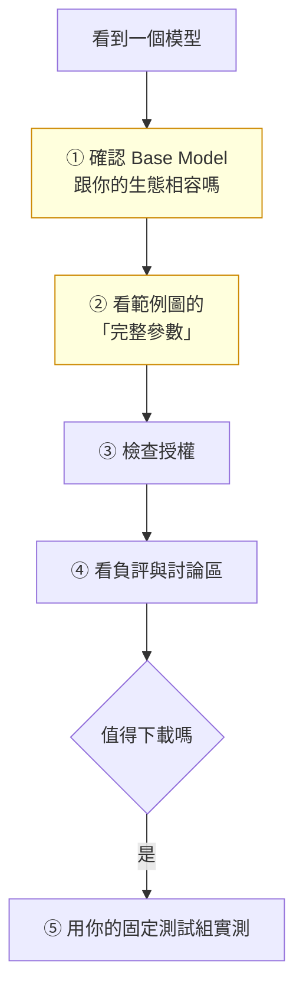

# comfy-3-7 從 Civitai / HuggingFace 挑模型

> **本章目標**：學會快速判斷一個模型值不值得下載——以及**授權那件事，在你要把素材放進商業遊戲時會變成真問題**。

## 你會學到

- 一套五分鐘的模型評估流程
- ⚠️ **範例圖的陷阱**：為什麼「作者的圖很棒」不代表你能產出同樣的東西
- 📖 授權標記怎麼看，以及商業使用的實際風險
- 建立你自己的「模型評估基準組」

---

## 概念說明

### 五分鐘評估流程



---

### ① Base Model：先擋掉不相容的

`comfy-3-1` 講過相容性規則。**這一步就能刷掉一半**：

```
你要找 Illustrious 系的 LoRA
→ 看到 Base Model 寫 "SD 1.5" → ❌ 直接跳過
→ 寫 "Pony" → ⚠️ 可用但效果打折
→ 寫 "Illustrious" / "NoobAI" → ✅ 繼續看
```

---

### ② 範例圖：最有價值也最容易被騙的地方

Civitai 每張範例圖底下有完整的生成參數。**這是作者把配方直接給你**——`comfy-0-5` 提過，這是這個網站最被低估的功能。

**要看什麼**：

| 看什麼 | 為什麼 |
|--------|--------|
| 掛了**哪些其他 LoRA** | ⚠️ 那張漂亮的圖可能疊了五支 LoRA，不是這支的功勞 |
| 用什麼**底模** | 可能不是你要用的那個 |
| CFG / sampler / steps | 作者的實測起點，照抄就好 |
| **有沒有做放大 / 修臉** | 很多範例圖經過 hires fix 與 FaceDetailer |
| 觸發詞 | ⚠️ **忘了記就等於廢了**（`comfy-0-5`） |

#### ⚠️ 範例圖的三個陷阱

**陷阱一：疊了一堆東西**

最常見。範例圖用了 3~5 支 LoRA、經過兩階段放大、修過臉。你單獨掛這一支，出來的東西差很遠。

> **辨識法**：看參數區有沒有多個 `<lora:...>` 標記，或 workflow 特別複雜。

**陷阱二：挑過的**

作者放的是產一百張裡最好的那張。**這很正常**（你自己也會這樣做），但你要調整期待——**看的是「最好情況」，不是「平均水準」**。

> **更有用的判斷**：看範例圖的**一致性**。如果十張範例圖風格穩定，代表模型可控；如果每張差很多，代表要靠運氣。

**陷阱三：跟你的題材無關**

模型的範例圖全是半身特寫，你要產全身立繪——**那些範例圖不能告訴你它在全身構圖上的表現**。

---

### ③ 授權：對商業遊戲這是真問題 ⚠️

Civitai 的模型頁有一組授權標記，常見的有：

| 標記 | 意思 |
|------|------|
| **允許商業使用** | 產出可用於商業用途 |
| ⚠️ **不允許商業使用** | 產出只能自用 |
| 允許販售產出圖片 | 可以賣圖 |
| ⚠️ **不允許在付費服務中使用模型** | 不能拿去做圖像生成服務 |
| 要求署名 | 使用時要標明來源 |
| ⚠️ **不允許合併後改變授權** | 合併模型的授權要跟著走 |

**對你的情況（產遊戲素材）**，關鍵問題是：

```
1. 底模允許商業使用嗎？
2. 你掛的每一支 LoRA 呢？
3. ⚠️ 如果底模是合併模型，它混進來的成分授權清楚嗎？
```

> ⚠️ **誠實的說明**：這個領域的法律狀態**在多數司法管轄區仍不明確**——AI 產出的著作權歸屬、訓練資料的合法性、模型授權的可執行性，都還在演變中。而且 `comfy-3-2` 提到的血統問題，讓「這個模型的授權到底有沒有效」變得更複雜。
>
> **我能給的實務建議**：
> - **記錄你用了什麼**（模型名稱、版本、授權標記、下載日期）——出問題時你至少說得出來
> - **優先選授權清楚、允許商業使用的模型**
> - ⚠️ **如果這個遊戲要商業發行，這件事值得找法務確認**，我的說明不能取代法律意見
>
> 這正是「你不熟的領域要主動標風險」——**授權風險不會在產圖時報錯，它會在你上架後才出現。**

---

### ④ 討論區：找負評

模型頁的留言區與 review 常常藏著最有用的資訊：

| 找什麼 | 為什麼 |
|--------|--------|
| ⚠️ **「這個模型在 X 情況下會壞」** | 這是你在範例圖上看不到的 |
| 推薦的參數修正 | 作者寫的可能不是最佳 |
| 「跟 Y LoRA 衝突」 | 相容性資訊 |
| **更新後變差的抱怨** | 有時舊版本比新版好 |

> **一個實用習慣**：如果一個模型有多個版本，**看看社群是不是還在用舊版**。「v3 出了但大家還在用 v2」通常代表新版有問題。

---

### ⑤ 用你自己的測試組實測

⚠️ **這一步不能省。** 網路上的評測用的是通用測試圖，跟你的需求無關。

**建立你的固定測試組**（`comfy-3-4` 提過）：

```
測試 1：角色立繪（掛你的角色 LoRA，全身站姿）
測試 2：小人 sprite（小尺寸、要看格線）
測試 3：場景元件（掛 ControlNet 色塊圖）

固定：seed、prompt、CFG、sampler、尺寸
變數：只有底模
```

**評估標準要事先寫下來**，而不是產完再說「感覺不錯」：

| 評估項 | 怎麼判斷 |
|--------|---------|
| 風格是否對得上 canon | 並排比較 |
| **像素格線有沒有保住** | ⚠️ 量測（`comfy-6-3`）**且放大看臉** |
| 我的 LoRA 還能用嗎 | 觸發詞有沒有生效 |
| 產出一張可用的要試幾次 | ⚠️ **這比單張品質重要** |

---

### 硬碟管理：什麼時候該刪

`comfy-0-5` 提過硬碟會爆炸。一個實用的淘汰規則：

```
下載後兩週內沒用過 → 刪
有更好的替代品     → 刪
只用過一次做實驗   → 刪（記下模型名稱就好，要用再下載）
```

⚠️ **但 LoRA 不要隨便刪**——尤其是你自己訓練的。它們很小，而且重訓的成本遠高於保存。

> **建議的保留策略**：
> - 底模：留 2~3 個真的在用的
> - **你自己訓的 LoRA：全部留，並且異地備份**（`comfy-0-4` 講過 `user/` 與訓練產出是不可取代的）
> - 別人的 LoRA：常用的留著，其他記下名稱與來源網址即可

---

## 程式碼範例

把評估流程做成一份可填寫的紀錄格式：

```markdown
## 模型評估：<模型名稱> <版本>

- **來源**：<網址>
- **Base Model**：Illustrious / Pony / SDXL / ...
- **授權**：商業使用 ✅/❌ ｜ 署名要求 ✅/❌
- **檔案**：safetensors / fp16 / <大小>
- **作者建議參數**：CFG _ / sampler _ / steps _
- **觸發詞**：⚠️ <一定要記>
- **下載日期**：2026-08-__

### 實測（固定測試組，seed 8888）
| 測試 | 結果 | 備註 |
|------|------|------|
| 立繪 | | |
| sprite（看格線） | | |
| 場景元件 | | |

### 結論
- [ ] 採用　[ ] 淘汰
- 理由：
```

> 這份格式的價值在於**強迫你在下載前就想清楚評估標準**，而不是產完幾張憑感覺決定。

---

## 小練習

1. **建立你的測試組**：把三組測試 prompt 與參數存成 workflow 檔案（`test-portrait.json` / `test-sprite.json` / `test-scene.json`）。**這是一次性投資，之後每次評估模型都能用。**

2. **檢查你現有模型的授權**：把你機器上的底模與 LoRA 列出來，逐一查授權標記。**你可能會發現有些是不允許商業使用的**——這在遊戲要上架前必須處理。

3. **拆解一張範例圖**：找一張你覺得很棒的 Civitai 範例圖，把它的完整參數列出來，**數一數它疊了幾支 LoRA、做了幾階段處理**。這會校準你對「模型能力」的期待。

---

## 課外讀物

> 相容性規則 → `comfy-3-1`
> 為什麼要記錄配方 → `comfy-2-11`、`comfy-7-6`
> `.ckpt` 的資安風險 → `comfy-0-5`
