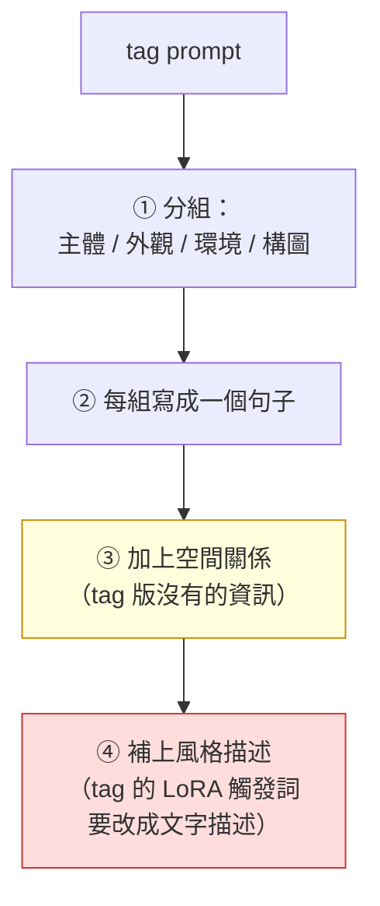

# comfy-3-9 Prompt 工程（二）：自然語言式模型怎麼寫

> **本章目標**：學會寫給 Flux / Qwen / SD3 這類模型的 prompt。**即使你不打算換主力，這章也有用**——因為你偶爾會單點借用它們（`comfy-3-4`）。

## 你會學到

- 自然語言式 prompt 的結構
- ⚠️ **兩種模型的思維差異**：查詢 vs 描述
- 什麼能寫、什麼還是不能寫（有些限制是共通的）
- 一個實用的轉換練習：把你的 tag prompt 翻成句子

---

## 概念說明

### 核心差異：查詢 vs 描述

`comfy-3-3` 提過這個心法，這裡展開：

```
tag 式（Illustrious）：你在「查詢」一張圖
    → 列出關鍵字，模型去找符合這些關鍵字的分布

句子式（Flux）：你在「描述」一張圖
    → 說明一個場景，模型去理解並組合出來
```

**兩者的寫作策略完全相反**：

| | tag 式 | 句子式 |
|---|---|---|
| 冗詞（`a`, `the`, `with`） | ❌ 浪費 token | ✅ **必要的語法結構** |
| 完整句子 | ❌ 效率差 | ✅ 正確做法 |
| 空間關係 | ❌ 無效 | ✅ **有效** |
| 一個概念一個詞 | ✅ | ⚠️ 太破碎反而不好 |
| 長度 | 愈短愈好（<75 token） | ✅ 可以長很多 |

---

### 自然語言 prompt 的結構

一個好的句子式 prompt 通常有這個骨架：

```
1. 主體是什麼、在做什麼
2. 主體的外觀細節
3. 環境與背景
4. 空間關係（⚠️ 這是句子式的特權）
5. 光線與氛圍
6. 風格與媒材
```

**實例**（把你的角色需求翻成句子式）：

```
A slender young woman with long straight grey hair and blunt bangs,
wearing a white hairband with a bow, purple eyes with a cold
half-lidded expression. She wears an open khaki trench coat over a
black bikini, hands on her hips, standing in a dimly lit park at
night. A streetlight glows behind her to the left, casting a long
shadow toward the viewer. Pixel art style with visible 8-pixel
color blocks, limited palette, full body shot.
```

⚠️ **注意第四點**：`a streetlight behind her to the left` ——**這在 Illustrious 上完全無效**，但句子式模型能做到。

---

### 三個句子式的特權

#### 特權一：空間關係

```
✅ "standing to the left of the tree"
✅ "the cat sits under the table"
✅ "a sign hangs above the door"
```

> **這是換模型最正當的理由之一**。如果你的素材需求是「精確的物件相對位置」而且不想畫 ControlNet 控制圖，句子式模型值得考慮。
>
> ⚠️ **但對你的場景產線仍然不如色塊圖**——你需要的是**可重複、可微調**的精確構圖，而不是「大致對」。色塊圖改一個像素就改一次構圖，句子式模型只能重新描述。

#### 特權二：否定（部分有效）

```
⚠️ "a woman without glasses"    → 通常有效，但不保證
```

比 CLIP 好很多（CLIP 是完全無效），但**仍然不如負面提示詞可靠**。而且 Flux dev 在 CFG 1.0 下負面提示詞失效（`comfy-2-10`），所以否定只能寫在正面。

#### 特權三：圖中文字

```
✅ 'a wooden sign that reads "OPEN"'
```

**這是最大的能力差距**。但對你的專案沒用（UI 一律程式畫）。

---

### ⚠️ 仍然做不到的事（共通限制）

不要以為換了模型就萬能。以下對兩種模型**都**很困難：

| 限制 | 說明 |
|------|------|
| **精確的數量**（超過三四個） | 「畫七棵樹」通常不準 |
| **精確的比例與尺寸** | 「這棵樹是那個人的三倍高」 |
| **一致性**（跨圖同一個角色） | ⚠️ **這仍然要靠 LoRA 或 IPAdapter** |
| **精確的顏色數值** | 「RGB(116,116,116) 的頭髮」→ 沒有模型做得到 |
| 複雜的多物件精確排列 | ControlNet 仍是唯一可靠解 |

> ⚠️ **第三項對你最重要**：你的核心需求是**角色一致性**，而那件事跟模型的語言理解能力**無關**。換到 Flux 一樣要訓 LoRA。

---

### 兩種模型的 prompt 不能互抄

**這是換模型時最常見的失敗**：

| 錯誤做法 | 後果 |
|---------|------|
| 把 tag prompt 直接餵給 Flux | ⚠️ 破碎的關鍵字，Flux 的 T5 無法發揮 |
| 把句子 prompt 直接餵給 Illustrious | ⚠️ 冗詞吃掉 token，關鍵資訊被稀釋 |
| 把 `score_9, ...` 帶到 Illustrious | ⚠️ 模型不認識的詞，往隨機方向拉 |
| 把 `masterpiece, best quality` 帶到 Flux | ⚠️ 通常無害但無效 |

> **換模型 = prompt 全部重寫。** 這是 `comfy-3-4` 那張「換過去的代價」表裡最容易被低估的一項。

---

### 一個實用的轉換方法

如果你需要把既有的 tag prompt 轉成句子式：



⚠️ **步驟四是最大的問題**：你的 `pixpix, 8-bit, pixel_art` 是**觸發詞**，指向一支特定 LoRA 學到的畫風。換到 Flux 上，那個 LoRA 不存在，你只能用文字描述「像素風」——**而文字描述出來的像素風，跟 skormino 的 8px 硬邊完全是兩回事**。

> **這再次說明**：你的產線核心資產不是 prompt，是**那幾支 LoRA**。它們才是綁死你在 SDXL 生態的東西——而那是好事，因為它們也是你的成果。

---

## 程式碼範例

一個對照，同樣的需求兩種寫法：

```python
# 給 Illustrious（tag 式）—— 約 30 tokens
PROMPT_TAG = (
    "masterpiece, nightheroine, 1girl, solo, "
    "open coat, bikini, hands on hips, standing, "
    "full body, night park"
)
# ⚠️ 髮色/臉/身材刻意不寫 —— 那些由 LoRA 管（comfy-4-7）


# 給 Flux（句子式）—— 約 90 tokens
PROMPT_NL = (
    "A slender young woman with long straight grey hair and blunt bangs "
    "wearing a white hairband, stands with her hands on her hips in a "
    "dimly lit park at night. Her khaki trench coat hangs open over a "
    "black bikini. A streetlight glows behind her to the left. "
    "Retro pixel art style with chunky visible pixels and a limited palette. "
    "Full body shot."
)
# ⚠️ 所有角色特徵都必須寫出來 —— 因為沒有 LoRA 幫你記
```

**注意兩者的長度差三倍，而且句子版還不保證角色一致。** 這就是「LoRA 的價值」最直觀的展示。

---

## 小練習

1. **做一次轉換**：把你目前的立繪 prompt 翻成句子式，用線上的 Flux 服務產一張。**跟你的 canon 比較**——看差多遠。

2. **測試空間關係**：用句子式模型試「角色站在路燈左邊」，產五張，統計命中率。**跟你在 Illustrious 上做同樣測試的結果比較**（`comfy-3-3` 的練習 3）。

3. **體驗一致性的問題**：用同一段句子式 prompt 產五張，**看看是不是同一個角色**。這會讓你理解為什麼 LoRA 不可取代。

---

## 課外讀物

> tag 式模型的完整寫法 → `comfy-3-8`
> 為什麼你不該換主力模型 → `comfy-3-4`
> 角色一致性的真正解法 → `comfy-4-1`（LoRA）
