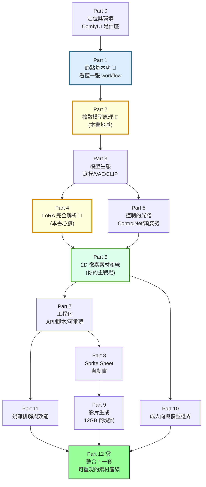

# ComfyUI 生成式美術課程大綱

> **核心理念**：你已經能靠 AI 產出圖了——這門課要解決的是**你不知道自己為什麼成功**。
> 「CFG 設 3.5」「skormino 權重 0.7 以上大衣會褪色」「openpose 對像素風會毀臉」這些都是**結論**，不是知識。
> 結論換一個題材就失效，知識不會。這門課要把你手上那疊結論，還原成背後的模型：
> **一張 workflow 圖每個節點在幹嘛、擴散模型在做什麼、LoRA 為什麼是「小補丁」、控制手段的光譜長什麼樣。**
> 學完你能自己下判斷，而不是每次都要問 AI「這個參數要設多少」。

---

## 這門課的定位

| | 說明 |
|---|------|
| **適合對象** | **接觸過 ComfyUI，但本質上還是白紙的人**。你知道它是「用節點串起產圖流程」，但說不出有哪些節點、線為什麼接不上去、KSampler 裡那堆欄位是什麼。過去都是 AI 幫你接好，你看過就忘。 |
| **目標** | 學完能：**看懂並手接任何一張 workflow**；說得出每個節點與參數在做什麼；**訓練並驗收 LoRA**；用 ControlNet／IPAdapter／inpaint **精確控制構圖與角色**；把 ComfyUI **當成服務接進程式專案**；理解影片模型與 12GB VRAM 的真實邊界。 |
| **前置知識** | **不需要任何 AI／機器學習背景**，也不需要會用 ComfyUI——跑過一次、看過節點畫面就夠。本課用類比與圖表講原理，只在能改變你決策的地方講到公式的直覺。 |
| **主戰場** | 2D 像素風遊戲素材：角色立繪、小人 sprite、場景元件。後半段延伸到 sprite sheet、影片、以及成人向差分。 |
| **實例來源** | 本課大量引用 `crashgame` 專案的真實紀錄（`docs/art-pipeline.md`、`tools/comfy/`、`tools/lora/`）——**包含四次 LoRA 訓練的失敗史**。踩過的坑比成功配方值錢。 |

> **這門課跟網路教學的差別**：網路上多數 ComfyUI 教學是「照著接這幾個節點」。本課反過來——**先講為什麼要接**，讓你有能力判斷別人（或 AI）給你的 workflow 哪裡是必要的、哪裡是抄來的贅節點。

> 標 🔬 的章節是**原理**（可能有點硬，但不懂就永遠只能抄參數），標 🔧 的是**動手做**，標 ⚠️ 的是**本專案真的踩過的坑**，標 📖 的是**可回頭查的參考章節**，標 🏆 的是整合專案。

---

## 學習路徑總覽

> 脈絡：**先學會讀圖（Part 1，先給你「節點的語言」）→ 再懂圖是怎麼生出來的（Part 2 地基）→ 知道有哪些模型可選（Part 3）→ 兵分兩路學「改變模型」（Part 4 LoRA）與「約束模型」（Part 5 控制）→ 匯流到實際產線（Part 6）→ 工程化（Part 7）→ 再往動畫、影片、成人向延伸。**
>
> **Part 1 是白紙讀者的入口**：它只講「語法」（節點怎麼接、資料型別是什麼、有哪些節點），不講「語意」（參數為什麼設那個值）——語意留給 Part 2。**先能讀懂圖，再問為什麼。**
>
> Part 2 與 Part 4 是本書最硬的兩段，也是投資報酬率最高的兩段。

---

## Part 0 — 開始之前：你在用的到底是什麼

> 先把「ComfyUI 是什麼類型的軟體」搞清楚。用錯心智模型，後面每一步都會卡。

### 章節列表

- `comfy-0-1` 為什麼你 vibe 得很順卻什麼都沒學到——結論 vs 知識，這門課要補的缺口
- `comfy-0-2` 🔬 ComfyUI 不是繪圖軟體，是**有向無環圖（DAG）執行引擎**——用前端工程師熟悉的 build pipeline 來理解它
- `comfy-0-3` ComfyUI vs A1111 vs Fooocus vs 線上服務：為什麼專業產線最後都走向 ComfyUI
- `comfy-0-4` 安裝與目錄結構：portable / Desktop / 手動裝，以及 `models/` 底下每個資料夾各放什麼
- `comfy-0-5` 模型從哪來、放哪裡：檔案大小、命名、以及「為什麼你的模型下拉選單是空的」
- `comfy-0-6` ComfyUI Manager：裝 custom node、修 missing node、以及**它為什麼是最大的不穩定來源**
- `comfy-0-7` 🔬 硬體現實：VRAM 決定你能做什麼——12GB（RTX 4070）的能力邊界地圖
- `comfy-0-8` 🔧 跑通第一張圖（先照做就好，下一個 Part 會把它整個拆給你看）

---

## Part 1 — 節點基本功：看懂一張 workflow 📖

> **白紙讀者的真正入口。** 這個 Part 教你 ComfyUI 的「語言」——
> 節點是什麼、線為什麼有顏色、有哪些節點可用、怎麼從一張陌生的圖看出它在幹嘛。
>
> **這裡刻意不解釋參數該設多少**（那是 Part 2 的事）。目標只有一個：
> 從此以後 AI 丟給你一張 workflow，你看得懂它，而不是只能按下 Queue。

### 1-A 介面與規則

- `comfy-1-1` 畫布最小操作集：加節點、連線、搜尋、複製、刪除、整理——十個動作打天下
- `comfy-1-2` 🔬 **線為什麼接不上去**：ComfyUI 的資料型別系統——`MODEL` / `CLIP` / `VAE` / `CONDITIONING` / `LATENT` / `IMAGE` / `MASK` 各是什麼，一張型別對照圖
- `comfy-1-3` 節點的解剖：輸入孔、輸出孔、widget（欄位）——以及 **widget 怎麼轉成可連線的 input**
- `comfy-1-4` 🔬 **按下 Queue Prompt 之後發生什麼**：執行順序、節點快取、為什麼改一個 seed 會整條重跑、為什麼改 prompt 只重跑一半
- `comfy-1-5` 🔧 預設 workflow 逐節點導覽：七個節點，一個一個講——**這章結束你會知道最小可用產圖鏈長什麼樣**

### 1-B 節點地圖：到底有哪些工具 📖

> 這五章是**參考章節**，不用背，當字典查。每個節點都寫「它吃什麼、吐什麼、什麼時候會用到」。

- `comfy-1-6` 📖 節點地圖（一）**載入類**：`CheckpointLoaderSimple` / `LoraLoader` / `VAELoader` / `ControlNetLoader` / `CLIPLoader` / `UNETLoader` / `UpscaleModelLoader`
- `comfy-1-7` 📖 節點地圖（二）**條件類**：`CLIPTextEncode`、以及 `ConditioningCombine` / `Concat` / `SetArea` / `Zero` 分別在做什麼
- `comfy-1-8` 📖 節點地圖（三）**Latent 類**：`EmptyLatentImage` / `VAEEncode` / `VAEDecode` / `LatentUpscale` / `LatentComposite` / `SetLatentNoiseMask` / `VAEEncodeForInpaint`
- `comfy-1-9` 📖 節點地圖（四）**取樣類**：`KSampler` vs `KSamplerAdvanced` vs `SamplerCustom`——三者差在哪、什麼時候需要進階版
- `comfy-1-10` 📖 節點地圖（五）**影像與遮罩類**：`LoadImage` / `SaveImage` / `PreviewImage` / `ImageScale` / `ImageBatch` / `ImageCrop` / 遮罩相關節點

### 1-C 讀圖與整理

- `comfy-1-11` **怎麼讀一張陌生的 workflow**：從 `SaveImage` 往回追的閱讀法——一套可重複的拆解步驟
- `comfy-1-12` 🔧 讀圖實戰：把 crashgame 的 `heroine-lora.json` 與 `scene-element.json` 完整拆給你看
- `comfy-1-13` 讓大圖可維護：Mute / Bypass 的差別、Group、Reroute、Note、Subgraph——**以及 Bypass 為什麼常常是除錯的第一步**
- `comfy-1-14` 📖 custom node 生態導覽：rgthree / Impact Pack / WAS / Efficiency / KJNodes / Crystools / ControlNet Aux——**各自解決什麼問題，哪些幾乎是必裝**
- `comfy-1-15` 🔧 **從零手接一張 txt2img workflow**——不准複製貼上。接得出來，Part 1 才算過關

---

## Part 2 — 擴散模型原理：一張圖是怎麼長出來的 🔬

> **本書地基。** 這個 Part 講完，你手上那些「魔法參數」會全部變成有道理的選擇。
> 不碰數學公式，但每個概念都會講到「所以你該怎麼調」。

### 章節列表

- `comfy-2-1` 🔬 從雜訊到圖：擴散（diffusion）的直覺——**它不是「畫圖」，是「從雜訊裡雕出圖」**
- `comfy-2-2` 🔬 為什麼要在 latent space 做：VAE 是什麼、為什麼畫布尺寸必須是 8 的倍數
- `comfy-2-3` 🔬 ⚠️ **畫布尺寸就是畫風**：為什麼 832×1216 和 1024×1536 的像素顆粒粗細不同（crashgame 真實案例）
- `comfy-2-4` 🔬 文字怎麼變成條件：CLIP / text encoder、token、以及 77 token 限制的真相
- `comfy-2-5` 🔬 為什麼 tag 順序＝權重、`(word:1.2)` 語法在做什麼、BREAK 有沒有用
- `comfy-2-6` 🔬 負面提示詞（negative prompt）的真相：它不是「不要這個」，是**反方向的引力**
- `comfy-2-7` ⚠️ 為什麼負面詞愈長臉愈糊——crashgame 的體型詞實驗
- `comfy-2-8` 🔬 📖 Sampler 全解：euler / dpmpp_2m / dpmpp_3m / ddim…到底差在哪，什麼時候有差
- `comfy-2-9` 🔬 Scheduler（karras / normal / beta…）與 steps：噪聲排程如何影響細節
- `comfy-2-10` 🔬 CFG scale：條件強度的兩難——太低沒聽話、太高會燒焦；**為什麼像素 LoRA 要用 CFG 3.5**
- `comfy-2-11` 🔬 Seed 與可重現性：同 seed 保證什麼、不保證什麼（換一個節點就全變了）
- `comfy-2-12` 🔧 回頭看 Part 1 手接的那張圖：把每個節點與參數對回原理，一張圖的完整生命週期
- `comfy-2-13` ⚠️ **參數不是萬能槓桿**：crashgame 掃過六種 sampler、三種 scheduler、CFG 2~7，對像素格線的影響全在 ±0.06——學會辨認「這題的槓桿不在這裡」

---

## Part 3 — 模型生態：你該用哪個底模

> 底模（checkpoint）決定了 80% 的成果。選錯模型，後面怎麼調都是徒勞。

### 章節列表

- `comfy-3-1` 📖 模型家族圖譜：SD1.5 → SDXL → SD3.5 / Flux / Qwen-Image，以及它們的分岔
- `comfy-3-2` 動漫／二次元支線：NovelAI 洩漏 → Pony Diffusion → **Illustrious / NoobAI**，為什麼這條線在遊戲素材圈是主流
- `comfy-3-3` ⚠️ 為什麼 crashgame 選 WAI Illustrious：**Danbooru tag 訓練**的模型吃 tag 不吃句子
- `comfy-3-4` Flux / Qwen-Image 什麼時候值得用：prompt 服從度與文字渲染的優勢，以及它們的 LoRA 生態劣勢
- `comfy-3-5` 🔬 checkpoint 裡面裝了什麼：UNet / CLIP / VAE 三件套，以及為什麼有時要外掛 VAE
- `comfy-3-6` 檔案格式與量化：safetensors vs ckpt、fp16 / fp8 / GGUF——用畫質換 VRAM 的取捨表
- `comfy-3-7` 從 Civitai / HuggingFace 挑模型：看什麼指標、避開什麼陷阱、授權要注意什麼
- `comfy-3-8` Prompt 工程（一）：tag 式模型的慣例——品質詞、角色數、特徵、服裝、動作、背景、構圖的順序
- `comfy-3-9` Prompt 工程（二）：自然語言式模型（Flux / Qwen）怎麼寫，跟 tag 式的思維差異
- `comfy-3-10` 🔧 同一組 prompt 跑過四個底模：建立你自己的「模型手感」比較基準

---

## Part 4 — LoRA 完全解析 🔬

> **本書心臟。** 你最想懂的那塊。
> 從「LoRA 到底是什麼」講到「四次訓練失敗的根因分析」，讀完你能自己設計訓練集、自己判斷該不該訓。

### 4-A 理解 LoRA

- `comfy-4-1` 🔬 LoRA 是什麼：**低秩微調**的直覺——為什麼一個 20MB 的檔案能改變一個 6GB 的模型
- `comfy-4-2` 🔬 dim（rank）與 alpha 到底在控什麼：容量與強度的旋鈕
- `comfy-4-3` 📖 LoRA 的種類學：風格 / 角色 / 概念 / 服裝 / 姿勢 LoRA——它們的訓練方式與用法都不同
- `comfy-4-4` 📖 親戚們：LyCORIS / LoCon / LoHa / DoRA、以及 Textual Inversion（embedding）差在哪
- `comfy-4-5` 🔬 掛載與權重：`LoraLoader` 對 UNet 與 CLIP 的兩個權重，為什麼常常要分開設

### 4-B 用 LoRA

- `comfy-4-6` ⚠️ **多 LoRA 疊加會打架**：crashgame 的權重矩陣實驗——skormino 0.7 起大衣褪色、1.0 時角色 LoRA 被蓋過去
- `comfy-4-7` 🔬 觸發詞（trigger word）的真相：**caption 沒寫的東西會被吸進觸發詞**，寫了的反而變成可關掉的開關
- `comfy-4-8` ⚠️ 風格 LoRA 會覆寫你以為鎖住的東西：skormino 把所有深色頭髮翻成銀白，靠 tag 調不動
- `comfy-4-9` 🔧 建立你的 LoRA 權重測試矩陣：同 seed 掃權重，用對照法而不是感覺

### 4-C 訓練 LoRA

- `comfy-4-10` 🔬 訓練在做什麼：訓練集 → caption → 步數 → 權重差，一張流程圖看懂 kohya 在跑什麼
- `comfy-4-11` **訓練集才是一切**（一）：張數、多樣性、以及「模型只會學到它看過的東西」
- `comfy-4-12` ⚠️ **訓練集才是一切**（二）：crashgame v2 的髮色災難——caption 寫了 `grey hair`、sample prompt 也寫了，但 31 張訓練集全是銀白，所以產出就是銀白
- `comfy-4-13` ⚠️ **訓練集才是一切**（三）：v1 的 29 張全穿大衣，所以「脫掉大衣」時模型滑回底模的預設分布
- `comfy-4-14` Caption 策略：寫什麼、不寫什麼、`keep_tokens` 保護觸發詞、以及自動打標工具（WD14 tagger）的用法與極限
- `comfy-4-15` 🔬 📖 超參數：learning rate / repeats / epochs / batch size / optimizer——哪些真的要調，哪些照抄就好
- `comfy-4-16` 🔬 ⚠️ **bucket 與解析度**：`bucket_no_upscale` 沒設好，kohya 會偷偷放大你的圖——crashgame v4 就是為了這件事重做資料準備
- `comfy-4-17` ⚠️ 像素風訓練集的鐵律：**一個像素都不要重新取樣**——v3 用 LANCZOS 從 960 拉到 1024，格線在進爐前就死了
- `comfy-4-18` 🔧 實作：用 kohya sd-scripts 訓一支角色 LoRA（含 Windows / SSH 遠端啟動的坑）
- `comfy-4-19` **怎麼挑 epoch**：為什麼最後一個 epoch 通常不是最好的（crashgame v1 選了 epoch 5）；過擬合的辨認方式
- `comfy-4-20` ⚠️ **世代衰減**：拿 AI 產物訓 LoRA，每過一手糊一點——canon → v1 → v2 的顆粒消失實錄
- `comfy-4-21` 驗收 LoRA：一致性、可控性、風格保留度——三個維度分別怎麼測

### 4-D 什麼時候不該訓練

- `comfy-4-22` 訓練的替代方案決策樹：img2img / IPAdapter / ControlNet / inpaint 什麼時候比訓練划算
- `comfy-4-23` ⚠️ 責任邊界：**角色 LoRA 負責「是誰」，風格 LoRA 負責「什麼畫風」**——不要指望角色 LoRA 把顆粒一起學走

---

## Part 5 — 控制的光譜：鎖姿勢、鎖構圖、鎖角色

> 從「靠 prompt 許願」到「精確指定每個關節位置」，中間有一整排工具。
> 這個 Part 的重點是**知道什麼時候該用哪一把**，以及它們疊在一起會怎麼打架。

### 章節列表

- `comfy-5-1` 📖 控制的光譜總覽：prompt → img2img → ControlNet → 區域控制 → 訓練，成本與精度的取捨圖
- `comfy-5-2` 🔬 img2img 與 denoise strength：`0.3` / `0.55` / `0.75` / `1.0` 各能改變什麼
- `comfy-5-3` ⚠️ **img2img 鎖得住臉，改不動姿勢**——crashgame 訓練集製作時的實測結論
- `comfy-5-4` Inpaint（局部重繪）：遮罩怎麼畫、`VAEEncodeForInpaint` vs `SetLatentNoiseMask` 的差別與適用時機
- `comfy-5-5` Outpaint（外擴）與 tile 放大：把小圖變大而不糊的幾條路
- `comfy-5-6` 🔬 **ControlNet 是什麼**：它如何在每個去噪步驟注入空間約束——這是理解所有參數的關鍵
- `comfy-5-7` 📖 ControlNet 型別全解：openpose / depth / canny / lineart / scribble / segment / normal / tile，各自鎖住什麼
- `comfy-5-8` 🔬 三個關鍵參數：`strength` / `start_percent` / `end_percent`——**為什麼「早期鎖構圖、後期放手」是通用心法**
- `comfy-5-9` Union / Promax 多合一 ControlNet 與 `SetUnionControlNetType`
- `comfy-5-10` ⚠️ **Preprocessor 會騙你**：openpose 對像素風插畫抓不到頭部節點，等於告訴模型「這裡沒有頭」→ 臉直接糊掉
- `comfy-5-11` ⚠️ **depth 會把衣服帶過去**：用一張參考圖控所有服裝階段必然打架
- `comfy-5-12` 🔧 📖 鎖姿勢的完整工具鏈：openpose 編輯器、DWPose、3D 擺姿軟體（Blender / Magic Poser / posemy.art）→ 匯入 ComfyUI
- `comfy-5-13` ⚠️ **色塊構圖圖**：crashgame 場景圖的正解——用 Pillow 畫色塊 → segment ControlNet 鎖構圖、prompt 出風格，兩邊不打架
- `comfy-5-14` ⚠️ 色塊圖畫法的坑大全：正圓樹冠變球、遠景太高長樹幹、連續帶變草地、留白處長樓梯
- `comfy-5-15` IPAdapter：用**圖片當 prompt**——風格轉移與角色一致性的輕量解法
- `comfy-5-16` 區域控制：regional prompting / attention couple / latent composite——一張圖裡不同區域不同 prompt
- `comfy-5-17` 🔬 多控制疊加的優先序：ControlNet + LoRA + IPAdapter 同時上場時誰蓋過誰
- `comfy-5-18` 🔧 綜合演練：指定姿勢 + 指定角色 + 指定構圖，一次到位

---

## Part 6 — 2D 像素素材產線（你的主戰場）

> 前面五個 Part 的東西，在這裡組裝成真正能出貨的產線。
> 這個 Part 最貼近 crashgame 的實戰，也最多「量測」——**因為像素風的好壞是可以量的**。

### 章節列表

- `comfy-6-1` 🔬 **像素風的本質**：格線、調色盤、邏輯解析度——AI 產出的「像素風」其實不是真像素畫
- `comfy-6-2` 像素風的三條路：像素 LoRA / 後製 pixelize / 真的畫——各自的品質天花板
- `comfy-6-3` ⚠️ **怎麼量「像素感」**：間距眾數會騙人，要量的是**格線相位集中度**（Rayleigh R）
- `comfy-6-4` ⚠️ **指標全綠不等於東西是對的**：crashgame 量到 R 0.962、雜訊 0、邏輯高完美命中，臉其實已經糊了——**一定要放大看臉**
- `comfy-6-5` 立繪產線（一）：純色背景的選擇——品紅／綠幕／深灰全失敗，為什麼**淺灰**才對
- `comfy-6-6` 立繪產線（二）：去背——色鍵容差、邊緣中位數取背景色、陰影殘留的幾何清法
- `comfy-6-7` 立繪產線（三）：統一比例與腳底對齊——跨 seed 的頭身比漂移怎麼在後製救回來
- `comfy-6-8` ⚠️ 自動量測的極限：長髮讓肩線抓不準，頭身比量出 5.7~16.9 的荒謬區間——**知道哪些指標不能信**
- `comfy-6-9` 服裝／表情差分：同角色多狀態的四種做法（prompt tag / img2img / inpaint / 分別訓練）比較
- `comfy-6-10` 場景元件產線：為什麼**素材要一開始就分開產**，不要事後從整張概念圖硬切
- `comfy-6-11` ⚠️ 「素材總表」是死路：棋盤格是畫上去的不是 alpha、細黑框會被當素材、解析度天生不夠
- `comfy-6-12` 後製工具箱：pixelize 的正確做法（量週期與相位、取格子中央中位數、**不要做調色盤量化**）
- `comfy-6-13` 🔧 批次產出與人工篩選的節奏：一輪產幾張、怎麼命名、怎麼比對

---

## Part 7 — 工程化：把 ComfyUI 當成服務

> 你是工程師，不該手動點介面產一百張圖。這個 Part 把 ComfyUI 變成可被程式呼叫的服務。

### 章節列表

- `comfy-7-1` **workflow 的兩種 JSON**：UI 格式 vs API 格式——為什麼你存下來的檔案送不進 `/prompt`
- `comfy-7-2` 🔬 📖 ComfyUI 的 HTTP API：`/prompt` / `/history` / `/view` / `/upload`，以及 websocket 進度回報
- `comfy-7-3` 🔧 寫一支通用執行器：送任意 workflow、用 `--set NODE.FIELD=VALUE` 覆寫節點值
- `comfy-7-4` **workflow 什麼時候該共用、什麼時候要分開**：只有參數不同就共用；**節點圖的形狀變了就必須分開**
- `comfy-7-5` PNG metadata：ComfyUI 把整個 workflow 寫進產出圖裡——**怎麼從一張圖逆推出它的配方**
- `comfy-7-6` 可重現性工程：seed / 模型雜湊 / 節點版本，哪些要記錄才能複現三個月前的成果
- `comfy-7-7` 產出組織與版本管理：暫存區、篩選、命名、什麼該進版控什麼不該
- `comfy-7-8` 遠端執行：SSH 隧道、`--listen`、以及 ⚠️ **VRAM 互搶**（訓練前必關 ComfyUI）
- `comfy-7-9` Subgraph 與 workflow 模組化：把重複的節點群打包成可重用單元
- `comfy-7-10` 🔧 把產線接進遊戲專案：從 prompt 到 `assets/` 的自動化鏈路

---

## Part 8 — Sprite Sheet 與 2D 動畫

> 從「一張立繪」到「一組會動的幀」。這是遊戲素材真正困難的地方——**一致性要求高一個數量級**。

### 章節列表

- `comfy-8-1` 為什麼 sprite sheet 這麼難：單張圖只要好看，一組幀要**幀間一致**
- `comfy-8-2` ⚠️ 一次產一整張 sheet 為什麼會失敗（也是為什麼負面要寫 `multiple views, character sheet`）
- `comfy-8-3` 路線一：ControlNet 逐幀——用 openpose 序列鎖每一幀的姿勢
- `comfy-8-4` 路線二：角色 LoRA + 固定 seed + 姿勢 tag——便宜但漂移
- `comfy-8-5` 路線三：影片模型產動作 → 抽幀 → 像素化（2026 年愈來愈可行的路）
- `comfy-8-6` 路線四：AI 只產關鍵幀，中間幀用傳統補間／骨骼動畫（**通常這才是遊戲的正解**）
- `comfy-8-7` 幀對齊與錨點：畫布對齊、腳底錨點、調色盤鎖定
- `comfy-8-8` 三視圖與角色轉面：Qwen-Image Edit / 多視角 LoRA 的現況
- `comfy-8-9` 🔧 產一組 8 幀的走路循環，並在遊戲引擎裡跑起來

---

## Part 9 — 影片生成：原理與 12GB 的現實

> ⚠️ **本 Part 的資訊時效性最短**（影片模型半年就換一輪）。所以重點放在**判斷框架**，具體模型當範例。

### 章節列表

- `comfy-9-1` 🔬 影片生成跟圖片差在哪：多了時間維度，難的是**時序一致性**（temporal coherence）
- `comfy-9-2` 📖 技術路線圖譜：AnimateDiff（在 SD 上加時間層）vs 原生影片模型（Wan / LTX / CogVideo / Hunyuan）
- `comfy-9-3` t2v / i2v / v2v 三種模式，以及它們分別適合什麼需求
- `comfy-9-4` 🔬 **12GB 的現實**：量化（GGUF / fp8）、分塊、CPU offload、幀數與解析度的取捨——先算清楚再下載 40GB 模型
- `comfy-9-5` 2026 年的選擇：Wan 2.2（含 5B 輕量版）、LTX-Video 的定位；**以及怎麼自己重做這個評估**
- `comfy-9-6` 影片的控制手段：首尾幀、ControlNet 序列、motion LoRA、camera control
- `comfy-9-7` ⚠️ 像素風 × 影片的根本矛盾：影片模型的時序平滑會把硬邊格線抹掉
- `comfy-9-8` 影片後製：插幀（RIFE）、超解析、抽幀轉 sprite
- `comfy-9-9` 🔧 產一段 3 秒的角色動態，並評估它到底能不能用在遊戲裡

---

## Part 10 — 成人向內容與模型邊界

> 你的專案有 R-18 差分需求，這是本地生成最常見的用途之一。這個 Part 講**技術與紅線**，兩邊都講清楚。

### 章節列表

- `comfy-10-1` 🔬 為什麼本地模型「沒有安全鎖」：開放權重模型與雲端服務的架構差異——這不是繞過，是**根本沒有那一層**
- `comfy-10-2` ⚠️ 反過來說，雲端服務的容忍度低到什麼程度：crashgame 連「大衣＋比基尼」的 SFW 版本都被 Gemini 拒——**這就是為什麼要自架**
- `comfy-10-3` 模型生態：Pony / Illustrious / NoobAI 系的 NSFW 能力差異與 tag 慣例
- `comfy-10-4` **絕對紅線**：真人肖像（deepfake）、未成年內容——法律後果、以及為什麼要在負面詞永久釘死 `child, loli` 這類 tag
- `comfy-10-5` 差分產線：同角色同構圖的服裝階段差分——inpaint 路線 vs 分階段 LoRA 路線
- `comfy-10-6` 一致性難題：裸體差分為什麼比穿衣差分難（訓練集缺口，crashgame v3 就是為此重做）
- `comfy-10-7` 成人向影片的現況與限制（2026）
- `comfy-10-8` 散布與合規：自用 / 上架 / 平台規範 / 各地法規差異——**做之前先確認你要拿它幹嘛**

---

## Part 11 — 疑難排解與效能

> vibe coding 最痛的時刻：它壞了，但你不知道從哪裡看起。

### 章節列表

- `comfy-11-1` 📖 錯誤訊息解讀：OOM / shape mismatch / missing node / 模型載不進來，各自代表什麼
- `comfy-11-2` **出圖跟預期不一樣時的除錯順序**：一套從外到內的排查流程（而不是亂調參數）
- `comfy-11-3` 🔬 VRAM 管理：模型駐留、`--lowvram` / `--novram`、tiled VAE、batch size 的真實影響
- `comfy-11-4` 加速手段：sage attention / xformers / torch.compile / TensorRT——投報率排序
- `comfy-11-5` ⚠️ custom node 的風險：相依衝突、更新炸掉環境、以及**任意程式碼執行**的資安風險
- `comfy-11-6` 環境隔離與備份：怎麼讓「昨天還能跑」變成可回復的狀態

---

## Part 12 — 🏆 整合專案：一套可重現的素材產線

- `comfy-12-1` 需求定義：把「我想要這種風格的角色」翻譯成可驗收的規格
- `comfy-12-2` 建立風格基準（canon）與量測基線
- `comfy-12-3` 訓練角色 LoRA 並通過三維度驗收
- `comfy-12-4` 用腳本產出立繪 + sprite + 場景元件三類素材
- `comfy-12-5` 把配方、失敗紀錄、量測結果寫成專案文件——**讓三個月後的你（或 AI）接得下去**

---

## 附錄 📖

> 不按順序讀，需要時查。

- `comfy-A-1` **節點速查表**：依用途分類的常用節點一覽（吃什麼／吐什麼／何時用）
- `comfy-A-2` **參數速查表**：sampler / scheduler / CFG / denoise / ControlNet 參數的常用區間與適用情境
- `comfy-A-3` **名詞對照表**：checkpoint、latent、conditioning、CFG、LoRA、rank、bucket…中英對照與一句話解釋
- `comfy-A-4` **crashgame 現行配方**：本專案當下實際在用的設定（會隨專案更新）

---

## 與 crashgame 專案的對照

| 本課章節 | crashgame 的對應紀錄 | 這門課補上什麼 |
|---------|---------------------|--------------|
| Part 1（節點基本功） | `tools/comfy/*.json` | 你終於看得懂那些檔案 |
| Part 2（原理） | `docs/art-pipeline.md` 的參數配方 | 為什麼是那些值 |
| `comfy-4-12` ~ `4-20` | 四次 LoRA 訓練（v1~v4）的失敗史 | 從個案抽象成通則 |
| `comfy-5-10` ~ `5-14` | ControlNet 場景圖的 10 輪迭代 | 各型別的適用邊界 |
| Part 6（像素產線） | `tools/portrait/measure_grain.py`、格線相位量測 | 量測方法背後的原理 |
| Part 7（工程化） | `tools/comfy/generate.py`、SSH 隧道啟動 | API 全貌與可重現性設計 |
| `comfy-10-2` | Gemini 拒圖紀錄 | 雲端 vs 本地的架構性差異 |

> **反過來也成立**：這門課寫完之後，crashgame 的 `art-pipeline.md` 應該只留「本專案的當前配方」，通用知識指回這裡。

---

## 與其他課程 / 課外讀物的對照

| ComfyUI 章節 | 對應的課程 / 課外讀物 | 關係 |
|-------------|---------------------|------|
| `comfy-0-2` DAG 執行引擎 | dsa 課程（圖論） | 同一個資料結構的實際應用 |
| `comfy-1-4` 節點快取 | cache 課程 | 快取失效判斷的實例 |
| `comfy-0-7` VRAM / `comfy-11-3` | cs 課程 Part 3（記憶體） | 記憶體階層的直接體現 |
| `comfy-7-2` HTTP API | 課外讀物 E-3（網路通訊） | REST / websocket 的實例 |
| `comfy-7-4` 共用 vs 分開 | 課外讀物 E-7-2（SRP）、E-6-3 | 「參數不同就共用、形狀不同才分開」正是 SRP |
| `comfy-7-6` 可重現性 | 課外讀物 E-8（Git） | 產物與配方的版本管理 |
| `comfy-7-8` 遠端執行 | infra 課程 Part 3（網路與連線） | SSH 隧道的實際用途 |
| `comfy-11-5` custom node 資安 | 課外讀物 E-10（Web Security） | 供應鏈風險 |

---

## 課程統計

| Part | 主題 | 章節數 | 🔬 原理 | 🔧 動手 | ⚠️ 踩坑 | 📖 可查 |
|------|------|:----:|:----:|:----:|:----:|:----:|
| 0 | 定位與環境 | 8 | 2 | 1 | 0 | 0 |
| 1 | **節點基本功** | 15 | 2 | 4 | 0 | 6 |
| 2 | 擴散模型原理 | 13 | 10 | 1 | 3 | 1 |
| 3 | 模型生態 | 10 | 1 | 1 | 1 | 1 |
| 4 | LoRA 完全解析 | 23 | 7 | 2 | 8 | 3 |
| 5 | 控制的光譜 | 18 | 4 | 2 | 5 | 3 |
| 6 | 2D 像素素材產線 | 13 | 1 | 1 | 5 | 0 |
| 7 | 工程化 | 10 | 1 | 3 | 1 | 1 |
| 8 | Sprite Sheet 與動畫 | 9 | 0 | 1 | 1 | 0 |
| 9 | 影片生成 | 9 | 2 | 1 | 2 | 1 |
| 10 | 成人向與邊界 | 8 | 1 | 0 | 2 | 0 |
| 11 | 疑難排解與效能 | 6 | 1 | 0 | 1 | 1 |
| 12 | 🏆 整合專案 | 5 | 0 | 5 | 0 | 0 |
| 附錄 | 速查表 | 4 | 0 | 0 | 0 | 4 |
| **合計** | | **151** | **32** | **22** | **29** | **21** |

---

## 資訊時效性聲明

生成式 AI 生態半年換一輪。本課的設計原則是：

- **原理章節（Part 2、4、5）幾乎不會過時**——擴散、LoRA、ControlNet 的機制五年內不會變。
- **介面章節（Part 1）會小幅過時**——ComfyUI 前端更新頻繁（Subgraph、新版 Manager UI 都是近期加的），但節點的資料型別系統與核心節點十分穩定。
- **模型章節（Part 3、9）會過時**——所以這些章節的重點是「**怎麼自己做評估**」，具體模型只當範例，並標註撰寫日期。
- **踩坑章節（⚠️）是本專案的實測紀錄**，標明日期與環境（RTX 4070 12GB / WAI Illustrious / kohya sd-scripts），換環境不保證成立。
