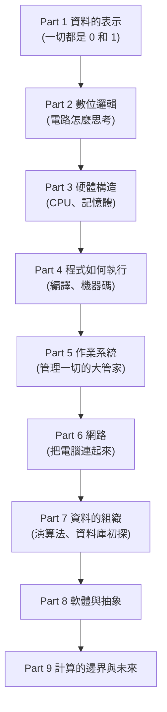

# [cs-0-1] 計算機概論在學什麼？這門課的地圖

> **本章目標**：搞懂「計算機概論」到底在學什麼、為什麼值得學，並拿到一張貫穿整門課的地圖，知道接下來會一層一層往上蓋什麼。

## 你會學到

- 計算機概論在回答什麼問題
- 為什麼「懂底層」會讓你寫程式更踏實
- 這門課的整體結構（從 0 和 1 到計算的邊界）
- 怎麼搭配其他課程一起學

## 概念說明

### 打開那個黑盒子

你每天用電腦、滑手機、可能也寫過一點程式。但有沒有想過——**當你按下一個按鈕，電腦裡面到底發生了什麼事？**

- 你打的中文字，電腦怎麼把它變成「能儲存、能傳送」的東西？
- 一段程式碼，CPU 到底怎麼「看懂」並執行它？
- 為什麼有些程式跑得飛快、有些卡頓？
- 為什麼電腦會當機、記憶體會不夠用？

這些問題的答案，就藏在「電腦這個黑盒子」裡。**計算機概論（Introduction to Computer Science）就是把這個黑盒子打開，帶你看清楚裡面每一層是怎麼運作的。**

### 為什麼要懂底層？

你可能會問：「我只想寫程式做出東西，需要懂這麼底層嗎？」

答案是——**懂底層讓你從「會照著做」變成「知道為什麼」。** 比喻一下：

```
不懂底層的工程師：像只會照食譜煮菜的人，食譜沒寫的就不會了。
懂底層的工程師：  像懂「為什麼這樣煮」的廚師，能隨機應變、能除錯、能創新。
```

當你懂了記憶體怎麼運作，就懂為什麼程式會「記憶體不足」；懂了 CPU 怎麼執行，就懂為什麼某些寫法快、某些慢；懂了資料怎麼編碼，就懂為什麼會出現亂碼。**這些「為什麼」，正是初級和資深工程師的分水嶺。**

### 這門課的地圖：從 0 和 1 往上蓋

這門課的結構像「蓋房子」——從最底層的地基開始，一層一層往上：



這張圖在說：我們從「電腦怎麼表示資料」（最底層的 0 和 1）開始，往上經過「電路、硬體、程式執行、作業系統、網路」，最後談到「軟體抽象」與「計算的極限」。**每一層都建立在前一層之上**——所以照順序學，會像爬樓梯一樣自然。

### 怎麼搭配其他課一起學

這門課是**所有書的地基**。它解釋「為什麼」，其他課教你「怎麼做」：

- 學 `basic`（寫程式）時，cs 幫你補上「型別、記憶體背後是什麼」。
- 學 `rust` 的所有權時，cs 的記憶體章節會讓你秒懂。
- 學 `infra` 的作業系統操作時，cs 的 OS 章節是它的原理版。

**不必先學完 cs 才能學別的**——你可以同時進行，遇到「為什麼」時回來查對應章節。

## 範例：一個問題，貫穿整門課

舉一個例子，感受「一層層」是什麼意思。當你在網頁打了「你好」並按下送出：

```
1. 「你好」被編碼成 0 和 1            ← Part 1 資料表示
2. CPU 執行瀏覽器的程式來處理它       ← Part 3、4 硬體與執行
3. 作業系統協調記憶體、網路卡         ← Part 5 作業系統
4. 資料透過網路傳到伺服器             ← Part 6 網路
```

一個這麼日常的動作，背後牽動了好幾層。學完這門課，你會對這整條鏈路了然於心。

## 小練習

1. 寫下三個你「一直好奇但沒搞懂」的電腦相關問題（例如「為什麼檔案會佔空間？」），放著，看看學完這門課能不能回答它們。
2. 用自己的話解釋「懂底層」對寫程式的好處，舉一個你能想到的例子。
3. 看一遍上面的課程地圖，挑一個你最有興趣的 Part，說說為什麼。

## 課外讀物

> 想直接從「實際操作電腦」入門 → [課外讀物 E-1：終端機操作](../../../課外讀物/E-1-terminal/E-1-1-what-is-terminal.md)

> 一些有趣的電腦冷知識，輕鬆暖身 → [課外讀物 E-5-1：為什麼陣列從 0 開始](../../../課外讀物/E-5-fun-facts/E-5-1-why-arrays-start-at-zero.md)
