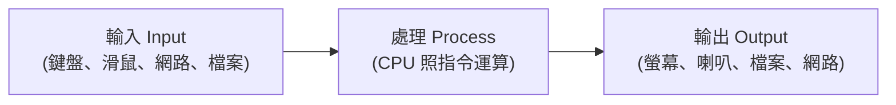

# [cs-0-2] 電腦的本質：一台「會照指令處理資訊」的機器

> **本章目標**：剝掉「電腦」華麗的外表，看清它的本質——一台「接收輸入、照指令處理、產生輸出」的資訊處理機器。

## 你會學到

- 電腦的本質可以濃縮成一句話
- 「輸入 → 處理 → 輸出」這個通用模型
- 「資料」和「指令」是什麼、有什麼關係
- 為什麼一台機器能做這麼多不同的事

## 概念說明

### 電腦其實很單純

電腦看起來無所不能——能打字、能玩遊戲、能視訊、能算數。但它的本質其實非常單純，可以濃縮成一句話：

> **電腦是一台「接收資訊、按照指令處理這些資訊、然後產生結果」的機器。**

就這麼簡單。所有複雜的應用，骨子裡都是這個模型的不同組合。比喻一下，電腦像一台超級聽話、超級快、但其實有點「笨」的計算員：

```
你給它「資料」（要處理的東西）和「指令」（怎麼處理的步驟），
它就會照著一步一步、飛快地做，然後把結果給你。
它不會自己思考，只會「嚴格照指令辦事」——但它一秒能辦幾十億次。
```

### 輸入 → 處理 → 輸出

這個本質可以畫成一個通用模型，叫 **IPO 模型（Input-Process-Output）**：



這張圖在說：任何電腦的工作，本質都是「拿到輸入 → 處理 → 給出輸出」。看幾個例子，你會發現全都符合：

| 應用 | 輸入 | 處理 | 輸出 |
|------|------|------|------|
| 計算機 | 你按的數字 | 做加減乘除 | 螢幕顯示結果 |
| 打字 | 你敲的鍵 | 判斷是哪個字 | 螢幕顯示文字 |
| 玩遊戲 | 你的操作 | 計算遊戲狀態 | 畫面與音效 |
| 視訊通話 | 鏡頭、麥克風 | 壓縮、傳輸 | 對方的影像聲音 |

**再炫的功能，拆開來都是這個模型。** 這就是為什麼理解這個本質很重要——它是看懂一切的起點。

### 資料 vs 指令：兩種不同的東西

上面一直提到兩個詞，要分清楚：

- **資料（data）**：被處理的「東西」。例如數字 `5`、一張照片、一段文字。
- **指令（instruction）**：「怎麼處理」的步驟。例如「把這兩個數字相加」「把這張圖變亮」。

比喻：資料是「食材」，指令是「食譜步驟」。電腦就是那個照著食譜、把食材變成料理的廚師。

有趣的是——**在電腦裡，資料和指令最後都是用 0 和 1 表示的**（Part 1 會講），它們甚至存在同一個地方（記憶體）。這個「指令也是一種資料」的洞見，是現代電腦設計的關鍵（Part 3 的馮紐曼架構會深入）。

### 為什麼一台機器能做這麼多事？

關鍵就在於——**你只要換一組「指令」（也就是換一個程式），同一台電腦就能做完全不同的事。**

```
同一台電腦：
   載入「瀏覽器」的指令 → 它就會上網
   載入「遊戲」的指令   → 它就會玩遊戲
   載入「試算表」的指令 → 它就會算表格
```

硬體沒變，只是「餵給它不同的指令」。這就是電腦「通用」的祕密——它是一台**通用的指令執行機器**。這個概念，正式名稱叫「**可程式化（programmable）**」，是電腦和「只能做一件事的機器」（像計算機、洗衣機）最大的不同。

## 範例：把日常動作拆成 IPO

練習用 IPO 模型拆解，你會更有感覺。以「用 Google 搜尋」為例：

```
輸入：你打的關鍵字「計算機概論」
處理：Google 的伺服器搜尋資料庫、依相關度排序
輸出：一頁搜尋結果

→ 即使是這麼複雜的服務，骨架還是「輸入 → 處理 → 輸出」。
```

## 小練習

1. 挑三個你今天用過的 App 或功能，分別用「輸入 → 處理 → 輸出」拆解它們。
2. 用自己的話解釋「資料」和「指令」的差別，各舉一個例子。
3. 思考題：為什麼說電腦「通用」？它和一台「只會洗衣服的洗衣機」最關鍵的差別是什麼？

## 課外讀物

> 資料和指令最後都變成 0 和 1，下一步就學這個 → 本書 Part 1：資料的表示

> 「指令也是一種資料、存在同個地方」這個關鍵設計 → 本書 Part 3-1：馮紐曼架構
